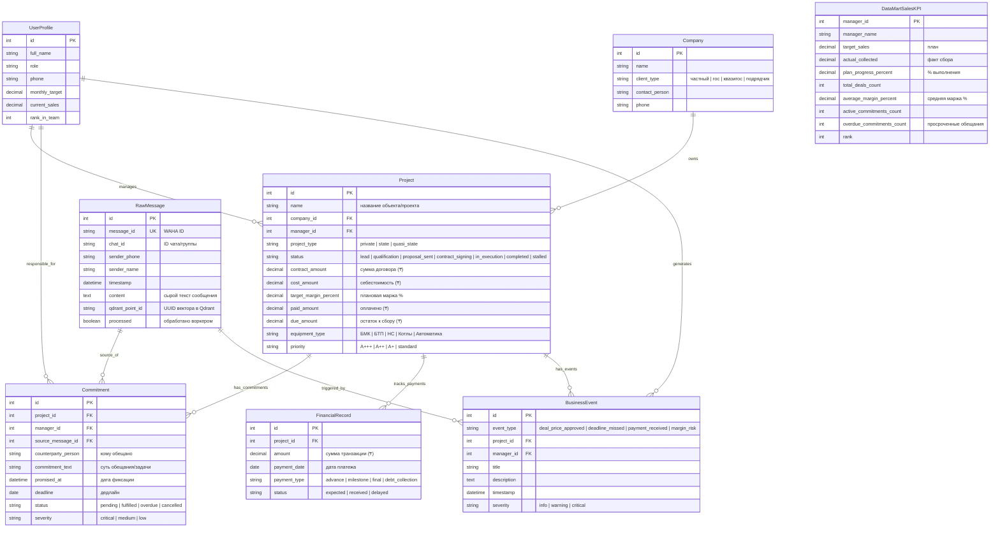
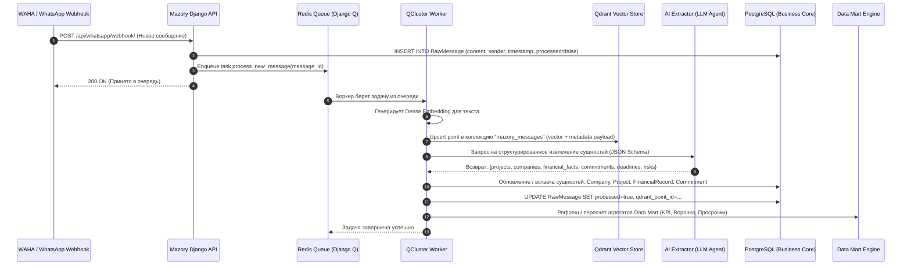
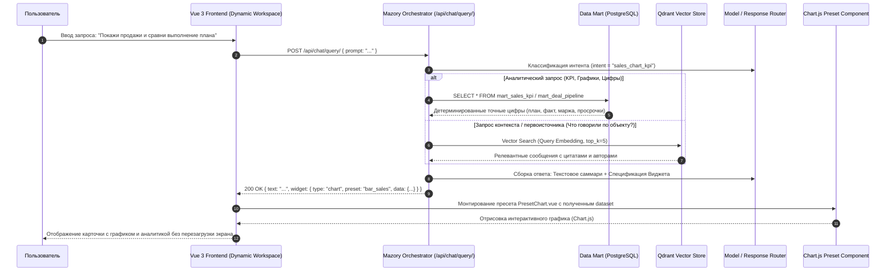

# Спецификация: Переход на PostgreSQL, Векторизация в Qdrant, Построение Data Mart и Динамические Графики во Vue 3

**Дата и время (MSK):** 2026-09-24 13:15:00  
**Ветка:** `feature/postgres-datamart-qdrant`  
**Статус:** На согласовании с пользователем  

---

## 1. Mermaid ERD (Схема моделей данных)

---

## 2. Mermaid Sequence Diagram (Сквозные потоки системы)

### Сценарий А. Прием нового сообщения $\to$ Worker $\to$ Qdrant $\to$ PostgreSQL $\to$ Data Mart

### Сценарий Б. Пользовательский запрос в чат $\to$ Оркестратор $\to$ Data Mart $\to$ Динамический график во Vue 3

---

## 3. Постановка задачи и обоснование

### 3.1. Проблема текущего состояния
1. **SQLite в проекте:**
   - Не держит конкурентную запись при параллельной работе Django Q2 воркера, вебхуков WAHA и пользовательских запросов (`database is locked`).
   - Отсутствуют аналитические функции для построения качественного Data Mart (оконные функции, материализованные представления, JSONB-индексация).
2. **Отсутствие векторного поиска первоисточников:**
   - История переписки теряется; при вопросах «Что обсуждали по объекту Курмет?» невозможно за миллисекунды поднять нужный контекст без перебора тысяч строк.
3. **Ошибочная парадигма «Всё на ИИ» (критика концепта из PDF):**
   - В сыром PDF предлагалось заставлять LLM каждый раз "на лету" читать историю или выдумывать метрики. Это приводит к галлюцинациям в суммах договоров, нестабильности форматов и огромным затратам времени и токенов.
4. **Правильный инженерный подход:**
   - **PostgreSQL** — единый источник проверенной правды для нормализованных бизнес-сущностей и Data Mart.
   - **Qdrant** — векторное хранилище сообщений через модель эмбеддингов.
   - **Фоновый воркер** — асинхронный обработчик событий: извлекает факты, фиксирует обещания и дедлайны, обновляет таблицы.
   - **Data Mart (Витрина данных)** — детерминированный слой аналитики (SQL агрегаты), гарантирующий 100% математическую точность цифр.
   - **Frontend (Vue 3 + Chart.js)** — библиотека визуальных пресетов: графики (Bar/Line/Doughnut), карточки KPI, списки просроченных обещаний, таблицы объектов.

---

## 4. План изменений в проекте

### 4.1. Инфраструктура (`mazory/docker-compose.yml`)
1. **Добавление PostgreSQL:**
   - Образ: `postgres:16-alpine`.
   - БД: `mazory_db`, пользователь: `mazory`, пароль: `mazory2026`.
   - Именованный том `postgres_data`.
   - Healthcheck через `pg_isready`.
2. **Добавление Qdrant:**
   - Образ: `qdrant/qdrant:v1.13.4`.
   - Порт: `6333:6333`.
   - Именованный том `qdrant_data`.
3. **Обновление `backend` и `qcluster`:**
   - Передача переменных `POSTGRES_DB`, `POSTGRES_USER`, `POSTGRES_PASSWORD`, `POSTGRES_HOST=postgres`, `POSTGRES_PORT=5432`.
   - `QDRANT_URL=http://qdrant:6333`.
   - Зависимость `depends_on: postgres, redis, qdrant`.

### 4.2. Бэкенд (`mazory/backend/`)
1. **Зависимости (`requirements.txt` / `pyproject.toml`):**
   - Добавить `psycopg[binary]>=3.2.0` (драйвер PostgreSQL).
   - Добавить `qdrant-client>=1.13.0` (клиент Qdrant).
   - Добавить модуль генерации dense эмбеддингов.
2. **Настройки Django (`settings.py`):**
   - Переключение `DATABASES['default']` на `django.db.backends.postgresql`.
   - Настройка подключения к Qdrant.
3. **Модели (`api/models.py`):**
   - `RawMessage`
   - `Company`
   - `Project`
   - `Commitment` (Обещания/дедлайны)
   - `FinancialRecord`
   - `BusinessEvent`
4. **Фоновый воркер и пайплайн (`api/tasks.py`):**
   - `process_raw_message_task(message_id)`:
     - Векторизация и отправка в Qdrant.
     - Вызов структурированного агента извлечения (LLM Entity Extractor).
     - Запись в таблицы `Company`, `Project`, `Commitment`, `FinancialRecord`.
     - Авто-триггер пересчета витрин данных.
5. **Data Mart слой (`api/datamart.py`):**
   - Формирование витрин:
     - `get_sales_kpi_mart()`: выполнение плана, факт сбора, маржинальность, количество сделок по менеджерам.
     - `get_pipeline_mart()`: воронка объектов, распределение по статусам и суммам.
     - `get_commitments_sla_mart()`: открытые, просроченные обещания, нарушения сроков.
     - `get_cashflow_priority_mart()`: план сбора денег, ключевые объекты-доноры (ПСЭМ, Top Build и т.д.).
6. **Оркестратор чата (`api/views.py`):**
   - Метод `ChatQueryView`:
     - Определение намерения пользователя (Intent).
     - Сбор данных из Data Mart / Qdrant.
     - Формирование строгого ответа:
       `{ "text": "...", "widget": { "type": "chart|kpi_grid|commitments_list|deal_table", "preset": "...", "data": {...} } }`.
7. **Сидинг реальных данных:**
   - Команда сидинга (`manage.py seed_aquakip_data`), загружающая реальные данные из предоставленного архива переписки: менеджеры (Камиль, Самат, Турар, Улугбек, Жанат, Вячеслав), их ключевые объекты (ПСЭМ, Top Build 343, Vertex Garden, Курмет, Зергер, Integra) и реальные обещания/дедлайны.

### 4.3. Фронтенд (`mazory/frontend/`)
1. **Установка библиотеки графиков:**
   - Установка `chart.js` и `vue-chartjs` в `package.json`.
2. **Библиотека Vue 3 пресетов (`src/components/presets/`):**
   - `PresetChart.vue`: рендеринг Bar (план-факт продаж), Doughnut (распределение портфеля по оборудованию), Line (динамика оплат).
   - `PresetKpiGrid.vue`: карточки выполнения KPI с прогресс-барами, маржой и рангом.
   - `PresetCommitmentList.vue`: интерактивный список обязательств и дедлайнов с бейджами статусов (просрочено, выполнено, ожидает).
   - `PresetProjectTable.vue`: таблица объектов с суммами, маржой и ответственными.
3. **Интеграция с чатом (`App.vue` и `useChat.ts`):**
   - Динамический рендеринг соответствующего пресета на основе ответа бекенда.
   - Поддержка быстрых команд в чате:
     - «Покажи продажи и сравни выполнение плана» $\to$ выводит график продаж (Bar Chart).
     - «Покажи KPI менеджеров» $\to$ выводит KPI Grid.
     - «Какие обещания и дедлайны горят?» $\to$ выводит список просроченных и активных обязательств.
     - «Что с объектом Top Build 343?» $\to$ выводит детальную карточку объекта и историю оплат.

---

## 5. Критерии готовности (Definition of Done)

1. **База данных:**
   - Docker Compose запускает PostgreSQL 16. Django миграции успешно применяются к PostgreSQL. Файл `db.sqlite3` отключен.
2. **Qdrant:**
   - Qdrant запущен в Docker Compose (порт 6333). Создана коллекция `mazory_messages`. Сообщения сохраняются с векторами и метаданными.
3. **Фоновая обработка (Worker):**
   - Сообщение проходит через `qcluster`: извлекаются проекты, контрагенты, суммы и обязательства, записываются в реляционную БД.
4. **Data Mart:**
   - Эндпоинты или сервисный слой Data Mart отдают точные выверенные цифры без округлений и галлюцинаций LLM.
5. **Фронтенд и графики:**
   - `npm run build` проходит без единой ошибки TypeScript (`vue-tsc -b`).
   - На фронтенде по запросам пользователя динамически отображаются интерактивные графики (Chart.js) и пресеты витрин данных.
