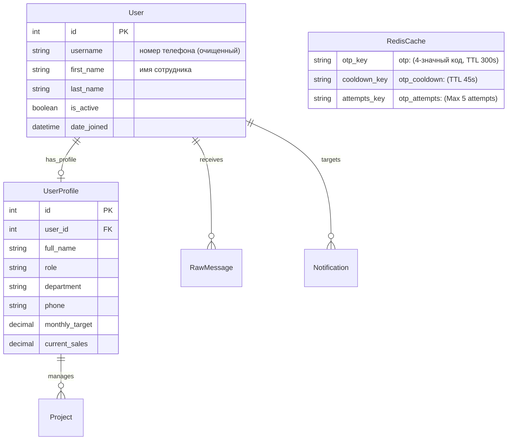
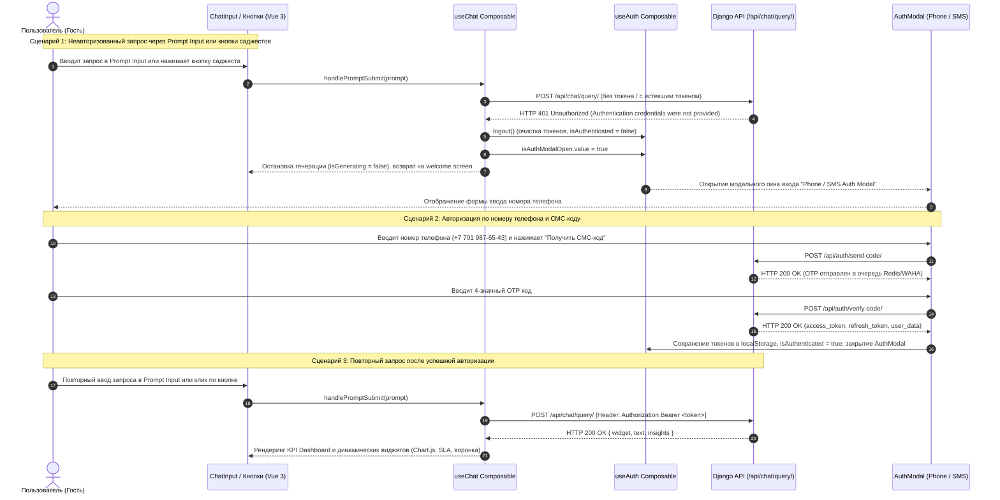

# Спецификация: Защита Prompt Input Bar и кнопок действий авторизацией (JWT 401 и Phone/SMS Auth Modal)

**Дата и время (MSK):** 2026-09-25 14:05:39  
**Ветка:** `bugfix/prompt-auth-guard`  
**Статус:** Завершено, проверки пройдены  

---

## 1. Mermaid ERD (Модели данных аутентификации и профилей)

---

## 2. Mermaid Sequence Diagram (Сквозной сценарий обработки неавторизованного доступа и 401 ошибки)

---

## 3. Постановка задачи

В текущей версии фронтенда неавторизованные пользователи могут отправлять промпты через Prompt Input bar и нажимать кнопки (кнопки саджестов в `WelcomeView`/`ChatInput`, кнопки действий в `AiInsightCard`), получая ответы оркестратора.

**Цель задачи:**
Ограничить доступ к генерации запросов и нажатию интерактивных кнопок:
1. Эндпоинт оркестратора `/api/chat/query/` на бэкенде должен строго требовать аутентификацию (`permission_classes = [IsAuthenticated]`) и возвращать `HTTP 401 Unauthorized` при отсутствии или невалидности JWT-токена.
2. Фронтенд при отправке промптов из Prompt Input bar или нажатии интерактивных кнопок без токена (или с недействительным токеном) должен перехватывать ошибку 401 и немедленно вызывать модальное окно авторизации **Phone / SMS Auth Modal** (`AuthModal.vue`), предотвращая переход в состояние активного ответа без прав доступа.
3. После успешного входа по SMS/WhatsApp OTP и сохранения токена в `localStorage` пользователь получает полный доступ к отправке запросов и динамическим виджетам.

---

## 4. Требования к реализации

### 4.1. Бэкенд (`backend/api/views.py`)
1. В классе `ChatQueryView`:
   - Заменить `permission_classes = [AllowAny]` на `permission_classes = [IsAuthenticated]`.
   - При отсутствии валидного JWT-токена в заголовке `Authorization: Bearer <token>` бэкенд возвращает статус `401 Unauthorized`.
2. Тесты бэкенда (`backend/api/tests.py`):
   - Добавить тест, подтверждающий, что неавторизованный запрос к `/api/chat/query/` возвращает статус 401.
   - Обновить существующие тесты для `ChatQueryView`, добавив аутентификацию (через JWT токен или `client.force_authenticate`).

### 4.2. Фронтенд (`frontend/src/composables/useChat.ts`)
1. В функции `handlePromptSubmit(prompt: string)`:
   - Извлекать токен из `localStorage.getItem('mazory_access_token')`.
   - Передавать заголовок `Authorization: Bearer ${token}`, если токен присутствует.
   - При получении ответа со статусом `401`:
     - Перехватывать ошибку (`res.status === 401`).
     - Сбрасывать состояние генерации (`isGenerating.value = false`).
     - Возвращать экран в исходное состояние (`currentView.value = 'welcome'`).
     - Вызывать `logout()` из `useAuth()`, очищая невалидный токен и сбрасывая `isAuthenticated.value = false`.
     - Открывать модальное окно авторизации: `isAuthModalOpen.value = true`.
     - Прерывать выполнение функции без изменения заголовков и виджетов.
2. В функции `fetchKpiData()`:
   - Передавать заголовок `Authorization: Bearer ${token}` при его наличии.

### 4.3. Фронтенд (`frontend/src/App.vue`)
1. Использовать единое реактивное состояние `isAuthModalOpen` из `useAuth()`, убрав локальное переопределение `const isAuthModalOpen = ref(false)`.
2. Добавить проверку авторизации для дополнительных действий в панели ввода (прикрепление файлов, микрофон): при клике неавторизованного пользователя открывать `AuthModal` и выводить подсказку о необходимости входа.

### 4.4. Фронтенд (`frontend/src/components/KpiDashboardView.vue`)
1. В функции `handleActionTrigger`:
   - Для действия `'why'` (кнопка "Почему?"): если пользователь не авторизован, направлять запрос через `handlePromptSubmit('Почему?')`, чтобы он перехватывал 401 ошибку и открывал окно авторизации, либо явно открывать `isAuthModalOpen`.

---

## 5. План тестирования и критерии готовности

### 5.1. E2E Тестирование (Playwright)
Создать сквозной E2E-тест в `frontend/e2e/mazory-auth-guard.spec.ts` со следующими сценариями:
1. **Неавторизованный ввод промпта:** Пользователь вводит текст в Prompt Input bar на главной странице и нажимает Enter -> запрос к `/api/chat/query/` завершается с кодом 401 -> на экране появляется модальное окно авторизации "Вход в Mazory" с полем ввода телефона.
2. **Неавторизованный клик по саджесту:** Пользователь нажимает на любую кнопку саджеста (например, "Покажи график продаж...") -> запрос возвращает 401 -> открывается модальное окно авторизации.
3. **Авторизованный пользователь:** Устанавливается валидный JWT токен в `localStorage` -> ввод промпта или клик по саджесту успешно строит график продаж / виджеты без открытия модального окна.

### 5.2. Обязательные системные проверки
1. `docker compose exec backend python manage.py check` — без ошибок.
2. `docker compose exec backend python manage.py makemigrations --check` — статус `No changes detected`.
3. `npm run build` в `frontend/` — чистая компиляция без TypeScript ошибок.
4. `npm run test:e2e` в `frontend/` — все Playwright тесты зелёные.
5. Просмотр логов контейнеров `backend`, `qcluster`, `frontend`.

---

## 6. Результаты верификации

1. **Django System Check:** `System check identified no issues (0 silenced).` (Код 0).
2. **Django Migrations Check:** `No changes detected` (Код 0).
3. **Backend Unit Tests:** `Ran 7 tests in 0.930s. OK.` (включая проверку 401 для неавторизованного запроса).
4. **Frontend TypeScript & Build:** `vue-tsc -b && vite build` выполнен успешно за 1.10s без единой ошибки.
5. **Playwright E2E Tests:** 10 из 10 тестов успешно пройдены (`10 passed (17.6s)`):
   - Перехват 401 и вызов `AuthModal` при отправке промпта из Prompt Input bar.
   - Перехват 401 и вызов `AuthModal` при клике по саджест-кнопкам.
   - Защита кнопок микрофона и вложений.
   - Успешное выполнение запросов авторизованным пользователем с отображением Chart.js и других виджетов.
6. **Docker Logs:** Логи `backend`, `qcluster` и `waha` проинспектированы, критических ошибок нет.
