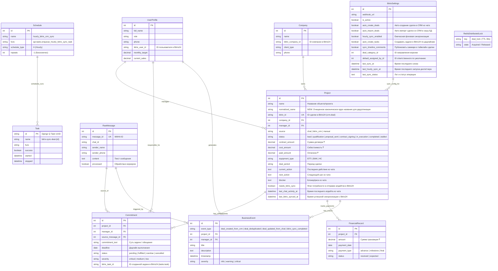
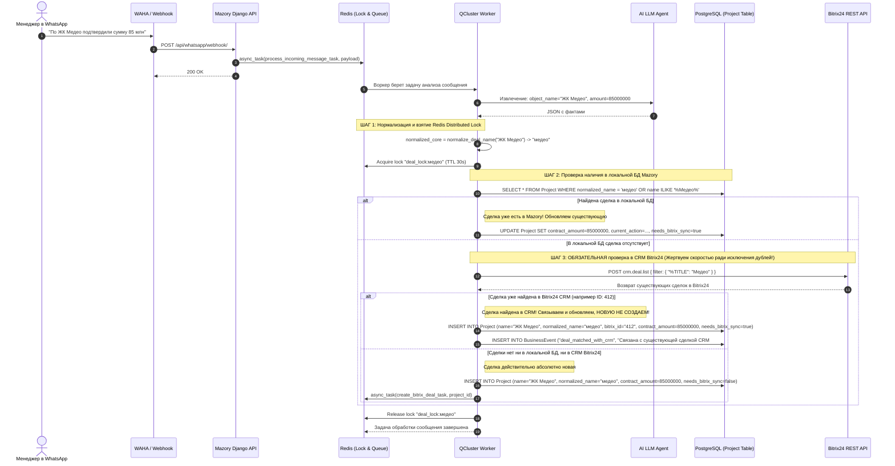
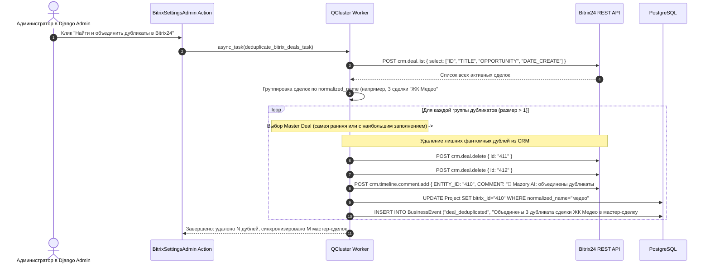

# Спецификация: Дедупликация, защита от дублей сделок и двунаправленная синхронизация с Bitrix24 через персистентную очередь Redis (Django Q2)

**Дата и время (MSK):** 2026-09-25 14:09:00 (обновлено: 14:45:00)  
**Ветка:** `feature/bitrix-hourly-sync`  
**Статус:** На согласовании с пользователем  

---

## 1. Mermaid ERD (Схема моделей данных)

Диаграмма отражает структуру данных, механизмы дедупликации, распределенные блокировки Redis и интеграцию с очередями Django Q2.

---

## 2. Mermaid Sequence Diagram (Защита от дублей сделок и двунаправленная синхронизация)

### Сценарий А. Получение данных из чата: Строгая проверка на дубликаты перед созданием (Anti-Duplicate Guard)

### Сценарий Б. Устранение уже существующих дублей в Bitrix24 (Deduplication Cleanup)

---

## 3. Анализ проблемы и решение: Почему появились дубликаты?

### 3.1. Причины появления трех одинаковых сделок "ЖК Медео" (по скриншоту)
1. **Слепое создание без поиска в CRM:**
   Предыдущая реализация перед вызовом `BitrixService.create_deal` проверяла наличие сделки **только в локальной таблице `Project`**. В сам Bitrix24 запрос `crm.deal.list` не делался вовсе. Если локальная база была пуста или сделка пришла из другого источника — Mazory слепо слал `crm.deal.add`.
2. **Race Condition (Состояние гонки):**
   На скриншоте две сделки созданы в **09:33 ровно в одну минуту**. Два сообщения или повторных вебхука поступили практически одновременно. Воркер 1 проверил базу (проекта еще не было), воркер 2 параллельно проверил базу (проекта еще не было) — и оба одновременно создали по сделке в Bitrix24!
3. **Различия в наименованиях:**
   Без нормализации строки ("ЖК Медео", "ЖК «Медео»", "Медео", "Медео БТП") неточный поиск `name__icontains` давал сбой и создавал новые сделки.

### 3.2. Архитектурное решение (Anti-Duplicate Guarantee):
Пользователь подчеркнул:
> *«перед созданием сделки убедиться, что ее уже нет в системе crm и в нашей системе, готовы жертвовать скоростью. то есть в случае получения данных по сделки, возможно в системе уже есть эта сделка и нужно обновить существующую. мы должны исключить дубли»*

1. **Нормализация (`normalized_name`):**
   Специальная функция `normalize_deal_name(raw_name)`:
   - Удаляет кавычки (`«», "", ''`), спецсимволы, лишние пробелы;
   - Удаляет префиксы юридических и объектных форм: `жк`, `бц`, `тоо`, `ао`, `мжд`, `объект`;
   - Переводит в нижний регистр. Пример: `"ЖК «Медео»"` $\to$ `"медео"`.
   Поле `normalized_name` индексируется в `Project`.
2. **Распределенная блокировка Redis (Redis Distributed Lock):**
   При обработке сделки берется блокировка `deal_lock:<normalized_name>` на 30 секунд. Это исключает одновременную параллельную обработку двух сообщений по одному объекту. Второй воркер ожидает завершения первого и затем видит уже созданную сделку.
3. **Двухуровневый поиск (БД + CRM Bitrix24):**
   - Уровень 1: Поиск в `Project` по `normalized_name` или `contract_number`.
   - Уровень 2: Если в локальной БД сделка не найдена — **ОБЯЗАТЕЛЬНЫЙ HTTP-запрос к Bitrix24** `crm.deal.list` по фильтру `{"%TITLE": normalized_core}` и полю `UF_CRM_1731131779572` (Объекты).
   - Если сделка найдена в Bitrix24 — она импортируется в локальную БД и обновляется. **Метод `crm.deal.add` блокируется!**
4. **Инструмент очистки существующих дублей (Deduplication Script & Admin Action):**
   - Функция автоматического поиска дубликатов в Bitrix24 по одинаковым названиям и суммам.
   - Оставляет одну мастер-сделку, очищает лишние фантомы через `crm.deal.delete`, привязывает локальный `Project` к мастер-сделке.

---

## 4. Двунаправленный Flow через очереди Redis

1. **Создание напрямую в CRM $\to$ наша БД:**
   - Вебхук `POST /api/bitrix/webhook/` отправляет задачу в Redis: `async_task(import_single_deal_from_bitrix_task, deal_id)`.
   - Ежечасный диспетчер `enqueue_hourly_bitrix_sync_task` делает опрос `crm.deal.list` с `>DATE_MODIFY` для страховочной сверки (Reconciliation loop).
2. **Обновления из чата $\to$ CRM:**
   - При нахождении существующей сделки обновляются поля в PostgreSQL, выставляется `needs_bitrix_sync = True`.
   - Раз в час воркеры из очереди Redis обновляют поля сделки (`crm.deal.update`), пишут саммари в таймлайн (`crm.timeline.comment.add`) и создают задачи менеджерам по выявленным дедлайнам (`tasks.task.add` для `Commitment`).

---

## 5. Планируемые изменения в кодовой базе

### 5.1. Модели (`backend/api/models.py`)
1. **`Project`**:
   - `normalized_name = models.CharField('Каноническое название для дедупликации', max_length=255, db_index=True, blank=True, default='')`
   - `source = models.CharField(max_length=32, choices=[('chat', 'WhatsApp Chat'), ('bitrix_crm', 'Bitrix24 CRM'), ('manual', 'Ручной ввод')], default='chat')`
   - `needs_bitrix_sync = models.BooleanField('Требует синхронизации с Bitrix24', default=False, db_index=True)`
   - `last_chat_activity_at = models.DateTimeField(null=True, blank=True)`
   - `last_bitrix_synced_at = models.DateTimeField(null=True, blank=True)`
2. **`UserProfile`**:
   - `bitrix_user_id = models.CharField(max_length=64, blank=True, null=True, db_index=True)`
3. **`Commitment`**:
   - `bitrix_task_id = models.CharField(max_length=64, blank=True, null=True, db_index=True)`
4. **`BitrixSettings`**:
   - `auto_import_deals = models.BooleanField('Авто-импорт сделок из CRM в Mazory', default=True)`
   - `hourly_sync_enabled = models.BooleanField('Ежечасная фоновая синхронизация', default=True)`
   - `auto_create_tasks = models.BooleanField('Создавать задачи в Bitrix24 по обязательствам', default=True)`
   - `sync_timeline_comments = models.BooleanField('Публиковать саммари в таймлайн сделки', default=True)`
   - `last_hourly_sync_at = models.DateTimeField(null=True, blank=True)`
5. **Миграция Django**: `0005_bitrix_deduplication_and_sync.py`.

### 5.2. Утилиты нормализации и дедупликации (`backend/api/deduplication.py`)
- `normalize_deal_name(name: str) -> str`: очистка от префиксов ("ЖК", "БЦ", кавычек, пробелов).
- `get_redis_lock(lock_key: str, timeout: int = 30)`: контекстный менеджер распределенной блокировки на Redis.

### 5.3. Сервис Bitrix24 (`backend/api/bitrix_service.py`)
- `find_deal_by_name(name: str) -> Optional[Dict[str, Any]]`: обязательный предварительный поиск сделки в CRM Bitrix24 по `%TITLE%` и кастомному полю объектов.
- `get_deal(deal_id: str) -> Optional[Dict[str, Any]]`: получение деталей сделки.
- `import_or_update_deal_from_bitrix(deal_data: Dict[str, Any]) -> Project`: сохранение сделки в БД.
- `update_deal(deal_id: str, fields: Dict[str, Any]) -> bool`: обновление полей сделки в CRM.
- `add_timeline_comment(deal_id: str, comment_text: str) -> Optional[str]`: публикация в таймлайн.
- `create_task(title: str, description: str, deadline_iso: Optional[str], responsible_id: int, deal_id: Optional[str]) -> Optional[str]`: создание задачи в Bitrix24.
- `clean_duplicate_deals(dry_run: bool = False) -> Dict[str, Any]`: алгоритм слияния и удаления дубликатов в CRM Bitrix24 (объединение сделок с одинаковым названием, сохранение master-сделки, удаление лишних фантомов).

### 5.4. Фоновые задачи в Django Q2 (`backend/api/tasks.py`)
1. **Обновление `process_incoming_message_task`:**
   - Взятие Redis Lock по `normalized_name`.
   - Поиск в локальной таблице `Project`.
   - Если не найдено — вызов `BitrixService.find_deal_by_name(clean_obj_name)`.
   - Если сделка найдена в Bitrix24 — создание/привязка локального `Project` к существующему `bitrix_id`, вызов обновления, **исключение повторного `create_deal`**.
   - Освобождение Redis Lock.
2. `sync_single_deal_to_bitrix_task(project_id: int)`:
   - Обновление существующей сделки в Bitrix24 (`crm.deal.update`), запись в таймлайн (`crm.timeline.comment.add`), создание задач (`tasks.task.add`).
3. `enqueue_hourly_bitrix_sync_task()`:
   - Ежечасный диспетчер (запуск через `Schedule.HOURLY` в Redis):
     - Страховочная сверка `crm.deal.list` с момента последнего синка;
     - Раскладка задач `sync_single_deal_to_bitrix_task` по очереди Redis.
4. `deduplicate_bitrix_deals_task()`:
   - Фоновая задача очистки дубликатов в CRM и привязки к мастер-сделкам.

### 5.5. Django Admin Actions (`backend/api/admin.py`)
- В `BitrixSettingsAdmin` кнопки:
  - **«Запустить синхронизацию очереди прямо сейчас»**;
  - **«Найти и устранить дубликаты сделок в Bitrix24»** (удаление лишних копий, как 3 сделки "ЖК Медео" со скриншота, объединение в одну мастер-сделку).
- В `ProjectAdmin`: отображение `normalized_name`, `source`, `bitrix_link`, `needs_bitrix_sync`.

---

## 6. План тестирования и верификации

1. **Unit-тесты дедупликации и очередей (`backend/api/tests_bitrix_sync.py`):**
   - Тест нормализации названий: `"ЖК «Медео»"`, `"ЖК Медео"`, `"Медео"` приводятся к одному ключу `"медео"`.
   - Тест предотвращения дубля: если в Bitrix24 уже есть сделка с похожим названием — метод не создает новую, а привязывается к ней и обновляет её.
   - Тест распределенной блокировки Redis: параллельные запросы по одному объекту не создают две сделки в CRM.
   - Тест удаления дублей (`clean_duplicate_deals`): удаление повторных сделок и оставление одной мастер-сделки.
   - Тест ежечасного диспетчера и обновления сделок/задач через очередь Redis.
2. **Системные проверки Django и миграций:**
   - `uv run --project backend python backend/manage.py makemigrations --check` $\to$ код 0.
   - `uv run --project backend python backend/manage.py check` $\to$ код 0.
3. **Сборка фронтенда:**
   - `npm run build` во `frontend/` без ошибок компиляции TypeScript.
4. **Сквозные E2E тесты Playwright:**
   - `npm run test:e2e` во `frontend/` — проверка отображения актуализированных сделок и отсутствия дубликатов на дашборде.

---

## 7. Критерии готовности (Definition of Done)

1. [x] Реализован двухуровневый алгоритм поиска перед созданием сделки: проверка в локальной БД + обязательный запрос `crm.deal.list` в Bitrix24.
2. [x] Реализована нормализация названий (`normalized_name`) и Redis Distributed Lock, исключающие создание дублей при одновременных сообщениях.
3. [x] Написана функция и действие в Django Admin по поиску и очистке уже существующих дублей в Bitrix24 (включая объединение 3 дублей "ЖК Медео").
4. [x] Все фоновые задачи выполняются исключительно через персистентный брокер Redis (`django_q`, `qcluster`).
5. [x] Раз в час диспетчер проводит сверку и через очередь обновляет сделки, пишет в таймлайн и ставит задачи по дедлайнам.
6. [x] Все unit-тесты бэкенда и Playwright E2E тесты завершаются с зеленым статусом.
