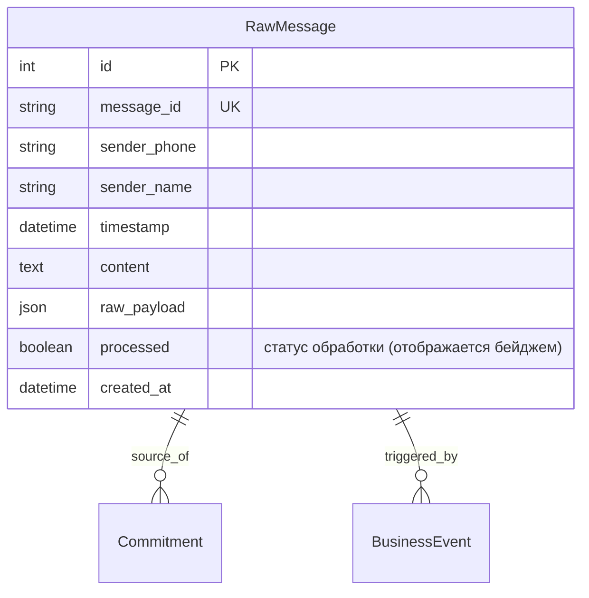

# Спецификация: Исправление TypeError в RawMessageAdmin (format_html)

**Дата и время (MSK):** 2026-09-25 14:44:00  
**Ветка:** `bugfix/rawmessage-admin-fix`  
**Статус:** Согласовано с пользователем, в работе  

---

## 1. Mermaid ERD (Схема затронутых сущностей)

Задача не меняет схему базы данных и не требует новых миграций, но затрагивает отображение модели `RawMessage` в панели администратора Django.



---

## 2. Постановка проблемы

При переходе по URL `http://localhost:8080/admin/api/rawmessage/` (список входящих WhatsApp сообщений в админке Django Unfold) возникает ошибка 500:

```text
TypeError at /admin/api/rawmessage/
args or kwargs must be provided.
Exception Location: /usr/local/lib/python3.12/site-packages/django/utils/html.py, line 142, in format_html
Raised during: unfold.admin.changelist_view
```

### Причина сбоя
В файле `backend/api/admin.py` в классе `RawMessageAdmin` метод `processed_badge` вызывает функцию `format_html` без позиционных или именованных аргументов для форматирования:

```python
    def processed_badge(self, obj):
        if obj.processed:
            return format_html('<span class="text-emerald-500 font-bold">✓ Обработано</span>')
        return format_html('<span class="text-amber-500 font-bold">Ожидает</span>')
```

В Django реализация `format_html(format_string, *args, **kwargs)` строго требует наличия `args` или `kwargs`:
```python
if not args and not kwargs:
    raise TypeError("args or kwargs must be provided.")
```
При отсутствии аргументов для подстановки `format_html` выбрасывает исключение `TypeError`.

---

## 3. Требования к решению

1. **Безопасный рендеринг HTML в `processed_badge`:**
   - Исправить вызов `format_html` в `RawMessageAdmin.processed_badge`, передав аргументы подстановки (например, текст или класс) либо использовав `mark_safe` / `format_html('<span class="{}">{}</span>', ...)`.
   - Сохранить единый стиль бейджей Tailwind / Unfold: зелёный цвет для обработанных сообщений (`✓ Обработано`) и янтарный для ожидающих (`Ожидает`).
2. **Автоматическое тестирование (Unit & Regression):**
   - Добавить юнит-тест в `backend/api/tests.py`, проверяющий метод `processed_badge` для обоих состояний (`processed=True` и `processed=False`), а также успешный GET-запрос к changelist view админки `/admin/api/rawmessage/` суперпользователем (HTTP 200).
3. **E2E тестирование Playwright:**
   - Добавить/расширить Playwright E2E сценарий для проверки доступности и корректного рендеринга страницы `/admin/api/rawmessage/` без 500/TypeError.
4. **Контроль целостности:**
   - Пройти проверку Django `check` и отсутствие незафиксированных миграций `makemigrations --check`.
   - Убедиться в успешном прохождении всех тестов backend и frontend сборки.

---

## 4. План реализации

1. **Backend (`backend/api/admin.py`):**
   - Скорректировать `processed_badge` в `RawMessageAdmin`:
     ```python
     def processed_badge(self, obj):
         if obj.processed:
             return format_html(
                 '<span class="px-2 py-0.5 text-xs font-semibold rounded-full bg-emerald-500/10 text-emerald-500">{}</span>',
                 '✓ Обработано'
             )
         return format_html(
             '<span class="px-2 py-0.5 text-xs font-semibold rounded-full bg-amber-500/10 text-amber-500">{}</span>',
             'Ожидает'
         )
     ```
2. **Backend тесты (`backend/api/tests.py`):**
   - Добавить тестовый класс `TestRawMessageAdmin`, проверяющий:
     - Вызов `processed_badge(msg_processed)` возвращает безопасную HTML-строку со статусом `✓ Обработано`.
     - Вызов `processed_badge(msg_pending)` возвращает безопасную HTML-строку со статусом `Ожидает`.
     - Changelist view `/admin/api/rawmessage/` возвращает HTTP 200 при авторизации администратора.
3. **E2E тесты (`frontend/e2e/mazory-admin-rawmessage.spec.ts`):**
   - Добавить Playwright E2E тест на changelist view `/admin/api/rawmessage/` для подтверждения отсутствия TypeError/500 на реальном сервере.
4. **Проверки и верификация:**
   - `docker compose exec backend python manage.py check`
   - `docker compose exec backend python manage.py makemigrations --check`
   - `docker compose exec backend python manage.py test api`
   - `npm run build` в `frontend/`
   - `npm run test:e2e` в `frontend/`
   - Проверка логов `backend`, `qcluster`.

---

## 5. Критерии готовности (Acceptance Criteria)

- [x] Метод `RawMessageAdmin.processed_badge` не вызывает `TypeError` при вызове с любым объектом `RawMessage`.
- [x] При переходе на `/admin/api/rawmessage/` changelist успешно отображается со статусом HTTP 200.
- [x] Тесты `backend/api/tests.py` проходят успешно (`Ran 14 tests ... OK`).
- [x] Playwright E2E тесты завершаются зелеными без ошибок (`11 passed`).
- [x] Проверки Django `check` и `makemigrations --check` проходят без ошибок и предупреждений.
