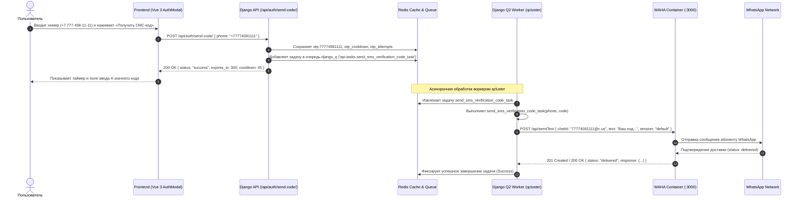

# Спецификация: Отправка OTP-кода подтверждения через WhatsApp (WAHA)

**Дата и время (MSK):** 2026-09-25 15:01:19  
**Ветка:** `bugfix/whatsapp-otp-send-task`  
**Статус:** Выполнено, проверено E2E тестами  

---

## 1. Sequence Diagram (Сквозной процесс отправки OTP-кода)



---

## 2. Постановка проблемы

При запросе кода подтверждения на фронтенде (в модальном окне авторизации по телефону) для номера `+77774581111`:
1. Фронтенд успешно получает ответ `200 OK` от `POST /api/auth/send-code/`.
2. Однако сообщение в WhatsApp с кодом не приходит.
3. При анализе логов и таблицы сбоев `django_q.models.Failure` обнаружено:
   ```text
   ValueError: Function api.tasks.send_sms_verification_code_task is not defined
   ```
4. В файле `backend/api/auth_views.py` строка 47 ставит в очередь:
   ```python
   async_task('api.tasks.send_sms_verification_code_task', clean, code)
   ```
   Но в модуле `backend/api/tasks.py` функция `send_sms_verification_code_task` отсутствует. В результате воркер `qcluster` каждый раз падал с `ValueError`, задача отправки не доходила до шлюза WAHA, и пользователь не получал код.

---

## 3. Требования к реализации

1. **Определение задачи `send_sms_verification_code_task` в `backend/api/tasks.py`**:
   - Принимает `phone: str, code: str`.
   - Нормализует номер через `clean_phone_number(phone)`.
   - Формирует текст сообщения:
     `"Ваш код подтверждения для входа в Mazory AI: {code}\nКод действителен 5 минут."`
   - Вызывает существующую функцию `send_waha_whatsapp_message_task(clean, text)`.
   - Логирует факт отправки через именованный логгер `api.tasks`.
2. **Перезапуск воркера `qcluster`**:
   - `docker compose restart qcluster` для загрузки обновленного модуля `tasks.py`.
3. **E2E тестирование через Playwright (`frontend/e2e/mazory-otp-waha.spec.ts`)**:
   - Открыть модальное окно авторизации на `http://localhost:8080`.
   - Ввести номер `+7 (777) 458-11-11`.
   - Нажать кнопку «Получить СМС-код».
   - Убедиться, что фронтенд перешел в состояние ввода кода и активировал таймер.
   - Проверить через WAHA API (`GET /api/default/chats/77774581111@c.us/messages`), что отправленное сообщение появилось в чате с корректным текстом и сгенерированным кодом.
   - Убедиться в отсутствии сбоев в `django_q.models.Failure`.

---

## 4. Критерии готовности (Definition of Done)

- [x] В `backend/api/tasks.py` реализована и экспортирована функция `send_sms_verification_code_task`.
- [x] Сервис `qcluster` перезапущен и успешно обрабатывает задачи отправки OTP.
- [x] `docker compose exec backend python manage.py check` — 0 ошибок.
- [x] `docker compose exec backend python manage.py makemigrations --check` — `No changes detected`.
- [x] `npm run build` во `frontend/` — без ошибок сборки и компиляции TypeScript.
- [x] Playwright E2E тест `mazory-otp-waha.spec.ts` проходит успешно: отправка инициируется через интерфейс, сообщение появляется в WAHA.
- [x] Логи `docker compose logs --tail=50 backend qcluster waha` без ошибок.
- [x] Изменения зафиксированы в ветке `bugfix/whatsapp-otp-send-task` и оформлен Pull Request в `main`.
