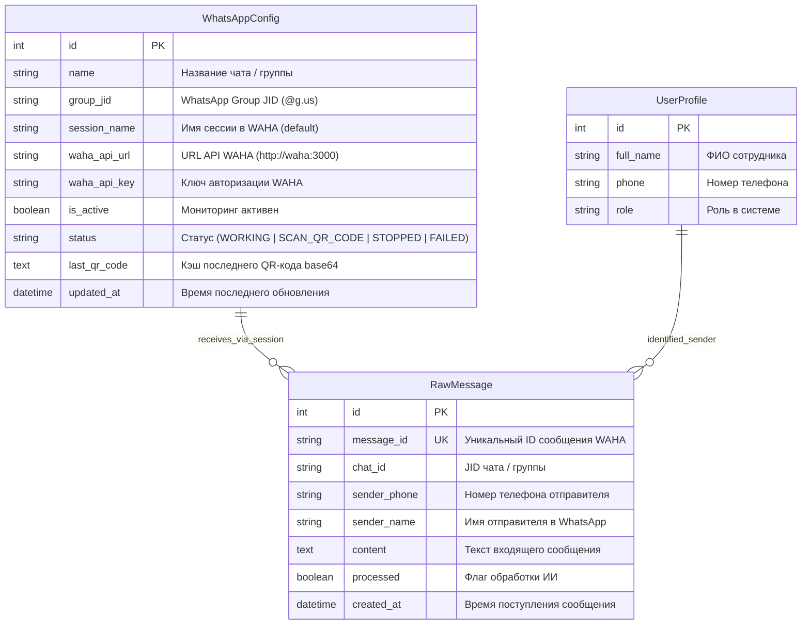
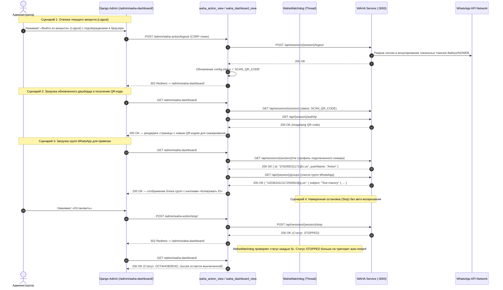

# Спецификация: Добавление действия Logout в WAHA, исправление автохилера и отображения групп WhatsApp

**Дата и время (MSK):** 2026-09-25 16:35:00  
**Ветка:** `feature/waha-logout-and-dashboard`  
**Статус:** Выполнено, проверено E2E тестами  

---

## 1. Mermaid ERD (Схема моделей данных)

Схема отражает сущности управления WhatsApp сессией (`WhatsAppConfig`), входящими сообщениями (`RawMessage`) и привязкой пользователей.



---

## 2. Mermaid Sequence Diagram (Сквозной процесс сброса сессии, получения QR-кода и остановки)



---

## 3. Постановка проблемы и анализ причин

В интерфейсе центра управления WAHA (`https://ai.mazory.best/admin/waha-dashboard/`) были обнаружены три критические проблемы:

1. **Невозможно отвязать текущий аккаунт и получить новый QR-код**:
   - Сессия `default` в контейнере WAHA авторизована под номером `+375299231172`.
   - В интерфейсе присутствуют только кнопки `Запустить`, `Перезапустить` и `Остановить`.
   - Действие `stop` лишь останавливает обработку сокетов, но **не удаляет сохранённую авторизацию**. При повторном старте WAHA восстанавливает сессию и переходит в статус `WORKING`.
   - Режим `SCAN_QR_CODE` не наступает, QR-код не отдаётся и в интерфейсе отсутствует возможность сменить номер WhatsApp.
2. **Сессия самопроизвольно запускается обратно после нажатия кнопки «Остановить»**:
   - В `backend/api/apps.py` фоновый поток `start_waha_watchdog` каждые 5 секунд проверяет статус сессии и при `status in ('FAILED', 'STOPPED')` принудительно перезапускает её (`POST /api/sessions/default/restart`).
   - Лог прода подтвердил: через 4 секунды после ручного `POST /admin/waha-action/stop/` вочдог воскрешал сессию сообщением:
     `🔄 [WAHA AUTO-HEALER] Session 'default' is STOPPED. Auto-restarting so QR is always active...`
3. **Не отображаются группы WhatsApp в блоке «Доступные чаты и группы»**:
   - Запрос профиля в коде выполнялся к `/api/{session}/me`, возвращая 404 (в API WAHA путь `/api/sessions/{session}/me`).
   - Запрос списка чатов выполнялся к `GET /api/{session}/chats`. В движке `NOWEB` этот эндпоинт падает с ошибкой `400 Bad Request` (`Enable NOWEB store "config.noweb.store.enabled=True"...`).
   - При этом в API WAHA есть отдельный эндпоинт `GET /api/{session}/groups`, который в `NOWEB` возвращает 200 OK со всеми группами аккаунта, но в коде он не использовался.

---

## 4. Требования к реализации

### 4.1. Добавление действия Logout в `backend/api/waha_admin_views.py`
- Добавить в `waha_action_view` маппинг действия `logout`:
  ```python
  url_map = {
      "start": f"{base_url}/api/sessions/{session}/start",
      "stop": f"{base_url}/api/sessions/{session}/stop",
      "restart": f"{base_url}/api/sessions/{session}/restart",
      "logout": f"{base_url}/api/sessions/{session}/logout",
  }
  ```
- При успешном выполнении `logout`:
  - Обновлять `config.status = "SCAN_QR_CODE"`.
  - Очищать `config.last_qr_code = ""`.
  - Сохранять изменения в модели `WhatsAppConfig`.
  - Выводить информационное flash-сообщение пользователю: «*Вы вышли из WhatsApp. Отсканируйте новый QR-код для привязки аккаунта.*»

### 4.2. Коррекция вызовов Me и Groups в `backend/api/waha_admin_views.py`
- Исправить вызов информации о подключенном аккаунте:
  `requests.get(f"{base_url}/api/sessions/{session}/me", headers=headers, timeout=5)`
- Реализовать загрузку групп через эндпоинт `GET /api/{session}/groups`:
  - Поддержать парсинг ответа в виде словаря `{jid: {subject, ...}}` и списка объектов `[{id, subject/name}, ...]`.
  - При наличии доступных групп формировать элементы вида:
    `{"id": group_id, "name": group_subject}`
  - Также пытаться вызвать `GET /api/{session}/chats` и дополнять список недостающими чатами (если хранилище доступно).
  - Сортировать список: группы с суффиксом `@g.us` первыми по алфавиту.

### 4.3. Обновление интерфейса в `backend/templates/admin/waha_dashboard.html`
- Добавить форму и кнопку «Выйти из аккаунта» (`logout`):
  - Кнопка должна быть заметной (акцентная стилизация amber/rose).
  - Обязателен диалог подтверждения:
    `onclick="return confirm('Вы действительно хотите отвязать WhatsApp-аккаунт? Потребуется заново отсканировать QR-код.')"`
  - Кнопка доступна при статусе `WORKING`.
- Обновить блок информации о подключенном аккаунте (отображение pushName и номера JID).
- Обеспечить корректный вывод списка групп и удобную кнопку «Копировать ID».

### 4.4. Исправление автохилера `start_waha_watchdog` в `backend/api/apps.py`
- Исключить статус `STOPPED` из условий автоперезапуска:
  ```python
  if status == 'FAILED':
      # перезапуск только при сбое
  ```
- Если статус сессии `STOPPED`, вочдог не должен отправлять запрос на перезапуск. Сессия остается остановленной до явного действия пользователя.

### 4.5. E2E тестирование через Playwright (`frontend/e2e/waha_dashboard.spec.ts`)
- Проверить доступность панели управления WAHA в Django Admin:
  - Проверка наличия кнопок «Запустить сессию», «Перезапустить», «Остановить», «Выйти из аккаунта».
  - Проверка корректного рендеринга карточек статуса и блока доступных групп.

---

## 5. Критерии готовности (Definition of Done)

- [x] В `backend/api/waha_admin_views.py` добавлено действие `logout` через `POST /api/sessions/{session}/logout`.
- [x] В `backend/api/waha_admin_views.py` исправлен вызов `GET /api/sessions/{session}/me`.
- [x] В `backend/api/waha_admin_views.py` реализовано получение групп через `GET /api/{session}/groups` с корректной сортировкой.
- [x] В `backend/templates/admin/waha_dashboard.html` добавлена кнопка «Выйти из аккаунта» с подтверждением и актуализирован вывод профиля и групп.
- [x] В `backend/api/apps.py` автохилер больше не поднимает сессию при статусе `STOPPED`.
- [x] Команда `uv run --project backend python manage.py check` завершается без ошибок.
- [x] Команда `uv run --project backend python manage.py makemigrations --check` возвращает `No changes detected`.
- [x] Команда `cd frontend && npm run build` проходит без ошибок TypeScript и сборки.
- [x] Добавлен сквозной Playwright E2E тест в `frontend/e2e/mazory-admin-waha.spec.ts`, проверяющий элементы интерфейса дашборда WAHA (пройден успешно).
- [x] Изменения зафиксированы в ветке `feature/waha-logout-and-dashboard`.
