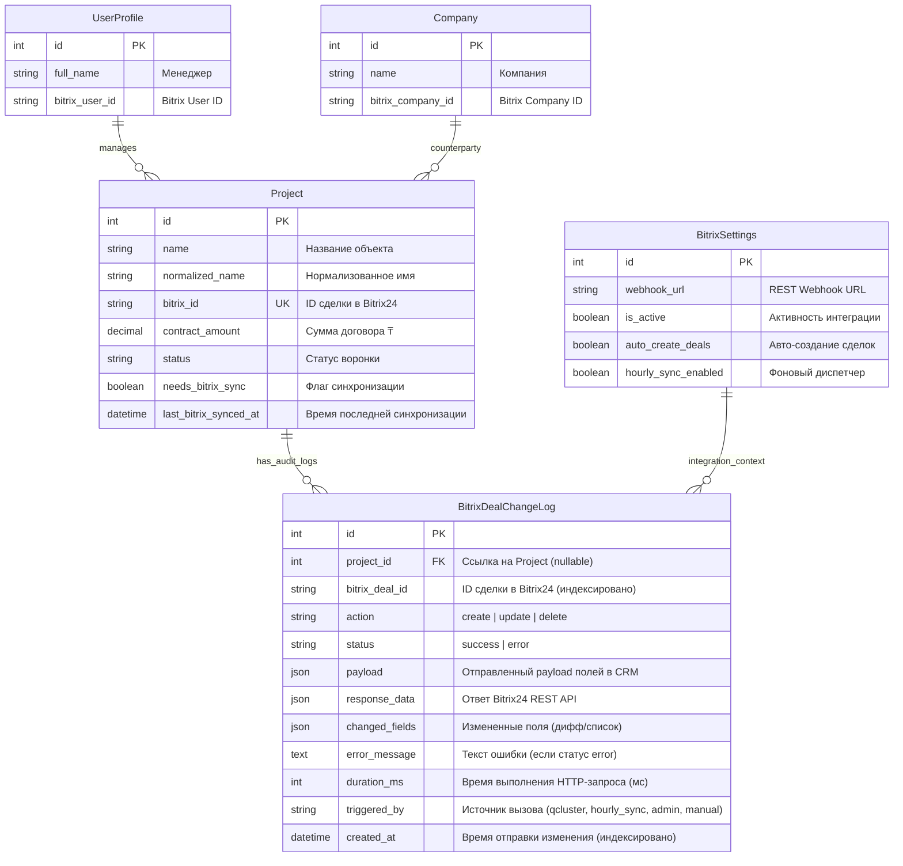
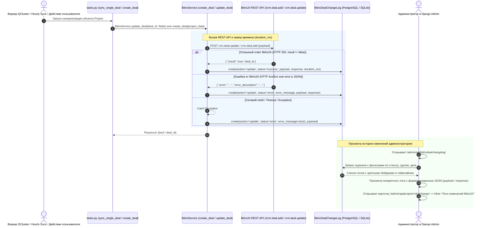

# Спецификация: Аудит и логирование изменений сделок, отправляемых в Bitrix24 CRM, с просмотром в Django Admin

**Дата и время (MSK):** 2026-09-25 17:04:47  
**Ветка:** `feature/bitrix-deal-change-log`  
**Статус:** Выполнено, проверено E2E тестами  

---

## 1. Mermaid ERD (Схема моделей данных)

Схема отражает добавление модели аудита `BitrixDealChangeLog` и её связь с существующей моделью `Project` (сделки/объекты) и интеграционной конфигурацией `BitrixSettings`.



---

## 2. Mermaid Sequence Diagram (Сквозной процесс логирования отправки изменений в Bitrix24)

Диаграмма иллюстрирует сквозной поток фиксации аудита при создании и обновлении сделок через `BitrixService` с последующим отображением в Django Admin.



---

## 3. Постановка задачи и бизнес-контекст

В платформе Mazory осуществляется двусторонняя синхронизация сделок и проектов с Bitrix24 CRM:
1. При обнаружении новых сделок в WhatsApp-чатах через ИИ-анализ создаются локальные объекты `Project`, которые затем передаются в Bitrix24 CRM (`crm.deal.add`).
2. При поступлении обновлений (изменение сумм оплат, сдвиг дедлайнов, смена статуса воронки, появление блокеров) данные отправляются в существующую сделку Bitrix24 (`crm.deal.update`).
3. Ежечасный диспетчер (`enqueue_hourly_bitrix_sync_task`) регулярно синхронизирует все сделки с флагом `needs_bitrix_sync=True`.

### Проблема:
В настоящее время факт и состав отправляемых в CRM данных логируются исключительно в stdout воркера. При возникновении расхождений между Mazory и Bitrix24 (например: почему изменилась сумма, почему сделка перешла на другой этап, какие поля были переданы, отклонил ли Bitrix запрос из-за валидации пользовательских полей `UF_CRM_*`) невозможно быстро провести расследование без прямого доступа к сырым консольным логам контейнеров Docker.

### Цель:
Реализовать постоянное сохранение в БД полной истории всех изменений, отправленных в Bitrix CRM по созданию и обновлению сделок, и предоставить удобный, структурированный интерфейс просмотра в Django Admin с подсветкой синтаксиса JSON, фильтрацией, поиском и интеграцией в карточку проекта (`ProjectAdmin`).

---

## 4. Требования

### 4.1. Функциональные требования

1. **Модель данных `BitrixDealChangeLog`:**
   - Хранение связки с проектом `Project` (`ForeignKey`, `null=True, blank=True, on_delete=models.SET_NULL`).
   - Идентификатор сделки Bitrix24 `bitrix_deal_id` (`CharField`, `db_index=True`).
   - Тип действия `action`: `create` («Создание сделки») / `update` («Обновление сделки»).
   - Статус операции `status`: `success` («Успешно») / `error` («Ошибка»).
   - Отправленный payload `payload`: `JSONField` (словарь переданных в Bitrix полей: `STAGE_ID`, `OPPORTUNITY`, `UF_CRM_*`, `COMMENTS` и т.д.).
   - Ответ Bitrix24 `response_data`: `JSONField` (ответ API `{"result": ...}` или данные об ошибке).
   - Список/дифф измененных полей `changed_fields`: `JSONField` (список измененных ключей или маппинг старое/новое для быстрого обзора).
   - Сообщение об ошибке `error_message`: `TextField` (пустая строка при успехе, текст ошибки при сбое).
   - Длительность выполнения запроса `duration_ms`: `IntegerField` (в миллисекундах).
   - Источник/инициатор `triggered_by`: `CharField` (`qcluster_task`, `hourly_sync`, `admin_action`, `manual`).
   - Дата и время события `created_at`: `DateTimeField(auto_now_add=True, db_index=True)`.

2. **Автоматический перехват в `BitrixService`:**
   - Перехват в методе `BitrixService.create_deal(project_data)`: сохранение записи аудита после выполнения `crm.deal.add` (как при успехе с полученным `deal_id`, так и при ошибке/исключении).
   - Перехват в методе `BitrixService.update_deal(deal_id, fields_to_update, project=None, triggered_by='...')`: сохранение записи аудита после выполнения `crm.deal.update`.
   - Изоляция ошибок логирования: исключения при записи лога в БД не должны прерывать выполнение основного бизнес-процесса отправки в Bitrix (оборачиваются в `try-except` с логированием в `logger.error`).

3. **Интерфейс в Django Admin:**
   - Регистрация модели `BitrixDealChangeLog` через `unfold.admin.ModelAdmin`.
   - Список записей (`list_display`):
     - `created_at` (форматированная дата и время)
     - `project_link` (ссылка на проект в Django Admin)
     - `bitrix_deal_link` (кликабельная ссылка на сделку в портале Bitrix24)
     - `action_badge` (цветной бейдж: синий для создания, индиго для обновления)
     - `status_badge` (зеленый для успеха, красный для ошибки)
     - `changed_fields_summary` (краткий список переданных полей)
     - `duration_fmt` (длительность запроса, например: `142 мс`)
   - Фильтры (`list_filter`):
     - По статусу (`status`)
     - По действию (`action`)
     - По дате создания (`created_at`)
   - Поиск (`search_fields`):
     - По `bitrix_deal_id`
     - По названию проекта `project__name`
     - По тексту ошибки `error_message`
   - Детальный просмотр карточки лога:
     - Все поля только для чтения (`readonly_fields`).
     - Запрет ручного создания и изменения логов в админке (`has_add_permission = False`, `has_change_permission = False`).
     - Красивое форматирование `payload` и `response_data` с отступами и подсветкой через `<pre class="bg-gray-900 text-gray-100 p-4 rounded-lg"><code>...</code></pre>`.
   - **Встраивание в `ProjectAdmin` (Inline):**
     - Добавление `BitrixDealChangeLogInLine` (`unfold.admin.TabularInline`, read-only) в карточку `ProjectAdmin`.
     - Администратор, открывая проект, сразу видит историю всех отправленных в Bitrix изменений по данному проекту.

### 4.2. Нефункциональные требования

- **Производительность:** запись в таблицу аудита должна быть легковесной и не блокировать транзакции.
- **Целостность данных:** при удалении проекта связь `project` сбрасывается в `NULL` (`on_delete=models.SET_NULL`), чтобы лог аудита интеграции оставался в базе навсегда.
- **Совместимость с Unfold Admin:** стилизация бейджей, таблиц и полей ввода строго соответствует Tailwind-палитре Django Unfold (`emerald`, `rose`, `indigo`, `amber`).
- **Соблюдение правил монорепозитория Mazory (`AGENTS.md`):**
  - Целочисленные первичные ключи `BigAutoField` в Django ORM.
  - Наличие миграции Django с обязательной проверкой `makemigrations --check`.
  - Сквозные E2E тесты на Playwright.

---

## 5. Планируемые изменения в кодовой базе

| Файл / Компонент | Тип изменения | Описание |
|------------------|---------------|----------|
| `backend/api/models.py` | Модификация | Добавление модели `BitrixDealChangeLog` с полями аудита, индексами и строковым представлением. |
| `backend/api/migrations/000X_bitrixdealchangelog.py` | Новый файл | Миграция базы данных Django для создания таблицы `api_bitrixdealchangelog`. |
| `backend/api/bitrix_service.py` | Модификация | Расширение методов `create_deal` и `update_deal` аргументами контекста (`project`, `triggered_by`), замер времени выполнения и вызов `_log_deal_change`. |
| `backend/api/tasks.py` | Модификация | Передача объекта `project` и источника вызова `triggered_by` при вызовах `BitrixService.create_deal` и `BitrixService.update_deal`. |
| `backend/api/admin.py` | Модификация | Регистрация `BitrixDealChangeLogAdmin` с кастомным форматированием JSON и добавление `BitrixDealChangeLogInLine` в `ProjectAdmin`. |
| `backend/api/tests_bitrix_audit_log.py` | Новый файл | Тесты Django TestCase для проверки создания записей аудита при вызовах `create_deal`, `update_deal`, а также обработки ошибок. |
| `frontend/e2e/mazory-bitrix-audit-log.spec.ts` | Новый файл | Playwright E2E тест: вход в админку, проверка наличия раздела аудита, фильтрация, просмотр payload и проверка Inline в карточке проекта. |

---

## 6. Детализация реализации

### 6.1. Модель данных в `backend/api/models.py`

```python
class BitrixDealChangeLog(models.Model):
    ACTION_CHOICES = [
        ('create', 'Создание сделки (crm.deal.add)'),
        ('update', 'Обновление сделки (crm.deal.update)'),
    ]
    STATUS_CHOICES = [
        ('success', 'Успешно'),
        ('error', 'Ошибка'),
    ]

    project = models.ForeignKey(
        Project,
        on_delete=models.SET_NULL,
        null=True,
        blank=True,
        related_name='bitrix_change_logs',
        verbose_name='Объект / Сделка'
    )
    bitrix_deal_id = models.CharField('ID сделки в Bitrix24', max_length=64, db_index=True)
    action = models.CharField('Действие', max_length=32, choices=ACTION_CHOICES, db_index=True)
    status = models.CharField('Статус', max_length=32, choices=STATUS_CHOICES, default='success', db_index=True)
    payload = models.JSONField('Отправленные данные (Payload)', default=dict, blank=True)
    response_data = models.JSONField('Ответ Bitrix24', default=dict, blank=True)
    changed_fields = models.JSONField('Измененные поля', default=list, blank=True)
    error_message = models.TextField('Текст ошибки', blank=True, default='')
    duration_ms = models.IntegerField('Длительность (мс)', default=0)
    triggered_by = models.CharField('Инициатор / Источник', max_length=128, default='system', blank=True)
    created_at = models.DateTimeField('Дата и время отправки', auto_now_add=True, db_index=True)

    class Meta:
        verbose_name = 'Лог изменения сделки Bitrix24'
        verbose_name_plural = 'Логи изменений сделок Bitrix24'
        ordering = ['-created_at']

    def __str__(self):
        return f"[{self.get_action_display()}] Сделка #{self.bitrix_deal_id} — {self.get_status_display()} ({self.created_at.strftime('%d.%m.%Y %H:%M:%S')})"
```

### 6.2. Логирование в `backend/api/bitrix_service.py`

В `BitrixService` добавляется защищенный метод `_record_deal_log`:

```python
@staticmethod
def _record_deal_log(
    action: str,
    bitrix_deal_id: str,
    payload: Dict[str, Any],
    response_data: Optional[Dict[str, Any]] = None,
    error_message: str = "",
    status: str = "success",
    project: Optional[Any] = None,
    duration_ms: int = 0,
    triggered_by: str = "system"
):
    try:
        from .models import BitrixDealChangeLog, Project
        if project is None and bitrix_deal_id:
            project = Project.objects.filter(bitrix_id=str(bitrix_deal_id)).first()
            
        changed_fields = list(payload.keys()) if isinstance(payload, dict) else []

        BitrixDealChangeLog.objects.create(
            project=project,
            bitrix_deal_id=str(bitrix_deal_id),
            action=action,
            status=status,
            payload=payload,
            response_data=response_data or {},
            changed_fields=changed_fields,
            error_message=error_message,
            duration_ms=duration_ms,
            triggered_by=triggered_by
        )
    except Exception as log_err:
        logger.error("Failed to record Bitrix deal change audit log: %s", log_err)
```

В методах `create_deal` и `update_deal`:
- Фиксируется `t0 = time.time()`.
- Выполняется вызов `BitrixService.call(...)`.
- При успешном выполнении вызывается `_record_deal_log(..., status="success", duration_ms=int((time.time() - t0) * 1000))`.
- В блоке `except Exception as e:` вызывается `_record_deal_log(..., status="error", error_message=str(e), duration_ms=int((time.time() - t0) * 1000))` и исключение пробрасывается/обрабатывается по стандарту.

### 6.3. Отображение в Django Admin (`backend/api/admin.py`)

1. **`BitrixDealChangeLogInline`:**
   ```python
   class BitrixDealChangeLogInLine(TabularInline):
       model = BitrixDealChangeLog
       extra = 0
       can_delete = False
       readonly_fields = ('created_at', 'action_badge', 'status_badge', 'changed_fields_summary', 'duration_fmt', 'bitrix_deal_link')
       fields = ('created_at', 'action_badge', 'status_badge', 'changed_fields_summary', 'duration_fmt', 'bitrix_deal_link')

       def has_add_permission(self, request, obj=None):
           return False
   ```
2. **`BitrixDealChangeLogAdmin`:**
   - Реализация форматирования JSON через `json.dumps(obj, indent=2, ensure_ascii=False)` в безопасном HTML-теге `<pre><code>`.
   - Кликабельные ссылки на портал Bitrix24 (`https://aquakip.bitrix24.kz/crm/deal/details/<id>/`).
   - Цветные бейджи для действий (`create` — синий, `update` — индиго) и статусов (`success` — зеленый, `error` — красный).

---

## 7. План E2E и интеграционного тестирования

1. **Бэкенд тесты (`backend/api/tests_bitrix_audit_log.py`):**
   - Тест успешного логирования `BitrixService.create_deal`: проверка создания записи в `BitrixDealChangeLog` с `action='create'`, корректным payload и `status='success'`.
   - Тест успешного логирования `BitrixService.update_deal`: проверка создания записи с `action='update'`, списком измененных полей и связкой с `Project`.
   - Тест логирования сетевой или API-ошибки: симуляция сбоя запроса к Bitrix API, проверка создания записи с `status='error'` и сохранением текста ошибки `error_message`.
   - Тест изолированности: проверка того, что возможный сбой при записи аудита не роняет основной метод `create_deal`/`update_deal`.

2. **Playwright E2E тест (`frontend/e2e/mazory-bitrix-audit-log.spec.ts`):**
   - Авторизация администратора в `/admin/`.
   - Переход в раздел `/admin/api/bitrixdealchangelog/`: проверка наличия таблицы, колонок «Дата», «Сделка», «Действие», «Статус», «Поля».
   - Проверка фильтрации по статусу («Успешно» / «Ошибка»).
   - Переход в детальный просмотр записи: проверка отображения отформатированного блока JSON с отправленным payload и ответом.
   - Переход в карточку объекта `/admin/api/project/<id>/change/`: проверка отображения встроенного блока (Inline) «Логи изменений сделки Bitrix24» с записями по данной сделке.

---

## 8. Критерии готовности (Definition of Done)

- [x] Модель `BitrixDealChangeLog` добавлена в `backend/api/models.py`.
- [x] Сгенерирована и успешно применена миграция БД (`python manage.py makemigrations` и `python manage.py migrate`).
- [x] Проверка `python manage.py makemigrations --check` завершается с кодом 0 (`No changes detected`).
- [x] Методы `BitrixService.create_deal` и `BitrixService.update_deal` сохраняют запись аудита при каждом вызове (как при успехе, так и при ошибке).
- [x] В `backend/api/tasks.py` вызовы создания и обновления сделок передают контекст проекта и инициатора.
- [x] Модель зарегистрирована в Django Admin (`backend/api/admin.py`) с фильтрами, поиском, красивым отображением JSON и ссылками на Bitrix24.
- [x] В `ProjectAdmin` добавлен read-only Inline с историей аудита изменений сделки.
- [x] Бэкенд тесты (`api/tests_bitrix_audit_log.py`) проходят успешно.
- [x] Сквозные Playwright E2E тесты (`frontend/e2e/mazory-bitrix-audit-log.spec.ts`) завершаются с зеленым статусом.
- [x] Сервисы Docker Compose работают стабильно, ошибки в логах отсутствуют.
