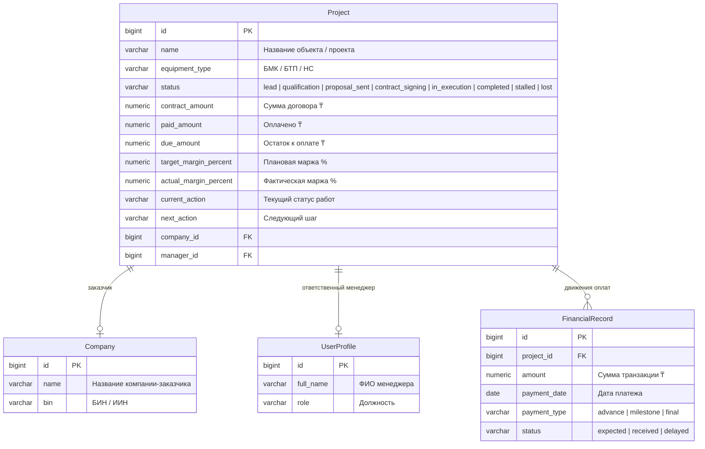

# Спецификация: Передача финансового контекста и реестра проектов в AI-ассистент Mazory

**Дата создания:** 2026-09-25 17:37:04 MSK  
**Ветка:** `feature/ai-project-financial-context`  
**Целевая ветка:** `main`  
**Статус:** На согласовании  

---

## 1. Архитектурная ER-диаграмма данных



---

## 2. Sequence-диаграмма взаимодействия с AI-ассистентом

```mermaid
sequenceDiagram
    autonumber
    actor User as Пользователь (Web UI)
    participant Front as Frontend (Vue 3 / useChat)
    participant View as ChatQueryView (DRF :8000)
    participant DB as PostgreSQL (Django ORM)
    participant Qdrant as Qdrant Vector DB
    participant AI as OpenRouter / LLM (AIService)

    User->>Front: Ввод аналитического вопроса ("Посчитай сумму договоров...", "Сколько на согласовании?")
    Front->>View: POST /api/chat/query/ { prompt }
    
    rect rgb(20, 30, 60)
        Note over View, DB: Интеллектуальное обогащение контекста
        View->>DB: Запрос финансовой сводки (Total Volume, Paid, Due, Count)
        View->>DB: Поиск проектов по токенам запроса или выгрузка реестра активных проектов
        DB-->>View: Агрегаты портфеля + список проектов с суммами и стадиями
        View->>Qdrant: Семантический поиск по переписке WhatsApp (limit=5)
        Qdrant-->>View: Найденные цитаты/факты
    end

    View->>AI: AIService.chat_assistant(prompt, context_data)
    Note over AI: Модель видит точные цифры договоров, суммы, стадии и производит математический расчет
    AI-->>View: Структурированный аналитический ответ с расчетами в ₸
    View-->>Front: HTTP 200 { text, quotes, widget: project_table }
    Front-->>User: Отображение текста ответа нейросети + интерактивный виджет таблицы
```



---

## 3. Постановка проблемы и обоснование

### Текущее поведение:
При произвольном вопросе в чат (например: *«Посчитай общую сумму по всем договорам»* или *«Какова сумма проектов на стадии квалификации?»*) запрос попадает в ветку `else` (Интент 5) в `ChatQueryView` ([`backend/api/views.py`](file:///Users/a_belianskii/projects/kz-aquakip/mazory/backend/api/views.py)).
Там выполняется поиск:
```python
matched_projects = list(Project.objects.filter(
    Q(name__icontains=prompt) | Q(company__name__icontains=prompt)
)[:5])
```
Так как в качестве аргумента `prompt` передается весь длинный вопрос пользователя целиком, поиск не находит ни одного совпадения. В `context_data["matched_projects"]` передается пустой список `[]`.
Нейросеть, следуя строгому системному промпту («не выдумывать данные, опираться на переданный контекст»), отвечает:
> *«На основании предоставленных данных невозможно рассчитать итоговую сумму, так как в витрине данных отсутствуют проекты и договоры (`matched_projects`: пустой массив)...»*

При этом данные в БД есть (14+ проектов, синхронизированных с Bitrix24), и в предопределенной кнопке-виджете они отображаются.

---

## 4. Требования к реализации

1. **Аналитическое обогащение `context_data` (Portfolio Summary & Financial Aggregates):**
   - В `context_data` добавить блок `portfolio_summary`:
     - Общая сумма портфеля договоров (`total_contract_amount`)
     - Фактически оплачено (`total_paid_amount`)
     - Остаток к сбору (`total_due_amount`)
     - Общее количество проектов (`total_projects_count`)
     - Распределение сумм и количества по стадиям воронки (`stages_summary`)
   
2. **Токенизированный и интеллектуальный поиск проектов (`matched_projects`):**
   - Извлекать из запроса пользователя ключевые слова (токены длиной от 3 символов, исключая русские стоп-слова).
   - Выполнять поиск проектов по токенам в названии объекта и названии компании (`name__icontains`, `company__name__icontains`).
   - **Fallback на весь активный реестр:** Если конкретный объект по названию не распознан, но запрос носит общий характер (расчет, договоры, воронка, статистика, клиенты, суммы) — передавать в `matched_projects` список всех активных проектов компании (до 30 проектов) с полями:
     - `id`, `name`, `company`, `manager`, `status` (человекочитаемый), `contract_amount`, `paid_amount`, `due_amount`, `margin_percent`, `equipment_type`, `current_action`.

3. **Возврат виджета таблицы проектов:**
   - Если пользователь задает финансовый/аналитический вопрос по договорам, в ответе API возвращать не только текст нейросети, но и виджет таблицы проектов (`preset: "deal_pipeline"`), чтобы в веб-интерфейсе синхронно появлялась актуальная таблица с данными.

4. **Системный промпт AI-ассистента:**
   - Уточнить в `system_prompt_assistant`, что модель имеет прямой доступ к двум блокам: `portfolio_summary` (общие агрегаты) и `matched_projects` (детальные данные договоров), и должна производить расчеты, группировки и вычисления на основе этих данных, отвечая на русском языке и форматируя суммы в тенге (₸).

---

## 5. План реализации

1. **Backend (`backend/api/views.py`):**
   - Модифицировать обработчик `ChatQueryView` (Интент 5):
     - Рассчитывать `portfolio_summary` через Django ORM aggregates (`Sum`, `Count`).
     - Реализовать токенизированный поиск проектов с fallback на реестр активных проектов.
     - Формировать расширенный `context_data` со сводными агрегатами и списком договоров.
     - Добавить прикрепление виджета `project_table` при наличии проектов в контексте.
2. **Backend (`backend/api/ai_service.py`):**
   - Убедиться, что сериализация `portfolio_summary` и `matched_projects` корректно подается в системный контекст чат-модели.
3. **E2E Верификация:**
   - Проверить запрос к `/api/chat/query/` с вопросом о расчете общей суммы договоров.
   - Проверить, что AI отвечает с точной суммой в тенге (₸), ссылаясь на конкретные проекты из базы данных.
   - Прогнать Playwright E2E тесты.

---

## 6. Критерии готовности (Definition of Done)

- [ ] Запрос «Посчитай общую сумму по всем договорам» возвращает от AI точную сумму портфеля в тенге (₸) без сообщения об отсутствии данных.
- [ ] Запрос с названием конкретного объекта (например, «Что по ЖК Медео?») находит этот объект и выдает суммы и статус именно по нему.
- [ ] В ответе присутствует как текстовый аналитический ответ нейросети, так и виджет таблицы проектов.
- [ ] Команды `python manage.py check` и `python manage.py makemigrations --check` завершаются успешно (код 0).
- [ ] Все Playwright E2E тесты проходят успешно.
