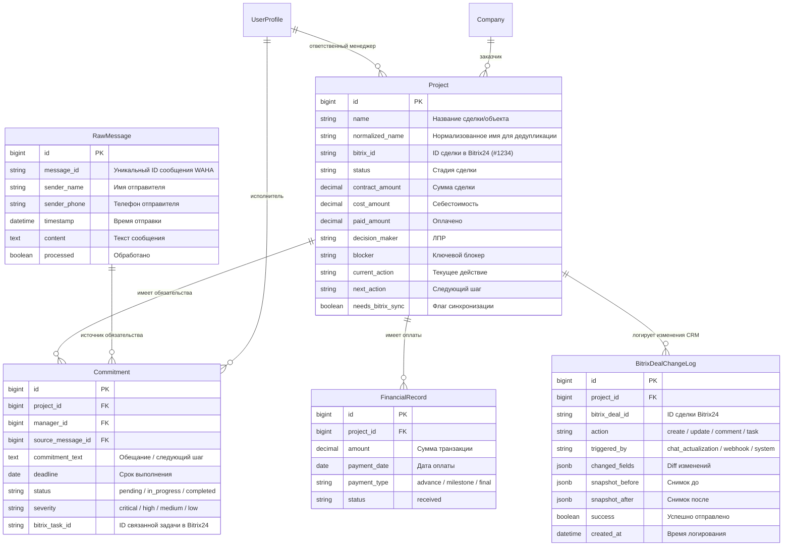
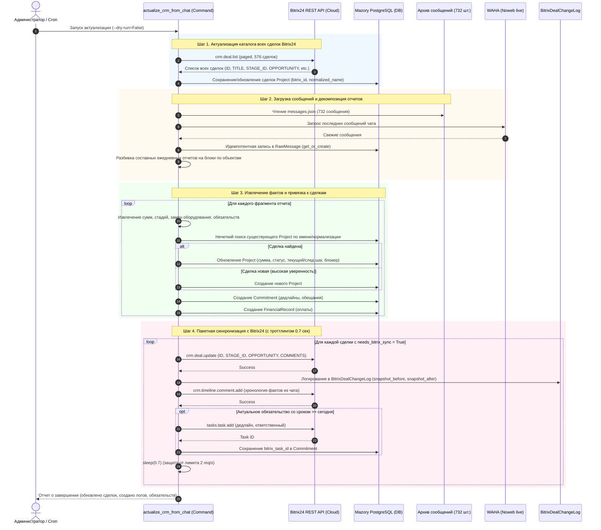

# Спецификация: Полная актуализация сделок из WhatsApp-чата и синхронизация с Bitrix24 CRM

**Дата и время создания:** 2026-09-25 18:03:19 MSK  
**Тип задачи:** feature  
**Ветка:** `feature/crm-chat-actualization`  
**Ответственный компонент:** `backend/api/` (management command, BitrixService, tasks, RawMessage, Project, Commitment, FinancialRecord, BitrixDealChangeLog)

---

## 1. Архитектура и диаграммы

### 1.1. ERD задействованных сущностей базы данных (Mermaid)

### 1.2. Sequence-диаграмма процесса сквозной актуализации

---

## 2. Постановка и цели

1. Выполнить полную и глубокую актуализацию данных между рабочим чатом WhatsApp «КОМАНДА ПОДДЕРЖКИ ПРОДАЖ» и CRM Bitrix24 на продакшене `https://ai.mazory.best/`.
2. Предотвратить потерю информации из многообъектных ежедневных отчетов (декомпозиция отчетов).
3. Исключить создание дубликатов в Bitrix24 за счет предварительного импорта каталога из 576 существующих сделок Bitrix24 и нормализованного сопоставления.
4. Предотвратить шторм уведомлений в Bitrix24: исторические обещания пишутся в таймлайн сделки, а задачи создаются только по активным дедлайнам.
5. Соблюсти лимит вызовов Bitrix24 REST API (<= 2 запроса в секунду).
6. Зафиксировать все до единого изменения в `BitrixDealChangeLog` с возможностью просмотра в Django Admin.

---

## 3. Требования

### Функциональные требования
1. **Management command `actualize_crm_from_chat`:**
   * Поддержка параметров `--dry-run`, `--limit-messages`, `--skip-bitrix-push`.
   * Шаг 1: `sync_bitrix_deal_catalog()` — загрузка всех 576 сделок из Bitrix24 в локальную БД `Project`.
   * Шаг 2: `load_raw_messages()` — загрузка 732 сообщений из `/app/archive_data/messages.json` + свежих сообщений из WAHA в `RawMessage`.
   * Шаг 3: `parse_and_extract_facts()` — извлечение коммерческих событий из отчетов с парсингом многообъектных отчетов.
   * Шаг 4: `sync_to_bitrix()` — синхронизация сделок с Bitrix24 с интервалом 0.7с между вызовами, фиксацией в `BitrixDealChangeLog`, добавлением комментариев в таймлайн сделки и созданием задач только для активных дедлайнов.
2. **Нечеткий матчинг и нормализация:**
   * Обработка вариаций написания: «Оазис» / «Оазиз» (`#1396`), «ЦТП 343» (`#718`), «Курмет» (`#350`), «Олимпик Парк» (`#304`), «Казына» (`#936`, `#938`), «Vertex Garden».
3. **Логирование изменений:**
   * Все вызовы `crm.deal.update` логируются через существующий `BitrixService._record_deal_log` в модель `BitrixDealChangeLog` со статусом `success=True`.
4. **Безопасность и отказоустойчивость:**
   * Идемпотентность — повторный запуск не создает дубликатов сделок, сообщений или записей оплат.

---

## 4. Критерии готовности (Definition of Done)

1. Команда `actualize_crm_from_chat` реализована, протестирована и запускается без ошибок.
2. В локальной базе данных актуализированы `Project`, `RawMessage`, `Commitment`, `FinancialRecord`.
3. Все обновления сделок успешно переданы в Bitrix24 CRM с соблюдением лимитов REST API.
4. В админке `https://ai.mazory.best/admin/api/bitrixdealchangelog/` доступны записи всех изменений.
5. Прогон системного check Django (`python manage.py check`) и миграций (`python manage.py makemigrations --check`) завершается с кодом 0.
