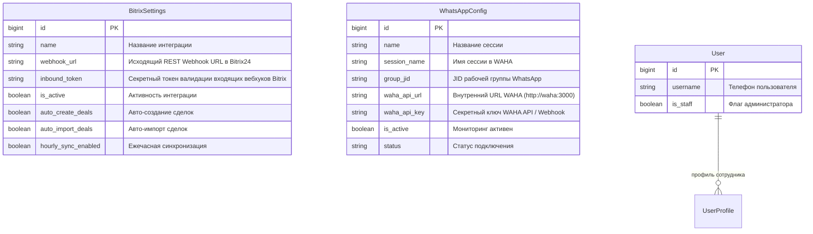
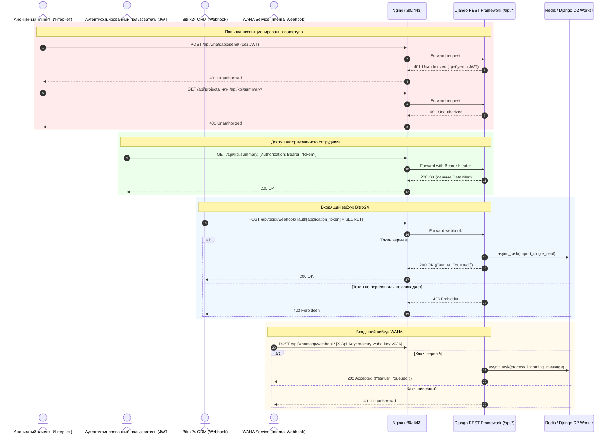

# Спецификация: Production-Ready Security Hardening (Закрытие роутов WhatsApp, Bitrix, KPI, Projects и DEBUG=0)

**Дата и время создания:** 2026-09-26 14:36:30 MSK  
**Тип задачи:** bugfix / chore  
**Ветка:** `bugfix/production-security-hardening`  
**Ответственные компоненты:** `backend/` (Django REST Framework permissions, settings, views, models, migrations), `docker-compose.yml`, `frontend/` (useAuth, useChat, e2e тесты)

---

## 1. Архитектура и диаграммы

### 1.1. ERD задействованных сущностей базы данных (Mermaid)

### 1.2. Sequence-диаграмма безопасного взаимодействия и проверки прав (Mermaid)

---

## 2. Постановка проблемы и цели

В текущей конфигурации приложения, развернутого в продакшене:
1. Роуты работы с WhatsApp (`/api/whatsapp/send/`, `/api/whatsapp/qr/`, `/api/whatsapp/status/`, `/api/whatsapp/restart/`, `/api/whatsapp/webhook/`) открыты для любого неавторизованного пользователя (`AllowAny`), что создает критическую уязвимость: несанкционированная рассылка WhatsApp-сообщений, перехват сессии по QR-коду и DoS перезагрузкой.
2. Вебхук Bitrix24 (`/api/bitrix/webhook/`) доступен без авторизации и без проверки секретного токена вебхука.
3. Коммерческие аналитические роуты `/api/projects/` (полный реестр сделок) и `/api/kpi/summary/` (выручка, маржинальность, KPI менеджеров) доступны без авторизации (`AllowAny`).
4. В конфигурации `docker-compose.yml` выставлено `DEBUG=1`, что приводит к утечке стектрейсов и переменных окружения при сбоях в проде.
5. Настройки CORS и разрешенных хостов (`ALLOWED_HOSTS`) требуют приведения к стандарту Production-Ready.

**Цель:** перевести систему в защищенный production-режим Zero-Trust по умолчанию, закрыть публичные эндпоинты авторизацией JWT / Staff / Webhook Secret Token, установить `DEBUG=0` и обновить контейнеры на продакшен-сервере.

---

## 3. Требования к изменениям

### 3.1. Политика прав DRF по умолчанию (Zero-Trust)
* В `REST_FRAMEWORK` в `backend/mazory_backend/settings.py` установить:
  `'DEFAULT_PERMISSION_CLASSES': ('rest_framework.permissions.IsAuthenticated',)`
* Публичный доступ (`AllowAny`) оставить строго для:
  * `POST /api/auth/send-code/` (вход по OTP)
  * `POST /api/auth/verify-code/` (проверка OTP и получение JWT)
  * `POST /api/bitrix/webhook/` (с обязательной валидацией токена приложения Bitrix24)
  * `POST /api/whatsapp/webhook/` и `/api/messages/ingest/` (с обязательной валидацией `X-Api-Key` или токена)

### 3.2. Роуты WhatsApp
* `POST /api/whatsapp/send/` — требовать `IsAuthenticated`. Только авторизованные пользователи могут отправлять сообщения в WhatsApp.
* `GET /api/whatsapp/status/` — требовать `IsAuthenticated`.
* `GET /api/whatsapp/qr/` — требовать `IsAuthenticated, IsAdminUser` (административный доступ к сессии).
* `POST /api/whatsapp/restart/` — требовать `IsAuthenticated, IsAdminUser`.
* `POST /api/whatsapp/webhook/` и `/api/messages/ingest/`: проверять валидность секретного ключа (`X-Api-Key` в заголовке или `?token=` в URL) с сопоставлением `WhatsAppConfig.waha_api_key` / `settings.WAHA_API_KEY`. При несовпадении возвращать `401 Unauthorized`.

### 3.3. Роуты Bitrix и коммерческих данных
* `POST /api/bitrix/webhook/`:
  * В модель `BitrixSettings` добавить поле `inbound_token` (секретный токен входящего вебхука Bitrix24, по умолчанию пустой/опциональный).
  * В `BitrixWebhookView`: если `inbound_token` задан в настройках (или через env `BITRIX_INBOUND_TOKEN`), проверять соответствие входящего `auth[application_token]`, заголовка `X-Bitrix-Token` или query-параметра `?token=`. При несовпадении возвращать `403 Forbidden`.
* `GET /api/projects/` — требовать `IsAuthenticated`.
* `GET /api/kpi/summary/` — требовать `IsAuthenticated`.

### 3.4. Production Settings
* В `docker-compose.yml`:
  * Выставить `DEBUG: 0` для `backend` и `qcluster`.
* В `backend/mazory_backend/settings.py`:
  * Убедиться, что `ALLOWED_HOSTS` включает: `ai.mazory.best`, IP `34.70.69.38`, `localhost`, `127.0.0.1`, `backend`, `mazory-backend`.
  * При `DEBUG=False` ограничить `CORS_ALLOW_ALL_ORIGINS`, указав `CORS_ALLOWED_ORIGINS = ['https://ai.mazory.best', 'http://localhost:5173']` (или разрешать только доверенные источники).

### 3.5. Frontend
* В `frontend/src/composables/useAuth.ts`:
  * В функции `sendWhatsAppAlert` добавить заголовок `Authorization: Bearer ${token}`.
* В `frontend/src/composables/useChat.ts`:
  * Корректно обрабатывать 401 на `fetchKpiData` (если пользователь еще не авторизован, не ломать приложение, а запрашивать данные после авторизации).

---

## 4. Критерии готовности (Acceptance Criteria)

1. **Безопасность роутов:**
   * Неавторизованный `POST /api/whatsapp/send/` возвращает `401 Unauthorized`.
   * Неавторизованный `GET /api/whatsapp/qr/` возвращает `401 Unauthorized` / `403 Forbidden`.
   * Неавторизованный `GET /api/kpi/summary/` возвращает `401 Unauthorized`.
   * Неавторизованный `GET /api/projects/` возвращает `401 Unauthorized`.
   * `POST /api/whatsapp/webhook/` с неверным `X-Api-Key` возвращает `401 Unauthorized`.
   * `POST /api/bitrix/webhook/` при настроенном токене возвращает `403 Forbidden` при отсутствии правильного токена.
2. **Работоспособность для авторизованных пользователей:**
   * После логина по телефону и OTP эндпоинты `/api/kpi/summary/` и `/api/chat/query/` отдают данные корректно.
3. **Проверки качества кода:**
   * `uv run --project backend python manage.py check` завершается без ошибок.
   * `uv run --project backend python manage.py makemigrations --check` завершается с кодом 0 (`No changes detected`).
   * `cd frontend && npm run build` (включая `vue-tsc -b`) собирается без ошибок.
   * `cd frontend && npm run test:e2e` Playwright тесты успешно проходят.
4. **Развертывание в продакшене:**
   * Изменения зафиксированы в Git, запушены в `main`.
   * Контейнеры на сервере (`joodexpert-vm`) пересобраны и запущены с `DEBUG=0`.
   * Проверен статус контейнеров (`docker ps`) и логи (`docker compose logs`).
