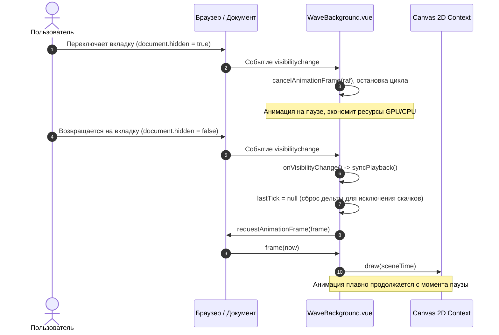

# Спецификация: Восстановление анимации Interactive Canvas 2D Wave Background после скрытия вкладки (visibilitychange)

**Дата и время создания:** 2026-09-26 14:46:54 MSK  
**Тип задачи:** `bugfix`  
**Ветка задачи:** `bugfix/wave-background-visibility`  
**Затронутые компоненты:** `frontend/src/components/WaveBackground.vue`, `frontend/e2e/mazory-wave-background.spec.ts`

---

## 1. Архитектура и диаграммы

База данных и модели Django в данной задаче не затрагиваются (ER-диаграмма не требуется).  
Ниже представлена диаграмма последовательности (Sequence) жизненного цикла анимации при переключении видимости страницы (Page Visibility API):



---

## 2. Постановка проблемы

В компоненте `frontend/src/components/WaveBackground.vue`:
1. Функция `frame(now)` перед каждым кадром вызывает `shouldRun()`.
2. Функция `shouldRun()` содержит проверку `!document.hidden`.
3. Когда пользователь сворачивает браузер или переключается на другую вкладку, `document.hidden` становится `true`.
4. При тике кадра условие `shouldRun()` возвращает `false`, и функция `frame` завершается через `return` без вызова следующего `requestAnimationFrame(frame)`.
5. В компоненте **отсутствует слушатель события `visibilitychange`** на объекте `document`.
6. В результате после возвращения пользователя на вкладку (`document.hidden = false`) цикл анимации не перезапускается, и фон навсегда остаётся статичным вплоть до перезагрузки страницы.

---

## 3. Требования

1. **Корректная обработка Page Visibility API:**
   - При переходе документа в фоновый режим (`document.hidden === true`) останавливать цикл кадров (`cancelAnimationFrame(raf)`), чтобы не тратить вычислительные ресурсы и не допускать сбоев тайминга.
   - При возвращении документа в видимый режим (`document.hidden === false`) автоматически вызывать `syncPlayback()`, возобновляя плавный рендеринг кадров.
2. **Бесшовное возобновление без скачков времени (jank-free resume):**
   - Убедиться, что при возобновлении после паузы тайминг дельты кадра сбрасывается (`lastTick = null`), предотвращая скачок параметров волны и "телепортацию" частиц.
3. **Безопасная очистка ресурсов при размонтировании (Lifecycle cleanup):**
   - При вызове `cleanupFn` (размонтирование компонента) удалять слушатель события `visibilitychange` с объекта `document`, предотвращая утечки памяти.
4. **Сквозная верификация через Playwright E2E:**
   - Добавить тест в `frontend/e2e/mazory-wave-background.spec.ts`.
   - Проверить:
     - Наличие канваса и его активную перерисовку (обновление кадров/времени).
     - Корректную остановку при симуляции `visibilitychange` (`hidden: true`).
     - Автоматическое возобновление анимации при возвращении `hidden: false`.

---

## 4. Планируемые изменения

### 4.1. `frontend/src/components/WaveBackground.vue`
- Объявить функцию-обработчик:
  ```ts
  function onVisibilityChange() {
    if (destroyed) return
    if (document.hidden) {
      cancelAnimationFrame(raf)
      raf = 0
    } else {
      syncPlayback()
    }
  }
  ```
- В `onMounted`:
  ```ts
  document.addEventListener('visibilitychange', onVisibilityChange)
  ```
- В `cleanupFn`:
  ```ts
  document.removeEventListener('visibilitychange', onVisibilityChange)
  ```

### 4.2. `frontend/e2e/mazory-wave-background.spec.ts`
- Создать Playwright E2E сценарий:
  - Открытие главной страницы `http://localhost:5173`.
  - Ожидание монтирования `<canvas>` фона.
  - Проверка, что канвас активен.
  - Симуляция смены видимости (`visibilitychange` с `document.hidden = true` и затем `document.hidden = false`).
  - Проверка, что после возвращения на вкладку кадры продолжают обновляться и канвас не зависает.

---

## 5. Критерии готовности (Definition of Done)

1. Компонент `WaveBackground.vue` слушает событие `visibilitychange` и корректно возобновляет цикл `requestAnimationFrame` при `document.hidden === false`.
2. При размонтировании слушатель события удаляется из `document`.
3. Сборка фронтенда `npm run build` проходит без ошибок TypeScript (`vue-tsc -b`) и Vite.
4. Системные проверки бэкенда (`python manage.py check` и `python manage.py makemigrations --check`) остаются зелёными.
5. Playwright E2E тесты (`npm run test:e2e`) успешно выполняются и подтверждают работу фона и его возобновление после переключения вкладок.
