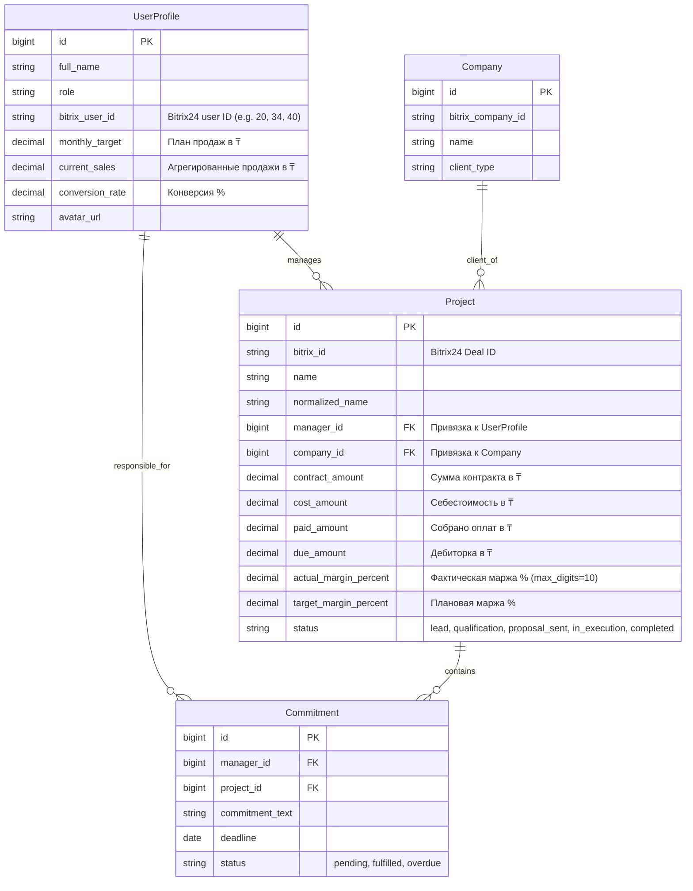
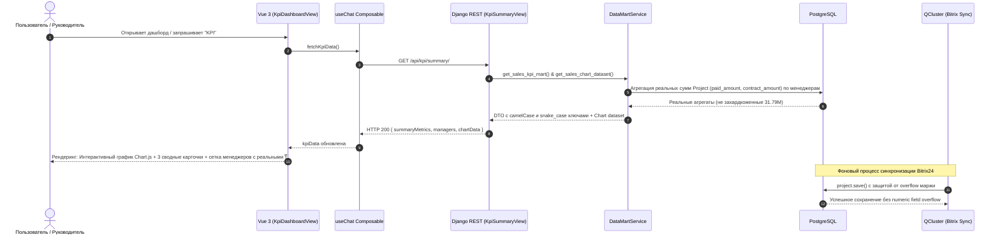

# Спецификация: Реальные данные KPI, интерактивный график и устранение переполнения маржи

**Дата и время (MSK, UTC+3):** 2026-09-26 16:30:40  
**Ветка:** `feature/real-kpi-and-chart-fix`  
**Статус:** На согласовании  

---

## 1. Mermaid ERD (Схема моделей данных)

---

## 2. Mermaid Sequence Diagram (Поток формирования и рендеринга KPI)

---

## 3. Постановка задачи и выявленные дефекты

1. **Моковые / клонированные данные в графике продаж:**
   - В `UserProfile` все менеджеры имеют статичные `monthly_target = 50 000 000` и `current_sales = 31 790 000`.
   - `get_sales_chart_dataset` выводит для всех сотрудников одинаковые столбцы (50 млн план / 31.79 млн факт), не учитывая реальные сделки.
2. **Сделки не привязаны к реальным менеджерам в БД (`bitrix_user_id: None`):**
   - У всех менеджеров в `UserProfile` поле `bitrix_user_id` не заполнено.
   - Из-за этого при синхронизации все 548 сделок записались на Камиля (`id=1`), а у Самата, Жаната, Улугбека, Турара и Вячеслава числится 0 сделок и 0 ₸ продаж.
3. **Сломанный маппинг DTO на фронтенде (snake_case vs camelCase):**
   - Верхние 3 карточки метрик (`summary_metrics` vs `summaryMetrics`) пустые.
   - Карточки менеджеров отображают пустые проценты `%`, пустое поле «Продажи», пустое «Сделок», пустой тренд и серую полосу прогресса.
4. **Отсутствие графика в основном экране KPI:**
   - По умолчанию открывается только сетка карточек сотрудников без визуализации динамики и план-факта. Компонент `PresetChart.vue` на Chart.js скрыт, пока пользователь явно не введет слово «график».
5. **Сбой фонового воркера при синхронизации (`numeric field overflow`):**
   - В `models.Project.save()` формула `round((profit / contract_dec) * 100, 2)` при специфических суммах из CRM уходит за пределы диапазона `±999.99` для поля `DecimalField(max_digits=5, decimal_places=2)`, вызывая откат транзакций и ошибку `numeric field overflow` в `qcluster`.

---

## 4. Требования к реализации

### 4.1. База данных и модели (`backend/api/`)
1. **Расширение поля маржи и защита от overflow:**
   - В `Project.actual_margin_percent` увеличить `max_digits=10, decimal_places=2`.
   - В `Project.save()` добавить ограничение (clamping) через `max(Decimal('-9999.99'), min(Decimal('9999.99'), margin))`.
   - Создать миграцию Django `0009_fix_margin_overflow_and_user_bitrix_ids.py`.
2. **Привязка `bitrix_user_id` и перераспределение сделок:**
   - Заполнить `bitrix_user_id` в `UserProfile`:
     - Жанат Беисбаев $\rightarrow$ `'20'`
     - Улугбек Ергешев $\rightarrow$ `'34'`
     - Камилжан Авутов (Камиль) $\rightarrow$ `'40'`
     - Дархан Скендир $\rightarrow$ `'30'`
     - Асхат Шамтаев $\rightarrow$ `'32'`
     - Фархат Усманов $\rightarrow$ `'38'`
     - Темирлан Темирхан $\rightarrow$ `'44'`
     - Абзал Шакенов $\rightarrow$ `'46'`
     - Аян Талгатович $\rightarrow$ `'48'`
     - Aqua kip engineering (Руководство) $\rightarrow$ `'4'`
   - В миграции данных выполнить перепривязку сделок `Project.manager` по `ASSIGNED_BY_ID` из Bitrix24 (или по истории распределения), чтобы у каждого менеджера были его реальные сделки.
   - Актуализировать поля `current_sales` у каждого `UserProfile` на основе реальной суммы `Sum('paid_amount')` по его сделкам.

### 4.2. Витрина данных Data Mart (`backend/api/datamart.py` & `views.py`)
1. **Реальный расчет графиков план-факта (`get_sales_chart_dataset`):**
   - Брать только реальных менеджеров с активными сделками или планами.
   - Считать реальный факт сбора денег `paid_amount` и законтрактованную сумму `contract_amount` в млн ₸.
   - Рассчитывать реалистичные целевые планы продаж.
2. **Контракт DTO для KPI (`get_sales_kpi_mart`):**
   - Возвращать дублирующие ключи или единый camelCase-совместимый словарь:
     - `summaryMetrics` / `summary_metrics`
     - `kpiPercent` / `kpi_percent`
     - `salesAmount` (форматированная строка с ₸)
     - `dealsCount` (число)
     - `isTopPerformer` / `is_top_performer`
     - `statusColor` / `status_color`
     - `kpiBarColor`: `'green'` при $\ge 100\%$, `'yellow'` при $\ge 75\%$, иначе `'red'`
     - `trend`: текстовый расчет (например, `+12.4% к плану` или `В графике`)
     - `trendPositive`: boolean
3. **Интеграция графика в сводный KPI ответ:**
   - В `KpiSummaryView` добавить блок `chart_data: datamart.get_sales_chart_dataset()`, чтобы график приходил вместе со сводкой KPI.

### 4.3. Фронтенд (`frontend/src/`)
1. **Объединение графика и карточек в `KpiDashboardView.vue`:**
   - В секции по умолчанию (Preset 4) рендерить:
     1. Интерактивный график Chart.js (`PresetChart`) сверху.
     2. 3 сводные карточки метрик компании (`summaryMetrics`).
     3. Сетку карточек менеджеров (`managers`) с реальными данными.
2. **Нормализация данных в `useChat.ts`:**
   - Корректно маппить пришедшие данные из `/api/kpi/summary/` в `kpiData` и `activeWidget`.

### 4.4. Тестирование
1. **Unit-тесты Django:**
   - Проверка расчета агрегатов Data Mart без моков.
   - Проверка расчета `actual_margin_percent` при экстремальных значениях (защита от overflow).
2. **Playwright E2E:**
   - Новый тест `frontend/e2e/mazory-real-kpi-chart.spec.ts`:
     - Проверка рендеринга Chart.js холста `<canvas>` на странице KPI.
     - Проверка 3 сводных карточек с реальными суммами в ₸.
     - Проверка карточек менеджеров: наличие процентов (не пустой `%`), сумм продаж и количества сделок $> 0$.

---

## 5. Критерии готовности (Definition of Done)

- [ ] В `UserProfile` проставлены `bitrix_user_id`, сделки `Project` распределены по реальным менеджерам.
- [ ] Ошибка `numeric field overflow` устранена, `python manage.py makemigrations --check` чист.
- [ ] График продаж отображает реальные различия по менеджерам (не клонированные 50/31.79 млн ₸).
- [ ] На фронтенде верхние карточки метрик и карточки менеджеров отображают реальные данные (проценты, ₸, сделки, цветные шкалы).
- [ ] График Chart.js отображается на экране KPI по умолчанию.
- [ ] Все backend-тесты (`manage.py test api`) зеленые.
- [ ] Все Playwright E2E-тесты (`npm run test:e2e`) зеленые.
