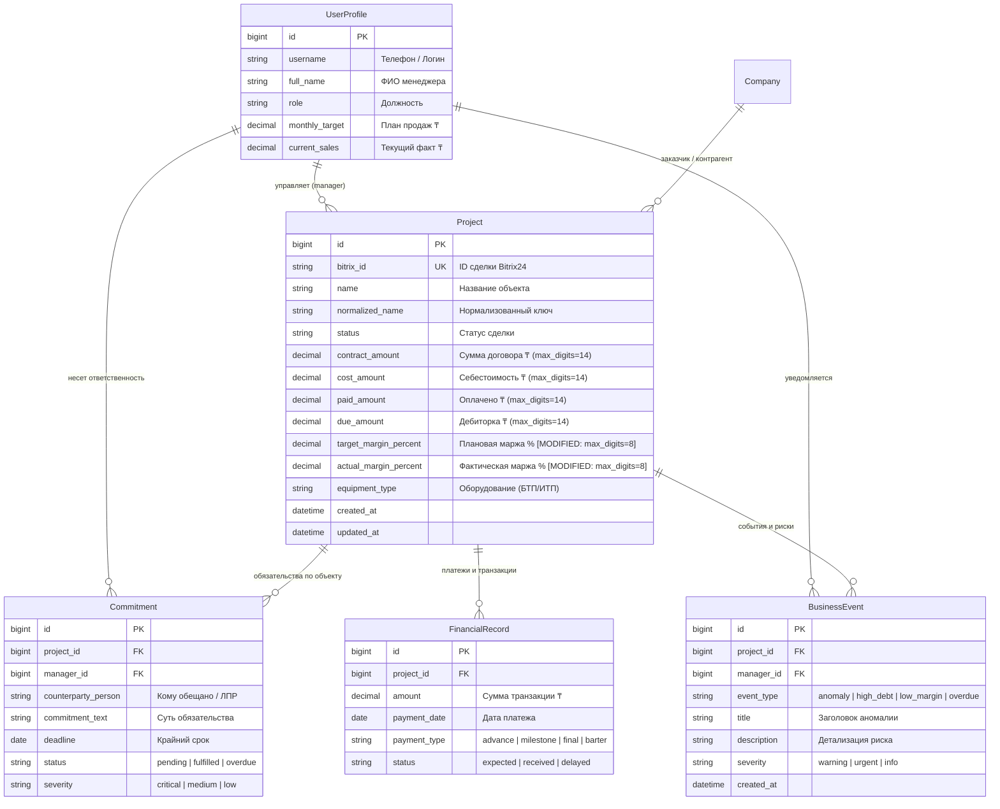
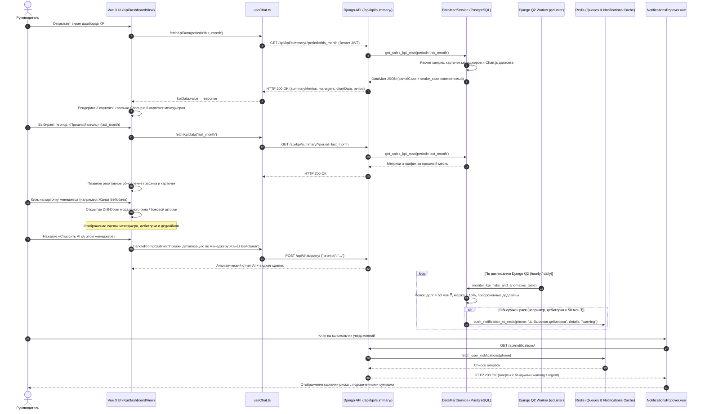

# Спецификация: Комплексная витрина KPI, ликвидация аварий воркера и предиктивные алерты рисков

**Дата и время создания:** 2026-09-26 16:57:43 MSK  
**Тип задачи:** `feature`  
**Ветка задачи:** `feature/kpi-dashboard-sync-hardening`  
**Затронутые компоненты:**
- Backend: `backend/api/models.py`, `backend/api/datamart.py`, `backend/api/views.py`, `backend/api/tasks.py`, `backend/api/notifications.py`, `backend/api/apps.py`, миграция `0008`
- Frontend: `frontend/src/composables/useChat.ts`, `frontend/src/types/chat.ts`, `frontend/src/components/KpiDashboardView.vue`, `frontend/src/components/ManagerCard.vue`, `frontend/src/components/presets/PresetChart.vue`, `frontend/src/components/NotificationsPopover.vue`
- E2E Tests: `frontend/e2e/mazory-kpi-dashboard.spec.ts`

---

## 1. Архитектура и диаграммы

### 1.1. ER-диаграмма сущностей базы данных (PostgreSQL)

Диаграмма отражает затронутые модели данных Mazory. Планируемые изменения (расширение точности полей маржинальности с `DecimalField(5,2)` до `DecimalField(8,2)` для исключения переполнения `numeric_value_out_of_range`) явно помечены как `[MODIFIED]`.



---

### 1.2. Sequence-диаграмма сквозного взаимодействия

Диаграмма иллюстрирует сквозные сценарии:
1. Загрузка сводного дашборда KPI с периодами и встроенным графиком Chart.js.
2. Интерактивный Drill-down по карточке менеджера (модальное окно / чат-запрос).
3. Фоновый периодический мониторинг рисков Django Q2 и доставка предиктивных алертов в `NotificationsPopover.vue`.



---

## 2. Постановка проблемы и цели

В текущей версии системы выявлены 5 критических архитектурных и продуктовых ограничений:

1. **Рассинхронизация контракта DTO и изолированность графика продаж (Критично, UI):**
   - Бэкенд в `KpiSummaryView` возвращал данные в формате `snake_case` (`summary_metrics`, `kpi_percent`, `sales_amount`, `is_top_performer`), тогда как фронтенд-компоненты `KpiDashboardView.vue` и `ManagerCard.vue` строго ожидали `camelCase` (`summaryMetrics`, `kpiPercent`, `salesAmount`, `isTopPerformer`, `statusColor`, `kpiBarColor`).
   - Из-за этого при начальной загрузке верхние 3 карточки оставались пустыми, а карточки менеджеров не отображали реальные суммы и цветные шкалы выполнения.
   - График Chart.js отображался только по отдельному текстовому запросу в чат («Выведи график продаж»), а не на сводном экране KPI.
2. **Фатальное падение воркера из-за числового переполнения (Критично, Backend):**
   - В модели `Project` (`models.py:138-139, 181`) поля `target_margin_percent` и `actual_margin_percent` объявлены как `DecimalField(max_digits=5, decimal_places=2)`.
   - Максимальное допустимое значение для `max_digits=5, decimal_places=2` составляет `999.99%`.
   - При малых суммах контракта (например, тестовые сделки или ошибки CRM с нулевой/символической ценой договора и ненулевой прибылью) вычисление `(profit / contract) * 100` выдает значения свыше `1000%`, вызывая в PostgreSQL фатальную ошибку:
     `numeric field overflow: A field with precision 5, scale 2 must round to an absolute value less than 10^3.`
   - Ошибка блокировала транзакции сохранения проектов и обработку очереди задач воркером `qcluster`.
3. **Отсутствие детализации (Drill-down) по карточкам менеджеров (Продуктово):**
   - Карточки менеджеров на дашборде являлись статичными и не реагировали на клики.
   - Руководителю требовалось вручную формулировать текстовые запросы в чат, чтобы узнать, какие именно сделки формируют выручку менеджера и какие дедлайны сорваны.
4. **Отсутствие временных периодов на дашборде (Аналитика):**
   - Дашборд отображал данные без возможности выбрать период («Этот месяц», «Прошлый месяц», «Квартал», «С начала года»), что делало невозможным ретроспективный анализ и сравнение темпов сбора выручки.
5. **Отсутствие предиктивных алертов по финансовым и процессным рискам (Проактивность):**
   - Компонент уведомлений `NotificationsPopover.vue` поддерживал типы `urgent`, `warning`, `deal`, `kpi`, но в системе отсутствовал регулярный автоматический мониторинг финансовых аномалий (высокая дебиторка > 50 млн ₸, маржинальность проекта < 15%, срыв контрольных сроков обязательств).

---

## 3. Требования

### 3.1. Функциональные требования

1. **DTO контракт и единый формат данных:**
   - Эндпоинт `GET /api/kpi/summary/` должен возвращать согласованную DTO-структуру, содержащую как `summaryMetrics`, `managers`, `chartData`, так и их snake_case алиасы для обратной совместимости.
   - В `useChat.ts` функция `fetchKpiData` должна парсить и наполнять состояние `kpiData` так, чтобы верхние 3 карточки и 6 карточек менеджеров сразу рендерились с полными данными без вызова чата.
2. **Встроенный интерактивный график Chart.js:**
   - Компонент `PresetChart.vue` должен быть встроен в `KpiDashboardView.vue` непосредственно над карточками менеджеров.
   - График отображает сравнение «План (млн ₸)» и «Факт сбора (млн ₸)» по всем менеджерам коммерческого отдела.
3. **Безопасные вычисления маржинальности и миграция БД:**
   - Поля `actual_margin_percent` и `target_margin_percent` в модели `Project` расширяются до `DecimalField(max_digits=8, decimal_places=2)` (допустимый диапазон от `-999 999.99%` до `+999 999.99%`).
   - В методе `Project.save()` и сервисе витрин реализуется жесткое ограничение (clamping) через `min/max`, гарантирующее, что аномальные или ошибочные значения не приведут к переполнению поля.
   - Создается и применяется миграция `0008_alter_project_margin_percent_digits.py`.
4. **Интерактивный Drill-down по менеджерам:**
   - Карточки `ManagerCard.vue` получают интерактивный курсор и hover-эффект.
   - Клик по карточке открывает детализированную шторку/модальное окно (Drill-Down Drawer) с информацией:
     - ФИО, аватар, должность, место в рейтинге.
     - Финансовые показатели: План, Факт, % выполнения, Средняя маржа.
     - Список ключевых объектов и сделок менеджера с суммами, статусами и суммами дебиторки.
     - Количество и список просроченных обязательств.
     - Кнопка быстрого перехода в AI-чат («Спросить AI о сделках менеджера»).
5. **Фильтр периодов дашборда:**
   - На дашборде размещается переключатель периодов: `Этот месяц` (дефолт), `Прошлый месяц`, `Квартал`, `С начала года`.
   - При клике на период фронтенд вызывает `GET /api/kpi/summary/?period=<code_name>`.
   - `DataMartService` динамически пересчитывает суммы сборов, выполнение плана и график в соответствии с выбранным периодом.
6. **Автоматический мониторинг рисков (Django Q2 Worker):**
   - Создается периодическая задача `monitor_kpi_risks_and_anomalies_task` в `backend/api/tasks.py`.
   - Сканируются условия:
     1. Дебиторская задолженность объекта `due_amount >= 50 000 000 ₸` (`type="warning"`).
     2. Маржинальность проекта `actual_margin_percent < 15.0%` при сумме договора > 0 (`type="warning"`).
     3. Просроченные обязательства `deadline < today` со статусом `pending/overdue` (`type="urgent"`).
   - Задача регистрирует `BusinessEvent` и рассылает персональные алерты через `push_notification_to_redis()` с дедупликацией (защита от повторной отправки одинакового алерта в течение суток).
   - Задача регистрируется в расписании Django Q2 через `Schedule.objects.get_or_create`.

### 3.2. Нефункциональные требования

- **Типобезопасность:** Запрещено использование `any` в коде фронтенда. Все структуры типизируются в `frontend/src/types/chat.ts`.
- **Идентификаторы:** Строгое соблюдение целочисленного контракта `id: number` для Django моделей и `string` только для строковых slug/DOM-ключей.
- **Производительность:** Витрина данных `DataMartService` использует агрегации ORM (`Sum`, `Count`, `Avg`) с предварительной выборкой `select_related`, без N+1 запросов.
- **Асинхронность:** Все уведомления и фоновые проверки выполняются в воркере `qcluster` без блокировки веб-сервера.

---

## 4. Детальный план реализации

### 4.1. База данных и модели (`backend/api/models.py`)

1. **Обновление полей в `Project`:**
   ```python
   target_margin_percent = models.DecimalField('Плановая маржа %', max_digits=8, decimal_places=2, default=16.80)
   actual_margin_percent = models.DecimalField('Фактическая маржа %', max_digits=8, decimal_places=2, default=0.00)
   ```
2. **Защита в `Project.save()` от числового переполнения:**
   ```python
   if self.contract_amount and self.contract_amount > 0:
       contract_dec = Decimal(str(self.contract_amount))
       cost_dec = Decimal(str(self.cost_amount)) if self.cost_amount is not None else Decimal('0.00')
       paid_dec = Decimal(str(self.paid_amount)) if self.paid_amount is not None else Decimal('0.00')
       profit = contract_dec - cost_dec
       raw_margin = round((profit / contract_dec) * 100, 2)
       # Clamping within Decimal(8,2) safe range [-999999.99, 999999.99]
       self.actual_margin_percent = max(Decimal('-999999.99'), min(Decimal('999999.99'), raw_margin))
       self.due_amount = max(Decimal('0.00'), contract_dec - paid_dec)
   elif self.contract_amount == 0:
       self.actual_margin_percent = Decimal('0.00')
       self.due_amount = Decimal('0.00')
   ```
3. **Генерация миграции:** `python manage.py makemigrations api` -> `0008_alter_project_actual_margin_percent_and_more.py`.

### 4.2. Слой витрин данных (`backend/api/datamart.py`)

1. **Поддержка параметра периода в `get_sales_kpi_mart(period: str = 'this_month')`:**
   - Вычисление диапазона дат (`date_from`, `date_to`) для:
     - `'this_month'` (текущий месяц, дефолт)
     - `'last_month'` (прошлый календарный месяц)
     - `'quarter'` (текущий квартал / последние 90 дней)
     - `'year'` (с 1 января текущего года)
   - Фильтрация фактических оплат по `FinancialRecord.payment_date` и привязанным проектам.
2. **Интеграция датасета графика:**
   - Включение поля `chart_data` (и `chartData`) непосредственно в ответ `get_sales_kpi_mart()`, построенного вызовом `get_sales_chart_dataset(period)`.
3. **Двойная совместимость ключей (camelCase + snake_case):**
   - Каждая метрика и карточка менеджера содержит как camelCase, так и snake_case свойства:
     - `summaryMetrics` / `summary_metrics`
     - `isTopPerformer` / `is_top_performer`
     - `statusColor` / `status_color`
     - `kpiPercent` / `kpi_percent`
     - `kpiBarColor`
     - `salesAmount` / `sales_amount`
     - `dealsCount` / `deals_count`
     - `trendPositive` / `trend_positive`
     - `projects`: краткий список сделок менеджера для мгновенного Drill-Down.

### 4.3. API эндпоинты (`backend/api/views.py`)

1. **`KpiSummaryView`:**
   - Чтение query-параметра `period = request.query_params.get('period', 'this_month')`.
   - Передача `period` в `datamart.get_sales_kpi_mart(period)`.
   - Формирование ответа с включением `chartData` и `period`.
2. **`ProjectListView`:**
   - Добавление опциональной фильтрации по `manager_id`: `?manager=<id>`.
3. **`ChatQueryView`:**
   - Доработка алгоритма поиска по менеджеру: распознавание запросов вида «Сделки [Имя Менеджера]» и привязка контекста.

### 4.4. Фоновые задачи и расписание (`backend/api/tasks.py`, `backend/api/apps.py`)

1. **Задача `monitor_kpi_risks_and_anomalies_task()`:**
   - Выборка проектов с дебиторкой `>= 50 000 000 ₸`.
   - Выборка проектов с фактической маржой `< 15.0%`.
   - Выборка обязательств с просроченным дедлайном.
   - Защита от дублей уведомлений через Redis-ключ с суточным TTL: `mazory:alert_cache:{entity_type}:{id}:{date}`.
   - Отправка уведомлений через `push_notification_to_redis(phone, title, message, notif_type)`.
2. **Регистрация в `setup_hourly_schedule()`:**
   - Регистрация расписания `kpi_risk_monitoring_schedule` (Django Q2 `Schedule.HOURLY`).

### 4.5. Frontend (`frontend/src/`)

1. **`types/chat.ts`:**
   - Расширение интерфейса `ManagerKpi` полями `targetAmount`, `averageMargin`, `overdueCommitments`, `projects`.
   - Обновление интерфейса `KpiDashboardData` полем `chartData?: any` и `period?: string`.
2. **`composables/useChat.ts`:**
   - Доработка `fetchKpiData(period?: string)`: отправка `?period=${period}`.
   - Сохранение `currentPeriod` в реактивное состояние.
3. **`components/KpiDashboardView.vue`:**
   - Встраивание селектора периодов (Segmented Control / Pills) в шапку витрины KPI.
   - Встраивание компонента `PresetChart.vue` прямо над карточками менеджеров.
   - Добавление модального окна / боковой шторки Drill-Down при выборе менеджера:
     - Карточка профиля менеджера, ранг, KPI %, план и факт в ₸.
     - Таблица/список закрепленных объектов с суммами контракта, статусами и дебиторкой.
     - Список просроченных обязательств.
     - Кнопка «Спросить AI об этом менеджере».
4. **`components/ManagerCard.vue`:**
   - Добавление события `@click="$emit('select', manager)"`.
   - Стили: `cursor-pointer hover:scale-[1.02] hover:border-indigo-400 active:scale-[0.99]`.
   - Обеспечение надежного отображения прогресс-бара и цветов статуса.

### 4.6. Автоматические E2E тесты Playwright (`frontend/e2e/mazory-kpi-dashboard.spec.ts`)

- Сценарий 1: Проверка загрузки экрана по умолчанию — наличие 3 карточек, графика Chart.js и 6 карточек менеджеров с реальными данными.
- Сценарий 2: Переключение периодов («Прошлый месяц», «Квартал», «С начала года») — отправка запроса и реактивное обновление данных.
- Сценарий 3: Интерактивный клик по карточке менеджера — открытие Drill-Down модального окна со списком сделок и кнопкой диалога с AI.
- Сценарий 4: Проверка отсутствия ошибок консоли браузера и корректности рендеринга Chart.js канваса.

---

## 5. Критерии готовности (Acceptance Criteria)

1. **DTO и UI Маппинг:**
   - При открытии главной страницы Mazory сразу отображаются 3 сводных карточки с ненулевыми суммами в тенге (₸).
   - Интерактивный график Chart.js монтируется над карточками менеджеров по умолчанию.
   - Все карточки менеджеров содержат аватар, имя, статус-точку, % KPI, цветовую шкалу, суммы продаж в ₸ и количество сделок.
2. **Ликвидация аварий воркера:**
   - Поля `actual_margin_percent` и `target_margin_percent` имеют `max_digits=8, decimal_places=2`.
   - Создание или сохранение проектов с аномальной прибылью (маржа > 1000%) не вызывает ошибку `numeric field overflow` в PostgreSQL.
   - Миграция `0008` успешно применена в БД. Команда `makemigrations --check` завершается с кодом 0 (`No changes detected`).
3. **Drill-Down по менеджерам:**
   - Клик по любой карточке менеджера открывает модальное окно / шторку с его персональными проектами и показателями.
   - Нажатие «Спросить AI» инициирует целевой запрос в чат и отображает детальный ответ.
4. **Фильтр периодов:**
   - Кнопки выбора периода переключают состояние без перезагрузки страницы, обновляя метрики и график.
5. **Система предиктивных алертов:**
   - Задача `monitor_kpi_risks_and_anomalies_task` успешно отрабатывает в Django Q2, обнаруживает риски и записывает алерты в Redis.
   - Колокольчик в UI открывает поповер со списком алертов типов `warning` и `urgent`.
6. **Тестирование и проверка качества:**
   - Команда `uv run --project backend python manage.py check` завершается без ошибок.
   - Сборка фронтенда `npm run build` (`vue-tsc -b`) проходит без ошибок типизации.
   - Все тесты `npm run test:e2e` в Playwright успешно завершаются (зеленый статус).
