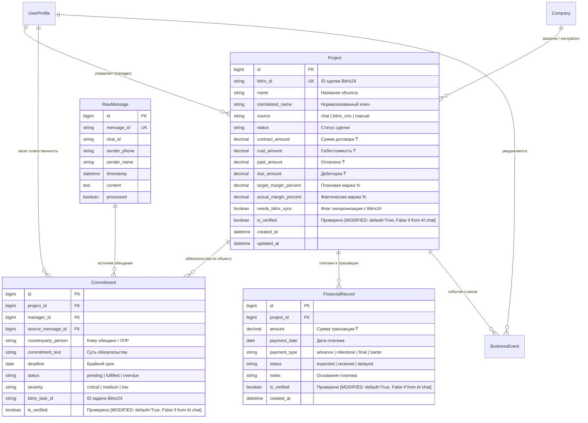
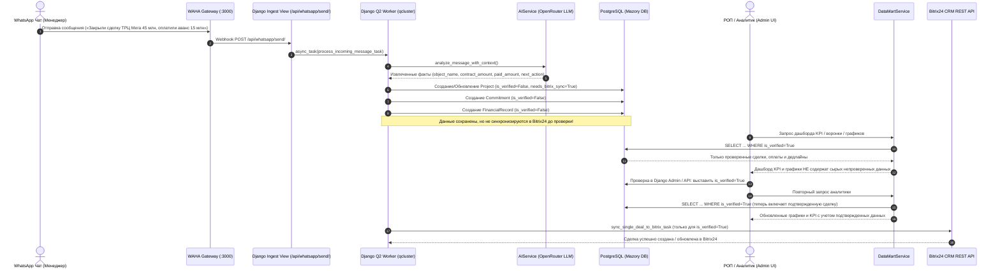

# Спецификация: Верификация данных WhatsApp (флаг «Проверено» и фильтрация в аналитике)

**Дата и время создания:** 2026-09-26 18:30:40 MSK  
**Тип задачи:** `feature`  
**Ветка задачи:** `feature/whatsapp-data-verification`  
**Затронутые компоненты:**
- Backend Models & Migrations: `backend/api/models.py`, новая миграция `0010_verification_flags`
- Task Worker & WhatsApp Processing: `backend/api/tasks.py`, `backend/api/bitrix_service.py`
- Analytics & Data Mart: `backend/api/datamart.py`, `backend/api/views.py`
- Admin & API: `backend/api/admin.py`, `backend/api/serializers.py`, `backend/api/urls.py`
- Frontend: `frontend/src/types/chat.ts`, `frontend/src/components/presets/PresetProjectTable.vue`
- Тесты: `backend/api/tests_verification_flow.py`, `frontend/e2e/mazory-verification-flow.spec.ts`

---

## 1. Архитектура и диаграммы

### 1.1. ER-диаграмма сущностей базы данных (PostgreSQL)

Диаграмма отражает модели данных Mazory, участвующие в цепочке извлечения и хранения коммерческих данных из WhatsApp. Планируемые изменения (добавление булевого поля `is_verified` с индексом и дефолтом `True` для существующих записей, а также правила выставления `False` при обработке нейросетью) помечены меткой `[MODIFIED]`.



---

### 1.2. Sequence-диаграмма сквозного процесса верификации

Диаграмма иллюстрирует полный жизненный цикл данных:
1. Поступление сообщения WhatsApp, анализ AI и сохранение в БД с флагом `is_verified=False`.
2. Защита аналитики: Data Mart и графики строго фильтруют данные `is_verified=True`, исключая непроверенные факты.
3. Верификация данных ответственным лицом (через Django Admin или API).
4. Включение проверенных данных в аналитику и последующая синхронизация с Bitrix24 CRM.



---

## 2. Постановка задачи и требования

### 2.1. Контекст проблемы
В текущей реализации при извлечении фактов нейросетью из сообщений WhatsApp (модель OpenRouter Nemotron) сущности `Project`, `Commitment` и `FinancialRecord` сохраняются непосредственно в PostgreSQL и мгновенно попадают в аналитические витрины `DataMartService` (KPI менеджеров, воронка сделок, расчет маржинальности, графики выполнения планов продаж Chart.js), а также ставятся в очередь на создание/обновление сделок в Bitrix24 CRM.

В случае неполных, предварительных или ошибочно распознанных нейросетью данных (галлюцинация суммы, опечатка менеджера в чате, неточный дедлайн) искажаются сводные показатели бизнеса, а в CRM могут создаваться некорректные сделки.

### 2.2. Цель
Реализовать механизм двухфазной фиксации данных:
1. Любые сущности (`Project`, `Commitment`, `FinancialRecord`), созданные или обновленные нейросетью на основе переписки из WhatsApp, должны маркироваться флагом `is_verified = False` («Не проверено»).
2. Непроверенные данные (`is_verified == False`) **категорически запрещено** учитывать в любых аналитических расчетах, сводках KPI, воронке проектов, контроле дебиторки и графиках Chart.js.
3. Непроверенные сделки и задачи **не должны** передаваться в Bitrix24 CRM до тех пор, пока человек не подтвердит их корректность.
4. В административной панели Django и через API предоставить удобный интерфейс для просмотра, фильтрации и массовой/точечной верификации записей.
5. После подтверждения (`is_verified = True`) данные мгновенно включаются в аналитику и разблокируются для синхронизации с Bitrix24 CRM.

---

## 3. Детализация изменений

### 3.1. Модели базы данных (`backend/api/models.py`)
1. **`Project`**:
   - Добавить поле:
     ```python
     is_verified = models.BooleanField(
         'Проверено',
         default=True,
         db_index=True,
         help_text='Подтверждена ли достоверность данных сделки. Непроверенные сделки исключаются из аналитики и синхронизации с CRM.'
     )
     ```
   - Записи, создаваемые вручную в админке или импортируемые из каталога Bitrix24, по умолчанию имеют `is_verified = True`.
   - Записи, создаваемые или обновляемые AI из чата WhatsApp, получают `is_verified = False`.

2. **`Commitment`**:
   - Добавить поле:
     ```python
     is_verified = models.BooleanField(
         'Проверено',
         default=True,
         db_index=True,
         help_text='Подтверждено ли обязательство. Непроверенные задачи не учитываются в SLA и просрочках.'
     )
     ```
   - При создании из переписки WhatsApp через AI: `is_verified = False`.

3. **`FinancialRecord`**:
   - Добавить поле:
     ```python
     is_verified = models.BooleanField(
         'Проверено',
         default=True,
         db_index=True,
         help_text='Подтвержден ли факт оплаты. Непроверенные оплаты не учитываются в сборе денег и выполнении планов.'
     )
     ```
   - При создании из отчета WhatsApp через AI: `is_verified = False`.

### 3.2. Логика обработки входящих сообщений (`backend/api/tasks.py`)
1. В `process_incoming_message_task(message_data)`:
   - При создании нового `Project`:
     `is_verified=False`
   - При обновлении существующего `Project` коммерческими фактами из чата:
     `project.is_verified = False` (требует подтверждения изменений)
   - При создании `Commitment`:
     `is_verified=False`
   - При создании `FinancialRecord`:
     `is_verified=False`
   - **Защита Bitrix24**:
     В `create_bitrix_deal_task` и `sync_single_deal_to_bitrix_task` проверять:
     ```python
     if not project.is_verified:
         logger.info("Project #%d '%s' is not verified yet. Postponing Bitrix sync.", project.id, project.name)
         return {"status": "unverified_skipped", "project_id": project.id}
     ```
     Синхронизация в CRM происходит только после верификации.

### 3.3. Витрины данных и аналитика (`backend/api/datamart.py`)
1. **`get_sales_kpi_mart(period)`**:
   - Фильтрация проектов менеджера: `mgr_projects = Project.objects.filter(manager=mgr, is_verified=True)`
   - Расчет оплат: `fin_qs = FinancialRecord.objects.filter(project__manager=mgr, is_verified=True, payment_date__gte=date_from, payment_date__lte=date_to, status='received')`
   - Расчет просрочек: `overdue_count = Commitment.objects.filter(manager=mgr, is_verified=True, status__in=['pending', 'overdue'], deadline__lt=today).count()`
   - Сводные показатели `total_actual`, `total_deals`, `total_overdue` рассчитываются строго на базе проверенных записей.

2. **`get_pipeline_mart()`**:
   - Базовый QuerySet: `projects = Project.objects.filter(is_verified=True).select_related('company', 'manager').order_by('-id')`
   - Стадии воронки и объемы сделок (`volume`) рассчитываются исключительно по проверенным проектам.
   - Распределение маржинальности (`margin_distribution`) строится только по проверенным проектам.

3. **`get_commitments_sla_mart()`**:
   - Базовый QuerySet: `all_commitments = Commitment.objects.filter(is_verified=True).select_related('manager', 'project')`
   - Статистика SLA, коэффициенты просрочки и реестр задач не содержат непроверенных данных.

4. **`get_sales_chart_dataset()`**:
   - Автоматически отражает только проверенные суммы, так как строится на основе выверенных карточек менеджеров `manager_cards`.

### 3.4. AI-оркестратор и представления (`backend/api/views.py`)
1. **`ChatQueryView`**:
   - Общие финансовые агрегаты:
     ```python
     Project.objects.filter(is_verified=True).aggregate(...)
     ```
   - Воронка по стадиям и поиск проектов для контекста LLM:
     ```python
     Project.objects.filter(token_query, is_verified=True)
     ```
2. **`ProjectVerifyView` (новый эндпоинт API)**:
   - `POST /api/projects/<id>/verify/` (требует `IsAuthenticated`):
     Позволяет подтвердить сделку, выставить `is_verified = True` и автоматически инициировать отложенную синхронизацию в Bitrix24 (`async_task('api.tasks.create_bitrix_deal_task', project.id)`).

### 3.5. Административная панель Django (`backend/api/admin.py`)
1. **`ProjectAdmin`**:
   - Добавить колонку `is_verified_badge`:
     - Зеленый бейдж: `✓ Проверено`
     - Янтарный бейдж: `⏳ Требует проверки (AI)`
   - Добавить фильтр: `list_filter = (..., 'is_verified')`
   - Добавить Admin Actions:
     - `mark_as_verified`: переводит выбранные сделки в `is_verified=True` и отправляет задачи синхронизации в Bitrix24 при необходимости.
     - `mark_as_unverified`: сбрасывает статус проверки.
2. **`CommitmentAdmin`**:
   - Добавить колонку статуса проверки, фильтр по `is_verified` и экшены подтверждения.
3. **`FinancialRecordAdmin`**:
   - Добавить колонку статуса проверки, фильтр по `is_verified` и экшены подтверждения.

### 3.6. Сериализаторы и фронтенд (`backend/api/serializers.py`, `frontend/`)
1. В `ProjectSerializer` добавить поле `is_verified`.
2. В интерфейсе `frontend/src/types/chat.ts` объявить `is_verified?: boolean`.
3. В `PresetProjectTable.vue` отображать статус верификации (если сделка выводится в детализированных списках).

---

## 4. План реализации по шагам

1. **Шаг 1: Миграция БД**
   - Добавить поля `is_verified` в модели `Project`, `Commitment`, `FinancialRecord` в `backend/api/models.py`.
   - Сгенерировать миграцию `makemigrations` и применить `migrate`.
   - Убедиться, что для всех существующих данных проставилось `is_verified = True`.

2. **Шаг 2: Модификация фонового воркера WhatsApp**
   - В `backend/api/tasks.py` выставить `is_verified = False` при создании/обновлении из чата.
   - Добавить блокировку синхронизации с Bitrix24 для непроверенных сделок (`not project.is_verified`).

3. **Шаг 3: Модификация Data Mart и аналитических представлений**
   - В `backend/api/datamart.py` добавить фильтрацию `is_verified=True` во все агрегаты KPI, воронки, оплат и дедлайнов.
   - В `backend/api/views.py` обновить контекст чата и добавить эндпоинт верификации.

4. **Шаг 4: Настройка административной панели**
   - В `backend/api/admin.py` настроить отображение бейджей верификации, фильтры и массовые действия для `Project`, `Commitment`, `FinancialRecord`.

5. **Шаг 5: Сериализаторы и типизация фронтенда**
   - Обновить `ProjectSerializer` и TypeScript-типы в `frontend/src/types/chat.ts`.
   - Проверить сборку фронтенда `npm run build`.

6. **Шаг 6: Тестирование и верификация**
   - Написать backend unit/integration тесты в `backend/api/tests_verification_flow.py`.
   - Написать и выполнить сквозной E2E тест Playwright `frontend/e2e/mazory-verification-flow.spec.ts`.
   - Проверить логи контейнеров `backend`, `qcluster`, `frontend`.

---

## 5. Критерии готовности (Acceptance Criteria)

1. [x] В моделях `Project`, `Commitment`, `FinancialRecord` присутствует поле `is_verified` с дефолтом `True`.
2. [x] Все существующие записи в базе данных имеют `is_verified = True`.
3. [x] При получении сообщения через WhatsApp обработчик `process_incoming_message_task` создает и обновляет записи строго с `is_verified = False`.
4. [x] Записи с `is_verified = False` **не учитываются** в:
   - расчетных показателях дашборда KPI (`get_sales_kpi_mart`),
   - суммах фактического сбора оплат,
   - графиках продаж Chart.js,
   - воронке проектов (`get_pipeline_mart`),
   - реестре и счетчиках просроченных обязательств (`get_commitments_sla_mart`),
   - аналитических ответах AI в чате (`ChatQueryView`).
5. [x] Непроверенные сделки не отправляются в Bitrix24 CRM до подтверждения.
6. [x] В Django Admin реализованы фильтры по признаку «Проверено» и групповые действия для перевода в статус «Проверено».
7. [x] При верификации сделки (`is_verified = True`) она немедленно становится доступна в аналитике и отправляется на синхронизацию с Bitrix24.
8. [x] Проверка типов `npm run build` завершается с кодом 0.
9. [x] Проверка Django `manage.py check` и `makemigrations --check` завершается с кодом 0.
10. [x] Сквозные Playwright E2E тесты выполняются и завершаются успешно.
