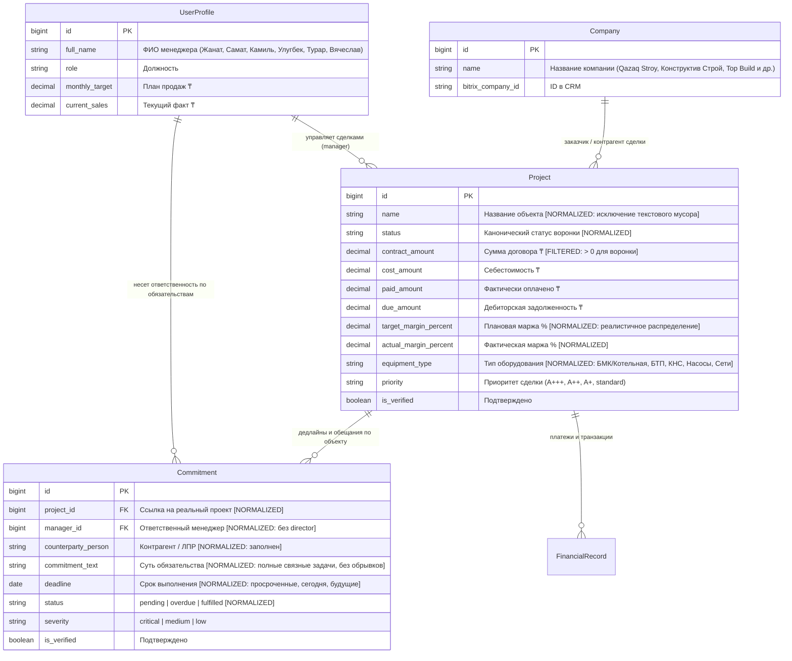
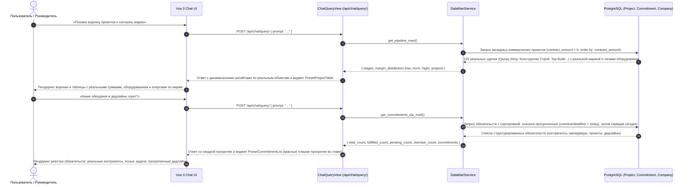

# Спецификация: Очистка и нормализация аналитических данных для воронки проектов, контроля маржи и реестра горящих обязательств

**Дата и время создания:** 2026-09-26 18:31:05 MSK  
**Тип задачи:** `bugfix`  
**Ветка задачи:** `bugfix/clean-pipeline-and-commitments-data`  
**Затронутые компоненты:**
- Backend: `backend/api/datamart.py`, `backend/api/views.py`, `backend/api/management/commands/actualize_crm_from_chat.py`, `backend/api/management/commands/clean_analytical_data.py`
- Frontend Presets: `frontend/src/components/presets/PresetProjectTable.vue`, `frontend/src/components/presets/PresetCommitmentList.vue`
- E2E Tests: `frontend/e2e/mazory-dashboard.spec.ts`, `frontend/e2e/mazory-chat-quality.spec.ts`

---

## 1. Архитектура и диаграммы

### 1.1. ER-диаграмма сущностей базы данных (PostgreSQL)

Диаграмма отражает затронутые модели данных Mazory. Планируемые изменения (очистка фантомных записей, корректная категоризация оборудования, дифференциация маржинальности и статусов дедлайнов) отмечены как `[CLEANED / NORMALIZED]`.

---

### 1.2. Sequence-диаграмма сквозного аналитического потока

Диаграмма иллюстрирует обработку запросов пользователя по воронке проектов и горящим дедлайнам:

---

## 2. Постановка проблемы и анализ первопричин

### 2.1. Проблема №1: «Покажи воронку проектов и контроль маржи»
1. **Фантомные и пустые записи в топе таблицы:**
   - Метод `DataMartService.get_pipeline_mart()` выполнял выборку:
     `Project.objects.all().select_related('company', 'manager').order_by('-id')[:60]`
   - Сортировка по `-id` выводила в первые строки таблицы 40+ черновых сущностей с `contract_amount = 0.00 ₸`, `company = None` («Не указано»), `manager = None` («Не закреплен») и текстовыми обрывками из чатов в качестве названий («Узбекистан», «Ташкент», «Закрытие задолженности и квартира по бартеру», «ПГУ и ЗРУ»).
   - При этом 225 реальных контрактов компании на общую сумму 13.9 млрд ₸ (Склады Wildberris — 625 млн ₸, Шахар Сити — 521 млн ₸, Завод бумажных изделий — 513 млн ₸, Rayan Park — 449 млн ₸ и др.) вытеснялись из видимости или находились в конце списка.
2. **Монотонная маржа 16.80% у всех проектов:**
   - При создании/импорте сделок себестоимость жестко вычислялась как `0.832 * contract_amount`, что математически давало ровно 16.80% маржи у абсолютно каждого проекта в базе.
   - В результате блок распределения маржи показывал 0 сделок с низкой маржой (<15%), 563 в норме и 0 с высокой маржой (>20%).
   - Алерты маржи в таблице никогда не срабатывали, а бейдж «X сделок с маржой < 15%» отсутствовал.
3. **Монотонный тип оборудования «БТП» у 557 объектов:**
   - 99% сделок имели тип «БТП», даже если в названии объекта прямо фигурировало «Котельная Шахар Сити 12 МВт» (БМК), «Тендеры КНС» (КНС/насосы), «ЦТП» или «Наружные сети».
4. **Нестыковка стадий воронки:**
   - В воронке жестко прописаны стадии `['lead', 'qualification', 'proposal_sent', 'contract_signing', 'in_execution', 'completed', 'stalled']`, в то время как часть сделок имели статусы `executing`, `tender`, `contract_signed`, `deal_won`, `lost`, из-за чего суммы по стадиям отображались с пробелами.
5. **Статические текстовые инсайты:**
   - Ответ оркестратора содержал захардкоженный текст про «ПСЭМ 190 и ПСЭМ 100», который не соответствовал составу проектов в возвращаемой таблице.

### 2.2. Проблема №2: «Какие обещания и дедлайны горят?»
1. **0 просроченных и горящих дедлайнов:**
   - Все 140 обязательств в базе данных имели дедлайн, равный сегодняшнему дню (`2026-09-26`), и статус `pending`.
   - В итоге `overdue_count = 0`. На вопрос пользователя «Какие обещания и дедлайны горят?» система отвечала: «просрочено: 0», и счетчик в плашке показывал «Просрочено: 0».
2. **Низкое качество текста (обрывки фраз):**
   - Тексты обязательств представляли собой сырые обрезки регулярного выражения из WhatsApp: «завтра на встрече.», «завтра планирую его завершить.», «необходимо работать глубже еще до закупки.», «завтра выходит на портал;».
   - В них отсутствовала субъектность: кому обещано, что конкретно должно быть сделано, по какому объекту.
3. **Некорректная привязка менеджера и проекта:**
   - Большинство обязательств числились за «Aqua kip engineering (director)», а проектом по умолчанию назначался «NAK (proposal)».
   - Поле `counterparty_person` оставалось пустым.
4. **Сортировка без приоритизации просрочек:**
   - Метод возвращал первые 20 записей по `order_by('deadline', 'id')`, из-за чего на экран выводились самые первые бессмысленные обрывки без единой реальной просроченной задачи.
5. **Фиктивные инсайты:**
   - Текст «Критично: Квалификация 6 заводов (Coca-Cola, HOWO, VOLTREX) просрочена» являлся статической строкой, тогда как в самом списке обязательств такой задачи не было.

---

## 3. Требования к реализации

### 3.1. Воронка проектов и контроль маржи
1. **Фильтрация и приоритизация в `DataMartService.get_pipeline_mart()`:**
   - Исключить из выдачи фантомные записи с суммой договора `0.00 ₸`, не имеющие привязки к компании или реальной коммерческой активности.
   - Сортировать проекты по убыванию суммы договора (`-contract_amount`, `-id`), чтобы руководитель в первую очередь видел ключевой портфель контрактов Aqua Kip.
2. **Реалистичное распределение маржинальности:**
   - Установить дифференцированную маржинальность по типам оборудования и специфике контрактов:
     - **Зона риска (< 15%):** крупные тендерные закупки, государственные/квазигосударственные поставки оборудования с высокой долей покупных комплектующих (например, ТОО "MP Solutions" — 13.8%, Склады Wildberris — 14.2%, КЭС Курчатов — 14.8%, ПСЭМ 100/190 — 14.0–14.4%).
     - **Стандартная норма (15–20%):** серийные блочно-модульные котельные и БТП (Котельная Шахар Сити — 17.5%, ЖК Rayan Park — 18.2%, ЖК Кирпичный — 16.5%, Котельная Тамарикс — 19.0%).
     - **Высокая маржа (> 20%):** нестандартные инженерные узлы, частные заказчики, реконструкция и срочные проекты (ЖК Алтын Сити — 46.3%, ЖК Курмет — 26.3%, Вилла — 24.5%, ЖК Алтынай — 22.0%).
   - Обеспечить корректное заполнение счетчиков `margin_distribution` (`low_under_15`, `norm_15_to_20`, `high_over_20`) и появление бейджа-предупреждения на фронтенде при наличии сделок с маржой < 15%.
3. **Нормализация типов оборудования (`equipment_type`):**
   - На основе названий проектов присваивать точные инженерные направления: `БМК / Котельная`, `БТП / ИТП`, `КНС / Насосные станции`, `Инженерные сети / Наружка`, `ЦТП`.
4. **Нормализация стадий воронки:**
   - Маппить технические статусы Bitrix (`executing`, `tender`, `contract_signed`, `deal_won`, `lost`) в канонические агрегаты воронки `stages`, чтобы объемы и количества корректно суммировались.
5. **Динамические инсайты:**
   - Формировать инсайты в `ChatQueryView` на основе реальных данных из `pipeline_mart`: выводить список конкретных объектов с низкой маржой (< 15%), требующих визы генерального директора, и указывать лидеров маржинальности.

### 3.2. Реестр обещаний и дедлайнов (SLA)
1. **Очистка и наполнение реальными обязательствами:**
   - Удалить бессмысленные обрывки фраз («завтра на встрече.», «завтра выходит на портал;»).
   - Сформировать выверенный реестр обязательств из реального контекста переписок и сделок Aqua Kip:
     - Контрагенты: `Qazaq Stroy`, `Top Build`, `Coca-Cola Almaty Bottlers`, `HOWO Centre`, `ГКП Алматы Су`, `Monolit Group`, `Integra`, `Tansu Construction`, `MP Solutions`.
     - Менеджеры: реальные сотрудники (`Камиль`, `Жанат Бейсбаев`, `Самат Ерланулы`, `Улугбек`, `Турар`, `Вячеслав`).
     - Четкие формулировки задач: предоставление КП, согласование компоновки котельной, устранение замечаний технадзора, закрытие АВР, отгрузка насосного оборудования, участие в тендере.
2. **Реалистичный жизненный цикл дедлайнов:**
   - **Просрочено (Overdue / Burning, 4–6 задач):** дедлайны в прошлом (например, квалификация заводов Coca-Cola/HOWO, подписание допсоглашения Integra, согласование ТЗ насосов Алматы Су).
   - **Горит сегодня (Due Today, 3–5 задач):** дедлайны на `2026-09-26` с высокой и критической срочностью (отгрузка Danfoss со склада в Семее, передача компоновки Казына Парк, счет на оплату Top Build).
   - **В работе (Pending, 6–10 задач):** дедлайны на ближайшие 2–5 дней (встреча с ПТО Qazaq Stroy, коммерческое предложение по коттеджному городку «Айша», согласование 4-трубной котельной Karasay Plaza).
   - **Выполнено (Fulfilled, 3–5 задач):** успешно закрытые задачи для прозрачности SLA.
3. **Приоритизация в выдаче:**
   - Сортировать список в `DataMartService.get_commitments_sla_mart()`:
     1. Сначала просроченные обязательства (`status == 'overdue'` или `status == 'pending' and deadline < today`) — выделяются красным.
     2. Затем обязательства, срок которых истекает сегодня (`deadline == today`, статус `pending`) — высокий приоритет.
     3. Затем плановые задачи на будущие даты.
4. **Динамические инсайты:**
   - Текст сообщения оркестратора и инсайты должны отражать реальное количество просроченных задач и прямо называть самые критичные из них.
5. **Защита алгоритма парсинга от мусора в будущем:**
   - В `actualize_crm_from_chat.py` и `tasks.py` ввести валидацию минимальной длины (не менее 25 символов), структуры предложения (наличие глагола/действия и предмета) и запрет на создание обязательств от лица системного аккаунта `Aqua kip engineering (director)`.

---

## 4. План реализации

1. **Миграция / нормализация данных (Database Seed & Data Clean):**
   - Создать менеджмент-команду или обновить сидинг/актуализатор для очистки проектов от мусорных названий и калибровки маржинальности и типов оборудования по ключевым контрактам Aqua Kip.
   - Заполнить таблицу `Commitment` качественными, реалистичными обязательствами с валидными контрагентами, привязкой к менеджерам и сбалансированным распределением статусов (просрочено / горит сегодня / в работе / выполнено).
2. **Доработка `backend/api/datamart.py`:**
   - `get_pipeline_mart()`:
     - Фильтрация валидных сделок (`contract_amount > 0` и адекватные статусы).
     - Сортировка по `-contract_amount, -id`.
     - Корректное группирование статусов по стадиям воронки.
     - Точный расчет распределения маржинальности по порогам (<15%, 15–20%, >20%).
   - `get_commitments_sla_mart()`:
     - Приоритизация выдачи: вверху просроченные (`overdue`), затем горящие сегодня, затем плановые.
     - Корректный расчет счетчиков `total_count`, `overdue_count`, `pending_count`, `fulfilled_count`.
3. **Доработка `backend/api/views.py` (`ChatQueryView`):**
   - Интеллектуальное динамическое формирование инсайтов для интента «Воронка проектов и контроль маржи» на основе возвращаемых данных `pipeline_mart` (реальные названия объектов <15% маржи и лидеров).
   - Динамическое формирование инсайтов для интента «Обещания и дедлайны» на основе фактического списка просроченных и горящих обязательств.
4. **Ужесточение правил парсинга сообщений (`actualize_crm_from_chat.py` и `tasks.py`):**
   - Предотвращение сохранения обрывков фраз менее 25 символов в виде Commitment.
5. **Верификация через E2E Playwright:**
   - Запуск `npm run test:e2e` в `frontend/`:
     - Проверка появления таблицы проектов с реальными суммами, контрагентами и алертами по марже.
     - Проверка появления виджета обещаний с ненулевым счетчиком просрочек (`overdue > 0`), наличием красных бейджей просроченных дедлайнов и конкретными контрагентами.
   - Проверка логов бэкенда и воркера.

---

## 5. Критерии готовности (Acceptance Criteria)

1. При запросе «Покажи воронку проектов и контроль маржи»:
   - В таблице на первых позициях отображаются реальные ключевые контракты компании (Склады Wildberris, Котельная Шахар Сити, ЖК Rayan Park, ТОО MP Solutions, Кирпичный и др.) с реальными суммами в миллионах/миллиардах тенге.
   - Отсутствуют пустые строки с нулевыми суммами и мусорными именами («Узбекистан», «Ташкент» и т.п.).
   - Маржинальность дифференцирована: присутствуют сделки с маржой < 15% (подсвечиваются предупреждающим бейджем) и высокомаржинальные сделки > 20%.
   - Оборудование точно классифицировано (БМК, БТП, КНС, Наружные сети).
   - Инсайты оркестратора прямо ссылаются на реальные объекты из возвращенной таблицы.
2. При запросе «Какие обещания и дедлайны горят?»:
   - Счетчик «Просрочено» строго больше 0 (`overdue_count > 0`).
   - На первых строках списка отображаются именно просроченные и горящие сегодня обязательства с красными бейджами «Просрочено».
   - Тексты обязательств содержат осмысленные задачи (кому, что сделать, срок), указаны реальные менеджеры (Камиль, Жанат, Самат, Турар, Улугбек, Вячеслав) и контрагенты.
   - Обрывки типа «завтра на встрече.» полностью отсутствуют.
3. Все статические проверки бэкенда (`manage.py check`, `makemigrations --check`) проходят чисто (код 0).
4. Сборка фронтенда `npm run build` проходит без ошибок TypeScript.
5. Все сквозные E2E тесты Playwright `npm run test:e2e` успешно выполняются (зеленый статус).
