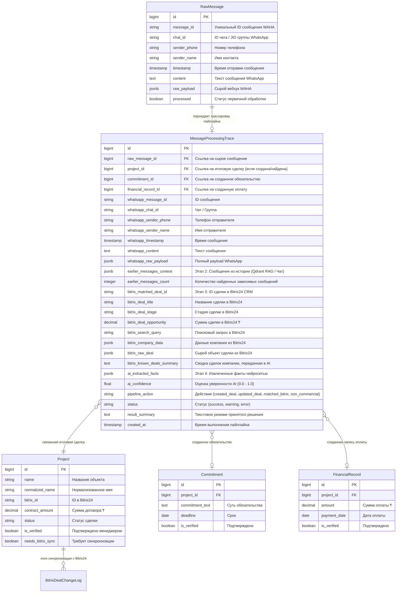
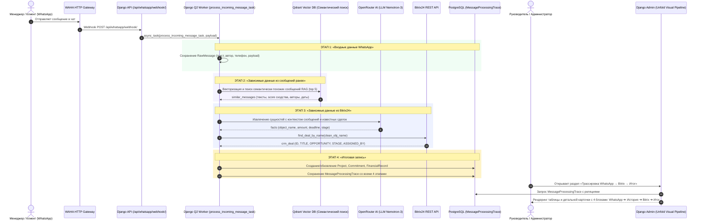

# Спецификация: Сквозная трассировка пайплайна в Django Admin («Входные данные WhatsApp» → «Данные из сообщений ранее» → «Данные из Bitrix24» → «Итоговая запись»)

**Дата и время создания:** 2026-09-28 02:23:19 MSK  
**Тип задачи:** `feature`  
**Идентификатор задачи:** `whatsapp-pipeline-trace`  
**Ветка задачи:** `feature/whatsapp-pipeline-trace`  
**Затронутые компоненты:**
- Backend Models & DB: `backend/api/models.py` (новая модель `MessageProcessingTrace`, связи с `RawMessage`, `Project`, `Commitment`, `FinancialRecord`)
- Pipeline Processing: `backend/api/tasks.py` (фиксация всех 4 этапов при обработке сообщений через воркер `process_incoming_message_task`)
- Django Admin (Unfold): `backend/api/admin.py`, `backend/templates/admin/message_processing_trace_detail.html`, `backend/mazory_backend/settings.py` (регистрация в Unfold sidebar)
- Management Command & Backfill: `backend/api/management/commands/backfill_pipeline_traces.py` (генерация трассировок для имеющихся сообщений в базе)
- Automated Tests: `backend/api/tests_pipeline_trace.py`, E2E Playwright тест `frontend/e2e/admin-pipeline-trace.spec.ts`

---

## 1. Архитектура и диаграммы

### 1.1. ER-диаграмма сущностей базы данных (PostgreSQL)

Диаграмма показывает существующие сущности и новую модель аудита и сквозной трассировки `MessageProcessingTrace`:

---

### 1.2. Sequence-диаграмма сквозного пайплайна обработки и визуализации в Admin

Диаграмма иллюстрирует сквозной путь данных от получения WhatsApp-сообщения до интерактивного отображения цепочки в Django Admin:

---

## 2. Постановка проблемы и бизнес-ценность

В текущей системе сообщения из WhatsApp-чатов рабочей группы продаж проходят многоэтапную цепочку:
1. Получение сырого вебхука через WAHA и регистрация в `RawMessage`.
2. Семантический поиск контекста в Qdrant (предыдущие сообщения по объекту, договорам, встречам).
3. Проверка наличия объекта в CRM Bitrix24 (`BitrixService.find_deal_by_name`) для защиты от дублирования сделок.
4. Извлечение коммерческих фактов через LLM OpenRouter и генерация/обновление сущностей (`Project`, `Commitment`, `FinancialRecord`).

**Проблема:**
Администраторы и руководители в Django Admin видят разрозненные сущности: отдельно сырые сообщения `RawMessage`, отдельно сделки `Project`, отдельно логи Bitrix24 `BitrixDealChangeLog`. Нет единого прозрачного экрана (Data Lineage / Audit Trail), позволяющего ответить на вопросы:
- *«Из какого конкретно сообщения WhatsApp появилась эта сделка или обязательство?»*
- *«Какие сообщения из истории чатов помогли AI понять контекст и принять решение?»*
- *«Что в этот момент ответил Bitrix24: была ли сделка найдена в CRM или создана с нуля?»*
- *«Какие сырые факты выделил AI, и какие параметры попали в итоговую запись в базе?»*

Пользователь сформулировал прямое требование:
> «в django admin Хочу получить полную информацию «входные данные WhatsApp” —> «зависимые данные из сообщений ранее» —> «зависимые данные из bitrix” —> «итоговая запись»

---

## 3. Требования к реализации

### 3.1. Модель данных `MessageProcessingTrace`
В `backend/api/models.py` объявляется модель `MessageProcessingTrace`:
- Связи:
  - `raw_message` (ForeignKey `RawMessage`, `on_delete=models.SET_NULL`, `null=True`, `blank=True`)
  - `project` (ForeignKey `Project`, `on_delete=models.SET_NULL`, `null=True`, `blank=True`)
  - `commitment` (ForeignKey `Commitment`, `on_delete=models.SET_NULL`, `null=True`, `blank=True`)
  - `financial_record` (ForeignKey `FinancialRecord`, `on_delete=models.SET_NULL`, `null=True`, `blank=True`)
- Поля Блока 1 («Входные данные WhatsApp»):
  - `whatsapp_message_id`: CharField(max_length=128, db_index=True)
  - `whatsapp_chat_id`: CharField(max_length=128, blank=True, default='')
  - `whatsapp_sender_phone`: CharField(max_length=64, blank=True, default='')
  - `whatsapp_sender_name`: CharField(max_length=255, blank=True, default='')
  - `whatsapp_timestamp`: DateTimeField(null=True, blank=True)
  - `whatsapp_content`: TextField
  - `whatsapp_raw_payload`: JSONField(default=dict, blank=True)
- Поля Блока 2 («Зависимые данные из сообщений ранее»):
  - `earlier_messages_context`: JSONField (список словарей: `content`, `sender_name`, `timestamp`, `score`, `message_id`)
  - `earlier_messages_count`: IntegerField(default=0)
- Поля Блока 3 («Зависимые данные из Bitrix24»):
  - `bitrix_matched_deal_id`: CharField(max_length=64, blank=True, default='', db_index=True)
  - `bitrix_deal_title`: CharField(max_length=255, blank=True, default='')
  - `bitrix_deal_stage`: CharField(max_length=64, blank=True, default='')
  - `bitrix_deal_opportunity`: DecimalField(max_digits=14, decimal_places=2, null=True, blank=True)
  - `bitrix_search_query`: CharField(max_length=255, blank=True, default='')
  - `bitrix_company_data`: JSONField(default=dict, blank=True)
  - `bitrix_raw_deal`: JSONField(default=dict, blank=True)
  - `bitrix_known_deals_summary`: TextField(blank=True, default='')
- Поля Блока 4 («Итоговая запись»):
  - `ai_extracted_facts`: JSONField(default=dict, blank=True)
  - `ai_confidence`: FloatField(default=0.0)
  - `pipeline_action`: CharField(max_length=64, choices=[...], db_index=True)
  - `status`: CharField(max_length=32, choices=[('success', 'Успешно'), ('warning', 'Требует внимания'), ('error', 'Ошибка')], default='success')
  - `result_summary`: TextField(blank=True, default='')
  - `created_at`: DateTimeField(auto_now_add=True, db_index=True)

### 3.2. Интеграция в пайплайн воркера (`backend/api/tasks.py`)
- В функции `process_incoming_message_task(message_data)`:
  - Формирование объекта `MessageProcessingTrace` на каждом этапе конвейера.
  - На этапе 2: фиксируются `similar_messages` из Qdrant со всеми полями (score, sender, timestamp, content).
  - На этапе 3: сохраняется поисковый запрос к Bitrix24, результат `find_deal_by_name`, статус совпадения в CRM и переданная сводка сделок.
  - На этапе 4: сохраняются извлеченные факты AI, confidence, принятое решение (создана сделка, обновлена сделка, зафиксировано обязательство/оплата или некоммерческое инфо-сообщение), и ссылки на созданные/обновленные записи `Project`, `Commitment`, `FinancialRecord`.

### 3.3. Отображение в Django Admin (Unfold)
- **Регистрация в меню Unfold Sidebar:**
  - В разделе «AI & Интеграции» добавить пункт:
    - Заголовок: `Трассировка пайплайна (WhatsApp → Bitrix → Итог)`
    - Иконка: `account_tree` или `linear_scale`
    - Ссылка: `/admin/api/messageprocessingtrace/`
- **Список записей `MessageProcessingTraceAdmin`:**
  - `list_display`:
    - Время сообщения (`whatsapp_timestamp`)
    - Отправитель WhatsApp (`whatsapp_sender_name`, `whatsapp_sender_phone`)
    - Текст сообщения (краткий сниппет)
    - Бейдж истории («Найдено X сообщений в Qdrant»)
    - Бейдж Bitrix24 («Найдена сделка #ID» / «В CRM отсутствует»)
    - Бейдж действия пайплайна («Создана сделка», «Обновлена сделка», «Обязательство», «Инфо»)
    - Итоговая сделка (ссылка на `Project`)
    - Статус цепочки (Успешно / Внимание)
  - `list_filter`: `pipeline_action`, `status`, `whatsapp_timestamp`, `created_at`
  - `search_fields`: `whatsapp_content`, `whatsapp_sender_name`, `whatsapp_sender_phone`, `bitrix_matched_deal_id`, `project__name`
- **Детальная страница трассировки (Visual Pipeline View):**
  - Разработать кастомный информативный шаблон `templates/admin/message_processing_trace_detail.html` (или встроенные readonly-поля с HTML-рендерингом Tailwind), визуализирующий 4 этапа:
    - **Блок 1 (Зеленый / WhatsApp):** Отправитель, телефон, дата, текст сообщения, кнопка просмотра raw payload.
    - **Блок 2 (Фиолетовый / Qdrant RAG):** Карточки найденных из истории сообщений с процентом сходства (score), автором и датой.
    - **Блок 3 (Синий / Bitrix24 CRM):** Статус проверки в CRM, найденная сделка с ссылкой на Bitrix24, сумма, стадия, ответственный.
    - **Блок 4 (Изумрудный / Итоговый результат):** Выделенные факты AI, карточка созданного/обновленного проекта с кнопкой перехода в Mazory, карточка созданных обязательств и оплат.
- **Интеграция с существующими моделями:**
  - В `ProjectAdmin`: Inline или прямая ссылка на связанную трассировку WhatsApp.
  - В `RawMessageAdmin`: колонка со ссылкой на трассировку и admin action «Сформировать/перезапустить трассировку».

### 3.4. Команда ретроспективного наполнения (Backfill)
- Создать management-команду `python manage.py backfill_pipeline_traces`, которая для всех существующих в базе `RawMessage` проверяет наличие связей со сделками/обязательствами и формирует полные трассировочные записи, гарантируя отсутствие пустых экранов после деплоя.

---

## 4. План реализации и контрольные точки

1. **Создание модели и миграции базы данных:**
   - Добавление `MessageProcessingTrace` в `backend/api/models.py`.
   - Запуск `python manage.py makemigrations` и `python manage.py migrate`.
   - Проверка `python manage.py makemigrations --check` на чистоту схемы.
2. **Обновление фонового воркера обработки:**
   - Модификация `process_incoming_message_task` в `backend/api/tasks.py` для сохранения трассировок всех 4 этапов.
3. **Разработка интерфейса Django Admin:**
   - Настройка `MessageProcessingTraceAdmin` в `backend/api/admin.py` с визуальным 4-блочным представлением.
   - Добавление ссылки в сайдбар `mazory_backend/settings.py`.
   - Добавление inline/ссылок в `ProjectAdmin` и `RawMessageAdmin`.
4. **Ретроспективное наполнение данных:**
   - Создание команды `backfill_pipeline_traces.py` и заполнение существующих сообщений.
5. **Тестирование и верификация:**
   - Backend unit-тесты `backend/api/tests_pipeline_trace.py`.
   - E2E Playwright тест `frontend/e2e/admin-pipeline-trace.spec.ts`.
   - Проверка сборки фронтенда `npm run build` и системная проверка Django `python manage.py check`.

---

## 5. Критерии готовности (Acceptance Criteria)

- [ ] В Django Admin по адресу `/admin/api/messageprocessingtrace/` доступен полноценный журнал трассировки всех входящих WhatsApp-сообщений.
- [ ] При переходе в детальную карточку любой трассировки администратор видит исчерпывающую цепочку:
  1. «Входные данные WhatsApp» (текст, дата, номер, отправитель, payload).
  2. «Зависимые данные из сообщений ранее» (семантически найденные сообщения из истории чатов с процентом сходства).
  3. «Зависимые данные из Bitrix24» (результат поиска в CRM, ID сделки, название, сумма, стадия, ответственный в Bitrix).
  4. «Итоговая запись» (факты AI, созданный/обновленный `Project`, обязательство `Commitment`, оплата `FinancialRecord`).
- [ ] Каждое новое сообщение, поступающее через WhatsApp/WAHA, автоматически создает актуальную запись трассировки.
- [ ] В `ProjectAdmin` и `RawMessageAdmin` есть навигация на связанную трассировку.
- [ ] Команда `python manage.py makemigrations --check` завершается с кодом 0 (`No changes detected`).
- [ ] E2E тест на Playwright успешно проходит в браузере, проверяя рендеринг списка и всех 4 блоков цепочки в детальной карточке.
