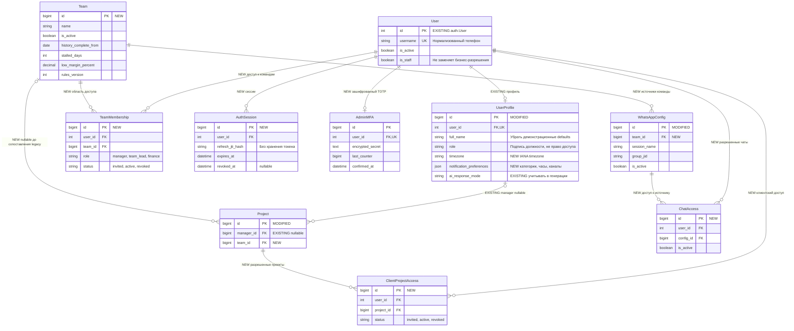
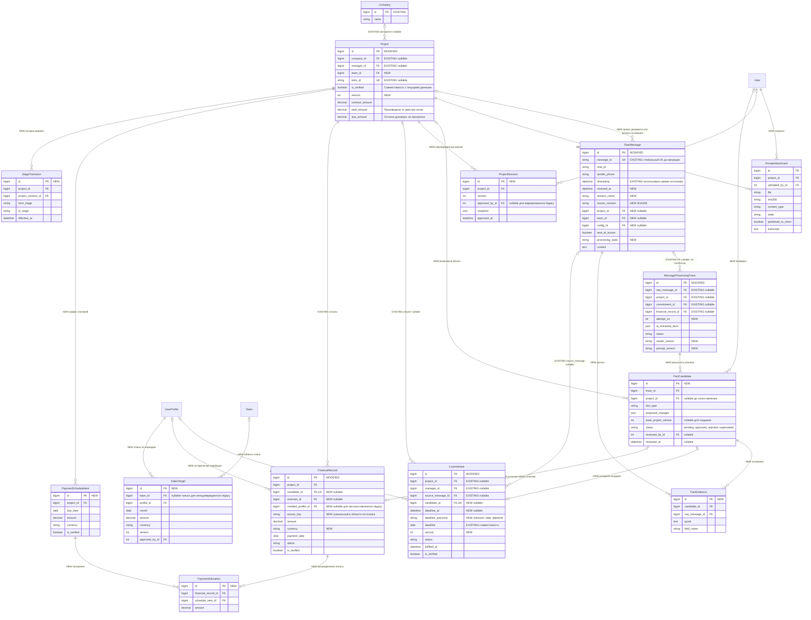
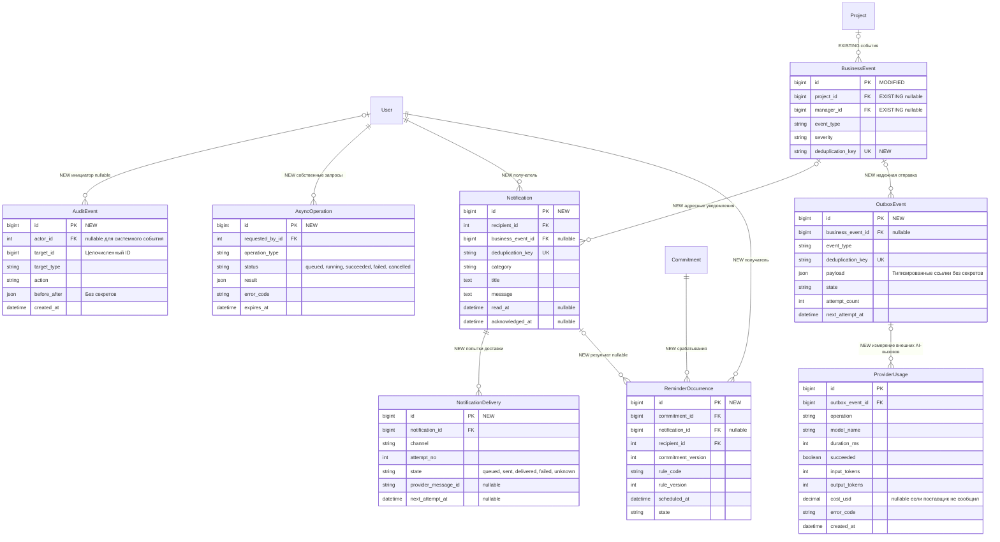
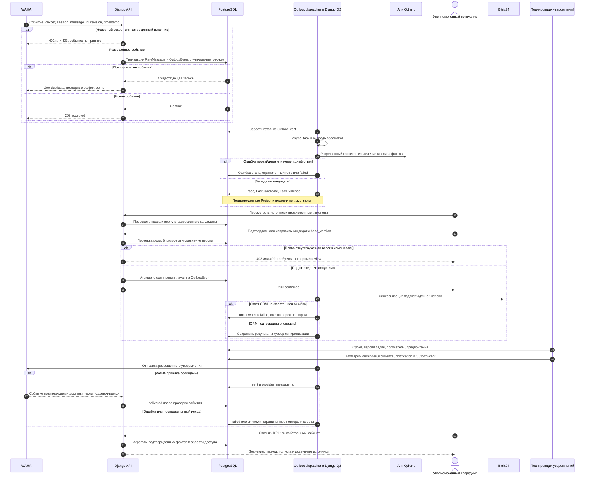

# Спецификация: безопасность, достоверность данных и развитие Mazory

**Дата и время создания:** 2026-09-28 03:39:56 MSK (UTC+3)\
**Тип текущей задачи:** `feature` — реализация согласованной спецификации\
**Идентификатор:** `platform-security-quality`\
**Ветка:** `feature/platform-security-quality`\
**Основание:** пользователь одобрил рекомендации обзора и запросил их оформление в спецификацию. GitHub Issue не задан.\
**Статус:** согласована пользователем командой «реализуй» 28.09.2026; код реализован в отдельной ветке на базе main `bf852a8`; открыт [PR #1](https://github.com/envOnion/kz-mazory/pull/1) в main, выполняется CI. Рабочее окружение не развёртывалось.\
**Область:** Django/DRF, PostgreSQL, Redis, Django Q2, WAHA, Bitrix24, AI/RAG/Qdrant, Vue, личные кабинеты, уведомления, KPI, Docker/Nginx и CI.\
**Базовая ревизия обзора:** `8c5c19a` (main перед началом подготовки).\
**Источник исходной структуры:** `backend/api/models.py` и миграции `0001–0011`. Реализация добавляет миграции `0012–0019`; ERD уточнена по новым моделям.\
**Легенда ERD:** ниже показана целевая схема. `EXISTING` — существующая сущность/связь; `MODIFIED` — существующая сущность с изменениями; `NEW` — новая сущность, поле или связь. PK новых моделей — `BigAutoField`; Django User сохраняет текущий целочисленный PK. Показаны значимые поля; ограничения подробно определены далее. `Company` — контрагент, а не организация-владелец данных.







Существующие `WhatsAppConfig`, `AISettings`, `BitrixSettings` и `BitrixDealChangeLog` сохраняются. В настройках секретные значения заменяются ссылками на конфигурацию окружения/хранилище секретов; журнал Bitrix получает связь с операцией синхронизации. Несколько ERD разделяют области одной целевой схемы, а не обозначают отдельные спецификации.



## 1. Постановка и границы

Цель — сделать Mazory безопасным рабочим инструментом, в котором сотрудники получают только разрешенные данные, извлеченные из переписки факты проходят проверку, финансовые показатели воспроизводимы, а уведомления доходят до нужного человека и приводят к действию.

Документ объединяет все рекомендации обзора. Он является единственным текстовым артефактом этой инициативы в `specs/`: этапы, решения, результаты проверок и уточнения вносятся сюда. Пользователь подтвердил реализацию. Изменения выполняются по этапам в изолированной ветке; проверки используют отдельные данные и не отправляют сообщения рабочим получателям.

Исходные допущения:

- Первый контур обслуживает одну организацию Aqua Kip с несколькими командами и ограниченным доступом клиентов. Мультитенантный SaaS, биллинг и самостоятельная регистрация организаций в эту инициативу не входят.
- Публичной регистрации сотрудников нет: доступ предоставляется приглашением/назначением администратором. Номер телефона подтверждается существующим четырехзначным OTP.
- Базовая валюта аналитики — KZT. Другие валюты сохраняются явно и не суммируются с KZT без документированного источника курса и даты пересчета.
- Время организации по умолчанию — `Asia/Almaty`, пользователь может выбрать IANA timezone. MSK используется только для имени и метаданных спецификации.
- Все новые UI-процессы доступны в существующем Vue-приложении. Django Admin сохраняется для администрирования и диагностики.
- Денежные факты из WhatsApp всегда требуют подтверждения уполномоченным сотрудником. Значение confidence модели само по себе не разрешает изменение финансов.
- Числовые ID моделей остаются `int` в Python и `number` в TypeScript. Внешние WhatsApp/Bitrix ID и JWT JTI остаются строками. Полиморфные идентификаторы и объединения `number | string` не вводятся.

## 2. Подтвержденное исходное состояние

Наблюдения относятся к просмотренному исходному коду и доступному Docker-окружению на 28.09.2026. Это основание требований, а не утверждение о результатах полного пентеста или безопасности всех развернутых сред.

| ID | Наблюдение и место | Последствие | Приоритет |
|---|---|---|---|
| F01 | [admin.py](../backend/api/admin.py), `stage_1_whatsapp_card`, другие карточки трассировки: f-строки с внешним содержимым передаются в `mark_safe`. Безвредная HTML-метка проходит без экранирования. | Сохраненная HTML/XSS-инъекция при просмотре переписки/CRM в админке. | P0 |
| F02 | [settings.py](../backend/mazory_backend/settings.py): резервный SECRET_KEY совпал с активным ключом доступного контейнера; JWT подписывается им. В [Compose](../docker-compose.yml), [models.py](../backend/api/models.py) и миграциях присутствуют фиксированные секретные значения. | Компрометация подписей/интеграций при знании секретов из исходников. Значения секретов в эту спецификацию не включаются. | P0 |
| F03 | [auth_views.py](../backend/api/auth_views.py): OTP создает User. [views.py](../backend/api/views.py): список проектов и подтверждение по ID ограничены только `IsAuthenticated`. | Получение внутренних данных и изменение чужих объектов любым вошедшим пользователем. | P0 |
| F04 | [serializers.py](../backend/api/serializers.py): план, продажи, количество сделок, место и конверсия доступны для изменения через собственный профиль. | Пользователь способен менять данные, влияющие на отображаемый результат и ранжирование. | P0 |
| F05 | [tasks.py](../backend/api/tasks.py): повторное получение RawMessage не останавливает обработку; оплата прибавляется, записи создаются повторно. | Повторный учет денег и обязательств, в том числе при повторе задачи после сбоя. | P1 |
| F06 | Там же: AI меняет подтвержденный Project и выставляет `is_verified=False`. | Подтвержденная версия исчезает из части аналитики, предлагаемые изменения смешиваются с фактом. | P1 |
| F07 | [datamart.py](../backend/api/datamart.py): при отсутствии оплат периода используются коэффициенты 0.92, 2.65, 7.4 и значения профиля; есть фиксированные тренды. [views.py](../backend/api/views.py): фиксированные инсайты. | Графики и выводы могут представлять оценку/демоданные как факт. | P1 |
| F08 | [notification_views.py](../backend/api/notification_views.py) вызывает отсутствующую `dispatch_targeted_notification_task`. Мониторинг рисков в tasks.py выбирает всех пользователей и не читает предпочтения. | Неисполняемая адресная рассылка, лишние адресаты и игнорирование настроек. | P1 |
| F09 | [notifications.py](../backend/api/notifications.py): список в Redis ограничен 50 элементами и TTL 14 дней, обновляется через read-modify-write. | Нет надежной истории; возможна потеря уведомлений при конкурентном обновлении. | P1 |
| F10 | [qdrant_service.py](../backend/api/qdrant_service.py) возвращает плоские поля, ChatQueryView ожидает `payload`; фильтра доступа нет. | Цитаты теряются; поиск не учитывает права на чаты/проекты. | P1 |
| F11 | В [tasks.py](../backend/api/tasks.py) время события заменено временем обработки; неизвестный дедлайн превращается в «через два дня». Промпт извлекает один объект. | Ошибочные сроки и даты оплат, потеря других сделок из одного сообщения. | P1 |
| F12 | ChatQueryView и [whatsapp_views.py](../backend/api/whatsapp_views.py), часть admin actions обращаются к внешним сервисам синхронно. Q2 имеет два worker и timeout 60 секунд. | Долгие HTTP-запросы, конкуренция OTP с AI, обрыв многошаговых задач. | P1 |
| F13 | Вебхуки пропускают проверку при пустом ожидаемом секрете; `get_active()` конфигураций может создать новую запись вместо сохранения выключенного состояния. | Прием неподтвержденных событий и неожиданное включение интеграции. | P0 |
| F14 | Токены в localStorage, access живет семь дней; UI сессий содержит фиксированное устройство/IP. | Длительное действие украденного токена и отсутствие реального управления сессиями. | P1 |
| F15 | Compose запускает Django runserver и Vite dev server. `check --deploy` выявил W004, W008, W009, W012, W016. | Рабочее окружение требует отдельной производственной конфигурации. | P1 |

При исходном обзоре `makemigrations --check --dry-run` завершился с `No changes detected`. Все девять Compose-сервисов работали; просмотренный фрагмент логов содержал timeout. Причина каждого сбоя и внешняя HTTPS-конфигурация требуют отдельной проверки при реализации. Исходный обзор не запускал полный E2E-набор.

## 3. Требования к безопасности и API

### SEC-01. Безопасный вывод внешних данных

- Все тексты из WhatsApp, Bitrix, AI, сырых payload, имен отправителей, названий проектов и журналов выводить с экранированием.
- Удалить применение `mark_safe` к строкам с внешними подстановками. Использовать autoescape шаблонов либо `format_html`/`format_html_join` с отдельными аргументами.
- Сохранить очистку Markdown через DOMPurify во фронтенде. Запретить небезопасные URL-схемы, HTML-обработчики событий и произвольные iframe.
- Добавить CSP для рабочего окружения после проверки совместимости Vue/Unfold. CSP дополняет экранирование.
- Регрессии покрывают текст, атрибуты, JSON-карточки, цитаты и ссылки; тест не должен выполнять скрипт ни в Vue, ни в Admin.

### SEC-02. Секреты, интеграции и конфигурация

- Рабочее окружение не запускается с отсутствующим, демонстрационным или заведомо небезопасным SECRET_KEY/JWT signing key. Разделить dev/test/production конфигурации.
- Убрать действующие ключи из исходников, новых миграций и defaults. Старые значения из истории считать раскрытыми; при внедрении заменить Django/JWT, WAHA, Bitrix и пароли, которые действительно использовались. Значения не публиковать в логах, PR или этой спецификации.
- Порядок ротации учитывать для API, qcluster, подписанных задач и действующих сессий. Компрометированный ключ не сохранять как рабочий fallback; безопасно завершить/пересоздать очередь и отозвать сессии.
- Секреты загружать через settings из окружения/хранилища секретов. В БД разрешены ссылки на секрет и несекретные параметры. Один источник конфигурации WAHA для API, worker и админки.
- Выключенная интеграция остается выключенной. Читающие методы не создают активную конфигурацию автоматически.
- Ограничить адреса внешних провайдеров доверенными URL; запретить произвольные URL от пользователя. Утвержденный внутренний адрес WAHA — явное исключение для приватной сети.
- Redis, PostgreSQL, Qdrant и WAHA доступны только разрешенным сервисам; Qdrant защищается также учётными данными. Ключи и резервные копии не включаются в образ или Git.

### SEC-03. Приглашения и проверка прав

Разделить подтверждение владения телефоном и право доступа к организации. Успешный OTP активирует заранее разрешенную учетную запись с приглашением, действующим членством или клиентским доступом; произвольный номер не получает бизнес-доступ. Ответ запроса OTP не раскрывает наличие номера в справочнике.

| Возможность | Менеджер | Руководитель | Финансист | Технический администратор | Клиент |
|---|---|---|---|---|---|
| Проекты | Свои в разрешенных командах | Проекты своих команд | Финансовые представления разрешенных команд | Только отдельное назначенное бизнес-разрешение | Явно разрешенные проекты, ограниченный DTO |
| KPI | Собственный | Командный и сотрудников команды | Финансовые агрегаты своей области | Не получает автоматически | Нет |
| Кандидаты AI | Предложить/исправить по своим проектам | Подтвердить нефинансовые изменения своей команды | Подтвердить денежные операции своей области | Нет без бизнес-роли | Нет |
| План продаж | Просмотр | Утверждение плана команды | Просмотр | Нет без бизнес-роли | Нет |
| Уведомления | Свои; запрос помощи по своему объекту | Свои; отправка сотрудникам своей команды | Свои; финансовые уведомления своей области | Технические оповещения и управление разрешениями | Свои клиентские уведомления |
| Интеграции и аудит безопасности | Нет | Ограниченный бизнес-аудит | Финансовый аудит своей области | Явные Django permissions и MFA | Нет |
| Переписка | Только явно разрешенные чаты/источники | Разрешенные чаты команды | Источники, разрешенные финансовой ролью | Только отдельное разрешение | Нет |

- Права применять в queryset, object-level проверках, агрегатах, RAG, экспортах, admin actions и фоновых заданиях. Параметр `manager_id` только сужает уже разрешенную область.
- Использовать существующие Django permissions для действий; TeamMembership задает область и бизнес-роль. Поля `UserProfile.role`/`department` остаются подписями и не назначают полномочия.
- Членство, роли и клиентские доступы имеют историю назначения/отзыва. Финансовая и управленческая роли могут совмещаться только явно.
- Для отправки WhatsApp не принимать произвольные номера от любого вошедшего пользователя. Получатель разрешается через сотрудника/контакт доступного объекта. Массовая отправка — отдельное разрешение, лимит и аудит; `all` не означает всех User.
- Чужие объекты возвращают 404, запрет известного действия — 403. Отзыв доступа действует на новые запросы и на еще не исполненные задания.

### SEC-04. OTP и реальные сессии

- Сохранить четырехзначный код, TTL 300 секунд, cooldown 45 секунд и максимум пять попыток, заданные правилами проекта.
- Проверку/погашение OTP, счетчик попыток и cooldown сделать атомарными в Redis. Новый запрос кода не сбрасывает скользящий лимит злоупотреблений.
- Начальные настраиваемые лимиты: пять отправок на телефон в час, десять в сутки; тридцать на IP в час. Для общего корпоративного NAT лимит корректируется по наблюдаемым данным. Все превышения дают 429 и `Retry-After`.
- Код, токены и полные номера не логировать. Ввод проверять сериализаторами: тип, длина, нормализация, диапазон; сравнение секрета выполнять безопасным способом.
- Access JWT — 15 минут, хранение в памяти клиента; refresh — до 30 дней, ротация и отзыв, Secure/HttpOnly cookie с подходящим SameSite. Refresh/logout защищены от CSRF; бизнес-API сохраняет Bearer access.
- AuthSession связывает JWT с пользователем и устройством. Проверять активность пользователя, сессии и членства; повторное использование отозванного refresh блокирует соответствующую сессию.
- Реализовать текущие/активные сессии, последнее использование и «Завершить сессию»/«Завершить все». Данные устройства не выдавать за доказательство личности.
- После logout, смены пользователя, 401 и отзыва сессии очищать токены, профиль, уведомления, результаты чата и клиентские кеши. Ошибка сети не объявляет серверную авторизацию подтвержденной.
- Для входа в административную панель включить MFA. Superuser использовать как контролируемый аварийный доступ, а не обычную бизнес-роль.

### SEC-05. Вебхуки и устойчивость API

- Вебхуки WAHA/Bitrix не используют пользовательский JWT, но обязательно проверяют сервисный секрет; пустой ожидаемый секрет запрещает прием с 503 и техническим оповещением.
- Передавать секрет в согласованном заголовке/поле поставщика; убрать секреты из URL/query string. Проверка типа события, источника, session и разрешенного chat обязательна.
- Не обходить разрешенный список для личных чатов; выключенные источники не обрабатываются. Служебные события доставки обрабатывать отдельно от текста.
- Дедупликация идентификатора события обязательна. Проверку подписи и времени применять, если ее поддерживает выбранная версия поставщика; не предполагать наличие HMAC без проверки протокола. Исторический импорт идет отдельным разрешенным путем.
- Для webhook — начальный лимит тела 1 MiB, текстового сообщения 32 KiB; для prompt — 8 000 символов; для списков — пагинация, максимум 100 записей на страницу. Значения конфигурируются, слишком большой запрос отклоняется до постановки задачи.
- AI-запросы: не более двух активных операций и десяти новых запросов в минуту на пользователя по умолчанию; общий бюджет провайдера ограничен отдельно.
- Ошибки выдавать понятным сообщением и correlation ID, без traceback, ключей или адресов внутренних сервисов. DTO и типы входа валидировать; неожиданные поля не должны менять защищенные данные.
- Точные ALLOWED_HOSTS/CORS, HTTPS redirect на доверенном proxy, Secure cookies и HSTS после проверки сертификатов. Настройки proxy доверяют только собственному Nginx.
- Автоматические проверки ограничений выполняются и для анонимного, и для вошедшего пользователя с недостаточными правами.

## 4. Прием сообщений, AI и проверка фактов

### DATA-01. Надежный прием и повторная обработка

- На приеме сохранить исходное событие и OutboxEvent одной транзакцией PostgreSQL. HTTP-ответ «принято» возможен только после commit.
- Уникальный ключ события: `(source, session_name, message_id, source_revision/event_type)`. Для WAHA отсутствующий устойчивый ID не заменять текущими миллисекундами: отклонить некорректный webhook либо использовать документированный стабильный ID импорта.
- Обработчик outbox публикует задания через `django_q.tasks.async_task`. Повторная публикация допустима, повторный бизнес-эффект — нет.
- Обработка имеет состояния `received → processing → pending_review/processed/ignored/failed`, попытки и время последнего прогресса. Захват задания использует атомарное состояние/lease; зависшая задача может быть восстановлена.
- Простая проверка `processed` и Redis-lock недостаточны: уникальные ограничения БД и транзакции защищают от конкурентных worker. Если блокировка не получена, обработка не продолжается без нее.
- Платеж, обязательство, решение review и исходящая операция имеют собственные устойчивые ключи. Сбой между любыми этапами не создает дубли после восстановления.
- «Перераспознать» создает новую попытку/версию кандидатов с историей, не прибавляет деньги повторно. Исправления и удаление сообщения создают новую ревизию источника и требуют review затронутых фактов.
- Сохранять исходное время отправки отдельно от времени получения/обработки. Поле `timestamp` больше не подменять текущим временем.

### DATA-02. Извлечение структурированных фактов

- Ответ AI — валидируемая схема массива фактов, а не один произвольный JSON-объект. Для каждого факта: тип, предполагаемый объект, поля, валюта, дата события, ответственный, цитаты, confidence и причины неопределенности.
- Поддержать несколько сделок/обязательств в одном сообщении, русский и казахский текст, смешанные названия, сокращения сумм.
- Различать сумму договора, стоимость, отдельный платеж, накопительный итог, обещание оплаты, возврат и отрицание. «Всего оплачено 10 млн» не означает новый платеж 10 млн.
- «Завтра»/«в пятницу» интерпретировать относительно времени источника и его timezone. Неизвестные даты, суммы и ответственные остаются неизвестными; автоматическое «через два дня» запрещено.
- Ответственного связывать с проверенным справочником телефонов/внешних идентификаторов. Отображаемое имя, частичное совпадение и пустой номер не дают права автоматически выбрать первого сотрудника.
- Проверять диапазоны, precision Decimal, валюты, допустимые стадии, длины и типы. Невалидный ответ фиксируется как ошибка распознавания/кандидат для уточнения, не записывается в бизнес-модель.
- При недоступности AI не создавать финансовые факты из эвристики с произвольной высокой уверенностью. Допустимо сохранить низкодостоверную подсказку для ручного review.
- Содержимое переписки и найденный контекст считать недоверенными данными. Текст не может изменять системные правила, права, URL инструментов и политику подтверждения.
- Хранить версию модели, промпта, схемы и извлечения; confidence показывать как оценку модели, не как доказанную вероятность правильности.
- Голосовые сообщения и OCR вложений входят в следующий этап этого документа: обработка в фоне, allowlist MIME/размеров, безопасное хранение, текст расшифровки с привязкой к файлу/таймкоду. Тот же review обязателен; автоматического учета документов нет.

### DATA-03. Контекст и семантический поиск

- Один типизированный контракт результата поиска используется worker, API и Vue: `message_id`, `content`, `sender`, `sent_at`, `score`, ссылка на разрешенный источник. Устранить расхождение плоских полей и `payload`.
- Ограничивать поиск правами, разрешенными чатами, проектами и временем до передачи контекста AI. Повторно проверять доступ при открытии цитаты и получении готового ответа.
- Исключать текущее сообщение из «предыдущего контекста». Учитывать цепочку ответов и соседние сообщения, а не только top-5 семантических совпадений.
- Удаление источника или отзыв доступа исключает его из RAG и сохраненных пользовательских результатов согласно политике хранения.
- При сбое embeddings не смешивать хеш-векторы с векторами модели. Помечать индексацию как отложенную, повторять с ограничениями.
- Смена модели/размерности создает новую версионированную коллекцию с переиндексацией и контролируемым переключением. Автоматическое удаление рабочей коллекции в `ensure_collection` запрещено.
- Для ответа без источников/при недоступном поиске показывать ограничение. Внешний AI получает только минимально необходимые разрешенные данные; секреты и OTP исключены.

### DATA-04. Экран проверки и подтвержденные версии

- Экран «Требует проверки» показывает тип факта, объект, автора/дату сообщения, точную цитату, предыдущие и предлагаемые значения, неоднозначности и связанные кандидаты.
- Действия: принять, исправить и принять, отклонить с причиной, назначить ответственного, запросить уточнение. Отправка запроса в WhatsApp — отдельное явное действие уполномоченного пользователя.
- Сотрудник может предложить изменения своих объектов; нефинансовые изменения подтверждает руководитель, денежные — финансист в своей области. Эти проверки действуют также в Admin.
- AI не изменяет подтвержденные Project/FinancialRecord/Commitment до принятия кандидата. Новая сделка создается при подтверждении; существующие legacy-черновики остаются отделены от факта.
- Подтверждение атомарно создает/изменяет бизнес-факт, ProjectRevision, аудит и outbox. Устаревшая base_version дает 409 с актуальным сравнением; повтор того же подтверждения возвращает прежний результат без дубля.
- Изменение подтвержденной сделки не обнуляет ее достоверную версию и не исключает прежние значения из KPI. Неодобренные предложения показываются отдельным счетчиком.
- Финансовые корректировки выполняются отдельной корректирующей/сторнирующей записью с основанием; подтвержденные платежи не удаляются бесследно.
- История связывает сообщение, попытку распознавания, кандидата, решение человека, принятую версию, изменение CRM и уведомление. Просмотр финансового источника сам по себе не раскрывает весь чат.

### DATA-05. Сверка с Bitrix24

- Определить владельца каждого поля: финансовый реестр — источник поступлений; подтвержденная версия Mazory — источник одобренных фактов; CRM — источник внешнего ID и согласованного набора CRM-полей.
- Внешнее изменение финансов/одобренного поля из Bitrix становится кандидатом или конфликтом сверки, а не молча перезаписывает подтвержденную версию.
- Отправлять только подтвержденные изменения через worker. Поиск одинакового названия не является достаточным доказательством совпадения: учитывать внешний ID, контрагента, договор и ручное разрешение неоднозначности.
- Каждая исходящая операция имеет ключ и ожидаемую версию. После timeout создания сделки сначала сверить CRM по устойчивой связи; запретить слепое повторное создание.
- Результат `unknown` отличается от `failed` и `success`. Версия, отправленная в CRM, отмечается отдельно от текущей версии, чтобы не потерять изменения, пришедшие во время запроса.
- Подтверждение Project не подтверждает автоматически связанные платежи/обязательства. Каждый тип факта проходит свою проверку.

## 5. Достоверные KPI и графики

### KPI-01. Единый источник расчета

- Все карточки, графики, ответы чата, выгрузки и личные кабинеты используют один сервис агрегации с одинаковыми фильтрами периода, доступа и подтверждения.
- Удалить коэффициенты прошлых периодов, демонстрационные значения профиля, произвольную маржу по умолчанию и фиксированные истории успеха. При пустой базе не появляется вымышленный лидер.
- Отсутствие операций при полной загрузке периода означает ноль. Неполная/отсутствующая история означает «Недостаточно данных» с описанием покрытия; это не ноль и не основание для прогноза.
- Деньги вычисляются через Decimal. API отдает денежные значения десятичными строками с валютой; округление до миллионов выполняется только для графика. Преобразование денег для Chart.js выполняется в одном типизированном адаптере и не меняет контракт ID.
- Текущий период, закрытый предыдущий период и сравнение «на ту же дату периода» различаются явно. План месяца/квартала/года формируется из утвержденных SalesTarget соответствующих месяцев.
- История планов и ответственных сохраняется. Изменение сегодняшнего профиля/назначения не переписывает автоматически исторический KPI: фиксировать менеджера атрибуции платежа и историю переназначений.
- Факт, план и прогноз имеют разные подписи/серии. Прогноз содержит метод, дату расчета и достаточность истории; при недостаточной истории он недоступен.
- Ответ агрегата содержит границы периода и timezone, фильтры, единицы, время актуальности источников, полноту, определение метрики и разрешенный переход к исходным операциям.

### KPI-02. Определения показателей

| Показатель | Расчет и ограничения |
|---|---|
| Фактические поступления | Сумма подтвержденных received-операций FinancialRecord за период по реальной payment_date, включая подтвержденные корректировки. Учитываются только доступные проекты с подтвержденной версией. Ожидаемые оплаты и текст обещания не входят. Поступления не называются бухгалтерской выручкой. |
| Выполнение плана поступлений | Факт / утвержденный план периода × 100%. Нулевой/отсутствующий план дает «План не задан», без деления на ноль и без произвольного плана. |
| Изменение к предыдущему периоду | (Текущий факт − факт сравниваемого периода) / факт сравниваемого периода × 100%. При нулевом знаменателе — абсолютное изменение и отдельное состояние без процента. Сопоставимость длительности периодов указана. |
| Остаток по договору | Подтвержденная сумма договора минус подтвержденные накопленные оплаты с учетом корректировок. Переплата отображается отдельно, а не теряется при обрезании до нуля. |
| Просроченная дебиторка | Непогашенный подтвержденный PaymentScheduleItem с due_date ранее отчетной даты; погашение считается через PaymentAllocation. Весь неоплаченный остаток договора нельзя автоматически считать просрочкой. |
| Возраст задолженности | Непогашенные части графика: не просрочено, 1–30, 31–60, 61–90, более 90 дней. Отсутствие графика показывается как неизвестный срок. |
| Плановая/фактическая маржа | Каждая серия имеет свой источник стоимости. Фактическая маржа = (сумма договора − подтвержденная фактическая стоимость) / сумма договора. Неизвестная стоимость не равна нулю. Агрегат — взвешенный по суммам, а не среднее процентов. |
| Конверсия воронки | Доля объектов выбранной когорты, достигших целевой стадии; когорту и правила завершения указывать. До появления достоверной StageTransition-истории не показывать историческую конверсию как факт. |
| Время на стадии | Длительность между подтвержденными переходами StageTransition. Для незавершенной стадии возраст показывать отдельно. |
| Выполнение обязательств вовремя | Доля обязательств со сроком в периоде, выполненных не позже действовавшего согласованного срока; отмененные исключаются и показываются отдельно. Переносы сохраняют историю, первоначальный SLA не улучшается молча. |

Порог риска задолженности/маржи настраивается по организации/команде и имеет версию. Начальные существующие значения 50 млн KZT и 15% можно сохранить как видимые настройки, но не встраивать в текст AI как неизменный бизнес-закон.

### KPI-03. Представления

Обязательные графики: поступления по времени с планом; сравнение менеджеров за одинаковый период; дебиторка по возрасту; воронка и время на стадиях; плановая/фактическая маржа; исполнение обязательств. Фильтры: период, команда, менеджер, проект и доступная валюта.

Клик по показателю открывает список сформировавших его записей. Сумма строк должна воспроизводить итог с объявленным округлением. Из записи доступен разрешенный источник и история подтверждения. Табличное представление дополняет canvas для доступности и проверки цифр.

Текстовые инсайты строятся из вычисленных фактов и ссылаются на них. AI не выполняет авторитетный финансовый расчет и не придумывает причинно-следственные связи. Персональный режим `detailed/concise/finance` и настройка рекомендаций реально влияют на ответ, но не меняют сами цифры.

## 6. Уведомления, напоминания и действия

### NOTIF-01. Хранение и доставка

- Реализовать отсутствующий диспетчер через единый сервис бизнес-событий и фоновых задач. Ответ API фиксирует прием заявки, а не обещает доставку.
- PostgreSQL хранит Notification и NotificationDelivery; Redis — кеш/брокер, его очистка не удаляет историю и состояние прочтения.
- Получатель — User с числовым ID. Телефон используется как подтвержденный адрес канала, а не как ключ принадлежности уведомления.
- Настройки категорий и каналов, timezone, тихие часы и время дайджеста учитываются до отправки. Начальное время дайджеста — 09:00 по timezone пользователя; тихие часы — 21:00–09:00 с возможностью изменения.
- Состояния различаются: поставлено в очередь, принято провайдером/sent, доставлено, прочитано, подтверждено сотрудником, ошибка, неизвестный исход. HTTP 200 WAHA не доказывает доставку получателю.
- Хранить provider_message_id, попытки, код ошибки и время следующей попытки. Если провайдер не поддерживает подтверждение доставки/чтения, UI не выдумывает этот статус.
- Ограничить повторы; при неопределенном исходе выполнять сверку, а не слепую отправку. Не обещать exactly-once внешней доставки, если поставщик не дает необходимых гарантий.
- Дедупликация по событию, получателю, каналу и версии правила; read/ack не теряет параллельно поступившее уведомление. Нужны индивидуальное прочтение, массовое прочтение, пагинация и архив.
- Сроки хранения истории настраиваются; начальное предложение — 180 дней для уведомлений, с отдельной политикой для бизнес-аудита и финансов. Изменение политики не удаляет данные без проверяемого задания и учета связанных источников.

### NOTIF-02. Маршрутизация и напоминания

- Предупреждение получает ответственный за объект; руководитель — при установленной эскалации; финансовый риск — уполномоченный финансист. Нет автоматической рассылки всем User.
- Базовые напоминания для точного срока: за 24 часа, за 2 часа, при наступлении срока. При просрочке — ответственному, через 24 часа без решения — руководителю. Каждое срабатывание имеет уникальный ключ.
- Для даты без времени применять отдельно показанное правило рабочего дня пользователя; не изображать извлеченное точное время. Для неизвестного срока предложить его уточнить.
- Тихие часы откладывают доставку до ближайшего разрешенного времени; несколько накопившихся неэкстренных напоминаний объединяются. Исключение для критического канала должно быть явно включено пользователем/разрешенной политикой.
- Планировщик проверяет актуальную версию обязательства непосредственно перед отправкой. Выполнение, отмена, перенос или смена ответственного отменяют устаревшие срабатывания и планируют новые.
- «Выполнено», «Перенести», «Нужна помощь» открывают разрешенное действие с объектом, сохраняют автора, время и причину; простое чтение уведомления не завершает задачу.
- Перенос срока подчиняется роли и не стирает прошлую просрочку. Клиент не может менять внутренние задачи.
- Дайджест объединяет задачи дня, просрочки, ожидаемые оплаты, кандидаты на проверку и разрешенные риски. События о 50/80/100% плана и зависших сделках используют реальные показатели и пользовательские предпочтения.
- Контроль зависания использует содержательную активность по проекту, а не любое сообщение в группе. Начальный порог для стадии КП — три дня, правило доступно для настройки.

## 7. Личные кабинеты и взаимодействие с AI

### UI-01. Кабинеты по ролям

- **Менеджер:** «Мой день», свои сделки, следующий шаг, ожидаемые оплаты, просроченные задачи, личный KPI, очередь фактов для уточнения и запрос помощи.
- **Руководитель:** команда, риски, планы, сравнение сотрудников, очередь нефинансовых согласований, причины переносов и делегирование задач.
- **Финансист:** подтверждение платежей, графики оплат, сверка с CRM, корректировки, дебиторка и финансовые источники.
- **Технический администратор:** доступы, состояние интеграций/очередей, аудит безопасности и ошибки. Доступ к бизнес-данным назначается отдельно.
- **Клиент:** только явно предоставленные проекты, согласованные статусы/сроки и опубликованные для него документы. В DTO отсутствуют себестоимость, маржа, внутренние KPI, чаты, промпты и служебные комментарии. Включение кабинета клиенту выполняется явным назначением.

Убрать демонстрационные имя, аватар, продажи, рейтинг и IP. Пустой профиль показывает приглашенного сотрудника и незаполненные поля. Пользователь может редактировать только разрешенные личные сведения/предпочтения. Смена телефона входа требует повторного подтверждения; изменение текстового поля профиля не меняет получателя OTP.

### UI-02. Асинхронный чат

- Запрос к AI создает AsyncOperation и возвращает 202 с числовым operation_id и адресом проверки состояния. UI показывает queued/running, повторную попытку после ошибки и готовый ответ с цитатами.
- Начальный транспорт получения результата — polling с интервалом и backoff; SSE можно добавить без изменения модели операций.
- Внешние AI/embeddings/WAHA/Bitrix вызовы, экспорт и OCR/ASR выполняются только в worker. Статус WAHA читается из обновляемого в фоне состояния.
- Операция принадлежит инициатору; права проверяются при запуске, перед обращением к данным и при выдаче результата. После отзыва доступа готовый результат не раскрывает старую область.
- Повторный submit с тем же клиентским ключом возвращает ту же операцию; обработчик не создает неограниченную очередь.
- Наличие слов «план»/«проект» не должно терять выбранные фильтры периода и менеджера. Классификация запроса возвращает типизированные намерение и параметры, а расчет выполняет сервис данных.
- UI корректно обрабатывает loading, empty, partial, error, forbidden, session-expired и недоступность интеграции. Сообщения пользователю описывают действие/проблему без внутренних stack trace и терминов брокера.

## 8. Контракты API и схемы

Точные названия маршрутов могут уточняться при review этого документа; ниже закреплены требуемые операции и их права. Существующие потребители меняются согласованно, без скрытой смены формата.

| API/операция | Требуемый контракт |
|---|---|
| `POST /api/auth/send-code/`, `verify-code/` | Публичная проверка телефона с лимитами; бизнес-доступ только приглашенным. Секреты и наличие учетной записи не раскрываются. |
| `POST /api/auth/refresh/`, `logout/` | Ротация/отзыв refresh-cookie с CSRF-проверкой. |
| `GET /api/auth/sessions/`, `POST /api/auth/sessions/{id}/revoke/` | Только свои сессии; отзыв других пользователей — отдельная административная операция. |
| `GET/PUT /api/profile/` | Разрешенные личные поля. Расчетные KPI только read-only; попытка изменить защищенное поле — понятная ошибка валидации. |
| `GET /api/projects/`, `GET /api/kpi/summary/` | Единая область доступа, проверенные фильтры, пагинация реестра, определение периода/полноты для KPI. |
| `GET /api/fact-candidates/`, `GET /api/fact-candidates/{id}/` | Только разрешенные кандидаты, источники и diff. |
| `POST /api/fact-candidates/{id}/review/` | Действие, причина, исправленные поля и base_version; проверка роли, атомарность, идемпотентность; конфликт — 409. |
| `POST /api/projects/{id}/verify/` | На переходе — защищенный адаптер нового review; не подтверждает связанные финансовые записи автоматически. После миграции UI переводится на review кандидатов. |
| `POST /api/chat/query/`, `GET /api/operations/{id}/` | 202 при запуске; результат/статус доступны инициатору при действующих правах. Простые локальные запросы могут оставаться 200, это явно отражается в DTO. |
| `GET /api/notifications/`, действия read/ack | Собственные записи, непрочитанные и пагинация; числовые ID новой модели. |
| `POST /api/notifications/dispatch/`, `POST /api/whatsapp/send/` | Только разрешенные инициаторы, адресаты и каналы; создание устойчивой операции доставки. |
| Действия над Commitment | Выполнение/перенос/помощь с версией, причиной и проверкой назначения. |
| `POST /api/whatsapp/webhook/`, `messages/ingest/`, `bitrix/webhook/` | Обязательная сервисная проверка, валидация, durable прием, дедупликация; 202 новое, 200 повтор/документированное ignored. |
| Управление WAHA | Только разрешенный администратор; POST запускает фоновую операцию. GET не перезапускает внешнюю сессию. |

Стандартные HTTP-коды: 200/201, 202 для асинхронных операций, 400/401/403/404, 409 для конфликта версии, 413 для размера, 429 для лимита, 503 для недоступной обязательной конфигурации. Ошибка содержит `error`, машинный `code` и при необходимости `correlation_id`. Новые ответы не оборачиваются в самодельный `{success, data}`; пагинация использует один документированный стандарт DRF.

Все DTO объявляются в `frontend/src/types/`. Исключить `any` и альтернативные поля одного ID. Новые notification/operation ID — `number`; старые Redis-ID строковые и не смешиваются с ними в одном контракте. Денежная строка имеет отдельный тип и не используется как идентификатор.

## 9. Ограничения целевой модели и миграция

### DB-01. Ограничения и хранение истории

- TeamMembership уникален по `(user, team, role)`; ClientProjectAccess — по `(user, project)`; ChatAccess — по `(user, config)`. Полномочия определяются активными записями.
- WhatsAppConfig получает принадлежность команде и устойчивую пару `(session_name, group_jid)`; доступ к исходному чату задается явными ChatAccess для пользователя/конфигурации. Общий чат может быть разрешен нескольким сотрудникам, но клиентам сырой доступ не выдается.
- RawMessage после миграции имеет составной ключ источника/сессии/сообщения/ревизии; изменение прежнего глобального unique(message_id) сопровождается проверкой данных.
- MessageProcessingTrace остается связью «много попыток к одному сообщению», добавляется unique `(raw_message, attempt_no)` для ненулевого raw_message. Новые трассировки не перезаписывают прошлые.
- FactCandidate относится к попытке; FactEvidence связывает его с одним или несколькими исходными сообщениями. При approve обязательны reviewed_by/at; изменения сохраняются в AuditEvent.
- ProjectRevision уникальна по `(project, version)`. Данные принятой версии неизменяемы; новый review повышает версию.
- Источники платежа имеют уникальный source_key в области поставщика/сессии, а не только сумму/дату. Один утвержденный платежный кандидат не создает несколько FinancialRecord.
- PaymentAllocation не превышает доступный остаток платежа/плановой строки с учетом корректировок; валюты совпадают. Конкурентное распределение защищено транзакцией и блокировками.
- Для отчетной атрибуции FinancialRecord сохраняет менеджера на момент признания факта. Изменения атрибуции проходят аудит; профиль не служит реестром денег.
- SalesTarget уникален по `(team, profile, month, currency, version)`, одновременно активна одна утвержденная версия для этой команды, сотрудника, месяца и валюты. Планы без сопоставленной команды в расчёты не входят. История планов сохраняется.
- ReminderOccurrence уникален по обязательству, версии обязательства, коду и версии правила, получателю и плановому времени. Delivery уникальна по уведомлению, каналу и номеру попытки.
- Аудит и подтвержденные финансовые данные не удаляются каскадом вместе с пользователем/проектом: пересмотреть текущие CASCADE, использовать PROTECT/архивирование, а для инициатора — безопасный SET_NULL с сохранением идентификации события.
- Индексы предусматриваются для области доступа, времени события, состояния обработки, due_date, очереди кандидатов, unread и outbox next_attempt_at.
- Секреты, OTP и полные токены не записываются ни в историю, ни в payload outbox. Сохраненные сообщения/вложения имеют ограниченные права и политику хранения.

### DB-02. Переход с текущих данных

1. Создать проверенную резервную копию и измерить исходные суммы/количество объектов, не включая секреты и тексты переписки в отчеты.
2. Добавить новые модели/nullable-поля совместимыми миграциями. Сначала закрыть доступы по принципу запрета по умолчанию, затем явно назначить существующих сотрудников в команды.
3. Не назначать реальные роли по свободному тексту должности и не объявлять всех старых User доверенными. Список допусков подтверждает администратор организации.
4. Для существующих подтвержденных проектов создать начальную legacy-версию. Не выдумывать автора подтверждения, платежную дату, источник и историю стадий.
5. Исторические RawMessage, для которых известна только дата обработки, пометить ограничением точности. Дату отправки восстанавливать только из проверяемого payload.
6. Сверить накопленные paid_amount с реестром платежей. Расхождения отправить в очередь финансовой проверки; не создавать фиктивные поступления ради совпадения суммы и не удваивать старые оплаты.
7. Legacy-черновики и извлеченные непроверенные записи перевести в review с сохранением источников; не подтверждать массово.
8. Перенести доступные Redis-уведомления с меткой legacy и защитой от повторного импорта. Утраченную историю не восстанавливать вымышленными записями.
9. Существующие переключатели уведомлений/AI перенести в новые предпочтения без изменения выбора пользователя.
10. Перестроить Qdrant в новую коллекцию с областями доступа. Переключить поиск после проверки полноты; старую коллекцию удалять только отдельным контролируемым действием.
11. Перевести API/UI на новые DTO и расчеты. Сравнить агрегаты на контрольном наборе; различия с прежними коэффициентами признать исправлением, а не подгонять новые формулы.
12. После проверки заполнения включить обязательные ограничения и отключить старые пути записи денег/уведомлений. Откат приложения не должен включать обратно небезопасные способы записи; применять флаги функций и совместимые миграции.

Удаление истории, массовая отправка уведомлений и автоматическая повторная обработка всей переписки не являются побочными действиями миграций.

## 10. Эксплуатация, надежность и наблюдаемость

### OPS-01. Рабочее окружение

- Создать отдельный production-профиль Compose: production WSGI/ASGI server для Django; собранные Vue assets обслуживает Nginx. Dev server и debug не используются в рабочем профиле.
- Зафиксировать версии/дайджесты образов; отказаться от `latest` для WAHA и других критичных зависимостей. Обновления выполняются через PR с проверкой совместимости.
- Контейнеры запускаются с минимальными правами; сервисные порты не публикуются наружу. Приватные вложения не раздаются общедоступным `/media/`; выдача проверяет доступ.
- Health/readiness различают живой процесс, доступность БД, работоспособность очереди и состояние интеграции. Падение внешнего AI не должно делать недоступными кабинет и фактические KPI.
- HTTPS настраивается и проверяется снаружи прокси; автоматическое продление сертификатов сопровождается контролем результата.
- Обновление конфигурации не выводит секреты в диагностические команды и CI-артефакты.

### OPS-02. Очереди и внешние операции

- Разделить очереди/worker для OTP и срочной доставки, AI/индексации, CRM/экспорта. Долгая генерация не занимает все слоты доставки кода.
- Разделить обработку сообщения на возобновляемые этапы; budget задачи учитывать с учетом нескольких внешних запросов. timeout/retry/max_attempts задать явно по классу задач и возможностям выбранного брокера.
- Ошибка внешнего запроса не возвращается worker как успешный результат доставки. Есть конечные failed/unknown состояния, ограниченные повторы с backoff и jitter, ручное восстановление после устранения причины.
- Redis-брокер не считать достаточной гарантией сохранности сообщения: PostgreSQL outbox и журнал обработки обеспечивают повторную публикацию/сверку после сбоя.
- `transaction.on_commit` может ускорять публикацию, но не заменяет устойчивый outbox при падении процесса между commit и enqueue.
- Перенести watchdog WAHA из `AppConfig.ready()` в единственный контролируемый периодический процесс/задачу; несколько процессов Django не должны независимо перезапускать одну сессию.
- Расписания регистрируются идемпотентно отдельным этапом развертывания. Management-команды check/migrate и read-only просмотр не запускают фоновые отправки.
- Все экспорты учитывают роль/фильтры, выполняются в фоне и выдаются по короткоживущей авторизованной ссылке.

### OPS-03. Наблюдаемость и приватность

Панель состояния показывает по каждой интеграции время последнего входящего/успешно обработанного события, очередь и возраст старейшего задания, ошибки по этапам, попытки, задержки и число необработанных фактов.

Обязательные метрики: задержка приема/обработки, доля успешных задач, повторы/дубли, ошибки доставки, доля исправленных и отклоненных AI-кандидатов по типу поля, coverage источников, стоимость AI на сообщение/операцию и исчерпание бюджета. Рост расходов или ошибок вызывает техническое оповещение уполномоченному сотруднику.

Логи используют `logging.getLogger(__name__)`, correlation ID и ID операции/события. Маскируются телефоны, токены, секретные части URL; сырой текст переписки и полный AI payload не пишутся в обычные production-логи. Доступ к диагностическим источникам аудитируется.

Политика хранения определяет сообщения, вложения, векторы, AI-результаты, уведомления, аудит и резервные копии отдельно. Для каждого вида данных — владелец, срок, способ удаления/архивирования и влияние на связанные факты. Автоматическое удаление доказательств финансовой операции до согласования политики запрещено. Настройки внешнего AI-провайдера и допустимость передачи данных проверяются перед включением реальных чатов.

### OPS-04. Резервное копирование и CI

- Резервировать PostgreSQL, приватные вложения и необходимые конфигурации; Qdrant либо резервировать, либо иметь проверенную переиндексацию из источников.
- Копии хранить отдельно от рабочего хоста, зашифрованно, с ограниченным доступом. Сессии WAHA и секреты восстанавливаются по отдельной защищенной процедуре.
- Начальные цели для согласования: RPO не более 24 часов, RTO не более четырех часов. Проверка восстановления в отдельном окружении обязательна; фактические результаты фиксируются в этой спецификации.
- CI на PR в main: типы/сборка Vue, Django check, makemigrations --check, backend-тесты, Playwright, проверка секретов и зависимостей.
- Тесты изолированы от рабочих данных и внешних учетных записей. Повторная проверка не должна создавать или удалять реальные сделки, рассылать сообщения сотрудникам или менять их KPI.
- Merge разрешен после обязательных проверок/review. На main не коммитить напрямую. Все стадии этой инициативы ссылаются на данную спецификацию.

## 11. Планируемые изменения по компонентам

| Компонент | Изменения |
|---|---|
| `backend/api/models.py`, `migrations/` | Модели доступа, сессий, кандидатов/источников, версий, планов/графиков, уведомлений/outbox/операций; ограничения, индексы, безопасный переход данных. |
| `auth_views.py`, `profile_views.py`, `serializers.py`, `urls.py` | Приглашения/OTP, refresh/logout, сессии, защищенный профиль, валидируемые DTO и новые операции. |
| `views.py`, новые небольшие сервисы permissions/review | Общая область доступа для списков/агрегатов/действий, подтверждение кандидатов, асинхронный чат, защищенные вебхуки. |
| `tasks.py`, `deduplication.py`, `apps.py` | Возобновляемые этапы, outbox, идемпотентность, разделение очередей, конечные ошибки, управляемые расписания. |
| `ai_service.py`, `qdrant_service.py` | Валидируемое извлечение нескольких фактов, единый результат поиска, ACL, корректное время, версии индекса и безопасная деградация. |
| `bitrix_service.py`, `waha_admin_views.py`, `whatsapp_views.py` | Фоновые операции, сервисная авторизация, сверка неизвестного исхода, единая конфигурация и статус доставки. |
| `datamart.py` | Единые воспроизводимые формулы, реальные периоды и планы, coverage, история стадий и детализация источников. |
| `notifications.py`, `notification_views.py` | PostgreSQL-хранилище, адресация, предпочтения, доставка, прочтение/ack и действия. |
| `admin.py`, admin templates | Экранирование, ролевые действия, просмотр источников/версий и состояния обработки. |
| `frontend/src/types/`, composables, компоненты | Единые DTO, безопасные сессии, кабинеты, очередь review, состояния UI, графики/детализация и центр уведомлений. |
| `docker-compose.yml`, Dockerfile, Nginx, CI | Production-профиль, HTTPS, закрытые сервисы, worker по назначению, healthchecks, сборка и автоматические проверки. |
| `backend/api/tests*.py`, `frontend/e2e/*.spec.ts` | Проверки доступа, регрессии безопасности, учет денег, сбои/повторы, реальные UI-сценарии и асинхронная доставка. |

Декомпозиция крупных файлов выполняется по необходимости этих изменений. Переписывание приложения целиком, смена Vue/Django или очереди без доказанной необходимости не входит в задачу.

## 12. Этапы реализации и порядок выпуска

| Этап | Объем | Условие завершения |
|---|---|---|
| 0. Review и подготовка | Подтвердить документ, назначения ролей, тестовое окружение и значения из раздела 15; зафиксировать исходные данные/резервную копию. | Спецификация согласована; есть проверяемый план миграции и разрешенные тестовые источники. |
| 1. P0 — закрыть прямые риски | SEC-01/02/03/05: экранирование, секреты, запрет произвольной регистрации/доступа, read-only KPI, проверка вебхуков. Сначала возможно использовать явный список допущенных пользователей и существующие Django permissions, не дожидаясь всего нового UI. | XSS-регрессии и отрицательные проверки доступа проходят; опубликованные ключи заменены в затронутых средах. |
| 2. Основа достоверных данных | DATA-01/04/05, новые версии/кандидаты, транзакции, outbox, миграция и сверка денег. | Повторы не меняют итог второй раз; review сохраняет подтвержденную версию; нет молчаливой перезаписи CRM. |
| 3. KPI и распознавание | DATA-02/03, KPI-01/02/03; убрать условные коэффициенты и исправить цитаты/права RAG. | Контрольные суммы и периоды совпадают с источниками; пройден корпус распознавания. |
| 4. Сессии и надежные уведомления | SEC-04, NOTIF-01/02, разделенные очереди и фоновые внешние операции. | Отзыв сессий работает; напоминания адресные, отменяемые, учитывают предпочтения и состояние доставки. |
| 5. Кабинеты и эксплуатация | UI-01/02, OPS-01/02/03/04, CI и восстановление. | Ролевые сквозные сценарии и восстановление проходят; рабочий профиль не содержит dev server. |
| 6. Расширения того же плана | Голос/OCR, клиентский кабинет, прогноз при достаточной истории, асинхронные выгрузки. | Те же правила безопасности/источников; доступ включается явно; показатели качества измерены. |

Клиентская роль и границы DTO проектируются с этапа 1, даже если ее UI выпускается на этапе 6. Критичные исправления можно выпускать раньше остального объема. Отдельный PR этапа не означает выполнение всей спецификации. Сроки и трудозатраты уточняются после review и контрольной сверки данных.

## 13. Верификация и критерии приемки

### 13.1. Обязательные сценарии

| ID | Сценарий и проверяемый результат |
|---|---|
| AC-01 | HTML/скриптовые конструкции в сообщении, имени, цитате, AI/CRM JSON отображаются как безопасный текст. Скрипт не выполняется в карточках Admin и Vue. |
| AC-02 | Production-конфигурация отказывается стартовать с пустыми/демонстрационными секретами; секреты отсутствуют в ответах и логах. `check --deploy` не имеет необъясненных предупреждений. Если redirect обеспечивает proxy, это проверено HTTP-запросом. |
| AC-03 | Неприглашенный номер не получает бизнес-доступ; истекший/повторно использованный OTP отклоняется. Параллельные проверки не обходят пять попыток и одноразовость. Лимиты сохраняются после запроса нового кода. |
| AC-04 | Менеджер A не читает/подтверждает объекты менеджера B вне своей области через ID, фильтры, списки, чат, RAG, операции и выгрузки. Клиент не получает внутренние поля даже при ручном API-запросе. |
| AC-05 | Изменение `current_sales`, `monthly_target`, `rank_in_team` через профиль отклоняется. Должность/department не повышают права. Read-only финансовый результат одинаков в кабинете и KPI. |
| AC-06 | Logout и отзыв сессии блокируют последующие защищенные запросы. Повтор refresh запрещен; после смены пользователя на экране не остается предыдущий профиль, чат и уведомления. |
| AC-07 | Webhook с пустым серверным секретом, неверным ключом, запрещенным чатом/сессией, неподдерживаемым типом или слишком большим телом не запускает бизнес-обработку. Выключенная конфигурация сама не создается заново. |
| AC-08 | Одно событие доставлено десять раз, в том числе параллельно: одна активная версия набора кандидатов, один утвержденный платеж/обязательство, итоговая оплата учитывается один раз. |
| AC-09 | Сбой после commit и до публикации, после вызова CRM и до сохранения ответа, после сохранения факта и до ack не теряет событие и не создает повторного бизнес-эффекта. Внешний неизвестный исход отражен честно. |
| AC-10 | При новом AI-предложении существующие подтвержденные суммы и KPI не меняются. Принятие меняет их один раз; отклонение не меняет. Конкурирующий review устаревшей версии получает 409. |
| AC-11 | «Оплатим», «не оплатили», накопительный итог, корректировка и две сделки в одном сообщении разобраны различно. Дата «завтра» у старого сообщения не привязана ко времени его импорта; неизвестный срок не становится «через два дня». |
| AC-12 | Цитаты реально приходят в ответ и ведут к разрешенному источнику. Чужие чаты не передаются AI; текущее сообщение не выдается за прошлое. При смене embeddings старая коллекция не удаляется автоматически. |
| AC-13 | Для фиксированного набора платежей суммы за месяц/квартал/год точно равны контрольному расчету. Ноль, неполная история, отсутствие плана, корректировка и разные валюты дают отдельные корректные состояния. Фиксированных «ростов» и имен лидеров нет. |
| AC-14 | Остаток договора без наступившего срока не попадает в просроченную дебиторку. Распределение платежа, частичная оплата и переплата корректно отражены; детализация воспроизводит итог. |
| AC-15 | Адресная отправка проходит API → PostgreSQL/outbox → Q2 → тестовый канал и появляется у нужного пользователя. Очистка Redis не удаляет историю. Другой пользователь уведомление не видит. |
| AC-16 | Выключенная категория, тихие часы и timezone учитываются. Выполнение/перенос/смена ответственного до отправки отменяют старое напоминание; повтор запуска планировщика не дублирует отправку. |
| AC-17 | Статус sent не отображается как delivered без подтверждения поставщика. Ошибка/timeout создают failed/unknown, ограниченные повторы и видимую диагностику. |
| AC-18 | Кнопки «Выполнено», «Перенести», «Нужна помощь» проходят проверку прав, сохраняют историю и обновляют реальные данные. Read/ack сам по себе не закрывает обязательство. |
| AC-19 | При недоступном AI запрос завершается понятным состоянием операции; обычные KPI/кабинет доступны. Переключатели режима ответа действительно влияют на его представление. |
| AC-20 | При нагрузке на AI OTP-задачи продолжают исполняться в своей очереди. Измерены очередь, задержки, доля ошибок и стоимость; техническое оповещение не раскрывает бизнес-данные лишним адресатам. |
| AC-21 | После восстановления отдельного окружения подтвержденные данные, связи источников и права совпадают с копией. Повторное выполнение outbox не дублирует платежи. Зафиксированы фактические RPO/RTO. |
| AC-22 | Production использует собранный frontend и production Django server, сервисные порты закрыты. CI на PR выполняет обязательные проверки и блокирует merge при ошибках. |

### 13.2. Корпус качества и нагрузка

До выбора/смены модели собрать обезличенный контрольный набор не менее 100 примеров: русский, казахский, смешанные сообщения, несколько объектов, отрицания, исправления, разные денежные значения, относительные даты, неоднозначный ответственный и инструкции внутри сообщения. У каждого примера — проверенная разметка фактов и источников.

Порог первой приемки: 100% отрицательных/неоднозначных финансовых сценариев не приводят к автоматической подтвержденной записи; не менее 95% точности явно указанных сумм/валют и 90% явно указанных объектов/сроков на контрольном наборе. Полнота извлечения и доля ручных исправлений измеряются отдельно: нельзя повысить точность отбрасыванием всех фактов. Порог полноты коммерческих фактов — 90%. Метрики корпуса не являются гарантией качества на всей будущей переписке.

Начальная нагрузочная приемка на описанном тестовом стенде: прием 20 webhook/сек в течение пяти минут, p95 ответа не более 500 мс без ожидания AI; отсутствие потерь принятых событий; p95 начала обработки OTP не более пяти секунд при заполненной AI-очереди. Напоминание становится доступным к обработке не позднее минуты от планового времени вне тихих часов. Внешняя доставка измеряется отдельно от внутренней очереди.

### 13.3. Playwright и проверки приложения

Для реализации обязательны новые/расширенные Playwright E2E в `frontend/e2e/*.spec.ts` на реальном приложении `http://localhost:5173`. Покрыть браузерный вход/ограничения, ролевые кабинеты, review, чат, динамические виджеты и Chart.js, уведомления, loading/error/empty и отсутствие неожиданных консольных ошибок. Отдельные API/unit-тесты не заменяют E2E.

На старте реализации привести стенд к указанному порту: сейчас Playwright по умолчанию использует 8080, а 5173 в Compose внутренний. Для E2E нужен изолированный dev/test frontend на loopback 5173 с корректным API_BASE/proxy. Рабочий профиль не публикует Vite.

Для точных финансовых/доступных сценариев использовать детерминированные синтетические данные и несколько отдельных пользователей. Интеграционные проверки БД и конкуренции выполнять на PostgreSQL, поскольку текущий SQLite test-default не подтверждает поведение блокировок/ограничений PostgreSQL. Внешние AI/CRM адаптеры в обычном CI могут быть тестовыми; реальная очередь, API, БД и UI остаются в цепочке.

Проверку WAHA с фактической отправкой выполнять только в выделенном тестовом аккаунте/чате с разрешенным получателем. По умолчанию тесты не отправляют сообщения реальным сотрудникам. Помимо UI просмотреть коррелированные логи backend/qcluster/waha и результаты доставки; наличие успешного HTTP-ответа постановки задачи недостаточно.

Команды обязательных проверок реализации:

```bash
docker compose exec -T backend python manage.py check
docker compose exec -T backend python manage.py check --deploy
docker compose exec -T backend python manage.py makemigrations --check
docker compose exec -T backend python manage.py test
npm --prefix frontend run build
PLAYWRIGHT_BASE_URL=http://localhost:5173 npm --prefix frontend run test:e2e
docker compose logs --tail=50 backend qcluster waha
```

При изменениях моделей создать и применить миграции, повторить `makemigrations --check` до `No changes detected`. Backend-тесты с внешними побочными действиями предварительно изолировать; команда общего прогона выполняется только на тестовом стенде. Ошибки обязательных проверок исправляются до PR/merge.

Исключение AGENTS.md для одного Markdown-документа применялось только при подготовке спецификации. Для реализации выполнены проверки приложения из раздела 17.

## 14. Готовность инициативы

- [x] Пользователь подтвердил спецификацию командой «реализуй». На изолированном стенде роли и источники назначены явно; производственное сопоставление остаётся этапом развёртывания.
- [ ] Закрыты все P0 из исходного обзора, секреты заменены в соответствующих средах.
- [x] Все проверки прав распространяются на API, UI, Admin, AI, фоновые операции и выгрузки.
- [x] Повторы и сбои не создают повторного учета; предложения AI отделены от подтвержденных фактов.
- [ ] Реализованы контролируемые review и сверка CRM с историей решений.
- [x] KPI и графики воспроизводятся из подтвержденных источников; неизвестные данные обозначены явно.
- [x] Напоминания и уведомления адресные, устойчивые, управляемые и учитывают предпочтения.
- [x] Кабинеты и сессии показывают реальные данные и очищаются при смене пользователя.
- [ ] Голос/OCR, клиентский доступ, прогноз и экспорт реализованы в пределах этапа 6 либо явно перенесены пользователем изменением этой спецификации.
- [ ] AC-01–AC-22 и пороги качества выполнены; обязательные Playwright E2E проходят.
- [ ] Миграции согласованы, применены и проверены; восстановление данных воспроизведено.
- [ ] Все этапы прошли PR в main, CI и обязательный review; документация результатов находится в этой же спецификации.

## 15. Параметры для review

Предложенные значения позволяют оценить конкретный объем без блокирования подготовки документа. При подтверждении спецификации пользователь может изменить их здесь:

| Решение | Предложенный вариант |
|---|---|
| Регистрация | Только приглашения; существующих пользователей явно сопоставить с сотрудниками. |
| Подтверждение | Руководитель — нефинансовые факты, финансист — деньги; менеджер предлагает/исправляет. |
| Организационный контур | Одна организация, команды, явные клиентские доступы; без мультитенантного SaaS. |
| Сессии | Access 15 минут, refresh до 30 дней, ротация/отзыв; MFA административного доступа. |
| Напоминания | За 24 часа, за 2 часа, при наступлении; эскалация через 24 часа просрочки. |
| Дайджест/тихие часы | 09:00; 21:00–09:00 по timezone пользователя. |
| Хранение уведомлений | 180 дней; для переписки/финансов/аудита отдельная согласованная политика до включения удаления. |
| Восстановление | RPO ≤ 24 часов, RTO ≤ 4 часов как начальные проверяемые цели. |
| Расширения | Голос/OCR, клиентский UI и прогноз после закрытия безопасности и достоверности данных. |
| Реальные интеграционные тесты | Выделенные WhatsApp/Bitrix тестовые аккаунты и разрешенные получатели; без рассылок из CI в рабочие чаты. |

## 16. Проверки текущего документа и ссылки

Проверки подготовки документа 28.09.2026:

- `git diff --check` — успешно, ошибок форматирования нет.
- Все четыре Mermaid-блока разобраны парсером Mermaid: три ERD и одна sequence-диаграмма.
- Локальные ссылки на исходники/конфигурацию существуют; блоки кода сбалансированы; AC-01–AC-22 присутствуют без пропусков.
- `docker compose exec -T backend python manage.py makemigrations --check --dry-run` — код 0, `No changes detected` в доступном Docker-окружении.
- В ветке документа изменен только этот файл. Спецификация изолирована в отдельном git worktree, поскольку основной рабочий каталог занят параллельной задачей.
- Сборка, E2E и критерии будущей реализации в рамках подготовки спецификации не выполнялись; приложение и данные этой задачей не изменялись.

Технические основания требований:

- [Django — Deployment checklist](https://docs.djangoproject.com/en/6.1/howto/deployment/checklist/): секреты, production server, HTTPS и проверки развертывания.
- [Django — Security](https://docs.djangoproject.com/en/6.1/topics/security/): экранирование внешнего содержимого и ограничения безопасного вывода HTML.
- [DRF — Permissions](https://www.django-rest-framework.org/api-guide/permissions/): объектные права и ограничения queryset.
- [SimpleJWT — Settings](https://django-rest-framework-simplejwt.readthedocs.io/en/latest/settings.html): срок действия, ротация и настройки JWT.
- [Django Q2 — Configuration](https://django-q2.readthedocs.io/en/master/configure.html): timeout, повторы, отдельные конфигурации очередей и подпись задач.

Рекомендации из документа адаптированы к коду Mazory; внешние ссылки не заменяют критерии приемки.


## 17. Результаты реализации и границы выпуска

### 17.1. Реализованный контур

- Приглашения, роли команд, явные чатовые и клиентские доступы; общий ACL в API, фоновых операциях, RAG, выгрузках и Admin. Телефон и должность профиля не дают полномочий.
- Redis OTP с атомарным лимитом и одноразовым потреблением; access только в памяти браузера, refresh в HttpOnly cookie с CSRF и ротацией, отзыв сессий. Административный вход защищён шифрованным TOTP и запретом повторного кода.
- Подписанный входящий WhatsApp webhook сохраняет источник и outbox в одной транзакции. Кандидаты, цитаты и подтверждения отделены от реестра. Исправления и решения журналируются; конфликты версии возвращают 409.
- Ручное предложение по документу и сверка legacy доступны через API; в кабинете администратора есть очередь исторических проектов. Смена ответственного требует причины и явно выбранной передачи открытых обязательств. Атрибуция исходной оплаты и её возврата сохраняется.
- Денежные значения — Decimal/десятичные строки. Планы версионируются по команде, сотруднику, месяцу и валюте; поступления, погашение графика, возраст задолженности и корректировки связаны с детализацией. Прогноз текущего месяца: факт + среднесуточное поступление трёх полных закрытых месяцев × оставшиеся дни, версия метода `daily_mean_previous_3_complete_months_v1`. Сезонность не моделируется. При неполной истории прогноз недоступен.
- Конверсия использует только наблюдаемые проекты с подтверждённым входом в lead; legacy-история не достраивается. Длительность стадий считается по StageTransition. Подтверждённые нулевые значения и неизвестная история различаются.
- PostgreSQL-уведомления, read/ack, отдельные попытки доставки и sent/delivered/unknown. Планировщик учитывает часовой пояс, тихие часы, категории, текущую версию обязательства; действия выполнения/переноса/помощи сохраняются. Пороги зависания и низкой маржи задаются в Team с версией правила и аудитом. Ручное восстановление outbox имеет причину; повтор неизвестной доставки требует подтверждения отсутствия отправки у поставщика.
- Асинхронный чат, отмена и срок жизни операций, четыре вида виджетов, ссылки на доступные цитаты, фильтры и детализация. Приватная загрузка файлов/аудио, адаптеры OCR/транскрипции, review извлечения, публикация документов клиенту и авторизованный download. Без провайдера показывается состояние unavailable.
- Отдельные очереди ai/delivery/crm; PostgreSQL outbox выдерживает недоступность Redis. Метрики запросов/ошибок/времени/токенов и сообщённой поставщиком стоимости связаны с outbox. Неизвестная цена остаётся null; денежный лимит учитывает известные расходы, дополнительный лимит количества запросов ограничивает использование при неизвестных ценах.
- Production Gunicorn, собранный frontend/Nginx, закрытые внутренние сервисы, необязательный профиль TLS с Certbot. Исправлены старые SSL-шаблоны, удалена общедоступная раздача media. Проверка live/ready не обращается к AI/WAHA. Скрипты выпуска/продления сертификата проверяют результат. Таймеры резервирования и продления подготовлены, но на рабочем сервере не установлены.
- В репозиторий больше не включаются SQLite-база и скомпилированные служебные файлы. Удалены опубликованные значения ключей из исходников/примеров; это не заменяет ротацию действующих ключей и не удаляет прежние коммиты из истории.

### 17.2. Воспроизводимые проверки

Стенд: отдельный Compose project `mazory-platform-e2e`, PostgreSQL 16, Redis 7, Qdrant, настоящие Django/Q2 и браузер Chromium на `http://localhost:5173`. Docker daemon находится на 192.168.0.193; рабочий проект `mazory` не перезапускался. Все телефоны, документы и сделки — синтетические. Провайдеры WhatsApp/AI/OCR заменены отдельным HTTP-сервисом стенда; это проверка интеграционного контракта, а не измерение качества реальной модели или сети WhatsApp.

- `npm --prefix frontend run build` — TypeScript и Vite успешно; production Docker frontend собирается, `nginx -t` проходит.
- Django `check` — успешно; миграции `0012–0019` проверяются через реальный PostgreSQL, `makemigrations --check` завершился `No changes detected`.
- Backend: итоговый набор включает проверки OTP/сессий/CSRF/ACL/XSS, финансовой идемпотентности и конкуренции, RAG, outbox, напоминаний, MFA, вложений, прогнозов, планов, атрибуции и ручного review. Итоговый прогон на PostgreSQL: 61 тест, все успешно, без пропусков; на SQLite три проверки конкурентных блокировок намеренно пропускаются.
- Playwright: 11 сценариев успешно — реальный вход через доставленный OTP; чат/loading/error/Chart.js/виджеты; webhook → Q2 → AI → review → единственный платёж/KPI; закрытие сессий; уведомления/ack; кабинет клиента; помощь/перенос/выполнение; приватный документ → OCR → публикация → download; контраст и XSS админки; фон интерфейса.
- Нагрузка: 6000 уникальных событий за 299,99 с (20/с), 6000 ответов 202; p95 23,83 мс. Все 6000 источников обработаны; 12000 событий извлечения/индексации завершены, потерь нет. Для 17 принятых запросов OTP доставка в изолированный провайдер занимала 0,749–1,103 с при параллельной AI-нагрузке. Ещё три попытки получили 429 из-за уже использованного часового лимита тестового номера: ограничения не отключались для нагрузки.
- Зашифрованная age-копия PostgreSQL и файлов восстановлена в новую БД `mazory_restore_20260928034450` и отдельный volume. Сравнены упорядоченные хеши двадцати таблиц фактов/доступов/источников и SHA256 файлов. Повтор завершённого outbox не изменил платежи. Итоговый тест занял 26 с; потерь относительно сделанного snapshot нет. Это измерение малого синтетического набора; производственные RPO/RTO потребуют объёма рабочей базы и реально настроенного расписания/внешнего хранилища.
- `npm audit --audit-level=high` — 0 vulnerabilities; `pip-audit` по закреплённым зависимостям — no known vulnerabilities; Gitleaks — no leaks found. Исключение сканера ограничено генерируемыми каталогами и строками имён Django-миграций.
- `check --deploy` с временными production-ключами не выявляет ошибок; W005/W021 остаются явно ожидаемыми: HSTS применяется к конкретному домену, без автоматического включения всех субдоменов и регистрации preload до согласования доменной инфраструктуры.
- CI PR → main повторяет проверки PostgreSQL, типов/сборки, Playwright, зависимостей, секретов и зашифрованного восстановления. Логи тестовых worker проверяются отдельно; отключённый CRM виден как `crm_disabled`, а не как успешная синхронизация.

### 17.3. Перед включением рабочих данных

Эти пункты не выполнены тестовыми провайдерами и не считаются перенесёнными или закрытыми критериями:

1. Заменить реальные ранее опубликованные ключи, выбрать и закрепить проверенный WAHA image, настроить production secrets, адреса разрешённых провайдеров и HTTPS-домен. Выпуск сертификата и его продление проверять на реальном домене. Не копировать тестовые ключи из compose.e2e.yml.
2. До миграции рабочей базы сделать проверяемую копию. Миграция сохраняет legacy-снимки и снимает прежнее автоматическое подтверждение; восстановить реальные команды, приглашения, доступы к чатам и проверить исторические договоры/платежи. Старый paid_amount сам по себе не является новым поступлением.
3. Указать выделенные тестовые WhatsApp/Bitrix аккаунты и разрешённых получателей. Проверить подписи, реальные ack/unknown/reconciliation и карту стадий конкретной CRM. Изолированный провайдер не доказывает эти свойства внешней системы.
4. Выбрать реальные AI/OCR/транскрипцию и допустимость передачи данных. Прогнать не менее 100 размеченных обезличенных примеров и измерить precision/recall/стоимость по разделу 13.2. Порог 95%/90% не заявляется достигнутым на основании фикстур. Голос/OCR сейчас доступны через явную загрузку файла; автоматическое получение медиа из WAHA требует контракта выбранной версии шлюза.
5. Установить таймеры `ops/mazory-backup.timer` и `ops/mazory-cert-renew.timer` на целевом сервере после настройки путей и защищённого EnvironmentFile. Ключ расшифровки хранить отдельно; каталог копий должен находиться вне рабочего хоста. Проверить полный объём восстановления и мониторинг сбоев расписания.
6. Согласовать сроки хранения переписки, вложений, финансовых источников и аудита. Автоматическое удаление доказательств не включено; Redis не хранит единственную копию уведомлений.

Подготовленная реализация не изменяет рабочие пользовательские роли, не отправляет реальные сообщения и не применяет миграции к рабочему Compose-проекту автоматически. Для выпуска используется PR в main; код внешних адаптеров включается только после конфигурации выше.

При итоговом review добавлена проверка отзыва клиентского доступа при отключении команды: существующий JWT перестаёт открывать проекты сразу, без ожидания срока токена.

Карта стадий Bitrix настраивается JSON-параметром `BITRIX_STAGE_MAP`. Без точного сопоставления исходящей стадии CRM-запись блокируется (`crm_stage_mapping_required`). Входящая неизвестная/неоднозначная стадия остаётся вопросом для review, не подменяется ближайшей стадией.
