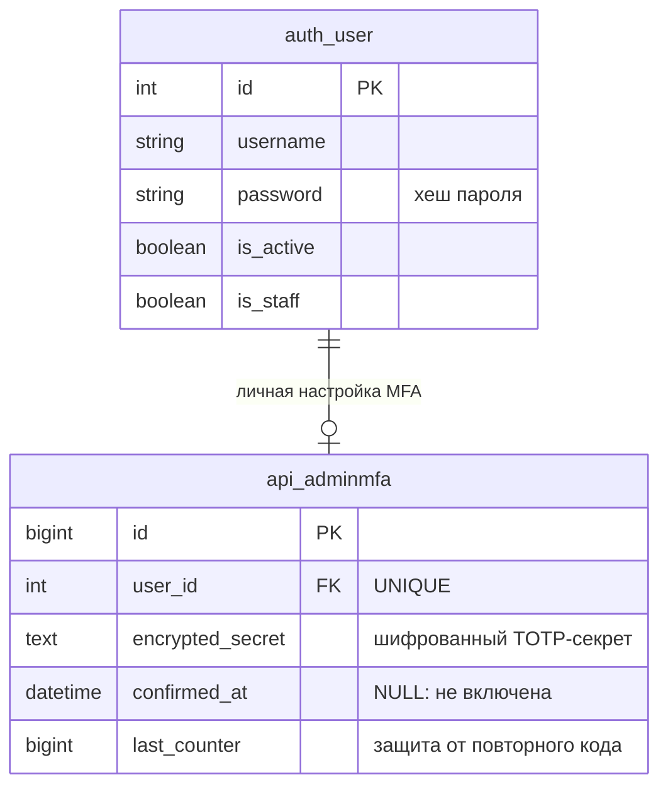

# Опциональная MFA в личных настройках администратора

Задача: `optional-admin-mfa`. Ветка: `feature/optional-admin-mfa`.
Основание: пользователь просит добровольное включение MFA кнопкой в настройках с QR-кодом.
Статус: согласована пользователем 2026-09-28 («продолжи»), реализована и проверена локально; далее CI, merge и развёртывание.
База: `main` после PR #3, `1acd0a3`.



Диаграмма показывает существующие таблицы; проверены `api/models.py` и миграция `0012_platform_access_facts_delivery.py`. Изменений схемы и новых таблиц не планируется. Состояние включения — существующее ненулевое `confirmed_at`; отсутствие записи или неподтверждённая запись не ограничивают вход.

```mermaid
sequenceDiagram
    actor Admin as Администратор
    participant UI as Админка
    participant MFA as Django MFA
    participant DB as БД и сессия
    participant Auth as Приложение-аутентификатор
    Admin->>UI: Вход с паролем
    UI->>MFA: Проверка личного состояния MFA
    MFA->>DB: Есть подтверждённая настройка?
    alt MFA выключена или настройка не завершена
        MFA-->>UI: Обычный доступ без навязывания настройки
        Admin->>UI: Настройки → Безопасность → Включить MFA
        UI->>MFA: POST начать настройку (CSRF)
        MFA->>DB: Создать шифрованный секрет
        MFA-->>UI: QR-код и ручной ключ
        Admin->>Auth: Сканировать QR-код
        Auth-->>Admin: Шестизначный код
        Admin->>MFA: Подтвердить код
        alt Код корректен и не использован
            MFA->>DB: confirmed_at, last_counter и подтверждение сессии
            MFA-->>UI: MFA включена
        else Ошибка или отмена
            MFA-->>UI: Ошибка / возврат в настройки; вход остаётся доступным
        end
    else MFA включена, сессия ещё не подтверждена
        MFA-->>UI: Форма одноразового кода без QR и секрета
        Admin->>MFA: Код из приложения
        alt Код корректен
            MFA->>DB: Записать счётчик и подтверждение текущей сессии
            MFA-->>UI: Перейти к запрошенной странице админки
        else Неверный, повторный код или лимит попыток
            MFA-->>UI: Понятная ошибка без доступа к защищённым страницам
        end
    end
```

## Постановка

Сейчас `ADMIN_MFA_REQUIRED = MAZORY_ENV == "production"` принудительно отправляет каждого администратора на настройку MFA. Это поведение заменить личной добровольной настройкой. Исправление перекрывающих окон и закрытие внешнего 8080 уже выполнены в PR #3 и сохраняются.

## Требования

1. Администратор без включённой MFA входит обычным способом. Незавершённые записи, ранее созданные принудительной страницей, не запускают обязательную настройку.
2. В админке появляется доступный пункт личных настроек «Безопасность». Страница показывает состояние и кнопку «Включить MFA»; пользователь управляет только своей MFA.
3. Секрет создаётся по явному POST-действию включения с CSRF. Страница настройки показывает QR-код, ручной ключ и поле шестизначного кода. QR генерируется внутри приложения, без отправки секрета внешним сервисам.
4. MFA включается только после проверки первого кода. Настройку можно отменить; отмена не блокирует админку.
5. При последующих входах код обязателен только для пользователя с подтверждённой MFA. Существующие подтверждённые настройки сохраняются и продолжают работать.
6. После подтверждения входа открывается исходная страница админки; адрес возврата ограничен локальными маршрутами админки. Выход из аккаунта всегда доступен.
7. В настройках включённой MFA есть отключение с подтверждением текущего пароля и свежего TOTP-кода. После отключения следующий вход обычный. Повторное включение выдаёт новый секрет; старые отметки подтверждения сессий не подтверждают новый секрет.
8. Сохранить шифрование секрета, лимит попыток, защиту от повторного кода, CSRF и смену ключа сессии после успешной проверки. Активный секрет и QR повторно не показывать. Страницы с секретом не кэшировать, значения не логировать.
9. Политика добровольного включения одинакова в production и тестах. Убрать глобальное принуждение через `ADMIN_MFA_REQUIRED`, а не отключать проверку для уже включивших MFA.
10. Область задачи — Django Admin. Пользовательский OTP/JWT API, WhatsApp, бизнес-логика и роли не меняются.

## Планируемые изменения

- `backend/api/mfa.py`: разделить личные настройки/подключение и подтверждение входа; middleware ориентируется на подтверждённую запись, учитывает актуальный секрет при подтверждении сессии.
- `backend/mazory_backend/urls.py`: добавить личные настройки безопасности, сохранить понятный маршрут подтверждения MFA.
- `backend/mazory_backend/settings.py` и шаблоны Unfold: ссылка на настройки и удаление обязательности для всех администраторов.
- `backend/templates/admin/`: состояние MFA, кнопки включения/отмены/отключения, локальный QR и форма кода в оформлении админки.
- Добавить минимальную библиотеку генерации QR с согласованными lock/requirements; не менять остальные зависимости намеренно.
- Новые Playwright E2E на реальном изолированном приложении; синтетические пользователи и секреты.
- После проверки: PR в `main`, CI, объединение и обновление публичного сервера `ai.mazory.best`.

## Критерии готовности и проверки

- Без MFA и с незавершённой настройкой: вход и переходы по админке без редиректа на подключение.
- В настройках: видимая кнопка, читаемый QR, ручной ключ; корректный код включает MFA, неверный код не включает; отмена работает.
- После нового входа включившего MFA: запрос кода, отказ неверному/повторному коду, соблюдение лимита, успешный переход после корректного кода. Нет обхода через страницу настроек и прямые admin URL.
- Отключение требует правильного пароля и свежего кода; повторное подключение не принимает старые секреты и подтверждения сессии.
- Секрет не выдаётся чужому пользователю или после активации. GET-запросы не создают настройки и не переключают MFA.
- Playwright на `http://localhost:5173` проверяет полный цикл подключения/повторного входа/отключения, отмену, ошибки и отсутствие зависших overlay. Полный существующий E2E-набор также проходит.
- Django `check`, `makemigrations --check` (`No changes detected`), frontend typecheck/build; проверены логи очередей и WAHA.
- После развёртывания HTTPS работает, внешний 8080 закрыт. Проверки производственных аккаунтов не включают и не отключают MFA за пользователя.


## Уточнение пользователя 2026-09-28

Использовать только сквозные Playwright E2E. Удалить существующие unit/изолированные backend-тесты и их неиспользуемые фабрики, убрать `manage.py test` из CI, явно закрепить запрет в AGENTS.md. Сохранить E2E-инфраструктуру с PostgreSQL, Redis, Q2 и тестовым внешним провайдером, проверки Django, миграций, типов, сборки и конфигурации. Сценарии MFA, включая защиту от обхода, повторного кода, CSRF и лимит попыток, проверять через браузер и реальный HTTP.

## Реализация и верификация

- Добавлена личная страница `/admin/security/` и пункт «Личные настройки → Безопасность». Подключение, подтверждение, отмена и отключение выполняются через POST с CSRF. QR формируется локально в SVG библиотекой qrcode 8.2; прочие версии зависимостей сохранены.
- Middleware требует TOTP только для подтверждённой личной настройки. Незавершённая старая запись не блокирует вход. Подтверждение сессии привязано к пользователю и текущему зашифрованному секрету; прежние сессии включённой MFA должны один раз подтвердить код заново. При новом подключении старые подтверждения недействительны.
- Незавершённый секрет доступен только сессии, явно начавшей подключение. Активный секрет не отображается. Лимит попыток общий для подключения, входа и отключения; изменения сериализованы блокировкой строки пользователя.
- По уточнению пользователя удалены 10 модулей unit/изолированных backend-тестов и их фабрики. Из CI удалён `manage.py test`; в AGENTS.md закреплён стандарт только Playwright E2E. E2E-провайдер, синтетические данные и команда выдачи тестовой сессии сохранены.
- Полный Playwright-прогон на `http://localhost:5173`: **21 passed**, включая 7 новых MFA-сценариев. Используются реальные Django/PostgreSQL/Redis/Q2, синтетические учётные записи и отдельный внешний тестовый провайдер. Проверены полный цикл MFA, отмена, ошибки, повторы кодов, параллельные запросы, прямые маршруты, CSRF, лимиты и безопасный возврат после входа.
- Изображение QR из браузера успешно декодировано независимым декодером; проверены схема otpauth, issuer Mazory и TOTP-секрет. Скриншот страницы проверен визуально; перекрывающих overlay нет.
- Frontend typecheck/Vite build прошёл. Django `check`: без ошибок; `makemigrations --check`: `No changes detected`. Проверка production-конфигурации не выявила ошибок; сохранены прежние предупреждения HSTS для поддоменов и preload.
- Логи тестовых очередей подтверждают выполнение заданий; `crm_disabled` ожидаем для отключённого CRM. Production-логи до развёртывания содержат 403 «Источник не разрешён» для WhatsApp-источников, не прошедших фильтр активной группы/команды. Это существующий контроль доступа, изменения MFA его не затрагивают.
