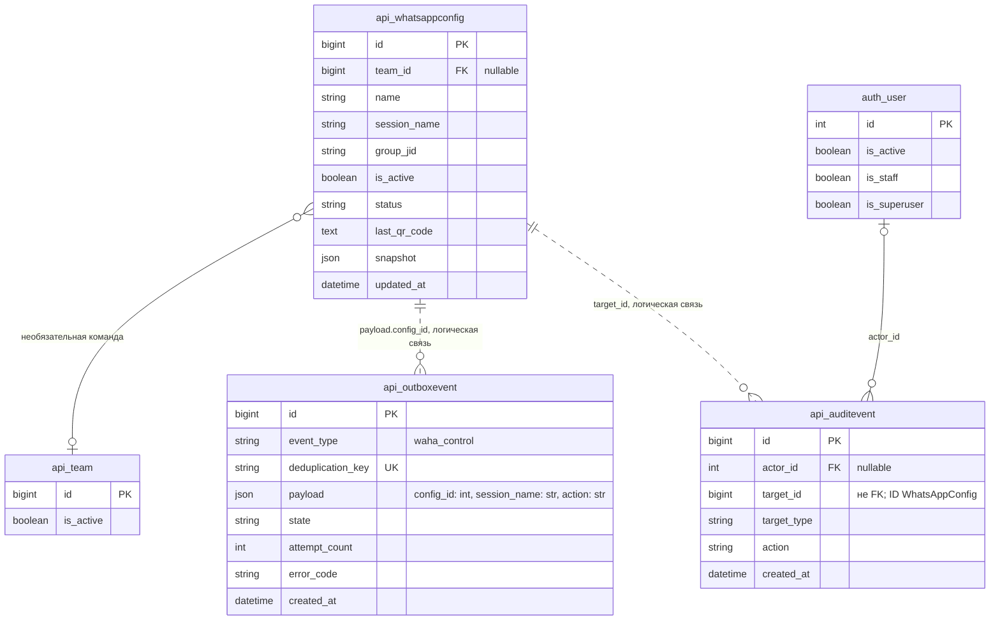

# Исправление действий WAHA в админке

Задача: `waha-admin-actions`. Ветка: `bugfix/waha-admin-actions`.
Основание: Logout и Stop возвращают 403, Restart возвращает 404 на `/admin/waha-dashboard/`.
База: актуальный `main`, `ae53573` (PR #4). Статус: согласовано пользователем («делай»); реализация и локальные проверки завершены, подготовлено к PR.



Показана существующая структура, проверенная по `backend/api/models.py` и миграциям `0003_aisettings_bitrixsettings_whatsappconfig_and_more.py`, `0012_platform_access_facts_delivery.py`. Связи конфигурации с OutboxEvent/AuditEvent логические, не внешние ключи БД. Новые модели, поля и миграции не планируются.

```mermaid
sequenceDiagram
    actor Admin as Администратор
    participant UI as WAHA-страница
    participant Django as Django Admin
    participant DB as PostgreSQL
    participant Dispatcher as Outbox dispatcher
    participant Q as Redis / Django Q2 delivery
    participant Worker as Worker tasks.py
    participant WAHA as WAHA API
    Admin->>UI: Start / Restart / Stop / Logout
    opt Logout
        UI->>Admin: Подтвердить выход из WhatsApp
    end
    UI->>Django: POST action + config_id + CSRF
    Django->>Django: Проверить доступ, действие и числовой ID
    alt Недостаточно прав или неверный CSRF
        Django-->>UI: 403; задача не создаётся
    else Невалидная или недоступная конфигурация
        Django-->>UI: Понятная ошибка; задача не создаётся
    else Допустимое действие
        Django->>DB: Атомарно OutboxEvent + AuditEvent
        Django-->>UI: Возврат на страницу: команда в очереди
        Dispatcher->>DB: Получить pending-событие
        Dispatcher->>Q: async_task(run_outbox, event_id)
        Q->>Worker: Выполнить waha_control
        Worker->>WAHA: POST /api/sessions/{session}/{action}
        alt WAHA подтвердила команду
            Worker->>WAHA: Прочитать актуальное состояние, при необходимости QR
            Worker->>DB: Обновить сохранённое состояние и результат события
            UI->>Django: Получить сохранённое состояние операции
            Django->>DB: Прочитать результат
            Django-->>UI: Завершение, статус сессии, доступный QR
        else Ошибка API или таймаут
            Worker->>DB: failed либо unknown и безопасный код ошибки
            Django-->>UI: Ошибка или неизвестный результат; без ложного успеха
        end
    end
```

## Подтверждённые причины

1. `waha_action_view` допускает только `status`, `qr`, `restart`. Шаблон отправляет также `start`, `stop`, `logout`; они отвергаются с 403 даже для администратора с необходимыми правами.
2. Во всех формах отсутствует `config_id`. Для допустимого `restart` обработчик ищет `WhatsAppConfig` с `pk=None` и возвращает 404.
3. `tasks.waha_control` реализует только Restart, QR и чтение статуса. Неизвестное действие сейчас попадает в ветку чтения статуса: одного расширения списка разрешённых кнопок недостаточно.
4. Дашборд получает `qr_image=None`, а текущий статус после Restart не обновляется. Для рабочего цикла Logout → Start → повторное подключение требуется обновление состояния и отображение QR.

## Требования

- Все четыре существующие кнопки передают ID выбранной конфигурации и выполняют своё действие через существующую цепочку Outbox → Django Q2 → WAHA. Синхронных внешних запросов из HTTP-обработчика нет.
- Сохранить `integration_allowed`, staff-аутентификацию, CSRF и требование POST. Разрешение новых действий не отменяет проверку прав. Неизвестные команды не должны молча превращаться в чтение статуса.
- ID проверяется как положительное целое число. Отсутствующее/нечисловое значение вызывает понятную ошибку валидации; удалённая или выключенная конфигурация обрабатывается явно. Если конфигурации нет, страница показывает пустое состояние без сломанных ссылок и активных кнопок.
- Start запускает существующую сессию; Restart перезапускает; Stop останавливает без выхода из аккаунта; Logout завершает авторизацию WhatsApp и сохраняет явное подтверждение в UI. При отсутствующей сессии WAHA показывать понятную ошибку; не создавать её с потерей существующих webhook-настроек.
- Для всех внешних запросов используются только `settings.WAHA_API_URL` и `settings.WAHA_API_KEY` в `tasks.py`. Имя сессии безопасно кодируется как сегмент URL. Публичный контракт управления сессией сверяется с [официальной документацией WAHA](https://waha.devlike.pro/docs/how-to/sessions/).
- Создание события и аудита атомарно. Обновление страницы после POST не повторяет команду. UI различает очередь, обработку, подтверждённое выполнение, ошибку и неизвестный результат; не сообщает об успешном перезапуске до выполнения задачи.
- После команды обновлять сохранённый статус. Устаревший QR очищать, актуальный показывать только при необходимости авторизации. QR формировать локально существующей библиотекой qrcode; секреты и содержимое QR не логировать и не кэшировать в браузере.
- Отсутствие ответа WAHA и отказ API не приводят к необработанной ошибке страницы; неизвестный результат не вызывает слепого повторения управляющей команды.
- Изменения ограничены управлением WAHA в админке и его фоновыми обработчиками. Распознавание сообщений, аналитика, MFA и бизнес-права не меняются. Полная реализация каталога WhatsApp-чатов не входит в эту задачу.

## Планируемые изменения

- `backend/api/waha_admin_views.py`: проверка входных данных, согласование допустимых действий, контекст Unfold, выбор конфигурации, отображение сохранённого результата фонового действия и состояния без конфигурации.
- `backend/templates/admin/waha_dashboard.html`: передача `config_id`, корректные управляющие кнопки, подтверждение Logout, состояния ожидания/ошибки/завершения и актуальный QR.
- `backend/api/waha_control.py`, `backend/api/whatsapp_views.py`: атомарная запись управляющего события и аудита, общий проверяемый список действий без изменения существующих API-ответов.
- `backend/api/tasks.py`: явное выполнение start/restart/stop/logout/status/qr, обновление состояния из ответа WAHA и безопасная обработка ошибок. При необходимости добавить маршрут чтения сохранённого состояния в `backend/mazory_backend/urls.py`, защищённый теми же правами.
- `backend/api/testing/provider.py`: отдельные маршруты сессии, учёт полученных команд, управляемые состояния и ошибки изолированного E2E-провайдера.
- Новый Playwright E2E на реальном UI/API, PostgreSQL и Q2. Unit-тесты не создавать и не запускать.
- После проверок — PR в `main`, CI, merge, обновление backend и обработчика очереди delivery на сервере; проверка публичной страницы и логов.

## Критерии готовности

1. Playwright нажимает Start, Restart, Stop, Logout в админке: допустимые действия не получают ошибочные 403/404, проходят через worker и достигают соответствующего маршрута внешнего E2E-провайдера.
2. При отмене подтверждения Logout задача не создаётся; после подтверждения показывается новый статус, затем Start позволяет получить QR для повторного подключения.
3. Проверены отсутствие/невалидность/неактивность config_id, пустая конфигурация, отсутствие прав, CSRF, недоступность WAHA и отказ внешнего API. Неверные запросы не создают управляющих задач.
4. Страница не зависает в ложном успехе или бесконечном ожидании; завершение и ошибка видны после выполнения воркера. Повторное обновление страницы не повторяет действие.
5. В браузере нет неожиданных ошибок консоли и перекрывающих overlay. Полный набор `frontend/e2e/*.spec.ts` проходит на `http://localhost:5173`.
6. Frontend typecheck/build, Django `check`, `makemigrations --check` (`No changes detected`), diff и логи очередей проверены. В CI остаются только E2E как функциональные тесты.
7. На production обновлены HTTP-backend и соответствующие воркеры; сайт и админка доступны. Разрушительные для подключения WhatsApp действия проверяются на изолированном провайдере; рабочую сессию для проверки не разлогинивать и не останавливать.

## Реализация и результаты проверки

- Общая атомарная постановка команд блокирует параллельные операции для конфигураций одной сессии. Статус и QR обновляются для всех таких конфигураций; неизвестные команды отвергаются явно.
- Поллинг защищённого маршрута читает только БД, прекращается после завершения или двух минут ожидания и показывает возможность обновить страницу. STARTING и ожидание сканирования предлагают явно обновить статус через очередь.
- Шаблон использует штатный контекст Admin/Unfold; `backend/static/admin/js/waha-dashboard.js` обрабатывает подтверждение Logout и ожидание. Каталог чатов с ложным состоянием загрузки удалён.
- Playwright: четыре новых сценария охватывают все команды, полный цикл выхода/QR, ошибки 403/404/503 внешнего сервиса, таймаут и обрыв соединения, отсутствующий/невалидный/выключенный ID, параллельные команды общей сессии, CSRF, права и пустую страницу.
- Для независимого запуска добавлен необязательный `E2E_COMPOSE_PROJECT` в E2E helper; CI сохраняет прежнее значение по умолчанию. Из-за занятого другой задачей localhost:5173 полный локальный прогон выполняется внутри отдельного браузерного контейнера на `http://localhost:5173`, с отдельными PostgreSQL, Redis, Q2 и провайдером (`mazory-waha-e2e`).
- Unit-тесты не добавлялись и не запускались. Сборка/typecheck фронтенда и Django check проходят, makemigrations --check: No changes detected. Страница проверена визуально при ширине 1440 и 390 px.

- Полный изолированный прогон Playwright: **25 passed (2.0m)**, включая четыре новых WAHA E2E. Логи delivery/outbox подтверждают выполнение start/restart/stop/logout/status/qr и ожидаемые failed/unknown при внесённых сбоях провайдера.

- Синхронизировано с исправлением полноширинной админки из main (PR #5); WAHA не добавляет собственного ограничения ширины. E2E проверяет ширину при 1920 px. Возврат после ожидания всегда выполняет GET, включая отклонённую команду из устаревшей вкладки.

## Доработка по скриншоту: оформление select

Продолжение согласованной доработки WAHA по замечанию пользователя; ветка `bugfix/waha-select-style`, база `main` после PR #7. На скриншоте системный select macOS игнорирует ожидаемую высоту и оформление поля. Существующие CSS не сбрасывают нативный `appearance`.

- Сохранить нативный доступный select и GET-выбор конфигурации; задать `appearance: none` / `-webkit-appearance: none`, шрифт, высоту, внутренние отступы, фон и рамку в светлой/тёмной теме, отдельную декоративную стрелку.
- Форма должна переноситься на узком экране; длинное название не должно растягивать страницу. Фокус клавиатуры видим, выбранная конфигурация сохраняется после отправки формы.
- Изменения ограничены шаблоном страницы и Playwright E2E. БД, управляющие команды и их разрешения сохраняются; существующая ERD выше применима без изменений.
- Добавить проверки реального select, тем, выбора и мобильной ширины в Chromium и WebKit; в CI установить WebKit для этих сценариев. Выполнить весь E2E-набор, сборку, Django check и makemigrations --check, затем PR/merge и обновление HTTP-backend.

Проверено: полный Playwright — 30 passed (2.5m), включая Chromium/WebKit в обеих темах; frontend build/typecheck, Django check и makemigrations --check прошли. В WebKit дополнительно устранено переполнение длинного нативного option на мобильной ширине; скриншоты 390 px и desktop просмотрены. Unit-тесты не создавались и не запускались.
