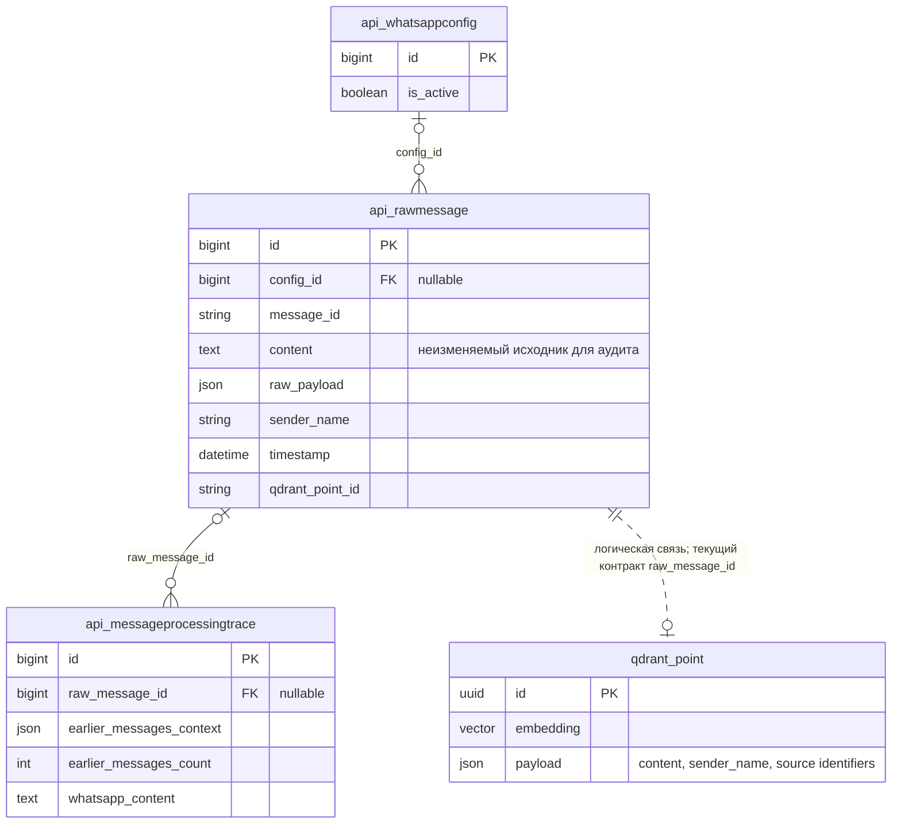
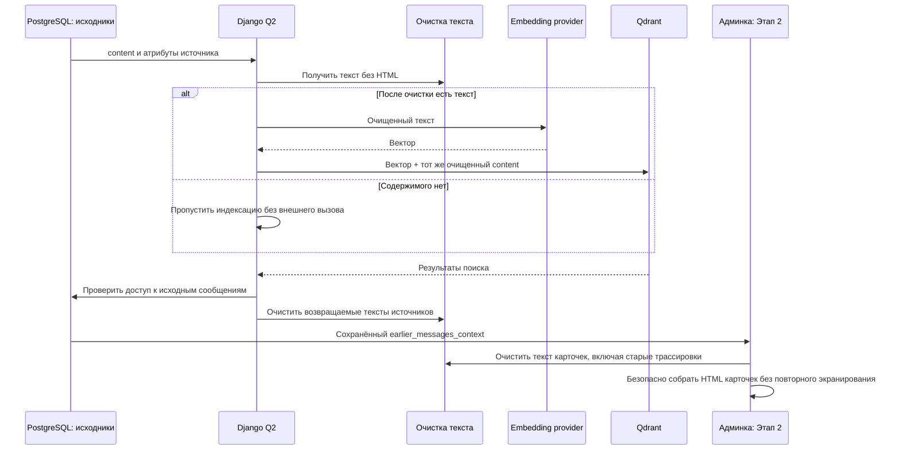

# Чистый текст Qdrant и корректные карточки «Этапа 2»

Задача: `qdrant-clean-text`. Ветка: `bugfix/qdrant-clean-text`.
Дата: 28.09.2026, 12:13:08 MSK. База: актуальный `main`, `ae53573`.
Статус: спецификация подтверждена пользователем («делай»); исправление реализовано и проверено локально, подготовлено к PR и выпуску. Рабочие данные не переписываются.

Показана существующая структура по моделям. Qdrant — внешний индекс, связь логическая; старые точки могут не иметь `raw_message_id`. Схема PostgreSQL и модели не меняются.

## Запрос

Проверить HTML-мусор в трассировке `/admin/api/messageprocessingtrace/100/change/`, исключить его из «Этапа 2» и не допускать попадания HTML в текст, индексируемый Qdrant.

## Подтверждённые результаты диагностики

Проверена рабочая среда `ai.mazory.best` через Docker context `mazory`, без изменения записей и без вызовов embedding/LLM.

- Трассировка №100 содержит три фрагмента контекста, длиной 200, 200 и 54 символа. В их тексте и именах отправителей HTML-тегов не найдено, включая после декодирования HTML-сущностей.
- В 734 `RawMessage.content` HTML-тегов не найдено.
- Единственная существующая коллекция `mazory_messages` содержит три точки. В полях `content` и `sender_name` HTML-тегов не найдено; строковые поля payload не содержат HTML-сущностей.
- В `MessageProcessingTraceAdmin.stage_2_earlier_messages_card` вызов `"".join(cards_html)` превращает безопасно сформированные карточки в обычную строку. Внешний `format_html` повторно экранирует её. Проверка результата рендеринга №100 показала 12 `&lt;div` и 0 настоящих элементов карточек. Это подтверждённая причина видимого мусора.
- `QdrantService.upsert_message` передаёт исходный `content` в embedding и payload. Последующий `**payload` может перезаписать `content`; очистка должна учитывать порядок объединения.
- `search_similar` возвращает текст из `RawMessage`, а не из Qdrant payload. Очистка только при записи в Qdrant не защитит выдачу старых исходников.
- Текущий `pipeline.extract_message` формирует историю из PostgreSQL. Очистку сохранённого контекста нужно применять и к этому пути, независимо от источника поиска.
- На сервере backend и фоновые воркеры используют разные теги образов. При выпуске исправления необходимо обновить backend и воркеры согласованно.

## Требования и изменения

1. Ввести общую функцию получения обычного текста из HTML. Разбирать HTML парсером; удалять теги, комментарии и содержимое `script`/`style`/других служебных блоков. Декодировать обычные и вложенно экранированные HTML-сущности с ограничением числа проходов. Сохранять смысловые переносы между абзацами, строками таблиц и элементами списков. Сохранять русский/казахский текст, суммы, URL и обычные сравнения вроде `2 < 3`.
2. В `qdrant_service.py` нормализовать `content` до расчёта embedding и записи payload; итоговый `payload.content` должен точно соответствовать тексту, переданному в embedding, и не перезаписываться исходным словарём. Очищать отображаемое имя отправителя. Для текста, ставшего пустым, не создавать embedding и точку. Очищать текст поискового запроса и возвращаемые тексты источников, сохраняя действующие ограничения доступа.
3. В `pipeline.py` очищать текст и имя отправителя в списке предыдущих сообщений до передачи контекста LLM и сохранения `earlier_messages_context`. Не переписывать `RawMessage.content`, исходный webhook или текущую цитату, по которой проверяется происхождение извлечённых фактов.
4. В `admin.py` безопасно объединять карточки через `format_html_join` или эквивалентный безопасный API Django, сохраняющий защиту пользовательских значений. Не применять `mark_safe` к содержимому сообщений. Очищать текст и отображаемое имя в старых сохранённых контекстах при рендеринге. Отображать дату из существующих `timestamp`/`sent_at` контрактов. Подтверждение на №100 должно показать три читаемые карточки вместо HTML-кода.
5. Массовая перезапись исходников, удаление коллекций и пересчёт существующих векторов не требуются: проверенные рабочие записи чистые. Изменения ограничены предотвращением будущего загрязнения, выдачей контекста и отображением.
6. Для параллельной работы над репозиторием параметры E2E Docker-проекта, тега образа и портов стали переопределяемыми через окружение. Значения по умолчанию сохранены. Это потребовалось после подтверждённого пересоздания общего тестового backend другой задачей во время первого полного прогона; итоговый прогон выполняется в отдельном `mazory-qdrant-clean-e2e`.

## Проверки и критерии готовности

- Добавить Playwright E2E на работающем изолированном приложении `http://localhost:5173`: через настоящий webhook, outbox, Django Q2 и Qdrant проиндексировать синтетическое сообщение с HTML, проверить очищенный payload и вход embedding-провайдера.
- E2E должен проверить сырую и экранированную разметку, `script`/`style`, сущности `&nbsp;`/`&#x20;`, сохранение переносов и обычного текста, а также пропуск содержимого, ставшего пустым. Данные и провайдеры только тестового окружения.
- Через браузер открыть трассировку с непустым контекстом; проверить реальные DOM-карточки, отсутствие видимых HTML-тегов и отсутствие выполнения пользовательского JavaScript. Проверить старый сохранённый контекст с HTML и новые записи. Просмотреть снимок результата.
- Запустить полный Playwright E2E, frontend build/typecheck, Django `check`, `makemigrations --check`, проверить логи backend и очередей. Unit-тесты, `pytest` и `manage.py test` не использовать согласно правилам репозитория.
- Создать PR в `main`; после успешных проверок и обязательного review объединить. Выпустить одинаковую версию backend и воркеров. На рабочем сервере повторно проверить рендеринг трассировки №100 и отсутствие HTML в существующих точках Qdrant без отправки тестовых сообщений в рабочие WhatsApp/CRM.

## Уже выполнено

- Синхронизация `git pull --ff-only origin main`; создана отдельная ветка и рабочая копия, существующая задача WAHA не затронута.
- Только чтение рабочей БД, Qdrant и результата рендеринга админки.
- `python manage.py makemigrations --check --dry-run` на сервере: `No changes detected`.
- Пользователь согласовал реализацию. Очистка добавлена в запись/поиск Qdrant, формирование и отображение контекста; объединение HTML-карточек исправлено через `format_html_join`. Пустое состояние совместимо с текущим API Django.
- Декодирование сущностей сохраняет обычные амперсанды в URL (`&not=3`), переносы, русский/казахский текст, суммы и сравнения.
- Полный Playwright E2E на `http://localhost:5173` в отдельном Docker-проекте: **22 passed**. После уточнения переносов в UI и защиты от повреждённых HTML-деклараций целевой сквозной сценарий повторён: **1 passed**. Проверены вход embedding-провайдера, Qdrant payload, поиск, контекст LLM, новые/старые трассировки, пустое состояние и отсутствие выполнения JS.
- `npm run build` (typecheck + Vite) прошёл. Django `check` без ошибок; `makemigrations --check`: `No changes detected`. Production configuration check прошёл без ERROR; существующие предупреждения о HSTS для поддоменов/preload не менялись. Просмотрены логи фоновых очередей и тестового WAHA-провайдера.
- Переносы строк дополнительно проверены по вычисленному CSS в браузере и снимку карточек. Повреждённый HTML, который парсер не может обработать, пропускается в производной текстовой проекции, исходник остаётся доступен для аудита.
