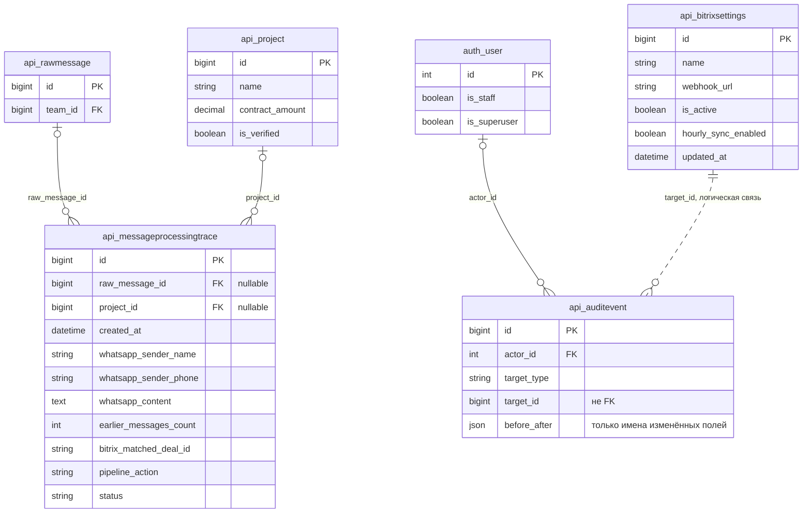
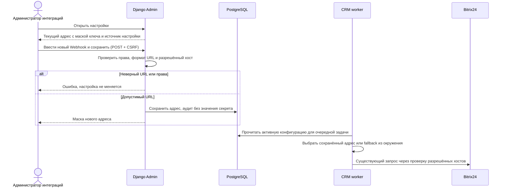

# Читаемые таблицы админки и замена Webhook Bitrix24

Задача: `admin-tables-webhook`. Ветка: `bugfix/admin-tables-webhook`.
Основание: скриншоты пользователя страниц трассировок и настроек Bitrix24.
Статус: согласовано пользователем («делай»). `git pull origin main` выполнен до создания спецификации и повторно перед реализацией; база — main после PR #8.

Существующая структура проверена по `models.py` и миграциям 0003, 0011, 0012, 0014. Новые поля и миграции не нужны. В 0014 сохранённые секреты интеграций были очищены; текущий CRM adapter использует только `settings.BITRIX_WEBHOOK_URL`.

## Требования и изменения

- Список трассировок: пять колонок вместо восьми — «Время / отправитель», «Сообщение», «Контекст / CRM», «Результат», «Сделка». Время, имя, телефон, контекст, CRM, действие, статус и проект сохраняются; ссылка на подробную трассировку остаётся заметной. Текст сообщения получает основную ширину, длинные имена и идентификаторы не раздвигают таблицу. Бейджи цельные; на малых экранах содержимое адаптируется без переполнения всей страницы. Сохраняются фильтры, поиск и ограничения доступа.
- Настройки Bitrix: текущий эффективный адрес показывается с полностью замаскированным секретным сегментом и указанием источника (настройка / окружение). Явная ссылка ведёт к редактированию. Колонки настроек уплотняются группировкой флагов, длинные заголовки не растягивают страницу.
- Поле замены Webhook доступно только с существующими правами интеграций и изменения настроек. Сохранённый секрет не вставляется в HTML; пустое поле при сохранении оставляет адрес прежним. Адрес проверяется без внешнего HTTP-запроса: формат Bitrix REST, HTTPS и существующий список разрешённых хостов (изолированный E2E-provider разрешён только в тестовом режиме). Ошибка понятна, секрет не попадает в аудит/логи/сводку изменений.
- CRM worker использует адрес из активной настройки, если он задан, иначе `settings.BITRIX_WEBHOOK_URL`; смена начинает работать на следующей фоновой задаче без перезапуска. Существующая проверка URL провайдера сохраняется. Бизнес-пайплайн и разрешения не расширяются.
- При публикации текущий production Webhook не заменяется тестовым; пользователь сможет ввести нужный адрес сам. Backend и CRM worker обновляются согласованно.

## Проверки и критерии готовности

- Только Playwright E2E: реальная админка на localhost:5173, обе темы, широкие и узкие экраны, длинные сообщения/имена/названия, цельные бейджи и рабочие переходы/фильтры.
- Через реальную форму заменить синтетический Webhook, сохранить его при пустом вводе, проверить маску, неверный URL, права/CSRF. Реальная фоновая CRM-задача должна достичь изолированного провайдера по новому адресу; fallback из окружения тоже проверяется. Unit-тестов нет.
- Полный E2E-набор, frontend build/typecheck, Django check, makemigrations --check (No changes detected), логи worker/outbox; визуальная проверка скриншотов.
- PR в main, успешный CI и review, merge, обновление сервера и проверка доступности приложения. Результаты фиксируются в этой же спецификации.

## Реализация и проверка

- В списке трассировок осталось пять колонок; действие и статус объединены, CRM и контекст сгруппированы. Превью сообщения занимает основную ширину, название сделки ограничено тремя строками с доступом к полному названию. На узкой ширине строки превращаются в блоки с подписями; устранены разрывы рамок и обрезание содержимого фиксированной высотой ячеек Unfold.
- Список Bitrix содержит четыре колонки и явный переход «Изменить Webhook». На форме показаны текущий адрес с маской, источник настройки и пустое поле замены; пустое сохранение не меняет адрес. Валидация проверяет REST URL и разрешённый хост без запроса к провайдеру. Секрет не возвращается в HTML и не записывается в историю изменений/аудит.
- Общий resolver выбирает сохранённый адрес или fallback из окружения; CRM worker перечитывает конфигурацию перед внешним запросом. Модели и миграции не менялись.
- Playwright проверяет таблицы в Chromium и WebKit, обе темы и ширины 1920, 1366, 1024, 390 px, отсутствие переполнения по ширине и обрезания по высоте, переходы и фильтры. Отдельный E2E проходит форму замены → реальный ingress API → outbox → Q2 CRM → изолированный провайдер; проверены fallback, новая настройка, пустое сохранение, неверные URL, CSRF и обе проверки прав. Секрет отсутствует в HTML, Django history и AuditEvent.
- Визуально просмотрены desktop и mobile скриншоты. Сборка/typecheck фронтенда, Django check и makemigrations --check (No changes detected) прошли; просмотрены логи CRM, AI, delivery и outbox. Unit-тесты не создавались и не запускались.
- Полный прогон на чистом изолированном PostgreSQL, Redis, Qdrant и Q2: **36 passed (3.0m)**. Браузер работает с реальным приложением на `http://localhost:5173` внутри отдельного контейнера; проект Compose `mazory-waha-select-e2e` не затрагивает параллельные окружения.
