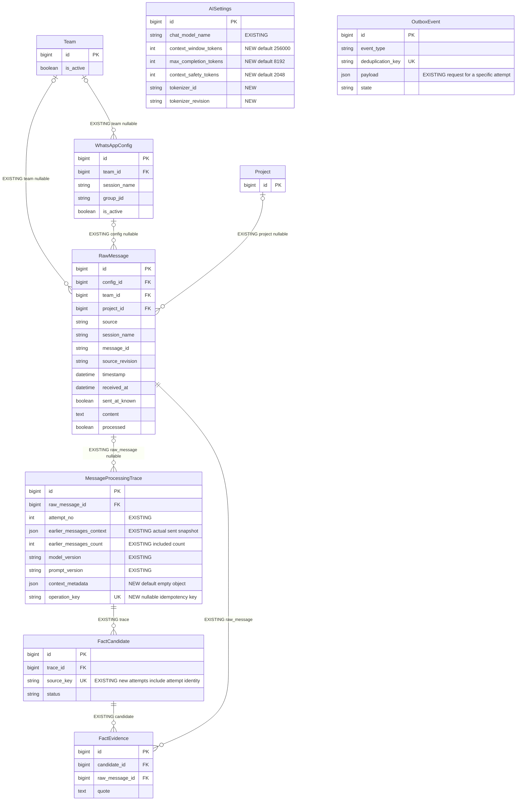
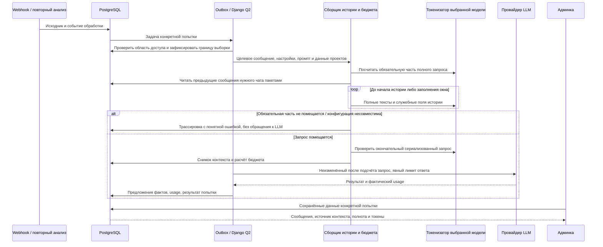

# Полная история сообщений в пределах 256 000 токенов и достоверная трассировка

- Задача: `message-context-budget`.
- Создано: 28.09.2026, 13:25:18 MSK.
- Ветка реализации: `feature/message-context-budget`; исходная база: `b671874`, интеграция с `6ae85bb` (#9).
- Статус: спецификация подтверждена пользователем («делай»); реализация завершена, локальные проверки пройдены, подготовка PR и выпуска.
- Уточнение пользователя: **«Вся история в пределах 256 000 токенов»**. Предложение о 10 000 символов отменено; отдельного ограничения числа сообщений или символов не вводить.

## Структура данных

Обозначения: `EXISTING` — проверенная существующая связь/поле; `NEW` — планируемое изменение. Числовые идентификаторы остаются `BigAutoField`/`int`. Поля JSON ниже не создают внешних ключей.



`AISettings` задаёт политику; её значения копируются в снимок `context_metadata`, поэтому изменение настройки не меняет смысл старой трассировки. `OutboxEvent` связывает обработку с исходником/попыткой через существующий JSON payload, а не через новый FK.

## Процесс обработки



## 1. Постановка и подтверждённые причины

Исправить список `/admin/api/messageprocessingtrace/`, карточку `/admin/api/messageprocessingtrace/100/change/` и формирование контекста новых обработок.

Проверено по коду и рабочей БД 28.09.2026:

- В `MessageProcessingTraceAdmin.earlier_messages_badge` буквально задано `{} сондай`. Это ошибочная подпись.
- В старом `backfill_pipeline_traces.py` из коммита `a61352f` резервная выборка использовала `[:3]`, `content[:200]` и фиксированный `score = 0.72`, без ограничения одним чатом. Команда теперь отключена.
- Трассировка №100 содержит три фрагмента длиной 200, 200 и 54 символа, каждый со `score=0.72`. Их идентификаторы и тексты точно совпадают со старой резервной выборкой; версии модели и промпта пустые. Эти 72% нельзя представлять как измеренное сходство.
- Текущий `pipeline.extract_message` читает историю из PostgreSQL и ограничивает её `[:12]`. Это другой путь, также с ненужным ограничением количества.
- Карточка, её обзорный блок и inline продолжают называть этот контекст Qdrant/RAG; модель embeddings в карточке захардкожена.
- В `AIService.analyze_message_with_context` нет общего подсчёта входных токенов и явного лимита ответа. История передаётся вместе с промптом, исходным сообщением и `known_projects`.

Результат: извлечение фактов получает всю доступную предыдущую историю разрешённого источника, пока позволяет окно модели; админка показывает именно отправленный контекст и честно объясняет его полноту.

## 2. Область истории

1. Для WhatsApp брать историю того же чата, сессии и команды через проверенную `WhatsAppConfig`. «Вся история» не означает смешивание разных чатов или команд. Не расширять доступ по совпадению текста, имени сделки или одного `chat_id`.
2. Для источников без `config` сохранить ограничение по `team`, `source` и `project`; при невозможности однозначно установить область завершать обработку с диагностикой, а не читать общую таблицу.
3. Основной порядок — `(timestamp, id)`. Включать записи с меньшим timestamp и записи с равным timestamp, но меньшим id. Целевое сообщение и все его редакции исключать из истории. В LLM передавать сообщения от старых к новым.
4. При неизвестном времени целевого сообщения использовать отдельный явно обозначенный режим порядка получения `(received_at, id)` в пределах той же области. Не выдавать порядок получения за известную хронологию отправки.
5. Зафиксировать верхнюю границу доступных исходников на старте попытки. Поступившие позже сообщения не должны менять уже собранный запрос. Для повторного анализа новая попытка имеет собственную границу; поздний импорт более ранней истории может войти в неё.
6. Редакции одного исходного сообщения не считать разными сообщениями: выбирать последнюю доступную редакцию на зафиксированную границу. Сохранить исключение superseded/удалённых источников согласно действующему контракту. Не включать будущие по выбранной временной шкале сообщения.
7. Сохранять `RawMessage.content` неизменным. Для истории применять существующую очистку HTML; пустой после очистки текст пропускать с отдельным счётчиком. Русский, казахский, переносы, суммы и Unicode должны сохраняться.
8. Не использовать Qdrant top-k, порог сходства, `[:3]`, `[:12]`, лимит дней или ограничение символов как фильтр полноты этой истории. Семантический поиск чат-ассистента и самостоятельная индексация Qdrant остаются отдельными механизмами.

«Вся доступная история» — история, фактически имеющаяся в системе на момент попытки. Это не обещание загрузить всю переписку из WhatsApp. Отдельно обозначать, что полнота внешнего импорта может быть неизвестна.

## 3. Бюджет 256 000 токенов

### 3.1. Настройки и формула

Для этой политики окно `W = 256000` токенов, именно 256 000, без неявной подмены на 262 144. Модель и фактический маршрут провайдера должны поддерживать это окно. Модель с большим окном использует выбранный бюджет; модель с меньшим окном вызывает понятную ошибку конфигурации, а не молчаливое сокращение истории.

Предлагаемые начальные настройки:

| Параметр | Значение | Назначение |
| --- | ---: | --- |
| `context_window_tokens` | 256 000 | Всё окно запроса и генерации |
| `max_completion_tokens` | 8 192 | Резерв и явный потолок генерации ответа |
| `context_safety_tokens` | 2 048 | Запас на особенности протокола/подсчёта |

Это настройки, а не новые ограничения числа или длины сообщений. При reasoning-модели резерв генерации должен включать внутренние reasoning-токены согласно её контракту; запрещено выделять их сверх общего окна. Значения валидируются вместе с лимитами модели и провайдера.

```text
F = токены обязательной части запроса без истории:
    system prompt + полное целевое сообщение + sender/timezone/sent_at
    + known_projects / CRM-данные + JSON, роли и служебное обрамление
H = max(0, W - max_completion_tokens - context_safety_tokens - F)

Обязательный финальный инвариант:
tokens(полный реально отправляемый input)
    + max_completion_tokens + context_safety_tokens <= W
```

Пример расчёта, а не замер текущего промпта: при `F=6000` для истории остаётся примерно **239 760 токенов**. Окончательное решение принимает подсчёт собранного запроса: сумма токенов отдельных строк не всегда равна токенам объединённого текста.

Не пересчитывать токены через фиксированное «1 токен = N символов» или размер UTF-8. Никакого лимита 10 000 символов на историю либо одно сообщение.

### 3.2. Подсчёт и проверка провайдера

- Ввести единый построитель payload, используемый и для подсчёта, и для отправки. После финальной проверки нельзя добавлять текст в запрос без пересчёта.
- Считать токены токенизатором выбранной модели с её шаблоном сообщений, либо официальным endpoint подсчёта для той же модели. Зафиксировать идентификатор и версию токенизатора. Для первого выпуска обязательно поддержать фактически настроенную рабочую модель; не подставлять токенизатор другой модели.
- Метаданные OpenRouter дают окно, тип токенизатора и ограничения провайдера, но сами по себе не обеспечивают точный подсчёт. До выпуска проверить соответствие локального токенизатора и шаблона реальному маршруту, включая длинный русский/казахский текст.
- При неподдерживаемой модели/недоступном достоверном подсчёте — `context_tokenizer_unavailable`, без отправки заведомо непроверенного запроса. Получение метаданных/внешний подсчёт выполняются в воркере; проверенные метаданные кэшируются с привязкой к версии модели.
- Явно передавать согласованный лимит генерации (`max_tokens` для текущего API). Не допускать fallback на маршрут с меньшим окном. Отключить автоматическую компрессию контекста провайдером: сохранённый snapshot должен соответствовать переданному input.
- Сохранять фактический `usage` после ответа отдельно от предварительного подсчёта. Отсутствие usage означает «неизвестно», а не ноль. Расхождение подсчёта и usage должно быть диагностируемым.

### 3.3. Заполнение истории и переполнение

1. Если все подходящие сообщения помещаются — включить **все, полностью**, независимо от количества и суммарного числа символов. Даже если история короткая, искусственно дополнять её до 256 000 токенов не нужно.
2. Читать историю пакетами, начиная с ближайших предыдущих сообщений, и набирать максимально длинную непрерывную последовательность назад во времени. Размер пакета БД — способ чтения, не лимит итоговой истории.
3. Если вся история не помещается, исключать наиболее старую часть. Не заменять её автоматически резюме и не переключаться на «похожие N сообщений».
4. На границе допускается один частичный фрагмент самого старого из включённых сообщений: сохранять его конец, обрезая только по доступному токенному бюджету. Это правило действует и когда одно предыдущее сообщение больше всего свободного бюджета. Не повреждать Unicode. В snapshot фиксировать исходный id, полный размер, включённый диапазон символов, признак частичности и причину `token_budget`. Маркер частичности входит в подсчёт.
5. Перед отправкой вернуть отобранные элементы в хронологический порядок и пересчитать весь input. При переполнении корректировать только старую границу истории. Целевое сообщение, системные правила и обязательные данные не обрезать.
6. Если обязательная часть с резервами сама больше окна — `context_fixed_input_too_large`, без обращения к LLM и без тихого усечения исходного сообщения. Ровно нулевой остаток допускает обработку без истории, но явно отражается как ограничение бюджета.
7. Переполнение у провайдера фиксировать отдельной ошибкой `provider_context_overflow`. Запрещено скрытно повторять запрос с меньшей историей, а в карточке оставлять прежний snapshot. Любой повтор имеет собственную зафиксированную попытку.
8. Ошибки конфигурации/неподдерживаемого подсчёта не ставить в бесконечные повторы. Сетевые сбои обрабатывать действующей ограниченной политикой retries.

## 4. Трассировка и данные

Добавить `MessageProcessingTrace.context_metadata = JSONField(default=dict, blank=True)` с версией схемы. Старое пустое значение означает неизвестное происхождение, а не успешную новую политику.

Сохранять:

- `schema_version`, `policy_version`, `source` (`chat_history` для нового пути), модель/маршрут, токенизатор и его ревизию, границу выборки и выбранную временную шкалу;
- `window_tokens`, `completion_reserve_tokens`, `safety_tokens`, `fixed_input_tokens`, `history_budget_tokens`, `input_tokens_preflight`, фактический `input_tokens_actual`, статус отправки запроса;
- `available_messages_count`, `included_messages_count`, `fully_included_messages_count`, `omitted_messages_count`, `partial_messages_count`, `empty_messages_count`, период доступной/включённой истории;
- `history_complete_in_request`, `omission_reason`, контрольную сумму канонического payload и значения конфигурации на момент попытки.

`available_messages_count` — число подходящих непустых сообщений после правил области/редакций; оно равно included + полностью omitted. Частичное сообщение учитывается в included и отдельно в partial. Полнота означает отсутствие и пропусков, и частичных элементов. Пустые записи показывать отдельно, не выдавая их за пропущенные из-за бюджета.

`earlier_messages_context` остаётся точным снимком переданных текстов и их порядка. Для новых элементов хранить числовой `raw_message_id`, идентичность редакции, автора, время, содержимое и метаданные частичности. `earlier_messages_count = len(earlier_messages_context)`; убрать двусмысленный fallback, маскирующий рассогласование счётчика и массива. Для исторических записей расхождение показывать как диагностику.

Миграции добавить для настроек и metadata, без перезаписи исходных текстов и без генерации новых «исторических результатов AI». Индексы для области и порядка выборки выбрать по реальному SQL/EXPLAIN; не загружать весь безграничный queryset в память. Не вводить скрытую отсечку общего числа прочитанных сообщений. Расчёт полноты может обходить историю потоково; содержимое, которое не войдёт, не требуется держать в памяти.

## 5. Админка

Исправить список, карточку, обзор цепочки и inline, используя общую функцию представления:

- Колонка/индикатор: **«Сообщений в контексте»**; значение: **«Включено: N»**. Удалить `сондай`, `N в RAG` и `0 контекста`.
- Блок: **«История сообщений, переданная в AI»**. Для нового пути источник — **«История этого чата»**, без названия Qdrant, захардкоженной embedding-модели и процентов сходства.
- Показывать «Включено N из M», период, токены входного запроса, резерв ответа и окно. При неполноте: «Старые сообщения не вошли: достигнуто окно модели» и число полностью/частично исключённых сообщений.
- Частичное сообщение явно пометить: «Показан фрагмент, вошедший в запрос». Дать доступ к полному исходнику при наличии прав. Не выдавать развёрнутый из БД текст за текст, отправленный модели.
- Для пустой истории писать «В доступной истории этого чата предыдущих сообщений нет». Не делать необоснованный вывод «Это первичное сообщение по объекту/теме».
- Различать «нет предыдущих сообщений», «не осталось бюджета», «источник недоступен» и «запрос не отправлен».
- Для длинной истории использовать раскрытие/постраничную загрузку карточек. Число видимых на странице карточек не влияет на payload и общий счётчик. Все включённые сообщения доступны для просмотра, тексты не ограничены 200 символами.
- Все новые представления и ссылки на исходники сохраняют текущую проверку доступа. Защита HTML, переносы строк и корректная тёмная тема сохраняются.

## 6. Старые записи и повторный анализ

1. Существующие snapshot, включая №100, остаются историческими. В №100 должно быть **«Сохранено: 3 сообщения»**, пояснение об ограничениях старого заполнения и отсутствие выдуманных 72%/утверждения о семантическом поиске.
2. Для старых записей без доказанного происхождения: «Исторический контекст; способ формирования и фактическая передача в AI не подтверждены». Нельзя определять происхождение только по `score=0.72`: реальное сходство тоже могло иметь это значение. №100 можно обозначить как подтверждённый legacy backfill по совокупности проверенных признаков; массовую классификацию делать только по надёжным данным, иначе оставлять unknown.
3. Не восстанавливать обрезанные тексты внутри старого snapshot и не подменять старые токены/модель современными значениями. Полный исходник можно показывать отдельно с соответствующей подписью.
4. Предусмотреть действие **«Повторить анализ с полной историей»** для выбранного исходника при наличии прав. Обработка асинхронная через Outbox/Django Q2, результат — новая трассировка с новым `attempt_no` и новой версией политики. Для №100 старая карточка остаётся доступна, новая связывается через тот же `raw_message`.
5. Проверить существующую заглушку `actions = ["reprocess_traces"]`: одного объявления недостаточно. Реализовать рабочий путь без сброса всей базы и без массового переанализа при миграции. На исходниках без разрешённой области повторный анализ недоступен с объяснением причины.
6. Сейчас `extract_message` завершает работу при `raw.processed=True`, а ключ кандидата имеет вид `message:{raw.id}:fact:{index}`. Новый путь должен явно различать первую обработку, технический retry и заказанную новую попытку. Новый `source_key` кандидата включает идентичность попытки; retry одной операции не создаёт её заново. Номер попытки выделять атомарно, с уникальностью `(raw_message, attempt_no)` для ненулевого FK; перед добавлением constraint проверить исторические дубликаты.
7. Уже подтверждённые факты, платежи и сделки не изменять. Повторно обнаруженный уже принятый факт не должен становиться вторым активным предложением и вторым платежом: сопоставлять происхождение/тип/значимые значения с принятыми фактами. Изменившееся толкование направлять на явный review, без автоматической записи в бизнес-таблицы. Старые pending-предложения заменять только после успешного завершения новой попытки; при сбое сохранять их.

## 7. Реализация и эксплуатационные требования

| Область | Планируемое изменение |
| --- | --- |
| `backend/api/models.py`, миграции | Настройки бюджета, metadata, уникальность попытки после проверки данных, необходимые индексы |
| Новый модуль сборки контекста | Потоковая выборка, очистка, порядок, редакции, подсчёт токенов, заполнение окна, финальный payload |
| `backend/api/pipeline.py` | Удаление `[:12]`, общий сборщик, сохранение фактического snapshot, обработка новой попытки |
| `backend/api/ai_service.py` | Единый payload, лимит ответа, usage, ошибки переполнения, отказ от скрытой компрессии |
| `backend/api/tasks.py` | Асинхронный повторный анализ, идемпотентность, согласованные сроки lease/retry |
| `backend/api/admin.py`, шаблоны и CSS | Подписи, источник, полнота, токены, просмотр длинной истории, действие повторного анализа |
| `backend/api/testing/provider.py` | Наблюдаемый полный payload, метаданные окна, usage и контролируемые ошибки для E2E |
| `frontend/e2e/` | Сквозные сценарии нового контекста и исторических карточек |

Ограничения независимого embedding-вызова и top-k чат-поиска не заменяют бюджет истории извлечения фактов. Не удалять несвязанные лимиты, например лимиты безопасности входящего HTTP или очереди, под видом этой задачи. Лимит 30 извлечённых фактов и выборка 100 известных проектов — отдельные контракты; их данные учитываются в общем input, но изменение этих контрактов сюда не входит.

Большой контекст обрабатывается в AI-воркере, HTTP возвращает статус поставленной задачи. Текущие 45 секунд HTTP-вызова AI, 180 секунд воркера, retry 240 секунд и четырёхминутный lease проверить на целевом размере: сетевой timeout и сборка должны укладываться в срок воркера, а lease/retry — превышать полный срок попытки с запасом. Выбрать согласованные настраиваемые значения по замеру; не продлевать только один timeout. Одно событие не должно параллельно выполняться двумя воркерами при длинном запросе.

Сохранять существующие бюджеты стоимости/частоты. Увеличение расходов из-за длинного input фиксировать через usage; не маскировать превышение бюджета молчаливым урезанием истории. Полные тексты и секреты не писать в технические логи; для диагностики достаточно ids, счётчиков, размеров и хеша payload. Snapshot доступен через защищённую трассировку.

## 8. Сквозные проверки и критерии готовности

Использовать Playwright на работающем изолированном приложении `http://localhost:5173`, настоящий webhook, PostgreSQL, Outbox и Q2; внешний AI заменить существующим тестовым провайдером. Проверять одновременно захваченный payload, сохранённую трассировку и отрисованный UI. Unit-тесты, `pytest` и `manage.py test` не добавлять согласно AGENTS.md.

1. **История без лимита количества:** 50, 100 и 1000 коротких сообщений, укладывающихся в бюджет, полностью попадают в запрос в правильном порядке; доступны первое, тринадцатое и последнее сообщение. Числа сценариев не становятся продуктовыми ограничениями.
2. **Длинные тексты:** сообщение больше 200 и больше 10 000 символов передаётся целиком, если помещается. История больше 10 000 символов также не обрезается. В payload и snapshot совпадает полный очищенный текст.
3. **Граница окна:** запрос чуть ниже/ровно на допустимой границе проходит; переполнение убирает только старую границу. Полный input вместе с резервами не превышает 256 000. Есть отдельный реальный прогон сборки около 256k; уменьшенный бюджет можно использовать для быстрых граничных сценариев, но им нельзя заменить этот прогон.
4. **Один огромный предшественник:** помещающийся хвост включён с корректным диапазоном, Unicode и признаком частичности. Резервы и маркеры учтены. Само целевое сообщение никогда не обрезается; его переполнение вызывает диагностируемый отказ до AI.
5. **Полнота:** included/omitted/partial/empty согласованы; при полной истории нет предупреждения об усечении; при частичной оно обязательно. Пагинация UI позволяет просмотреть все включённые элементы и не меняет snapshot.
6. **Границы доступа:** другие чаты/сессии/команды, будущие сообщения, целевое сообщение и его редакции отсутствуют. Проверить одинаковые timestamps, неизвестное время, поздний импорт и две редакции одного сообщения.
7. **Разные языки:** русский, казахский, emoji, URL, суммы, HTML и экранированные сущности не ломают подсчёт или очистку; отсутствуют XSS и видимый HTML-мусор. Источник остаётся неизменным.
8. **Совместимость модели:** неподдерживаемый токенизатор, маршрут с меньшим окном, неверные резервы и отсутствие подтверждённых метаданных дают понятную ошибку. Никаких молчаливых fallback на короткое окно/компрессию. Фактический usage и предварительный подсчёт различимы.
9. **Наследие:** fixture с характеристиками №100 показывает 3 исторических фрагмента, без `сондай`, фальшивых 72%, Qdrant и embedding-модели. Чтение карточки не меняет БД. Отсутствие доказанного происхождения отображается как unknown, а не как измеренный RAG.
10. **Повторный анализ:** из UI создаётся новая попытка с новым бюджетом; старая не меняется. Двойной запуск одной операции/технический retry не дублируют попытку и кандидатов. Принятый платёж не появляется повторно; ошибка новой попытки сохраняет прежние pending-предложения.
11. **Длинная задача:** контролируемая задержка провайдера проверяет согласованность таймаутов/lease, понятное состояние в UI, отсутствие параллельного выполнения и ограниченное число повторов. Ошибка переполнения не сопровождается скрытым усечением.
12. **Проверки проекта:** полный `npm run test:e2e`, `npm run build`, Django `check`, `makemigrations --check`; просмотр логов backend и очередей, визуальная проверка светлой/тёмной темы и адаптивности. Проверить необходимость индексов и отсутствие загрузки неограниченной истории в память.

## 9. Порядок выпуска

После review спецификации реализовать изменения отдельной веткой задачи, проверить миграции и E2E, создать PR в `main`. Миграции должны сохранять совместимость со старыми snapshot. Backend и все AI-воркеры выпустить одной версией; настройки модели/токенизатора проверить до включения политики. Не переключать рабочую модель автоматически ради прохождения проверки.

После выпуска проверить №100 только чтением: правильная историческая подпись и отсутствие недостоверных процентов. Работоспособность нового бюджета подтвердить на контролируемом тестовом исходнике; повторный анализ выбранных рабочих сообщений выполняется отдельным явным действием, без автоматического массового переанализа при деплое.

Откат приложения сохраняет новые поля и исторические snapshot; удалять данные миграцией отката не требуется. Откат на старую версию вернёт её ограничение 12 сообщений для новых задач, поэтому смена версии отмечается в эксплуатационной диагностике, без приписывания старому обработчику политики 256k.

## 10. Источники и состояние этой задачи

- [Рабочий список трассировок](https://ai.mazory.best/admin/api/messageprocessingtrace/), [запись №100](https://ai.mazory.best/admin/api/messageprocessingtrace/100/change/). Причины проверены чтением кода и БД через Docker context `mazory`, без изменений рабочих данных.
- [OpenRouter: модели и ограничения](https://openrouter.ai/docs/guides/overview/models): окно и ограничения провайдера, различие токенизаторов, совместный бюджет входа и выхода.
- [OpenRouter: API](https://openrouter.ai/docs/api_reference/overview): параметры запроса и фактический usage.
- [OpenRouter: преобразования сообщений](https://openrouter.ai/docs/guides/features/message-transforms): компрессия может удалять/обрезать части запроса; для достоверного snapshot она должна быть отключена.

## 11. Выполненная реализация и проверка

Пользователь подтвердил спецификацию командой «делай». Реализация находится в отдельной рабочей копии; другие задачи в основной папке не изменялись.

- Подсчёт: официальный токенизатор `nvidia/NVIDIA-Nemotron-3-Ultra-550B-A55B-BF16`, ревизия `77df655d5e9f8362164ed14dd8b48f8bce657498`, закреплённые SHA-256 трёх файлов. Docker получает файлы на этапе сборки; удалённый код модели не запускается. Используются нативные tokenizer.json и Jinja chat template. Для рабочего маршрута reasoning явно отключён; резерв 8192 относится к ответу.
- Поддержаны текущая бесплатная и платная версии Nemotron-3-Ultra. Другие модели требуют собственного проверенного токенизатора. Маршрут выбирается по метаданным провайдера, с проверкой окна и max output; fallback и context-compression отключены.
- Контекст формируется потоково; пакет 256 записей не ограничивает итог. Финальный подсчёт выполняется для полного payload; один частичный старый фрагмент содержит символьный диапазон. Целевой текст не обрезается.
- Технические повторы восстанавливают тот же payload из снимка и сохранённого envelope, с проверкой SHA-256. `operation_key` и уникальный номер попытки исключают дубли одной операции. Для прерванного отправленного запроса сохраняется неизвестный исход и требуется новая явная попытка.
- Timeout запроса 300 секунд, Q2 480 секунд, lease 540 секунд, retry 600 секунд. Ошибки недоступности метаданных допускают ограниченный сетевой повтор; несовместимая конфигурация и переполнение завершаются явно.
- Старые записи не переписываются. Их подпись показывает сохранённые фрагменты и неизвестное происхождение. Полный список новой истории доступен по 25 карточек на странице, без уменьшения снимка.
- Повторный анализ защищён проверкой доступа к источнику, ролью руководителя, CSRF и UUID операции; права повторно проверяются в воркере. Старая попытка и принятые факты сохраняются, pending заменяются только после успешного результата.

Предварительная проверка рабочего маршрута Nvidia через OpenRouter на синтетическом русском/казахском тексте: локально **66 855 input tokens**, фактически **66 855**, completion 7, reasoning 0, стоимость 0; корректный JSON с пустым списком фактов. Рабочая переписка не отправлялась, бизнес-данные не изменялись.

Дополнение после интеграции #9: новая компактная таблица сохраняет пять колонок, индикатор контекста расположен внутри колонки обработки; подпись и счётчик используют тот же общий renderer. Исправлен также фон обзорной цепочки: она читабельна без компиляции динамических Tailwind-классов.

`EXPLAIN` на выборке с 1000 сообщениями использует индекс конфигурации и уникальный индекс идентичности для разрешения редакций, без полного сканирования общей таблицы; сортировка по времени выполняется PostgreSQL. Добавлены индексы области/времени для роста истории. Python читает queryset через iterator, сохраняя только входящий в бюджет контекст.

Дополнительная read-only проверка рабочей записи №100: `raw_message_id=635`, но у исходника нет `config` и `team`. Старый snapshot доступен для чтения с исправленной подписью. Повторный анализ этого исходника закономерно недоступен до явного восстановления принадлежности источника; автоматически назначать команду/чат по догадке эта задача не разрешает.

Проверки перед PR:

- Полный Playwright на свежем изолированном PostgreSQL/Redis/Qdrant и настоящих Q2-воркерах: **44 passed (5.2m)**, Chromium + WebKit. Восемь новых сценариев покрывают всю историю 50/100/1000, реальную границу 256000, огромный target, отказ провайдера, неизвестное время, неподдерживаемую конфигурацию, повторы и доступ/CSRF.
- Граничный запрос: input **245760**, резерв **8192**, запас **2048**, сумма **256000**. Включено 50 сообщений, из них одно частично; фрагмент Unicode корректен, начало/конец и причина видны в UI.
- `npm run build` (vue-tsc + Vite), Django `check`, `makemigrations --check`: успешно. Миграция 0020 применена на чистой тестовой базе. `check --deploy --fail-level ERROR` пройден; два существующих предупреждения HSTS subdomains/preload без изменения политики домена.
- `npm audit --audit-level=high`, `pip-audit --no-deps --disable-pip`: известных уязвимостей нет. Ruff новых модулей и `git diff --check` чистые.
- Логи backend, AI/delivery/CRM/outbox и тестового провайдера просмотрены: очереди отработали; контролируемые отказы сценариев ожидаемы. Светлая/тёмная темы и мобильная ширина проверены визуально.
- Первые попытки общего повторного прогона выявили отсутствующий локальный WebKit и уже изменённые fixture-данные предыдущего запуска. Браузер установлен, итоговый полный прогон выполнен на новой изолированной базе. Это не скрытые retries упавших сценариев.

Первый CI выявил два false positive gitleaks: публичные SHA-256 tokenizer.json и tokenizer_config.json. Добавлены исключения ровно для двух полных строк с закреплёнными контрольными суммами; файлы/правила сканирования целиком не исключаются. Повторное сканирование обязательно перед обновлением PR.

Для выпуска: CI PR должен пройти полностью; затем один образ backend используется для HTTP и всех очередей. Финальный статус CI/выпуска фиксируется в PR и сообщении задачи, без изменения исторической записи №100 и без массового переанализа.
