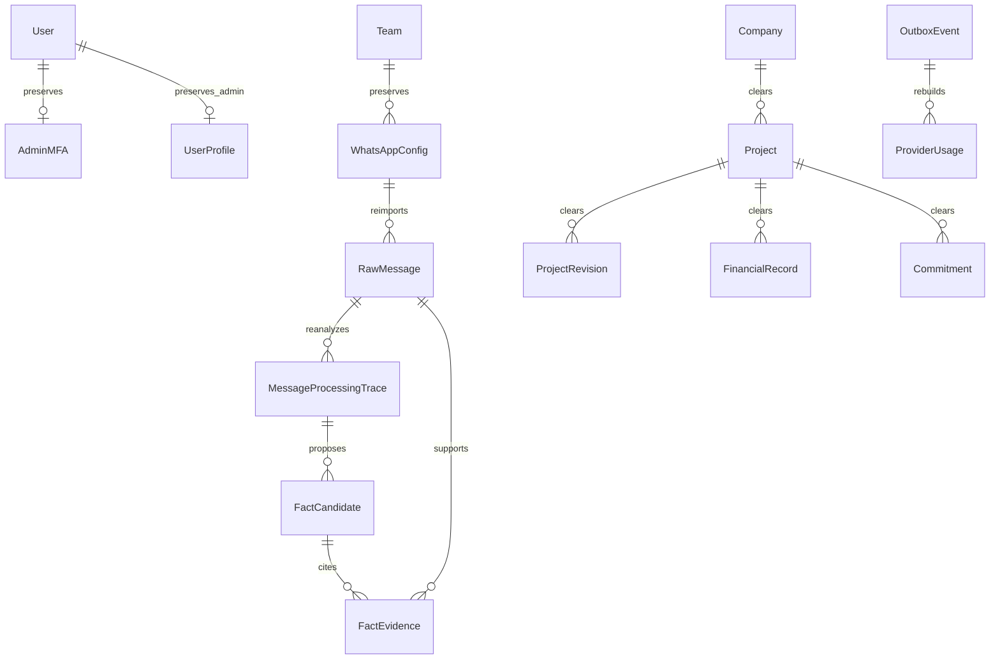

# Повторный сбор и анализ WhatsApp после очистки Mazory

Дата: 2026-09-28 18:00:12 MSK. Задача: `whatsapp-reimport`.
Основание: прямое поручение пользователя очистить данные на удалённом Docker-сервере, сохранить WhatsApp, группу и администратора, повторно собрать и проанализировать историю. Bitrix не изменять.



```mermaid
sequenceDiagram
  actor Admin
  participant Ops as Docker operation
  participant DB as PostgreSQL / Redis / Qdrant
  participant WA as Existing WAHA session
  participant AI as Analysis worker
  Ops->>DB: Stop CRM processing, create recoverable backup
  Ops->>DB: Clear business data and stale jobs, preserve configuration/admin
  Ops->>WA: Read session status and configured group history
  alt Session requires authentication
    WA-->>Admin: QR in existing admin page
    Admin->>WA: Link device
  end
  Ops->>DB: Import all available pages with original IDs, timestamps and source scope
  Ops->>AI: Queue analysis after complete import
  AI->>DB: Save traces, full prior context within 256000 tokens, proposed facts
  Note over Ops,AI: No Bitrix calls; extracted facts retain normal review workflow
```

## Объём операции

Только production-контейнеры `mazory-*` на Docker context `mazory`. Не затрагивать `mazory-staging-*`, другие приложения сервера и внешнюю CRM. Код приложения и схема БД не меняются.

Сохранить пользователя `admin`, пароль/права, MFA и его действующие сессии; существующую WhatsAppConfig, её команду, группу, конфигурацию ИИ, секреты интеграций и volume WAHA. Локальную интеграцию Bitrix отключить на время/по итогам этой операции, чтобы восстановление данных не отправляло изменений наружу. Секреты не выводить в журналы.

Удалить старые сообщения, трассы, факты, проекты, компании, обязательства, финансовые записи, ревизии, бизнес-события, локальные журналы CRM, производные индексы, старые задания и остальных пользователей с профилями. Системные таблицы Django и настройки сохранить. Идентификаторы не переиспользовать.

Перед удалением сохранить закрытый backup PostgreSQL и проверить восстановление в временной БД. Сохранить индекс Qdrant. Очистку PostgreSQL выполнить одной транзакцией с явным перечнем таблиц, без неконтролируемого CASCADE. При ошибке остановиться с исходными данными.

Импортировать сообщения только из настроенной группы, без общего ограничения количества/символов: читать страницы до исчерпания истории WAHA, проверять повторяющиеся страницы и ID, исходные даты и принадлежность группе. Зафиксировать доступный период и число текстовых/нетекстовых сообщений. Не выдавать доступную историю WAHA за полную историю телефона, если её полнота не подтверждена.

Анализ начинать после сохранения всей доступной истории, чтобы более поздние сообщения получали предыдущий контекст. Использовать действующий pipeline и окно 256000 токенов; не отключать проверку цитат, лимиты расходов и процедуру подтверждения фактов. При недоступности WhatsApp или ИИ показать точную причину и состояние продолжения.

## Критерии готовности

- Старые бизнес-данные очищены, backup проверен, admin/MFA/группа/конфигурация сохранены.
- Внешняя CRM не вызывалась; локальная синхронизация заблокирована.
- Доступная история импортирована с верными config/team/chat/session и исходными датами.
- Анализ запущен; итоговые количества, ошибки и предложения фактов проверены.
- Django check и проверка миграций успешны, production smoke через Playwright успешен, журналы проверены.

## Обнаруженное исходное состояние

734 сообщения (732 из группы, 2 без chat_id), 565 проектов, 509 компаний, 100 старых трасс. Сообщения не привязаны к config/team. WAHA уже разлогинен: FAILED, затем после штатного restart — SCAN_QR_CODE. Файлы сессии не удалялись; пользователь уведомлён о необходимой повторной привязке.

## Выполнено и текущее состояние

Очистка PostgreSQL завершена одной транзакцией. Дополнительно удалены 21 обязательство, 4 финансовые записи, 856 бизнес-событий, 126 локальных журналов CRM, 565 ревизий проектов, 11 пользователей кроме `admin`, старые задания и аудит бизнес-данных. Последовательности ID сохранены. Создана новая запись аудита операции.

Контрольные отпечатки подтверждают неизменность admin, MFA, WhatsAppConfig, команды и AISettings во время очистки. Сохранены две действующие административные сессии. BitrixSettings сохранена с `is_active=False`; CRM worker остановлен. Внешний Bitrix не вызывался. Redis очищен только в выделенном контейнере Mazory; коллекция `mazory_messages` с тремя старыми точками удалена после backup. Private media не содержал файлов.

Backup находится на сервере в `/home/a_belianskii/projects/mazory-backups/whatsapp-reset-20260928T150012Z/`: PostgreSQL custom dump, Qdrant snapshot, архив media и копия файлов WAHA. Каталог закрыт, файлы имеют права 0600, SHA-256 записаны в manifest. PostgreSQL dump успешно восстановлен отдельной временной БД; проверены исходные количества и наличие admin/MFA/группы. Временная БД затем удалена.

В WAHA были выключены постоянное хранилище сообщений и полная синхронизация. В существующей сессии включены `noweb.store.enabled=true` и `fullSync=true`; logout/delete не выполнялись. Требуется привязать WhatsApp по QR, поскольку авторизация отсутствовала до начала операции.

Запущен отдельный Docker job `mazory-whatsapp-reimport` с состоянием в volume `mazory_whatsapp_reimport_20260928`. Он ожидает авторизацию до 48 часов на запуск, после подключения ждёт начальную синхронизацию и три стабильных прохода истории. Страницы по 250 сообщений — размер запроса, не общий лимит. Полный набор импортируется транзакционно; только после его фиксации становятся доступны задания анализа. Исходные ID/время/config/team/chat/session сохраняются. Пустые сообщения сохраняются без вызова текстового ИИ. Задание не вызывает Bitrix и не подтверждает факты автоматически.

На момент проверки импорт находится в `waiting_for_whatsapp`, сообщений и трасс после очистки — 0. Анализ ещё не начался: ожидается действие пользователя с QR. AI worker, delivery worker, outbox, backend и nginx работают.

Проверки: Django `check` — ошибок нет; `makemigrations --check --dry-run` — `No changes detected`; production Playwright smoke — 1 passed (5.1 s), вход и readiness API доступны. Изменений кода приложения и схемы БД нет.
