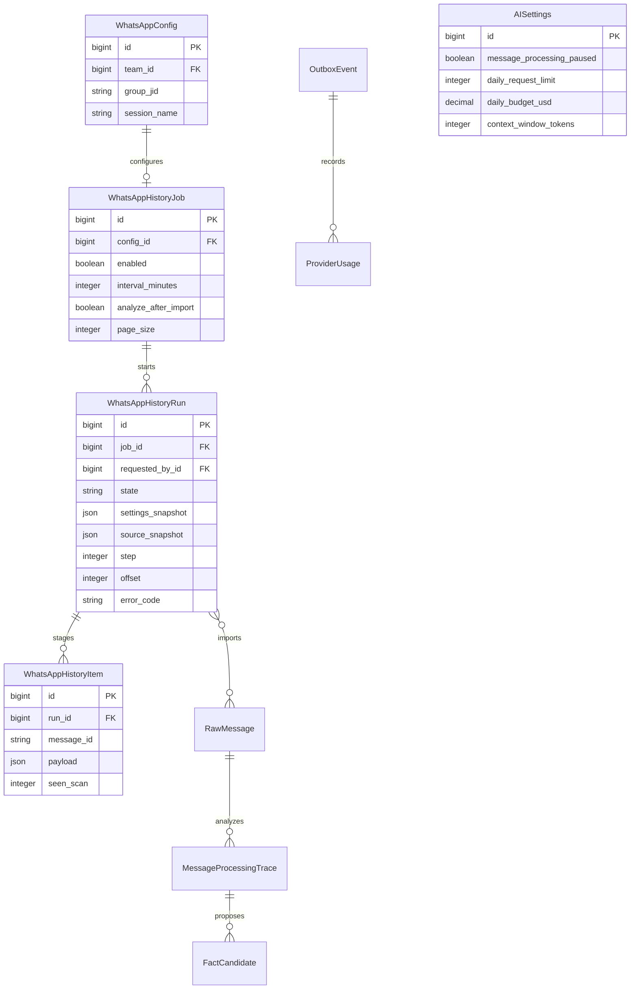
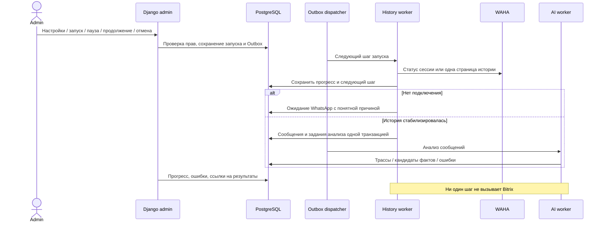

# Управление импортом WhatsApp и анализом в Django admin

Дата: 2026-09-29 03:28:31 MSK. Задача: `admin-background-jobs`.
Основание: пользователь подключил WhatsApp и поручил показать состояние заданий и добавить их настройки в Django admin. Ранее разрешённый импорт истории продолжается; Bitrix не затрагивать.

## Проблема

Одноразовый импорт работал отдельным Docker-процессом и не был виден в админке. После изменения ID группы процесс остановился на технической проверке старого ID, хотя WhatsApp подключён. Требуется штатное, наблюдаемое и возобновляемое задание.

## Требования и реализация

- Настройки импорта привязаны к WhatsAppConfig, а не к захардкоженному ID группы. Каждый запуск фиксирует текущую группу, сессию, команду и параметры. Изменение источника во время работы останавливает запуск с понятной ошибкой; следующий запуск использует новые настройки.
- В админке доступны настройки: включено, период (0 — только вручную), размер страницы, ожидание начальной синхронизации, интервал проверки, число стабильных проходов, анализировать после импорта. Размер страницы не является лимитом всей истории.
- Отдельный список запусков: этап, время, количество полученных/сохранённых/анализируемых сообщений, ошибки и ссылки на источники/трассы. Кнопки запуска, паузы, продолжения и отмены работают через POST с CSRF и правами интеграций. Нет произвольного ввода Python-функций.
- Один незавершённый запуск на настройку. Ожидание подключения и страницы истории выполняются короткими идемпотентными шагами через PostgreSQL Outbox и отдельную очередь history. Прогресс сохраняется при перезапуске worker/Redis.
- История сохраняется целиком до постановки сообщений на анализ. Не ограничивать количество или длину текста; брать все доступные страницы WAHA. Пустая доступная история отображается явно, а не как успешно проанализированные сообщения. Дедупликация сохраняет исходные ID и редакции; повторный запуск не повторяет успешный анализ автоматически.
- Настройки AI дополняются паузой анализа/индексации сообщений и суточными лимитами запросов/расходов (0 — существующая настройка сервера). Пауза не превращает задания в ошибки; уже отправленные запросы завершаются. Окно контекста остаётся 256000 токенов.
- Outbox получает читаемый список с фильтрами типа, состояния, ошибки, попытками и ссылками на источники. В боковом меню есть раздел «Фоновые задания».
- Прежнее отдельное Docker-задание заменяется штатным импортом после внедрения. Его успешно собранные сообщения сохраняются. Авторизация WhatsApp, admin/MFA и настройки не сбрасываются; локальная интеграция Bitrix остаётся выключенной.
- Извлечённые факты по-прежнему требуют обычного подтверждения; эта задача не меняет финансовые записи автоматически.
- Пауза/продолжение/отмена запуска доступны до постановки истории на анализ. После этого анализ и индексация приостанавливаются общим переключателем AI; уже полученные результаты сохраняются. Параметры текущего запуска фиксируются снимком, изменения применяются к следующему запуску.
- При исчерпании суточного бюджета AI задания остаются ожидающими до следующих суток UTC, без расходования попыток. Изменение лимита через админку повторно активирует ожидающие задания. Это ограничение расхода API, не объёма исторического контекста.
- Пагинация продолжается до пустой страницы; короткая страница не означает конец истории. Смещение увеличивается на фактически возвращённое число записей. Повтор одной страницы считается ошибкой источника. Ссылки на очередь запуска включают его импорт, анализ и индексацию.

## Проверки

Playwright через реальный UI/API/worker: сохранение настроек, подключение после ожидания, несколько страниц с длинным текстом, прогресс и полный контекст, повтор без дублей, пауза/продолжение/отмена, изменение источника, отказ WAHA, периодический запуск, CSRF/права, глобальная пауза анализа. Также полный E2E, Django check, миграции, frontend build, журналы worker и production smoke.

## Исходное состояние

Production image `8cfa4ed`; WhatsApp WORKING; группа в конфигурации изменилась. Старый импорт остановлен; сообщений/трасс/кандидатов — 0. Временный импорт перенаправлен на текущую настроенную группу до внедрения штатных заданий. BitrixSettings.is_active=False.

## Уточнение источника и границы

В WAHA текущий JID `120363411317250692@g.us` относится к группе «Test mazory» с одним участником; доступная история пуста. Отображаемое имя WhatsAppConfig по-прежнему «КОМАНДА ПОДДЕРЖКИ ПРОДАЖ». Пользователю задан вопрос о выборе группы; автоматической подмены JID нет. Старый одноразовый контейнер остановлен. Штатная настройка создаётся с ручным запуском (период 0), без сброса данных/сессии. Доступная история WAHA может отличаться от всей истории на телефоне; состояние «WAHA не вернул сообщений» не выдаётся за завершённый анализ.

## Выполненная реализация

Добавлены модели WhatsAppHistoryJob/Run/Item и миграция 0021; очередь `history` отделена от AI. Шаги хранятся в Outbox с дедупликацией, снимком источника, блокировками и единственным активным запуском на настройку. Импорт сохраняет сообщения и постановку на анализ одной транзакцией. Контроль доступа, CSRF и аудит применяются ко всем управляющим действиям.

Админка содержит настройки, историю запусков, живой прогресс, ссылки на сообщения/трассы/очередь, общий переключатель обработки сообщений и суточные бюджеты AI. В тестовом провайдере предусмотрены многостраничная история, короткие страницы, пустой ответ, повтор страницы и HTTP-ошибки. Добавлены пять Playwright-сценариев; фоновый импорт включён в E2E Compose и CI.

## Результаты проверки перед PR

- Полный Playwright: **49 passed**, Chromium и WebKit, реальный Django/PostgreSQL/Redis/Q2/Qdrant и изолированный HTTP-провайдер.
- Повтор пяти сценариев заданий после проверки связанной очереди и отключения задания с неактивным источником: **5 passed**. В первом сценарии сохраняются все 26 сообщений, в том числе текст 18 000 символов; в контексте последнего сообщения 24 предыдущих непустых сообщения. WAHA отдаёт по 3 записи при запрошенной странице 7 — пропусков нет. Повторный импорт не создаёт сообщения/трассы заново.
- Django `check`: 0 issues. Миграция 0021 применяется, `makemigrations --check`: `No changes detected`.
- TypeScript/Vite production build проходит. `git diff --check` чист. Новые модули history_jobs/job_admin проходят Ruff.
- Журналы history/AI проверены; ошибки history_source_changed, history_waha_http_403, history_repeated_page соответствуют намеренным E2E-сценариям. Интерфейс просмотрен в браузере, действия размещены отдельной панелью над формой.
- Развёртывание выполняется после CI и merge: резервная копия PostgreSQL/Compose, добавочная миграция, обновление только Docker backend/worker/Outbox, запуск отдельного history worker, проверка readiness и сохранности admin/MFA/конфигурации. CRM worker остаётся остановлен. Импорт рабочей истории зависит от уточнения выбранной группы.
