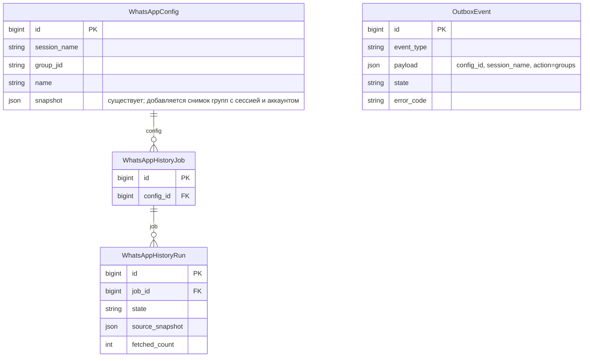
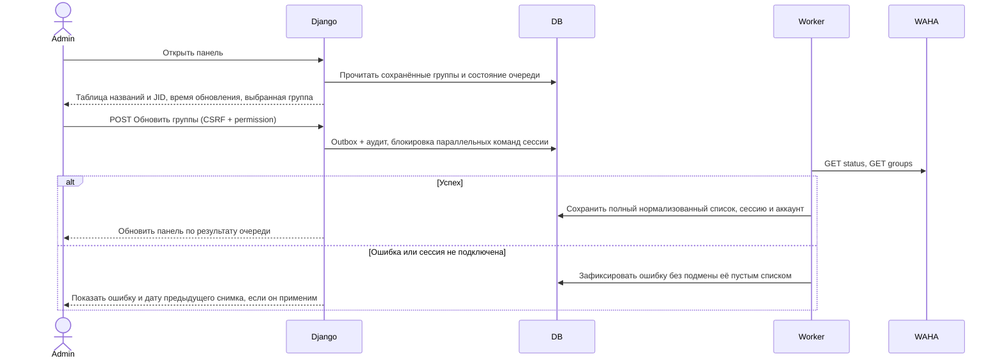

# Восстановление списка групп WAHA и пояснение пустого импорта

Задача: `waha-group-history`. Ветка: `bugfix/waha-group-history`.
Запрос пользователя: выяснить причину пустого запуска № 1 и вернуть названия групп с ID в Django WAHA dashboard.

## Проверенные факты

- Запуск № 1: три успешных пустых чтения, `state=empty`, ошибок очереди нет.
- Название выбранной группы по данным WAHA отличается от локального названия конфигурации.
- Через действующий worker выполнены GET с исходными параметрами и без timestamp-фильтра: оба вернули `[]`. Статус WORKING, NOWEB store.enabled/fullSync включены.
- API groups установленной WAHA возвращает словарь по JID. В аккаунте четыре группы, две с одинаковым названием. Нельзя выбирать источник только по названию.
- Старый блок групп удалён при переходе панели на асинхронное управление.

## Требования и изменения

1. Постоянный блок «Группы WhatsApp»: название, полный JID, копирование, метка выбранной группы, число групп и время снимка. Кнопка обновления через существующий Outbox/worker; GET страницы не обращается к провайдеру.
2. Поддержать словарь NOWEB и массив групп. Для пагинируемых ответов читать до конца, без лимита общего количества; повтор страницы не превращать в успешный неполный результат. Проверить поведение реально установленной версии.
3. Сохранять только названия и JID, без участников. Использовать существующий JSON snapshot, без миграции. Снимок привязан к сессии и аккаунту; не показывать данные другого аккаунта после перепривязки.
4. Различать «ещё не загружено», «групп нет», «ошибка», «последний сохранённый список». Не затирать успешный снимок при сбое. Экранировать имена, копировать через безопасный DOM API.
5. В карточке пустого запуска объяснить: отсутствие данных в хранилище WAHA не доказывает отсутствие истории на телефоне; показать фактическую группу/JID, ссылку на панель и настройки. Три прохода — проверка стабильности, не лимит сообщений. Обновлять пояснение при завершении без перезагрузки страницы.
6. Не менять выбранную группу автоматически. Не сбрасывать авторизацию, данные, MFA, настройки контекста. Развёртывание только Docker Mazory; Bitrix и остановленный CRM worker не затрагивать.

## Критерии готовности

- Playwright на реальном Django, очередях и тестовом провайдере: массив/словарь, несколько страниц, повторная страница, ошибка с сохранением снимка, пустой список, копирование, выбранная группа, изоляция сессий/аккаунтов, права и CSRF, пояснение пустой истории.
- Полный E2E, build/typecheck, Django check, makemigrations --check; просмотр логов очередей.
- PR в main, проверка diff/CI, merge и Docker deployment с резервной копией и проверкой сохранности защищённых данных.
- В production панель показывает реальный список групп; причина пустого запуска описана по фактическим ответам, без утверждения о полной истории телефона.

## Дополнительная диагностика

Пагинация NOWEB подтверждена: запрос `limit=1&offset=1` вернул одну следующую группу. В выбранной группе WAHA сообщает одного участника. Из четырёх групп доступные сообщения обнаружены в одной другой группе, для трёх остальных чтение вернуло пустой массив. Это свидетельствует о различии источников, а не об общем отказе API истории; наличие истории на телефоне не проверено. Смена источника остаётся выбором пользователя.
