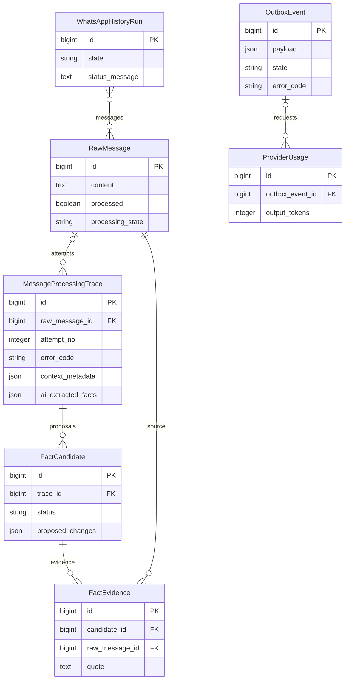

# Исправление ошибок анализа истории и результата трассировки

Задача: `history-analysis-errors`. Создано: 2026-09-29 10:36:11 MSK.
Ветка: `bugfix/history-analysis-errors`. Продолжение согласованной обработки полной истории.



Показана существующая схема; FK ProviderUsage.outbox_event допускает NULL.
OutboxEvent.payload содержит идентификаторы сообщения/попытки, это не FK.
Изменения схемы БД не планируются.

```mermaid
sequenceDiagram
    participant A as Django admin
    participant Q as Outbox / Q2
    participant P as Extraction pipeline
    participant AI as AI provider
    participant DB as PostgreSQL
    A->>Q: Анализ сообщения / новая попытка
    Q->>P: Полная история в бюджете 256000 токенов
    P->>DB: Неизменяемый снимок запроса
    P->>AI: История как справка, целевое сообщение в конце
    AI-->>P: Ответ и расход токенов
    alt Валидный JSON и точная цитата целевого сообщения
        P->>DB: Предложения фактов для ручной проверки
    else Обрезанный ответ / схема / чужая цитата
        P->>DB: Код, безопасная диагностика; никаких новых фактов
        P-->>Q: Завершённая ошибочная попытка без бессмысленных повторов
    end
    DB-->>A: Один статус, причина ошибки или фактический результат
```

## Проблема

Импорт второго запуска получил 485 сообщений. На момент диагностики анализ
дал 46 обрезанных ответов, 33 отказа из-за цитаты вне целевого сообщения,
16 ошибок схемы полей и 14 ошибок JSON/массива фактов. Это ошибки этапа AI,
а не получения истории из WAHA. Вход трассы №242 — 64953 токена — помещается
в настроенное окно. Лимит генерации ответа составляет 8192 токена.
Сам ответ при ошибке ранее не сохранялся, поэтому точные ошибки полей неизвестны.
Повтор диагностического запроса завершился таймаутом внешнего провайдера.
Последующие диагностические запросы подтвердили: провайдер также возвращает
перегрузку 503 внутри HTTP 200 (ранее ошибочно классифицировалась как ошибка JSON),
а неизвестные contract_amount, cost_amount и next_action возвращает как null.
Для одного сообщения с прежней чужой цитатой уточнённый запрос вернул facts: [].

Список повторяет статус «Ошибка» в двух бейджах; итоговая карточка экранирует
собственные HTML-фрагменты и показывает шаблон успеха при неудачном анализе.

## Требования и изменения

- Сохранить полную историю в пределах 256000 токенов с резервом ответа и служебным
  запасом. Не вводить лимиты количества сообщений/символов, не менять провайдера.
- Однозначно ограничить извлечение целевым сообщением: история нужна для понимания
  ссылок, не для повторного извлечения старых фактов. Поместить целевой текст после
  истории. Старые снимки запросов должны восстанавливаться с прежним хешем.
- Принимать JSON в единственном стандартном блоке ```json, но не произвольный текст
  вокруг JSON. Необязательное null трактовать как отсутствие поля; обязательные
  поля, суммы, enum, точную цитату и факт отсутствия обрезания продолжать проверять.
- Сохранять причину, finish_reason, объём ответа и ошибки полей; не сохранять
  chain-of-thought. Ошибочный ответ не должен создавать или подтверждать факты.
- Семантически ошибочный ответ завершает попытку; явный повтор создаёт новую
  попытку. Сетевые временные ошибки сохраняют существующий механизм повторов.
  Ошибки провайдера внутри HTTP 200 распознаются отдельно и учитываются как
  неуспешные обращения; перегрузка получает отложенный повтор.
- Показывать один статус ошибки, понятную причину и диагностику. Итог для новых
  фактов отражает предложения для проверки, при ошибке — отсутствие нового результата.
  Исправить HTML без отключения экранирования сообщений, названий и ответа AI.
- Показывать сводку причин ошибок анализа на странице запуска импорта.
- После проверки и Docker-деплоя повторить только неуспешные сообщения новыми
  попытками; сохранить исходные трассы, успешные результаты, авторизации, группу,
  администратора. Возобновить временно приостановленный анализ. Bitrix не затрагивать.

## Проверка и критерии готовности

Playwright E2E на реальных Django/Q2 с тестовым HTTP-провайдером: корректный ответ
с историей, JSON с fence/необязательными null, ошибка обязательного поля, цитата
из истории, обрезанный ответ, сохранение диагностики, отсутствие автоповторов
семантических отказов, безопасный рендер карточки и один бейдж ошибки.
Существующие E2E полного контекста, повторов и истории остаются зелёными.
Django check, makemigrations --check, frontend build/typecheck, полный E2E,
проверка логов воркеров. PR в main, CI, review, merge, Docker-деплой и проверка
новых реальных попыток. Фактические результаты проверки дополняются здесь.

## Подтверждённые результаты диагностики

- Запрос с полной сохранённой историей проблемной трассы №242 и новой инструкцией
  завершился `finish_reason=stop`: 65151 входной токен, 7 выходных, facts: [].
  История не сокращалась, reasoning_tokens=0. Исходная трасса не перезаписывалась.
- Реальный ответ для сообщения с ошибкой схемы прошёл проверку после исключения
  null в необязательных полях; точная цитата также прошла исходную проверку.
- Бюджет генерации остаётся 8192; окно 256000; авторизации и источник не меняются.
- Прогон отложенного повтора выявил нестабильность порядка вложенных JSON-ключей
  после PostgreSQL JSONB. Канонизация вложенных значений исправлена; последующий
  сквозной сценарий перегрузки и повторного запроса прошёл.
- Полный локальный E2E: 57/58. В оставшемся WebKit-сценарии обнаружена гонка
  тестового входа: glob `**/admin/` совпадал с `login/?next=/admin/`, следующая
  навигация отменяла POST входа. Helper теперь ждёт точный pathname `/admin/`.
  Это изменение тестового ожидания, без изменений авторизации приложения.
- После исправления ожидания все четыре WebKit-сценария прошли (4/4).
  Django check — без ошибок, makemigrations --check — No changes detected,
  frontend build/typecheck — успешно. Логи Q2 и тестового провайдера проверены:
  ожидаемые отказы из E2E, успешный повтор после перегрузки, без новых падений.

## Уточнение после проверки на сервере

PR #14 прошёл CI (58/58 E2E) и развёрнут как `fb58ae4`. Все три реальные
контрольные попытки успешны; для источника №242 создана успешная трасса №249.
112 неуспешных сообщений получили новые задания, очередь возобновлена.

При дальнейшем анализе обнаружен ложный отказ цитаты: модель заменила переносы
и несколько пробелов одним пробелом. Диагностический повтор подтвердил, что
буквы и знаки цитаты совпадают с целевым сообщением; отличия только в whitespace.
Продолжение той же задачи в `bugfix/history-evidence-whitespace`:

- Сначала сохраняется строгая проверка точного совпадения. Если она не прошла,
  разрешено единственное совпадение после сжатия последовательностей whitespace.
- В результат и FactEvidence сохраняется восстановленный точный фрагмент исходного
  сообщения с его переносами, а не изменённый текст модели. В диагностике отмечаются
  индексы восстановленных цитат. История не участвует в поиске совпадения.
- Изменённые слова, цифры, пунктуация, регистр, а также неоднозначные совпадения
  продолжают отклоняться. Никаких приблизительных семантических совпадений.
- E2E проверяет восстановление Unicode-пробелов и переносов внутри сообщения,
  сохранение буквального исходного фрагмента и отказ при неоднозначности/изменении
  цифр. Затем обязательные Django/build/E2E, CI и обновление Docker с сохранением
  истории попыток. Повторить только оставшиеся неуспешные сообщения.

Проверки дополнения: полный локальный Playwright — 61/61 (10.1 мин), включая
восстановление исходной цитаты и отказ при подмене цифр/неоднозначности.
Django check, makemigrations --check (No changes detected), frontend build/typecheck,
проверка логов Q2 и тестового провайдера — успешно.

Дополнительно сохраняется карточка уже связанных записей для исторических
трасс со статусом «Требует внимания»: этот статус не обязательно означает
незавершённую обработку. Браузерный сценарий проверяет ссылку на связанную сделку.
После этой правки все пять проверок карточек/списков Chromium и WebKit прошли;
повторные Django check и makemigrations --check также успешны.
