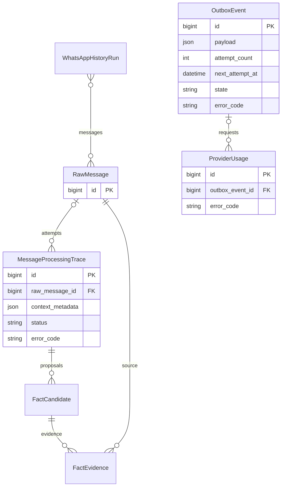
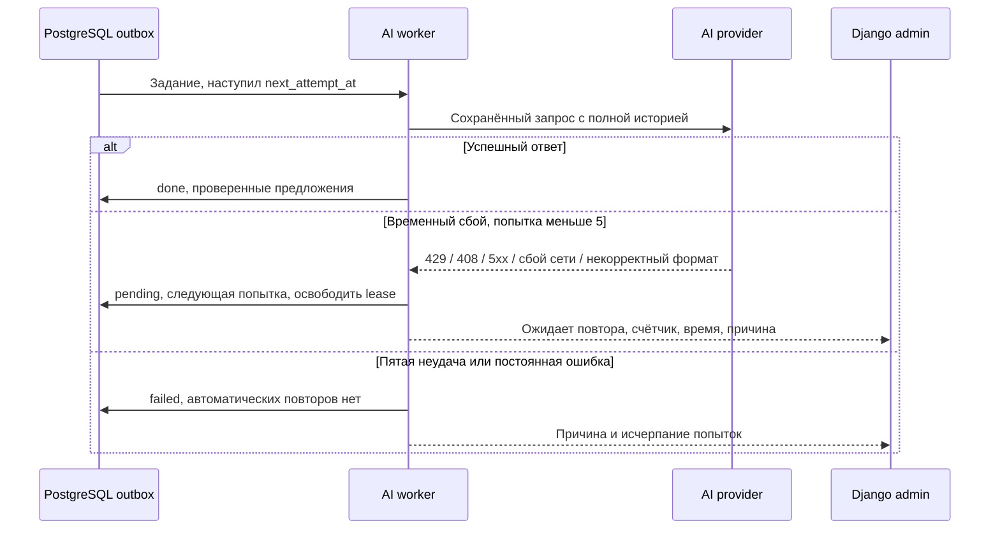

# Повтор временных ошибок AI до пяти попыток

Задача: `ai-provider-retries`. Основание: пользователь просит автоматически повторять задания после 429 и других ошибок AI с задержкой, до пяти попыток. Реализация и установка в существующий Docker-контур разрешены текущим запросом и предыдущим контекстом.

Связь OutboxEvent с сообщением/трассировкой логическая, через payload/operation_key, не FK. Схема БД не меняется. Существующие модели и кратности проверены по models.py.

## Текущее поведение

Outbox делает максимум три попытки; HTTP 429/5xx схлопываются в provider_request_failed. Retry-After теряется. Ошибки JSON/схемы завершаются после первого запроса. Ошибка из AIService повторно оборачивается pipeline без диагностики. В карточке промежуточный сбой выглядит окончательной ошибкой.

## Требования и изменения

- Пять попыток **всего**: исходная и до четырёх повторов для фоновых AI-задач извлечения и индексации сообщений. Другие очереди и интерактивный чат сохраняют прежнюю политику: интерактивные операции имеют отдельный срок жизни и обработку ошибок.
- Паузы по умолчанию 60, 120, 240, 480 секунд с небольшим случайным разбросом. Валидный Retry-After (секунды или HTTP-дата) задаёт минимальное время ожидания. Ожидание хранится в БД, воркер не спит.
- Различать HTTP 429, 408, 5xx, таймаут, сбой соединения, а также error внутри HTTP 200. HTTP 401/403, нехватка средств 402 и неверный запрос — окончательные отказы. Временный 402 с документированным limit_source=openrouter_in_flight_budget и Retry-After допускает повтор.
- Повторять некорректный JSON/схему ответа модели; не повторять неподтверждённые цитаты, противоречивые оплаты, обрезанный ответ, превышение контекста, ошибки конфигурации и доступа. Не ослаблять проверку фактов.
- Сохранить информацию о Retry-After сквозь pipeline и безопасную диагностику. Не сохранять секреты или сырые заголовки.
- Для извлечения сохранять один и тот же снимок входа при автоматических повторах, не создавать дубликаты фактов. В админке показывать ожидание, номер попытки и плановое время. После пятой неудачи — явное завершение с ошибкой.
- Пауза анализа, суточный бюджет и права доступа имеют приоритет. Ожидание бюджета не расходует попытку. Планировщик и повторная доставка очередью не должны выполнять запрос раньше next_attempt_at.
- Контекст 256000 токенов, WhatsApp-сессии/группы, администратор и Bitrix не меняются. Не удалять сообщения/прошлые трассировки.

## Проверка и установка

Поведение Retry-After и временного 402 сверено с [документацией OpenRouter](https://openrouter.ai/docs/api/reference/errors-and-debugging). Таймаут полного CI увеличен до 30 минут из-за новых сквозных сценариев повторов. Локальный Docker-хост 192.168.0.193 недоступен; изолированный тестовый проект `mazory-retries-e2e` использует собственные PostgreSQL/Redis, фиктивного провайдера, тестовые секреты и порты loopback 18180/18190 через SSH-туннель. Рабочие БД, volumes и сети не подключаются.

Playwright E2E на реальном Django/Q2 и изолированном провайдере: 429 с Retry-After и последующим успехом; HTTP-дата; 503 в HTTP 200; пятая неудача без шестой; некорректный JSON с повтором; 401 без повтора; сохранность контекста и отсутствие дубликатов; прежние семантические отказы. Для проверки нескольких длинных задержек допускается перевод next_attempt_at тестового события в прошлое только в изолированной E2E-БД, после проверки реально записанной задержки. Django check, makemigrations --check, frontend build, worker logs; полный браузерный прогон. PR в main, CI/review, merge. Docker-деплой с резервной копией и проверкой сохранности защищённых данных; возобновить очередь. Существующие неуспешные задания с новой повторяемой ошибкой при необходимости восстановить отдельной контролируемой операцией, сохранив счётчик и не превысив пяти попыток.
