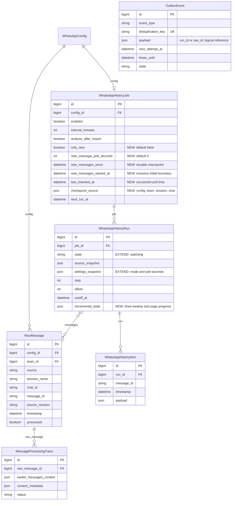
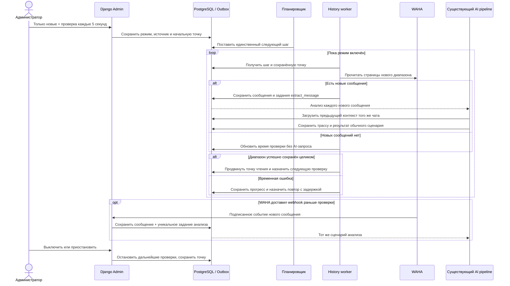

# Постоянный приём новых сообщений WhatsApp

- Задача: `whatsapp-new-messages`.
- Ветка: `feature/whatsapp-new-messages`.
- Дата: 2026-09-29 15:33:45 MSK.
- База: `main`, `40a2dca`, синхронизирована через `git pull origin main`.
- Статус: пользователь согласовал реализацию («делай»); работа выполняется.

Сущности и связи существуют, кроме полей с отметкой NEW. OutboxEvent ссылается на запуск или сообщение через JSON, а не внешний ключ. Уникальность RawMessage уже задана по `(source, session_name, message_id, source_revision)`; создавать вторую систему дедупликации не требуется.

## Постановка

На странице настройки импорта WhatsApp добавить «Только новые». Режим должен непрерывно проверять чат с коротким настраиваемым интервалом. Новое сообщение становится целью существующего анализа: предыдущая переписка этого же источника используется для определения связей, после чего выполняется действующий сценарий извлечения и обработки результатов.

Сейчас ручной и периодический запуск создают одинаковый полный импорт с offset=0, ожиданием синхронизации и несколькими стабильными проходами. Следующая периодическая операция зависит от завершения импорта и анализа. Для постоянного приёма это поведение не подходит.

## Поведение для пользователя

1. В настройках появляется флажок **«Только новые»**, по умолчанию выключенный, и поле **«Интервал проверки новых сообщений, секунды»**, по умолчанию 5, допустимые значения 5–3600.
2. При включённом задании сохранение режима включает постоянный мониторинг без конечного срока. Поле «Период запуска, минуты» относится только к полному импорту; в новом режиме интерфейс явно показывает, что используется интервал в секундах. Значение 0 в поле минут не выключает мониторинг «Только новые».
3. «Запустить сейчас» в этом режиме выполняет ближайшую проверку немедленно или возобновляет мониторинг. Кнопка не создаёт второй параллельный поток и не обнуляет точку чтения.
4. Предлагаемая начальная точка: последнее сохранённое сообщение данного config/team/session/chat; если сообщений нет — момент включения режима. Сообщения после этой точки, накопившиеся до первой проверки, подбираются. Вариант согласован пользователем при подтверждении спецификации.
5. После первой успешной проверки используется собственная сохранённая точка диапазона. При перезапуске приложения, воркера, паузе или повторном включении она не теряется. Более позднее сообщение, доставленное webhook, не передвигает эту точку и не скрывает пропущенные сообщения между проверками.
6. Отсутствие новых сообщений — нормальное состояние «Ожидаем новые сообщения». Мониторинг остаётся активен. Не создавать отдельный завершённый запуск каждые 5 секунд и не отправлять пустые запросы к AI.
7. В карточке показать режим, состояние мониторинга, последнее успешное чтение, следующую проверку, число новых сообщений и ошибки. Пауза/выключение прекращают новые проверки; уже сохранённые сообщения и точка чтения сохраняются. Пауза анализа задаётся существующими настройками AI.
8. Переключать режим или источник во время активного запуска можно только после его явной остановки. Серверная валидация объясняет необходимое действие. Новый источник не наследует старую точку чтения.

## Получение сообщений и устойчивость

- Использовать существующие PostgreSQL Outbox и history worker. HTTP-обработчики сохраняют настройки/события, внешние запросы выполняются через `tasks.py`. Каждый шаг ограничен работой с одной страницей или переходом состояния; не занимать воркер бесконечным циклом или sleep.
- Читать новый диапазон с `filter.timestamp.gte`, страницами по существующему `page_size`, с проверкой chat/session/source и временных границ на стороне приложения. WAHA документирует фильтр gte: https://waha.devlike.pro/docs/how-to/chats/ . Совместимость сортировки и пагинации проверить на используемой версии WAHA.
- Фиксировать верхнюю границу диапазона на начало цикла; не полагаться исключительно на совместное применение gte/lte сервером. Обрабатывать сообщения в хронологическом порядке. Полный проход истории и ожидание трёх одинаковых проходов не выполняются на каждом тике.
- Сохранять прогресс страниц отдельно от подтверждённой точки диапазона. Продвигать последнюю только после успешного сохранения всех подходящих сообщений и их заданий анализа. При сбое повтор безопасен благодаря существующим уникальным ключам.
- Повторно читать включительно граничную секунду и небольшое перекрытие в 60 секунд, ограниченное начальной точкой режима. Это покрывает одинаковые timestamps, обычные задержки синхронизации и короткие гонки; одинаковое сообщение не создаёт новый анализ.
- Произвольно поздняя доставка старого сообщения за пределами перекрытия не гарантируется polling; её подбирает доставленный webhook или отдельный полный импорт. Режим не обещает поиск всех исторических правок без чтения истории.
- Ошибки связи, STOPPED/SCAN_QR_CODE и перезапуск воркера не завершают мониторинг навсегда. Повторы с ограниченным увеличением задержки до 60 секунд; после восстановления вернуться к настроенному интервалу. Ошибки источника или настроек показывать явно и приостанавливать запросы до исправления.
- На один источник/задание одновременно действует только один цикл. Блокировки, step/generation и leases защищают от повторной доставки очереди, параллельного scheduler и результата запроса, завершившегося после паузы.
- Для пустых проверок обновлять состояние существующего запуска; не создавать новые WhatsAppHistoryRun и MessageProcessingTrace. Использовать действующую политику очереди для завершённых OutboxEvent.

## Триггер и связанные сообщения

- Существующий подписанный webhook уже сохраняет сообщение и создаёт `extract:{raw.id}`. Сохранить его как быстрый путь; polling подбирает сообщения, которых не было в webhook, через ту же уникальность RawMessage и OutboxEvent.
- Согласовать `analyze_after_import` для новых сообщений, полученных обоими путями в режиме «Только новые». Если анализ включён, новое текстовое сообщение ставится на анализ сразу после сохранения страницы, без ожидания следующего тика или окончания предыдущего AI-запроса. Если выключен, сообщения только сохраняются.
- Анализ использует `pipeline.extract_message` и `message_context.build_context`: предшествующие сообщения того же источника, актуальные версии, текущий бюджет токенов, существующие правила трактовки целевого сообщения, проверки доказательств и последующей обработки.
- Под «зависимыми сообщениями» здесь понимается тот же механизм контекста, что уже используется в проекте. Он читает сохранённую предыдущую переписку; отдельный рекурсивный поиск или массовая повторная обработка старых сообщений в задачу не входят.
- Если историю раньше не импортировали, более ранних сообщений может не быть в локальном контексте. Для такого контекста доступен существующий полный импорт; новый режим автоматически не запускает загрузку всей старой переписки.
- Уже обработанные сообщения не анализировать заново из-за повторной проверки. Новая версия текста, поступившая в проверяемом диапазоне или через webhook, использует существующую обработку ревизий. Нетекстовые сообщения не вызывают текстовый AI.
- Наличие незавершённого AI-анализа, паузы AI или исчерпанного бюджета не блокирует приём следующих сообщений; задания остаются в существующей очереди.

## Планируемые изменения

- `models.py` и миграция: настройки режима, постоянная точка чтения с привязкой к источнику, прогресс диапазона и состояние ожидания. Старые задания сохраняют режим полного импорта.
- `history_jobs.py`: отдельная ветка постоянного приёма, фиксация диапазона, страниц и контрольной точки, повторы и управление жизненным циклом.
- `tasks.py`, `run_outbox.py`: маршрутизация и планирование коротких шагов без зависимости от завершения AI.
- `views.py`: согласование webhook с настройками анализа нового режима и единая дедупликация; сохранение существующей проверки подписи и прав источника.
- `job_admin.py`, шаблоны и `history_run.js`: переключатель, валидация, объяснение интервалов, статус ожидания и управляющие кнопки.
- `api/testing/provider.py` и Playwright E2E: изменение сообщений во время работающего мониторинга, фиксация запрошенных диапазонов, ошибки/восстановление и webhook.

## Проверки и критерии готовности

1. Через реальный Django Admin включить «Только новые», убедиться в интервале 5 секунд, автоматическом старте и серверной проверке значений. Старое задание после миграции остаётся полным импортом.
2. При исходной сохранённой истории получить новые сообщения; проверяемый диапазон ограничен точкой чтения, старые сообщения не перечитываются целиком и не создают новых трасс анализа.
3. С пустой локальной историей старые сообщения до момента включения не импортируются; новое сообщение после включения запускает обычный сценарий.
4. Несколько пустых проверок не завершают мониторинг. После них добавить сообщение в WAHA fixture без перезагрузки UI: оно появляется и обрабатывается.
5. Проверить несколько страниц, неполную страницу, несколько ID в одну секунду и сообщение в перекрытии. Все новые сообщения сохранены ровно один раз.
6. Доставить одно сообщение через webhook и polling в обоих порядках: одна RawMessage на версию и один обычный анализ. При отключённом анализе оба пути сохраняют без AI.
7. Предыдущее связанное сообщение того же чата присутствует в контексте новой трассы; сообщения другой команды/сессии/чата не попадают туда. Действующие проверки исходного текста и бюджета контекста сохранены.
8. Пока AI приостановлен или обрабатывает предыдущее сообщение, новые сообщения продолжают сохраняться. После снятия паузы отложенный анализ выполняется.
9. Ошибка WAHA между страницами, временная потеря соединения, перезапуск воркера и повторная доставка шага не теряют прогресс и не создают дублей. Восстановление продолжает работу автоматически.
10. Пауза/выключение останавливают дальнейшие запросы; незавершённый ответ WAHA не меняет данные после остановки. Возобновление использует сохранённую точку. Изменение источника/режима при активном запуске отклоняется.
11. Регрессия: ручной полный импорт, периодический полный импорт, pause/resume/cancel, права/CSRF, лимиты AI и отображение ошибок.
12. Обязательные проверки проекта: Django `check`, `makemigrations --check`, frontend build/typecheck, Playwright E2E на `http://localhost:5173`, проверка логов backend/outbox/history/AI workers. Изолированные unit/backend тесты не добавлять.
13. После реализации и успешных проверок создать PR в `main`; описание отражает конечное поведение и выполненные проверки. Публикацию на production не считать выполненной без отдельной проверки развёрнутой версии.

## Реализация и проверка

Спецификация согласована пользователем («делай»). Реализованы настройки режима и миграция, постоянный запуск с состоянием watching, ограниченные временные диапазоны и страницы, контрольная точка с привязкой к источнику, защита от повторной доставки и продолжение после временных ошибок. Кнопка отмены выключает постоянное задание, чтобы планировщик не запустил его заново. Пауза сохраняет прогресс; повторное включение задания возобновляет его.

Webhook и polling используют одну уникальность сообщения/ревизии и один ключ задания анализа. Флажок анализа применяется обоими путями; данные продолжают поступать при паузе AI. Полный импорт остаётся режимом по умолчанию. Изменения источника и режима активного мониторинга отклоняются сервером. Ошибка WAHA 422 в новом режиме считается временной; ошибки доступа, источника и неподдерживаемого диапазона приостанавливают мониторинг.

Django `check`, `makemigrations --check --dry-run`, frontend typecheck/build и проверка diff выполнены успешно. Подготовлены пять Playwright E2E-сценариев с реальными HTTP-запросами, PostgreSQL, очередями и подменяемым внешним провайдером: контекст и приём при паузе AI, webhook/polling в обоих порядках, ревизии и выключенный анализ, пустой источник и управление, длительная ошибка провайдера, а также пауза при ответе в полёте и перезапуск history worker с восстановлением lease. Последние два случая объединены в одном сценарии.

Локальный Docker отсутствует, настроенный удалённый Docker недоступен по SSH. Сквозные проверки выполняются в изолированном GitHub Actions окружении PR #17; итоговый статус сообщается в PR. Настройки production и работающие сессии WhatsApp при разработке не изменялись.
