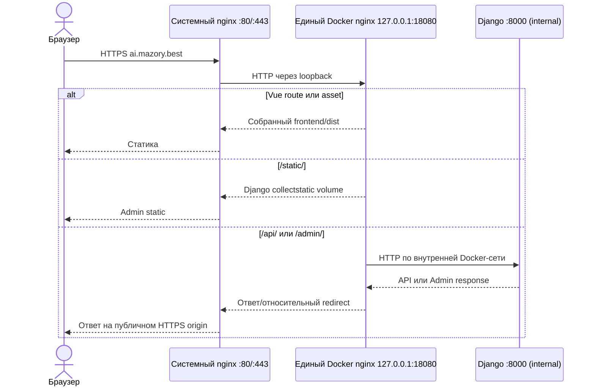

# Единый Docker nginx для Mazory

- Задача: `single-docker-nginx`.
- Ветка: `refactor/single-docker-nginx`.
- Дата создания: 2026-09-30 05:35:37 MSK.
- База: `main`, `18a4918`, синхронизирована через `git pull origin main`.
- Статус: реализация и pre-release проверки завершены; системный nginx не изменяется; объединяются два nginx внутри Docker-контура Mazory.

## Постановка

Внутри Docker-контура Mazory сейчас последовательно работают два nginx:

1. промежуточный `mazory-nginx` принимает трафик системного nginx на `127.0.0.1:18080` и пересылает его в `frontend:8080`;
2. nginx внутри контейнера `frontend` раздаёт Vue и проксирует `/api/` и `/admin/` в Django.

Перед ними находится общий системный nginx сервера, который также обслуживает `candy.mazory.best` и `cradar.mazory.best`. По уточнению пользователя системный nginx и его конфигурация не входят в задачу и остаются без изменений.

Два Docker nginx избыточны. Внутренний frontend nginx создаёт некорректный redirect: `/admin` без завершающего слеша получает `Location: http://ai.mazory.best:8080/admin/`; HSTS направляет браузер на недоступный `https://ai.mazory.best:8080`. Аналогичное поведение есть у `/api`.

Нужно собрать Vue на build stage и поместить `dist` в образ единственного Docker nginx. Этот контейнер сохраняет существующий loopback upstream `127.0.0.1:18080` для системного nginx, раздаёт Vue/Django static и напрямую проксирует динамические маршруты в `backend:8000`. Отдельный runtime-контейнер `frontend` удаляется.

## Целевая архитектура

- Системный nginx: без изменений, публичные `80/443`, TLS и Certbot остаются на host.
- Один Docker-сервис `nginx`: host binding `127.0.0.1:18080`, container port `80`.
- Multi-stage image: Node.js/Vite используется только для `npm ci && npm run build`; runtime содержит nginx и готовый `frontend/dist`.
- `/` и Vue routes обслуживаются через `try_files` из встроенного `dist`.
- `/static/` читается из общего read-only volume, заполняемого Django `collectstatic`.
- `/api/` и `/admin/` проксируются напрямую в `backend:8000`.
- `/media/` и `/private-media/` остаются недоступны.
- `backend`, очереди, PostgreSQL, Redis, Qdrant и WAHA остаются во внутренней Docker-сети.
- Vite остаётся инструментом разработки, но не production-сервисом.

## Требования

- В Docker-контурах production должен работать ровно один nginx-контейнер Mazory.
- Системный nginx, его vhosts, сертификаты, Certbot и соседние проекты не изменяются.
- Удалить runtime-сервис `frontend` и промежуточный proxy hop между Docker nginx и frontend nginx.
- Production не должен публиковать или слушать `5173`, `8080` и `8443`; единственная host-публикация проекта — `127.0.0.1:18080:80`.
- `/admin` и `/api` без завершающего слеша должны возвращать относительные redirects на `/admin/` и `/api/`, не раскрывая внутренние hostnames, схему или порты.
- Gateway должен явно задавать доверенные `Host`, `X-Forwarded-Host`, `X-Forwarded-Proto`, `X-Forwarded-Port`, `X-Real-IP` и `X-Forwarded-For` для Django.
- Сохранить rate limiting, CSP, ограничения размера запроса, таймауты и остальные security headers текущего frontend nginx.
- Не добавлять TLS/certbot в Docker gateway: TLS уже завершается системным nginx.
- Изменения не должны затрагивать данные и volumes PostgreSQL, Redis, Qdrant, WAHA и private media.

## Планируемые изменения

- Переделать `nginx/Dockerfile` в multi-stage build с корневым build context: собрать frontend и скопировать `dist` в финальный nginx image.
- Добавить строгий `.dockerignore`, исключающий Git, `.env`, сертификаты, backups, локальные зависимости и артефакты.
- Объединить маршрутизацию из `nginx/*` и `frontend/nginx.conf` в один HTTP gateway config, слушающий container port `80`.
- Обновить `docker-compose.yml`: собрать единый image, подключить `static_files`, напрямую зависеть от backend, публиковать только loopback `18080:80`; удалить `frontend`, Docker TLS/certbot и старые port mappings.
- Добавить production override `compose.server.yml`, сохраняющий действующие имена контейнеров, external volumes/network и bind текущей WAHA-сессии; deployment не должен переключать stateful-сервисы на новые хранилища.
- Удалить устаревшие runtime-файлы `frontend/Dockerfile` и `frontend/nginx.conf`; frontend source и Vite-конфигурация сохраняются.
- Обновить `.env.example`, README и deployment/SSL-инструкции в соответствии с фактической границей: TLS обслуживается host, Compose — только HTTP loopback gateway.
- Перевести CI и Playwright на реально собранный gateway image вместо Vite dev server. Изолированный E2E может публиковать gateway на test-only `127.0.0.1:5173`, сохраняя существующий Playwright baseURL.
- Добавить E2E для Vue assets, Django Admin static, `/admin` и `/api` без слеша, отсутствия `:8080`/внутренних имён в redirects и блокировки private media.

## Переключение production и откат

1. Собрать новый gateway image, выполнить `nginx -t` и полный E2E в изолированном Compose-проекте.
2. На сервере проверить backend readiness, выполнить миграции и `collectstatic --noinput`.
3. Сохранить inspect/config старых `mazory-nginx` и `mazory-frontend` для быстрого отката.
4. Через base Compose и production override выполнить точечный `up -d --no-deps --remove-orphans nginx`: заменить старый Docker nginx на том же `127.0.0.1:18080` и удалить orphan `frontend`, не пересоздавая backend/stateful-сервисы и не изменяя системный nginx.
5. Выполнить smoke-check `/`, `/admin`, `/api`, статики, webhooks и журналов.
6. После успеха удалить stale Docker-контейнеры/публикации `5173` и `8443`, сохранив app/data volumes.
7. При ошибке остановить новый gateway и вернуть два прежних контейнера; системный nginx и данные приложения при откате не меняются.

## Проверка

- `cd frontend && npm run build`.
- `uv run --project backend python manage.py check`.
- `uv run --project backend python manage.py makemigrations --check` с результатом `No changes detected`.
- Собрать unified gateway image и выполнить `nginx -t` внутри него.
- Поднять изолированный Docker-контур и выполнить `cd frontend && npm run test:e2e` через gateway image; разрешены только сквозные Playwright-тесты.
- Проверить Compose-конфигурацию: один nginx-сервис, отсутствует runtime `frontend`, gateway опубликован только на loopback.
- Просмотреть `docker compose logs --tail=50 backend qcluster waha nginx`.
- После deployment проверить Docker containers/labels/listeners и внешние ответы для `/`, `/admin`, `/admin/`, `/api`, `/api/`.
- Убедиться, что публичные `5173`, `8080` и `8443` не отвечают, а `18080` доступен только через loopback.

## Результаты pre-release проверки

- `npm run build` — успешно: TypeScript и production Vite build собраны.
- `python manage.py check` — без замечаний.
- `python manage.py makemigrations --check` — `No changes detected`.
- Итоговый production Compose валиден: runtime-сервис `frontend` отсутствует, единственная публикация — `nginx` на `127.0.0.1:18080:80`.
- Финальный gateway image пересобран; `nginx -t` завершён успешно.
- Полный Playwright E2E через собранный gateway — **75/75 passed** (71 Chromium + 4 WebKit, exit 0).
- После финальной фиксации forwarded headers отдельно повторены deployment smoke и авторизованный Django Admin — **2/2 passed**.
- Логи gateway и тестовых workers просмотрены; изолированные containers, network, volumes и SSH tunnels удалены, production-контур на этом этапе не изменялся.
- Независимый финальный review подтвердил корректность маршрутизации, production overlay, preflight и rollback; блокирующих замечаний нет.

## Критерии готовности

- Системный nginx продолжает работать без изменения конфигурации и обслуживает все существующие домены.
- В Mazory Compose работает один nginx-контейнер; отдельного runtime `frontend` нет.
- Vue, Django Admin, API и static assets работают через единый Docker gateway.
- Редиректы не содержат внутренних схем, hostnames или портов; `/admin` приводит к форме входа на `https://ai.mazory.best/admin/`.
- Production не публикует `5173`, `8080` или `8443`; gateway доступен только на `127.0.0.1:18080`.
- Playwright E2E, frontend build, Django checks, migration drift, nginx config test, CI/review и production smoke-check завершены успешно.
- PR направлен только в `main`, объединён после обязательных проверок; production deployment выполнен с проверенным откатом.
