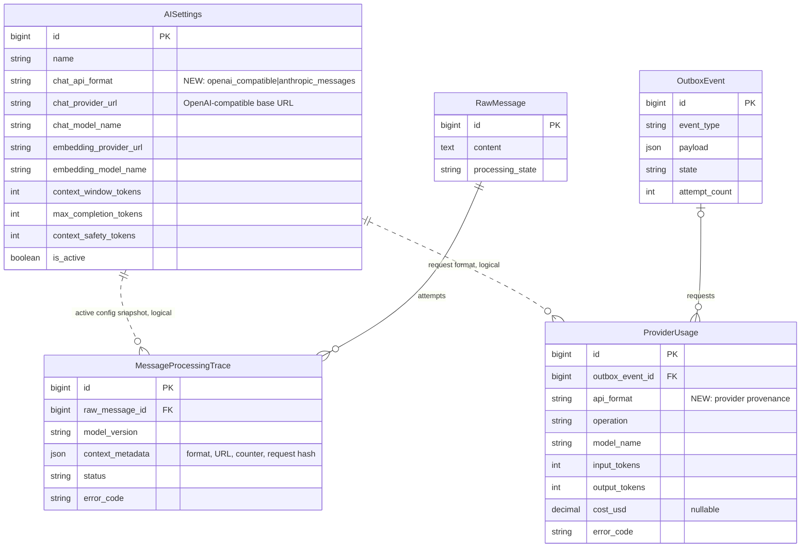
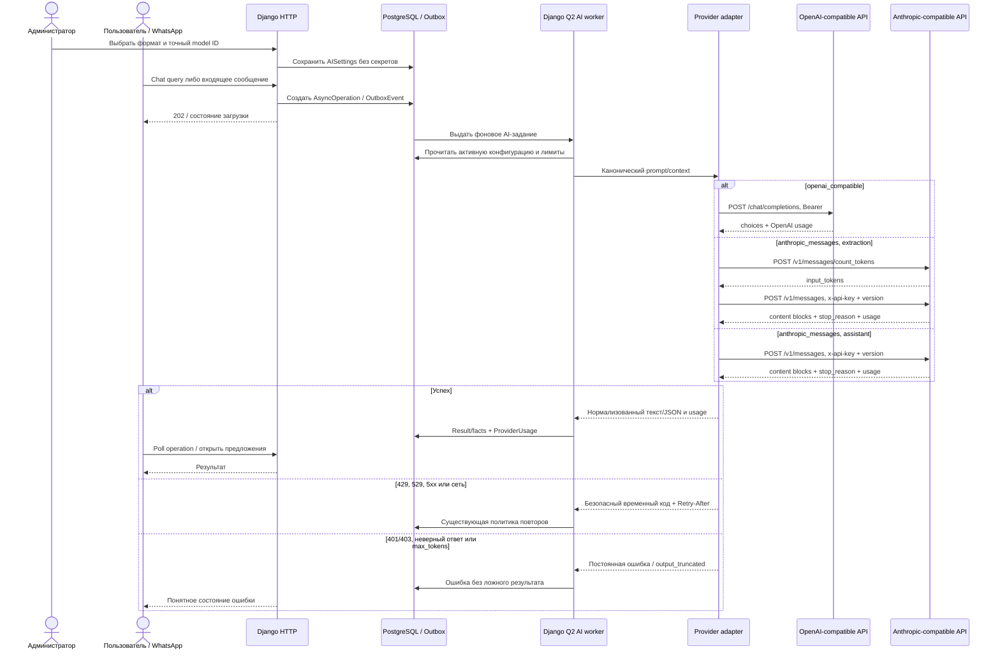

# Поддержка Anthropic-compatible моделей наряду с OpenAI-compatible

Задача: `anthropic-provider`. Ветка: `feature/anthropic-provider`.
Основание: прямой запрос пользователя, без GitHub Issue. База: актуальный `main`,
`18a4918`. Статус: согласовано пользователем («делай»), реализация и локальная
проверка завершены; ожидаются PR/CI/review.

Переданный в сообщении API-ключ не используется в командах, тестах или тексте
спецификации и не должен попасть в Git, PR, HTML админки либо логи. До проверки
production-интеграции ключ необходимо отозвать и заменить новым секретом окружения.

Планируется миграция с двумя новыми полями: `AISettings.chat_api_format` и
`ProviderUsage.api_format`. Существующие настройки и исторические записи usage
получают значение `openai_compatible`, поэтому текущая интеграция не переключается
автоматически. Новые таблицы и внешние ключи не создаются. Пунктирные связи на
диаграмме логические: активная конфигурация фиксируется в metadata/usage, но не
связывается FK.

## Текущее состояние

- `AISettings` уже разделяет параметры chat и embeddings, но не хранит формат
  chat API. Старые DB-поля ключей исключены из админки и после миграции `0014`
  не используются.
- `AIService` безусловно требует `OPENROUTER_API_KEY`, отправляет Bearer-заголовок
  на `/chat/completions` и читает OpenAI-структуры `choices`, `finish_reason`,
  `prompt_tokens` и `completion_tokens`.
- Контекст извлечения дополнительно зависит от OpenRouter
  `/models/{model}/endpoints`, OpenRouter-only полей `provider`, `plugins`,
  `reasoning`, `response_format` и локального Nemotron tokenizer manifest.
  Поэтому добавления двух env-переменных недостаточно.
- Свободный запрос из пользовательского чата сначала делает embedding-поиск в
  Qdrant, а затем обращается к chat-модели. Anthropic не предоставляет embedding
  endpoint, поэтому этот этап остаётся OpenAI-compatible и продолжает использовать
  отдельную существующую конфигурацию/ключ.

## Зафиксированные решения и требования

### Выбор провайдера и конфигурация

- В `AISettings` добавить явный выбор `OpenAI-compatible` или
  `Anthropic Messages`. Формат нельзя определять по hostname или имени модели.
- Существующее `chat_model_name` содержит точный model ID для выбранного формата.
  Конкретный Anthropic model ID пользователь пока не указал, поэтому модель не
  хардкодится и production-переключение выполняется только после её выбора в
  админке.
- Для OpenAI-compatible сохранить `AISettings.chat_provider_url` и текущее
  поведение. Для Anthropic единственным источником base URL является
  `ANTHROPIC_BASE_URL`; поле DB не создаёт второй конкурирующий адрес. В админке
  показать, что Anthropic URL задаётся окружением, не раскрывая секрет.
- Нормализовать base URL так, чтобы значение
  `https://ru.cheapvibecode.ru/anthropic` давало ровно
  `/anthropic/v1/messages` и `/anthropic/v1/messages/count_tokens`. Запретить
  userinfo, query, fragment, redirect, не-HTTPS и нестандартный порт вне
  изолированного E2E.
- Разделить allowlist по credentials: OpenAI/OpenRouter-вызовы используют только
  `OPENAI_PROVIDER_ALLOWED_HOSTS`, Anthropic — только
  `ANTHROPIC_PROVIDER_ALLOWED_HOSTS=ru.cheapvibecode.ru`. Общий
  `PROVIDER_ALLOWED_HOSTS` остаётся для других интеграций. Это не позволяет
  ошибочной DB-настройке отправить Bearer-ключ OpenRouter на Anthropic-host или
  `x-api-key` Anthropic на OpenAI-host. Сохранить общую SSRF-защиту
  `checked_url`.
- `ANTHROPIC_API_KEY` читать только из настроек окружения и передавать только
  сервису `qcluster` с очередью `ai`; HTTP backend, outbox, delivery/history/crm
  workers и frontend секрет не получают. Провайдер остаётся необязательным:
  OpenAI-only запуск не должен требовать Anthropic env.
- `ANTHROPIC_BASE_URL` как несекретную настройку передать backend для проверки и
  отображения статуса конфигурации и AI worker для вызова. В `.env.example`
  оставить только пустой placeholder ключа; реальный ключ хранится во внешнем
  `.env`/secret store.

### Anthropic Messages adapter

- Использовать существующий `requests`, без добавления SDK и новых зависимостей.
  Сохранить timeout, запрет redirect, allowlist, классификацию HTTP-ошибок,
  `Retry-After`, суточный request limit и текущую очередь повторов.
- Формировать `POST <base>/v1/messages` с `x-api-key`, фиксированной поддерживаемой
  `anthropic-version` и JSON content type. System instruction переносить в
  верхнеуровневое поле `system`; в `messages` оставлять пользовательские/assistant
  сообщения; всегда передавать `model` и положительный `max_tokens`.
- Не отправлять Anthropic OpenRouter-only поля `provider`, `plugins`, `reasoning`
  и `response_format`. Не полагаться на `temperature`: новые модели могут не
  принимать этот параметр, а управление форматом уже выполняется prompt/schema
  validation.
- Из успешного ответа принимать только текстовые блоки `content[]`, валидировать
  типы и нормализовать их во внутренний ответ. `stop_reason=max_tokens` считать
  `provider_output_truncated`; пустой/невалидный content —
  `provider_invalid_response`. Для extraction сохраняются все действующие проверки
  JSON, схемы фактов, цитат и запрета неподтверждённых данных.
- Нормализовать Anthropic `input_tokens`/`output_tokens` для `ProviderUsage` и
  trace metadata. `cost_usd` сохранять только при достоверном числовом значении,
  возвращённом gateway; стоимость не вычислять и не выдумывать. При неизвестной
  стоимости USD-бюджет учитывает только известные расходы, а request limit
  продолжает ограничивать все обращения; это явно отображается в админке.
- Нормализовать native error envelope и HTTP-коды в существующую таксономию:
  401/403 и неверный запрос — постоянные; 429, 529, 5xx, timeout/connection —
  временные по текущей политике; секреты, сырые заголовки и полный ответ провайдера
  не сохранять.

### Контекст и фоновые задачи

- Anthropic поддерживается и для пользовательского ассистента, и для фонового
  извлечения фактов. Embeddings остаются OpenAI-compatible; соответствующие
  credentials проверяются отдельно по операции, а не одним глобальным условием.
- `context_runtime` ветвится по формату. OpenAI/OpenRouter путь и точный локальный
  Nemotron counter остаются без регрессии. Anthropic не вызывает OpenRouter model
  metadata endpoint и не притворяется Nemotron-моделью.
- Для Anthropic extraction использовать официальный совместимый
  `/v1/messages/count_tokens`, настроенные `context_window_tokens`,
  `max_completion_tokens` и `context_safety_tokens`. Точные подсчёты внутри одного
  задания кэшировать по hash payload и ограничить необходимыми проверками
  фиксированной части, итогового payload и границы истории, чтобы не создавать
  запрос на каждое сообщение. В одном задании допускается не более 32 внешних
  count-запросов; после исчерпания preflight история больше не накапливается, а
  сразу подбирается доказанно помещающаяся граница либо обработка завершается
  fail-closed.
- Если gateway не поддерживает count-tokens, возвращает неверную схему или
  заявленное окно не вмещает запрос, extraction завершается до `/messages` с
  отдельной понятной ошибкой и без скрытого усечения. Поддержку обоих маршрутов
  указанного proxy подтвердить только новым ротированным ключом перед production
  activation.
- Канонический request snapshot и hash остаются воспроизводимыми. В
  `MessageProcessingTrace.context_metadata` дополнительно фиксировать API format,
  effective base URL, стратегию подсчёта и окно. Автоповтор запрещён, если после
  создания snapshot изменились format, URL или model.
- Все внешние вызовы остаются только в Q2 AI worker. HTTP endpoints по-прежнему
  создают операции/outbox и немедленно возвращают управление.

## Реализованные изменения

- `backend/api/models.py`, новая миграция после `0022`: enum формата chat API,
  provenance формата в usage, безопасные defaults/backfill.
- `backend/api/admin.py`: явный selector, понятные подсказки по источнику URL,
  наличию конфигурации и неизвестной стоимости; ключи по-прежнему исключены.
- `backend/mazory_backend/settings.py`, `.env.example`, `docker-compose.yml`,
  `compose.e2e.yml`: optional Anthropic config, точный allowlist и минимальная
  передача секрета только AI worker. В E2E используются только синтетические ключи.
- Новый provider-adapter (предварительно `backend/api/ai_providers.py`) и
  `backend/api/ai_service.py`: выбор credentials/transport, преобразование
  payload/response/usage/errors без изменения внешнего API Mazory.
- `backend/api/providers.py`: безопасная сборка Anthropic endpoint и расширение
  общей классификации, включая overload 529.
- `backend/api/context_tokens.py`, `backend/api/message_context.py`,
  `backend/api/pipeline.py`: provider-specific context runtime, count-tokens,
  канонический snapshot и защита от смены протокола.
- `backend/api/testing/provider.py`: изолированные Anthropic routes, управляемые
  ответы/ошибки и безопасный capture только факта корректной авторизации — без
  возврата значения ключа.
- Новый `frontend/e2e/anthropic-provider.spec.ts`. Vue-компоненты и публичные DTO
  не меняются: их loading/success/error состояния уже provider-neutral.
- Playwright base URL можно безопасно переопределить через `E2E_BASE_URL`, при
  этом стандартным адресом остаётся `http://localhost:5173`. Это позволяет
  запускать полностью отдельную матрицу без пересечения с параллельным E2E.

## Сквозная проверка

- Через реальный Django Admin выбрать `anthropic_messages`, сохранить точный
  тестовый model ID и убедиться, что выбор сохраняется, а ключ отсутствует в DOM,
  ответах и истории формы.
- Через реальный браузер войти в Mazory, отправить свободный chat prompt, увидеть
  loading, затем ответ fixture через цепочку HTTP → Outbox → Q2 → Anthropic
  adapter. Проверить отсутствие ошибок console/page.
- Через реальный webhook/изолированный WAHA принять сообщение, дождаться Q2
  extraction и появления проверяемого предложения факта в UI. Fixture проверяет
  `/v1/messages/count_tokens`, `/v1/messages`, отдельный `system`, `max_tokens`,
  отсутствие OpenRouter-only полей и корректный model ID.
- Проверить native 401, 429 с `Retry-After`, 529/5xx, timeout, malformed content,
  `stop_reason=max_tokens` и недоступный count-tokens. Существующие лимиты,
  количество попыток и пользовательские состояния ошибки не ослабляются.
- Переключить E2E-конфигурацию обратно на `openai_compatible` и подтвердить
  неизменность текущего `/chat/completions`, extraction и embedding/Qdrant пути.
- Проверить `ProviderUsage` для chat, extraction и token count: формат/model,
  токены, успех/ошибка и nullable cost без секретов. Просмотреть логи `backend`,
  `qcluster` и `waha`; в них нет ключа или содержимого auth header.
- Unit-тесты, `pytest` и `manage.py test` не создавать и не запускать. Выполнить
  миграцию на изолированной БД, `python manage.py check`, повторный
  `makemigrations --check` с `No changes detected`, `npm run build`, полный
  `npm run test:e2e` на `http://localhost:5173` и проверку Docker-логов.

## Результат реализации и локальной проверки

- Миграция `0023` применена с нуля на отдельной PostgreSQL; существующие строки
  получают `openai_compatible`. Повторный `makemigrations --check` сообщает
  `No changes detected`, Django `check` — `0 issues`.
- `npm run build` прошёл: `vue-tsc -b` и production-сборка Vite завершились без
  ошибок.
- Полный `npm run test:e2e` выполнен на чистом Docker-проекте с отдельной БД,
  Redis, Qdrant, provider fixture и всеми Q2 workers: `76 passed (18.0m)` в
  Chromium и WebKit. Из-за занятого другим checkout стандартного порта прогон
  был изолирован на `http://localhost:5174` через `E2E_BASE_URL`; default
  `http://localhost:5173` не изменён. Отдельный Anthropic-сценарий внутри полной
  матрицы прошёл за `33.9s`.
- Сценарий подтвердил реальное переключение/восстановление Django Admin,
  loading/success/error UI, native Messages/count-tokens payload и headers,
  401/429/529, malformed/truncated response, webhook → outbox → Q2 extraction,
  точный retry того же snapshot и fail-closed до генерации при неверном
  token-count ответе.
- После прогона активная настройка восстановлена в `openai_compatible`, pending
  outbox отсутствует. В логах нет `CRITICAL`, ошибок БД или секретов; ожидаемые
  traceback относятся только к E2E-проверкам отказа в доступе (`PermissionDenied`).
- Production Compose с синтетическим значением подтверждает, что
  `ANTHROPIC_API_KEY` получает только `qcluster`; остальные сервисы ключ не
  получают. Gitleaks `v8.24.3` проверил 5.28 MB отслеживаемых и новых файлов:
  `no leaks found`. Дополнительный поиск по префиксу раскрытого ключа в worktree
  и всех Git refs совпадений не нашёл.
- Свежие security/integration review не обнаружили high/medium замечаний.
  Реальный gateway намеренно не вызывался с раскрытым ключом: перед production
  activation требуется его ротация и проверка обоих native маршрутов новым
  секретом.

## Критерии готовности

1. Существующая запись `AISettings` после миграции остаётся
   `openai_compatible`; текущие OpenAI-like chat и embeddings работают без смены
   контрактов или секретов.
2. Администратор может явно выбрать Anthropic Messages и model ID. Приложение
   использует env-only base/key, а ключ нигде не отображается и не сохраняется в
   БД, trace, usage, audit, HTML, логах или тестовых артефактах.
3. Пользовательский chat и фоновое extraction-задание успешно проходят через
   native Anthropic-like endpoints и возвращают прежние внутренние DTO/факты.
4. Контекст Anthropic проверяется совместимым count-tokens до генерации; при
   невозможности доказать размер запрос не отправляется. Snapshot нельзя повторно
   использовать после смены format/URL/model.
5. Ошибки, retry, truncation, token usage и неизвестная стоимость отражаются
   честно; система не сообщает успех при неполном/невалидном ответе и не выдумывает
   USD cost.
6. Все новые и существующие Playwright E2E зелёные; Django check,
   `makemigrations --check`, frontend build и просмотр логов проходят без ошибок.
7. После проверок создаётся PR только в `main`, выполняются обязательные review/CI
   и merge. Production activation выполняется лишь после ротации раскрытого ключа,
   выбора точного Anthropic model ID и подтверждения `/v1/messages` плюс
   `/v1/messages/count_tokens` на указанном gateway.

## Источники протокола

- [Anthropic API overview](https://platform.claude.com/docs/en/api/overview):
  endpoint Messages, обязательные auth/version headers и Token Counting API.
- [Using the Messages API](https://platform.claude.com/docs/en/build-with-claude/working-with-messages):
  request/response envelope, top-level system instruction, content blocks,
  stop reason и usage.
