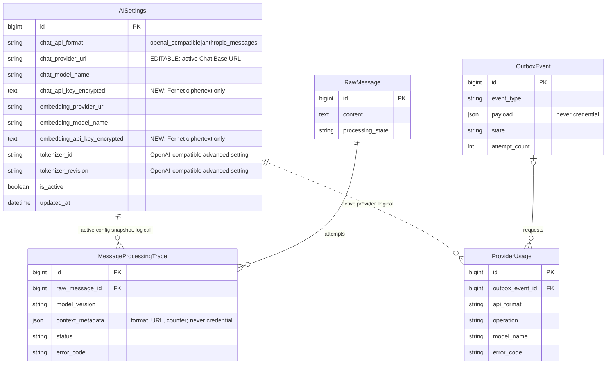

# Управление URL и ключами AI-провайдеров через Django Admin

Задача: `admin-ai-provider-credentials`. Ветка:
`feature/admin-ai-provider-credentials`. Основание: прямой запрос пользователя,
без GitHub Issue. База: актуальный `main`, `d43ea62`. Статус: подтверждена
пользователем 2026-09-30 10:32 MSK, реализована и проверена полным прогоном
Playwright E2E (76/76 сценариев в Chromium и WebKit).



Планируемая миграция сначала добавляет новые закрытые `TextField`
`chat_api_key_encrypted`/`embedding_api_key_encrypted`, не переименовывая и не
удаляя legacy-колонки во время rolling deployment. Любое непустое legacy-значение
шифруется и переносится, после чего legacy-поле очищается; физическое удаление
пустых колонок выполняется отдельным последующим rollout. В production эти поля
сейчас пусты после миграции `0014`, а реальные ключи находятся в окружении.
Новых таблиц и внешних ключей не будет. Пунктирные связи логические:
конфигурация отражается в snapshot/usage без FK и без копирования ключа.

```mermaid
sequenceDiagram
    actor Admin as Администратор интеграций
    actor User as Пользователь / WhatsApp
    participant HTTP as Django Admin / API
    participant Vault as Credential codec
    participant DB as PostgreSQL / Outbox
    participant Q as Django Q2 AI worker
    participant Provider as OpenAI-compatible / Anthropic

    Admin->>HTTP: Открыть AISettings
    HTTP-->>Admin: Формат, URL, модель, статус ключа; само значение пустое
    Admin->>HTTP: Новый URL и/или новый ключ через HTTPS
    HTTP->>HTTP: Проверить формат, allowlist и смену провайдера
    HTTP->>Vault: Зашифровать новый ключ
    Vault->>DB: Сохранить ciphertext и AuditEvent без значения
    HTTP-->>Admin: Настройки сохранены, ключ настроен

    User->>HTTP: Chat query или входящее сообщение
    HTTP->>DB: Создать AsyncOperation / OutboxEvent
    HTTP-->>User: 202 / состояние загрузки
    DB->>Q: Выдать задачу AI-очереди
    Q->>DB: Прочитать активные URL, модель и ciphertext
    Q->>Vault: Расшифровать ключ только в памяти процесса
    alt OpenAI-compatible
        Q->>Provider: Bearer + /chat/completions или /embeddings
    else Anthropic Messages
        Q->>Provider: x-api-key + /v1/messages/count_tokens
        Q->>Provider: x-api-key + /v1/messages
    end
    Provider-->>Q: Ответ / безопасная ошибка
    Q->>DB: Результат и ProviderUsage без секрета
    User->>HTTP: Poll результата
    HTTP-->>User: Результат / понятная ошибка
```

Переданный ранее рабочий API-ключ не включается в спецификацию, исходный код,
тесты, команды, Git, HTML, аудит или логи. После публикации ключа в чате его
необходимо отозвать и заменить новым через реализованную форму администратора.

## Проблема

- Сейчас `Anthropic Messages` игнорирует `AISettings.chat_provider_url` и всегда
  берёт `ANTHROPIC_BASE_URL` из окружения. Поэтому администратор видит старый
  OpenRouter URL и не может изменить фактический Anthropic endpoint.
- Поля `chat_api_key` и `embedding_api_key` существуют в модели, но исключены из
  админки, очищены миграцией `0014` и не используются. Chat/embedding runtime
  читает `OPENROUTER_API_KEY` и `ANTHROPIC_API_KEY` только из env.
- Текущая надпись «ключ доступен только AI worker» защищает секрет от лишних
  контейнеров, но не предоставляет администратору способ ротации. Это не
  соответствует требованию пользователя.
- `Токенизатор` не является ключом или провайдером. Это модельный словарь и
  шаблон, которыми OpenAI-compatible путь заранее считает размер контекста.
  Anthropic-путь эти два поля игнорирует и использует native `count_tokens`.
  Сейчас это различие в форме не объяснено.

## Зафиксированное поведение

### Единая активная Chat-конфигурация

- `chat_api_format`, `chat_provider_url`, `chat_model_name` и один активный Chat
  API key образуют единую конфигурацию. Один ключ не отправляется одновременно
  разным протоколам.
- `chat_provider_url` используется для обоих форматов. Для Anthropic значение
  вида `https://ru.cheapvibecode.ru/anthropic` даёт маршруты
  `/anthropic/v1/messages` и `/anthropic/v1/messages/count_tokens`; зависимость
  runtime от `ANTHROPIC_BASE_URL` удаляется.
- При смене `chat_api_format` администратор обязан одновременно ввести новый
  Chat API key. При смене hostname Chat URL также требуется новый ключ. Это не
  позволяет случайно отправить OpenAI/OpenRouter credential на Anthropic-host
  или наоборот.
- Пустое поле «Новый Chat API key» при обычном сохранении означает «оставить
  сохранённый ключ без изменений». Отдельное явное действие «Удалить ключ»
  очищает credential и переводит следующие AI-запросы в безопасную ошибку
  `ai_not_configured`, без показа старого значения.
- Embeddings остаются отдельным OpenAI-compatible каналом. Их URL, модель и
  отдельный API key также управляются в этой форме, чтобы для ротации AI-ключей
  не требовалось менять env.

### Форма Django Admin

- Создать специализированную `AISettingsForm` по образцу безопасной формы
  Bitrix: два write-only `PasswordInput` — «Новый Chat API key» и «Новый
  Embeddings API key», `autocomplete=new-password`, `render_value=False`.
- Raw ciphertext-поля никогда не входят в форму. После сохранения поля ключей
  снова пусты; рядом показывается только статус «настроен / отсутствует» и дата
  обновления конфигурации, без prefix/suffix ключа.
- Показать редактируемые Chat API format, Chat Base URL и точный model ID рядом
  в одном fieldset. Убрать readonly-блок, утверждающий, что Anthropic URL/ключ
  задаются только окружением.
- `tokenizer_id` и `tokenizer_revision` перенести в сворачиваемый раздел
  «Расширенные настройки контекста (OpenAI-compatible)» с пояснением: это способ
  считать токены, для Anthropic поля не используются. Значения не менять
  автоматически.
- POST формы пометить `sensitive_post_parameters` для обоих новых key-полей.
  ValidationError не повторяет введённый URL с userinfo, ключ либо ответ
  провайдера.
- Доступ сохраняется только у пользователей, проходящих `IntegrationAdmin` и
  существующую MFA-политику. AuditEvent фиксирует имена изменённых настроек и
  факт ротации/очистки, но не plaintext/ciphertext.

### Шифрование и жизненный цикл ключа

- Provider credentials хранятся в PostgreSQL только как versioned Fernet
  ciphertext (`fernet:v1:...`). Plaintext существует лишь в теле защищённого
  admin POST и в памяти AI worker на время запроса.
- Добавить отдельный инфраструктурный master key
  `AI_CREDENTIAL_ENCRYPTION_KEY`. Это не ключ провайдера и не требует ротации при
  каждой смене OpenAI/Anthropic credential. В production он обязателен и
  передаётся только HTTP backend (для сохранения) и AI qcluster (для чтения);
  delivery/history/crm/outbox/frontend его не получают.
- Ошибка расшифровки завершается fail-closed кодом
  `credential_decryption_failed`; запрещено молча использовать другой ключ или
  писать ciphertext/exception payload в лог.
- Runtime перестаёт читать `OPENROUTER_API_KEY`, `ANTHROPIC_API_KEY` и
  `ANTHROPIC_BASE_URL` после production-переноса значений в БД. Действующие
  credentials администратор один раз вводит через новую форму до переключения
  workers; автоматического импорта env-секретов в БД нет. На короткое окно
  обратимого rollout DB credential имеет приоритет, а env остаётся только
  operation-specific fallback при полном отсутствии DB credential. Повреждённый
  или не соответствующий формату ciphertext всегда даёт fail-closed и никогда
  не откатывается к env. После успешного smoke fallback отключается, а
  provider-key/base-URL переменные удаляются из Compose/.env.
- `.env.example` содержит только пустой `AI_CREDENTIAL_ENCRYPTION_KEY` и
  host allowlists. Реальные provider credentials в Git/образ/Compose не
  попадают.

### URL и SSRF-защита

- Админка разрешает менять полный HTTPS Base URL, но не отключает существующую
  SSRF-защиту: userinfo, query, fragment, redirects и нестандартный порт
  запрещены; E2E test-provider остаётся единственным тестовым HTTP-исключением.
- Host должен входить в соответствующий серверный allowlist:
  `OPENAI_PROVIDER_ALLOWED_HOSTS` либо `ANTHROPIC_PROVIDER_ALLOWED_HOSTS`.
  Изменение ключа через админку не даёт права отправить его на произвольный host.
- `AIService.effective_chat_provider_url`, token counting, chat assistant и
  extraction используют одно сохранённое DB-значение. Snapshot сохраняет URL,
  формат и model ID, но никогда не ключ.

### Совместимость фоновой обработки

- Все внешние AI-вызовы остаются в AI qcluster через существующий Outbox/Q2
  поток; HTTP handler не вызывает провайдера синхронно.
- `AIService._config`, chat, token count и embedding получают credential через
  единый безопасный resolver. Заголовок выбирается только по `chat_api_format`:
  Bearer для OpenAI-compatible, `x-api-key` для Anthropic.
- Ротация ключа применяется к новым попыткам без рестарта контейнеров. Payload и
  context snapshot повторной попытки остаются неизменными; credential в snapshot
  не включается.
- Существующие request/budget limits, retry policy, ProviderUsage и классификация
  ошибок сохраняются.

## Планируемые изменения

- `backend/api/models.py` и additive-миграция: закрытые encrypted-поля и методы
  установки/получения/очистки credentials; пустые legacy-колонки сохраняются на
  первый rollout для совместимости со старыми процессами.
- Новый небольшой модуль credential codec с version prefix, строгой проверкой
  master key и безопасными кодами ошибок.
- `backend/api/admin_forms.py` и `backend/api/admin.py`: write-only key inputs,
  URL/protocol validation, fieldsets, masking, sensitive POST и аудит.
- `backend/api/ai_service.py` и при необходимости `context_tokens.py`:
  DB URL/credentials для chat, token count и embeddings без env provider keys.
- `backend/api/trace_context_ui.py`: безопасные операторские сообщения для
  отсутствующего либо недоступного зашифрованного credential.
- `backend/mazory_backend/settings.py`, `docker-compose.yml`,
  `compose.e2e.yml`, `.env.example`: master-key scoping и удаление runtime
  provider-key зависимостей после переноса.
- `backend/api/management/commands/seed_e2e.py` и test-provider fixtures:
  синтетические encrypted credentials без реальных секретов.
- Обновить существующий `frontend/e2e/anthropic-provider.spec.ts`; при
  необходимости добавить один новый Playwright spec, не создавая unit/backend
  тестов.

## Сквозные E2E-сценарии

- Администратор входит через реальный Django Admin, видит формат, реальный Chat
  URL и пустой write-only key input; HTML не содержит plaintext или ciphertext.
- Через браузер выбирает Anthropic, задаёт test-provider URL/model/key, сохраняет
  и после reload видит выбранные значения и статус «ключ настроен», но не ключ.
- Пустое key-поле сохраняет текущий credential; замена неверным ключом даёт
  контролируемую 401-ошибку через реальный UI/очередь, последующая ротация
  правильным ключом восстанавливает chat без рестарта.
- Anthropic UI chat, webhook extraction и `count_tokens` проходят через Q2;
  provider capture подтверждает `x-api-key` и DB URL, а legacy env credential
  намеренно отсутствует либо неверен.
- Через админку выполняется переключение на OpenAI-compatible с новым URL/key;
  UI chat/extraction используют Bearer и не получают Anthropic key.
- Embeddings используют отдельный сохранённый key; смена Chat key их не ломает.
- Явное удаление credential приводит к `ai_not_configured`, не раскрывает
  прежнее значение и не откатывается скрыто к env.
- Проверка БД подтверждает versioned ciphertext и отсутствие тестового plaintext;
  логи backend/qcluster/outbox/history и audit payload также не содержат ключ.
- Нет browser console/page errors; динамический chat/loading/error UI сохраняет
  действующее поведение.

## Обязательные проверки и deployment

- `uv run --project backend python manage.py check`.
- `uv run --project backend python manage.py makemigrations --check`.
- `cd frontend && npm run build`.
- Полный `cd frontend && npm run test:e2e` на работающем приложении; unit-тесты,
  `pytest` и `manage.py test` не создаются и не запускаются.
- `docker compose config --quiet`, запуск сервисов, логи backend/qcluster/
  qcluster_history/outbox/waha и скан утечек синтетических ключей.
- До production migration — проверенный PostgreSQL dump. Во время cutover:
  применить additive-миграцию, через Django Admin ввести новые Chat/embedding
  credentials в `AISettings`, остановить выдачу новых AI-задач, переключить и
  проверить чтение новым worker, отключить fallback и удалить provider
  keys/base URL из runtime env, точечно пересоздать stateless backend/AI workers
  и возобновить очередь. Старые пустые колонки удаляются только отдельным
  последующим rollout после проверки отсутствия старых процессов.
- Production smoke через Q2 для выбранных URL/ключей; проверка, что изменение
  ключа через admin применяется без container restart. Если внешний
  `/count_tokens` по-прежнему отвечает 503, это фиксируется как отдельный
  provider-blocker и не маскируется изменением credential storage.
- При пересоздании AI qcluster сохраняется действующий DNS workaround для
  `ru.cheapvibecode.ru`, пока обычное DNS-разрешение с production-host не станет
  стабильным; остальные workers его не получают.
- PR только в `main`, обязательный review/CI, merge и проверяемый deployment с
  возможностью отката на дамп/предыдущий image.

## Критерии готовности

- В AISettings администратор может руками изменить Chat API format, фактический
  Chat Base URL, model ID и заменить/удалить API key для OpenAI-compatible либо
  Anthropic без правки `.env` и без рестарта.
- Отдельный embeddings key также ротируется через админку.
- Ключи не отображаются после сохранения, зашифрованы в БД и отсутствуют в Git,
  HTML, API, AuditEvent, trace/outbox payload и логах.
- AI worker использует ровно сохранённый URL и ключ выбранного формата; смена
  формата/host не может переиспользовать старый credential без явного ввода.
- Tokenizer-поля понятно помечены как расширенные и не применяются к Anthropic.
- Все обязательные Playwright E2E, frontend build, Django checks, migration
  drift и Docker/log checks проходят.

## Вне рамок

- Добавление новых wire-протоколов кроме OpenAI-compatible и Anthropic Messages.
- Отключение provider host allowlists либо разрешение произвольных URL.
- Исправление внешнего CheapVibeCode `count_tokens` 503 на стороне провайдера.
- Массовый повторный AI-анализ уже импортированных WhatsApp-сообщений.
