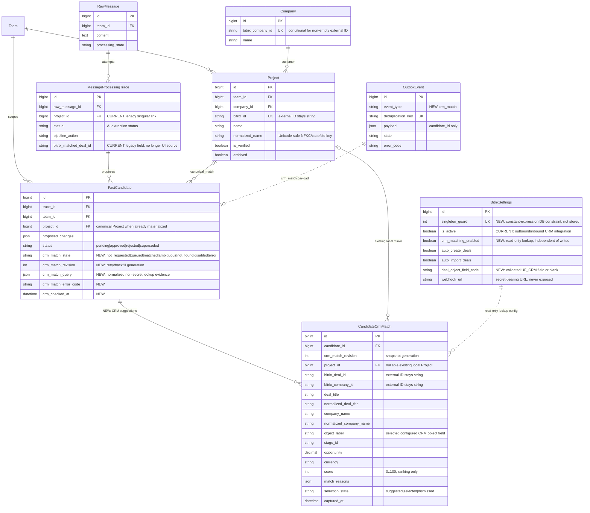

# Исправление сопоставления фактов WhatsApp со сделками Bitrix24

Задача: `crm-trace-matching`. Ветка: `bugfix/crm-trace-matching`.
Основание: прямой запрос пользователя после диагностики production-трассировки
№776, без GitHub Issue. База: актуальный `main`, `fa6d0f7`. Статус:
спецификация подтверждена пользователем 30.09.2026; реализация начата.



Текущие связи `Trace -> FactCandidate -> Project`, `Project -> Company` и
`Project.bitrix_id` сохраняются. Новая таблица `CandidateCrmMatch` хранит
несколько ограниченных снимков сделок, найденных для одного факта, потому что
одна компания может иметь несколько сделок. Планируются ограничения
уникальности `(candidate_id, crm_match_revision, bitrix_deal_id)` и не более
одного `selection_state=selected` на кандидата. Прошлые revision сохраняются
как аудит результата на момент поиска, а UI показывает текущую revision. Полные
ответы CRM, webhook URL и другие секреты в эту таблицу не записываются.

```mermaid
sequenceDiagram
    actor Sender as WhatsApp / Камиль
    participant HTTP as Django inbox
    participant DB as PostgreSQL / Outbox
    participant AI as Q2 AI worker
    participant CRMQ as Q2 CRM worker
    participant BX as Bitrix24 REST API
    actor Reviewer as Руководитель / администратор
    participant UI as Workspace / Django Admin

    Sender->>HTTP: Отчёт с несколькими объектами и компаниями
    HTTP->>DB: RawMessage + Outbox(extract_message)
    HTTP-->>Sender: 202 / сообщение сохранено
    DB->>AI: Фоновое извлечение фактов
    AI->>DB: MessageProcessingTrace + FactCandidate на каждый факт
    AI->>DB: Outbox(crm_match, candidate_id) для project-фактов
    Note over AI,DB: AI success означает только успешное извлечение

    DB->>CRMQ: crm_match в отдельной CRM-очереди
    alt read-only сопоставление выключено
        CRMQ->>DB: state=disabled; Bitrix не вызывать
    else конфигурация доступна
        CRMQ->>BX: crm.company.list по company_name
        BX-->>CRMQ: компании-кандидаты
        CRMQ->>BX: crm.deal.list по COMPANY_ID, TITLE и object UF
        BX-->>CRMQ: ограниченные поля найденных сделок
        CRMQ->>DB: upsert CandidateCrmMatch
        alt одно детерминированное сильное совпадение
            CRMQ->>DB: selected + FactCandidate.crm_match_state=matched
            CRMQ->>DB: attach existing Project when bitrix_id already local
        else несколько сделок одной компании
            CRMQ->>DB: suggestions + state=ambiguous
        else успешный поиск без результатов
            CRMQ->>DB: state=not_found
        else ошибка CRM
            CRMQ->>DB: state=error + safe error code; Outbox retry
        end
    end

    Reviewer->>UI: Открыть trace / «Проверка фактов»
    UI->>DB: Кандидаты и CRM suggestions
    DB-->>UI: Отдельный статус для каждого факта
    alt ambiguous
        Reviewer->>UI: Выбрать конкретную сделку CRM
        UI->>DB: match_crm(candidate_id, crm_match_id)
        DB->>DB: selected; AuditEvent; без внешней записи
    end
    Reviewer->>UI: Подтвердить факт
    alt выбранная CRM-сделка уже имеет локальный Project
        DB->>DB: Обновить подтверждённый Project
    else выбрана CRM-сделка без локального Project
        DB->>DB: Создать Company/Project с bitrix_id выбранной сделки
    else CRM-сделка не выбрана
        DB->>DB: Действующая проверка создания нового Project
    end
    Note over DB,BX: Read-only matching никогда не вызывает crm.deal.add/update/delete
    alt outbound Bitrix включён отдельно
        DB->>DB: Outbox(crm_sync) после подтверждения
        DB->>CRMQ: Фоновая синхронизация по стабильному bitrix_id
        CRMQ->>BX: crm.deal.update существующей сделки
    else outbound выключен
        DB->>DB: needs_bitrix_sync=true без внешнего вызова
    end
```

## Подтверждённая причина дефекта

- Production trace №776 завершился `success / proposed_facts` с резюме
  «Предложено фактов: 5». Это означает успешный AI-ответ и создание пяти
  `FactCandidate`, а не успешное сопоставление CRM.
- Кандидат №384 содержит `object_name = "Monolit Group — котельная 1 МВт"` и
  `company_name = "Monolit Group"`, но `project_id = NULL`; все trace-level
  поля Bitrix пусты.
- Сохранённый request snapshot trace №776 содержит `known_projects: []`. На
  момент диагностики в production было 0 локальных `Project`; настройка
  `BitrixSettings.is_active=False` после санкционированной очистки данных.
- Текущий pipeline не вызывает Bitrix при извлечении. Он ищет только локальный
  `Project` той же команды по строгому равенству
  `normalized_name == normalize_deal_name(object_name)` и принимает только
  ровно одно совпадение. `company_name` не участвует.
- На приложенном скриншоте у `ТОО "MONOLIT GROUP"` несколько сделок с другими
  названиями (`ЖК ...`). Совпадение только по компании не позволяет безопасно
  выбрать одну из них.
- Текущий admin выводит «В CRM нет» по пустому legacy-полю и утверждает, что
  был вызван удалённый `BitrixService.find_deal_by_name`, хотя такого метода в
  действующей реализации нет. Это ложное операторское сообщение.

## Требуемое поведение

### Разделение AI-результата и CRM-сопоставления

- `MessageProcessingTrace.status=success` продолжает означать успешное
  извлечение фактов. Интерфейс явно подписывает это как «AI-анализ завершён», а
  не как успешное завершение всех CRM-шагов.
- CRM-состояние хранится и показывается отдельно для каждого
  `FactCandidate`. Отчёт с пятью КП получает пять независимых результатов
  сопоставления.
- Пустое legacy-поле trace не интерпретируется как выполненный поиск.
  `not_found` допустим только после успешного ответа CRM без совпадений.
- Для `disabled`, `queued`, `ambiguous` и `error` показываются разные
  недвусмысленные сообщения. Ошибка или отключение CRM не превращаются в
  «сделка отсутствует».

### Read-only доступ к Bitrix24

- В `BitrixSettings` добавить независимый флаг
  `crm_matching_enabled`. Он разрешает только чтение для сопоставления и не
  включает входящие webhook, создание, изменение, комментарии, задачи или
  удаление сделок.
- `BitrixSettings` является singleton-конфигурацией одного портала: перед
  добавлением DB constraint миграция проверяет число строк и при конфликте
  останавливается с точным списком внутренних ID. Django Admin не предлагает
  создание второй строки, model validation и DB constraint закрывают гонку.
- Существующий `is_active` остаётся главным разрешением исходящей/входящей
  синхронизации. Его значение не меняется миграцией.
- Разделить CRM adapter на явно различимые read и write пути. Read resolver
  может использовать настроенный webhook при `crm_matching_enabled=True`,
  даже если outbound `is_active=False`; write methods продолжают fail-closed
  при `is_active=False`.
- Read resolver имеет жёсткий allowlist только для `crm.company.list/get` и
  `crm.deal.list/get`. Новый флаг нельзя передавать в универсальный метод так,
  чтобы через него стали доступны `add`, `update`, `delete`, timeline или
  tasks API.
- Все внешние запросы выполняются только обработчиком `crm_match` в
  `backend/api/tasks.py` на `qcluster_crm`. HTTP, admin, serializer и
  `pipeline.py` внешних запросов не делают.
- В начале одной revision worker фиксирует immutable snapshot scalar-настроек и
  один уже проверенный webhook base. Все страницы company/deal lookup используют
  этот snapshot без повторного чтения singleton; изменение флагов или адреса в
  admin посреди запроса применяется только к следующей revision и не смешивает
  порталы в одном результате.
- В payload Outbox передаются только внутренние числовые `candidate_id` и
  `crm_match_revision`. При новой попытке/backfill revision атомарно
  увеличивается, а deduplication key имеет вид
  `crm_match:<candidate_id>:<revision>`. Это позволяет повторить поиск после
  `disabled`/`error`, не переиспользуя завершённое событие. Worker до HTTP
  проверяет, что кандидат всё ещё `pending` и revision актуален; устаревшие,
  отклонённые и `superseded` кандидаты завершаются без вызова CRM.
- Используются таймаут, запрет redirect, действующая SSRF/host-защита,
  пагинация Bitrix и ограниченный набор полей. Один worker использует общий
  wall-clock deadline 60 секунд, лимит read-запросов и страниц; timeout каждого
  HTTP-вызова не превышает остаток общего бюджета. Исчерпание бюджета переводит
  актуального кандидата в `error` с безопасным кодом до 90-секундного timeout
  `qcluster_crm`. Webhook URL, credential и сырые ошибки ответа не попадают в
  HTML, БД матчинга или логи.
- Перед дописыванием любого read/write метода runtime применяет общий с admin
  form валидатор webhook base: только HTTPS, разрешённый host/443, без userinfo,
  query, fragment и path params, с точным путём `/rest/<id>/<token>/`.
  Legacy/env адрес, уже содержащий имя метода (включая delete), отклоняется до
  сетевого вызова; допустимый base канонизируется завершающим `/`.

### Правила поиска и выбора

- Входные сигналы: `object_name`, `company_name`, название локального проекта,
  `Project.bitrix_id`, `crm.deal.TITLE`, стандартный `COMPANY_ID` и
  настраиваемое поле объекта (`deal_object_field_code`).
- Если `proposed_changes.object_name` пуст, но кандидат уже связан с активным
  Project той же команды, query использует `Project.name`; archived и
  cross-team Project таким fallback не доверяются.
- Названия компании и объекта нормализуются раздельно. Для компании удаляются
  регистр, кавычки и юридические формы (`ТОО`, `АО` и аналоги), но не значимые
  слова. Для объекта сохраняются текущие правила плюс единая Unicode/пробельная
  нормализация без удаления казахских букв.
- Латинская юридическая форма `TOO` эквивалентна кириллической `ТОО` как в CRM
  query, так и в canonical `Project.normalized_name` и migration preflight.
- Перед schema constraints миграция self-contained нормализует существующие
  `Project.normalized_name`. Сначала вычисляются все новые ключи и rollout
  блокируется при active same-team collision с точными `team_id` и внутренними
  Project ID без клиентских названий; затем изменённые ключи двухфазно
  очищаются и записываются, чтобы действующий unique constraint не дал
  transient collision. Reverse migration — noop.
- По `company_name` сначала ищутся компании CRM; затем сделки этой компании в
  настроенной воронке. Параллельно разрешён поиск сделки по точному
  нормализованному TITLE/полю объекта, чтобы работать и без компании.
- Company lookup всегда объединяет ответы дедуплицированных безопасных raw- и
  нормализованного broad-prefilter, затем выполняет authoritative client-side
  normalized equality по всему объединению. Не более двух значимых
  token-prefilter запускаются последовательно только когда полный broad-union
  не дал точной компании. Ответы дедуплицируются по строковому company ID и
  делят общий request budget с deal lookup.
- Автоматический выбор разрешён только при детерминированном уникальном
  совпадении:
  - стабильный существующий `Project.bitrix_id`;
  - ровно одна сделка с точным нормализованным TITLE или object field.
- Одно совпадение только по названию компании остаётся ручным предложением
  (`ambiguous` с одной опцией), если TITLE/object field не подтверждают объект.
  Несколько сделок компании дают `ambiguous` с несколькими опциями.
- Нечёткий score используется только для сортировки подсказок. Он не даёт
  права автоматически связать сделку.
- Если у Monolit Group найдено несколько сделок и ни одна не имеет уникального
  точного сигнала «котельная 1 МВт», состояние — `ambiguous`; интерфейс
  показывает найденные сделки, но не выбирает «первую».
- Внешние Bitrix ID всегда остаются `string`; внутренние Django ID остаются
  `int`. Объединения `string | number` и неявные преобразования запрещены.

### Подтверждение человеком и канонический Project

- API проверки фактов получает отдельное действие `match_crm` с внутренним
  числовым `crm_match_id`. Перед выбором проверяются права, команда, статус
  кандидата и принадлежность предложения кандидату.
- Ручной выбор требует непустой причины; она сохраняется в `AuditEvent` вместе
  с прежним/новым выбором, но без сырого CRM payload.
- Выбор CRM suggestion сам по себе не подтверждает AI-факт и не меняет
  внешнюю CRM. Он записывает единственный `selected` match и `AuditEvent`.
- Если `Project` с выбранным `bitrix_id` уже существует в той же команде,
  кандидат связывается с ним и сохраняет его `base_version`.
- Если локального `Project` нет, он материализуется только при последующем
  подтверждении факта: `source=bitrix_crm`, `bitrix_id` выбранной сделки,
  корректные `team`, `Company` и CRM snapshot. Компания ищется прежде всего по
  `bitrix_company_id`, а не только по написанию названия.
- Валюта, явно указанная и прошедшая валидацию в AI-факте или исправлении
  пользователя, имеет приоритет. Если валюта отсутствовала, существующий
  `Project` сохраняет свою валюту, новый CRM-проект получает поддерживаемую
  валюту snapshot, а обычный новый проект использует `KZT` как fallback.
- Отрицательная или некорректная сумма `OPPORTUNITY` из CRM не переносится в
  `Project.contract_amount`; для неё действует валидированная сумма факта или
  безопасное значение по умолчанию.
- Общий `normalize_deal_name` для pipeline, CRM materialization, уникального
  ключа проекта и Redis lock использует Unicode NFKC/casefold и сохраняет
  казахские буквы. Миграция перед обновлением существующих `normalized_name`
  выполняет preflight новых ключей по активным проектам одной команды: при
  коллизии rollout блокируется с точными `team_id`/`Project.id`, без silent
  merge; после успешного preflight все существующие ключи перенормализуются.
- Для непустого `Company.bitrix_company_id` добавить условную уникальность.
  Перед миграцией выполняется read-only preflight; существующие дубли не
  объединяются молча и должны блокировать rollout с точным списком внутренних
  ID. В диагностированном production компании сейчас отсутствуют.
- Если `bitrix_id` или `(team, normalized_name)` конфликтует с другим локальным
  Project, транзакция не объединяет записи автоматически: возвращается 409 и
  требуется явное сопоставление с существующим Project.
- Выбранный внешний deal запрещает `crm.deal.add`. После подтверждения можно
  обновлять только этот `bitrix_id`, и только когда outbound-интеграция отдельно
  включена.
- При выключенном outbound подтверждённый проект сохраняется локально с
  `needs_bitrix_sync=True`, но задача внешней записи не отправляется. После
  будущего включения действующий reconciliation поставит её в очередь.
- Конкурентный выбор, повторный POST и повтор Outbox идемпотентны; конфликт
  версии возвращает 409 и не меняет связь.

### Django Admin и Workspace

- Перестроить этап 3 trace из одного legacy-блока в список результатов по
  каждому `FactCandidate`: извлечённый объект/компания, состояние поиска,
  выбранная сделка либо ранжированные предложения.
- Для каждой сделки показать безопасные поля: ID, TITLE, компания, стадия,
  сумма/валюта, причины совпадения и ссылка на портал. Не показывать полный
  webhook URL или сырой CRM payload.
- Удалить все ложные формулировки о вызове `find_deal_by_name`, создании новой
  сделки и «В CRM нет» без выполненного поиска. Обновить list badge, overview,
  inline badge и stage 3 card.
- `Без сделки` на trace-level заменить агрегатом кандидатов: например,
  «5 фактов · 1 совпадение · 1 неоднозначно · 3 не найдено». Каноническая
  ссылка берётся с кандидата, а не только из `trace.project`.
- В Workspace расширить строго типизированный `Candidate` полями CRM-статуса и
  `CrmMatchSuggestion[]`. Для `ambiguous` показать выбор найденной сделки и
  отдельную кнопку «Сопоставить с CRM»; существующий выбор локального Project
  сохранить.
- Состояния загрузки и ошибок не блокируют просмотр AI-факта и evidence.
- Admin queryset заранее загружает candidates/matches/projects, чтобы новый
  per-candidate экран не создавал N+1 запросы; названия CRM экранируются, ссылки
  открываются с `rel="noopener noreferrer"`.

### Существующие данные и trace №776

- Миграция только добавочная: не удаляет legacy trace-поля, прошлые сообщения,
  трассировки, кандидатов, настройки или backup.
- Добавить идемпотентное фоновое пере-сопоставление существующих `pending`
  project-кандидатов. Оно создаёт только Outbox-события и не повторяет AI-анализ.
- После развёртывания разрешить production только read-only matching; оставить
  `BitrixSettings.is_active=False`, пока отдельно не будет принято решение о
  внешних записях.
- Поставить на пере-сопоставление кандидат №384 и остальные актуальные
  project-кандидаты trace №776. Ожидаемый безопасный результат для Monolit:
  `matched`, если CRM содержит ровно один сильный объектный сигнал, иначе
  `ambiguous` со всеми релевантными сделками компании для ручного выбора.

## Планируемые изменения

- `backend/api/models.py` и новая additive-миграция:
  `FactCandidate.crm_match_*`, модель `CandidateCrmMatch`, настройки read-only
  matching, singleton-ограничение `BitrixSettings` с preflight и ограничения
  уникальности; Unicode-safe renormalization существующих Project с collision
  preflight.
- `backend/api/bitrix_service.py`: безопасные read-only company/deal lookup,
  пагинация, минимальный snapshot, детерминированная классификация результатов;
  явное отделение read от write.
- `backend/api/tasks.py`: новый Outbox handler `crm_match`, маршрутизация в
  кластер `crm`, retry/error state и идемпотентная постановка существующих
  кандидатов.
- `backend/api/pipeline.py`: после фиксации project-фактов создавать
  `crm_match` Outbox-события; локальное точное совпадение сохранять как
  приоритетный сигнал.
- `backend/api/facts.py`, `backend/api/platform_views.py`, serializers/URLs:
  безопасное `match_crm`, materialization выбранной CRM-сделки при approve,
  аудит и блокировка нежелательного `crm.deal.add`.
- `backend/api/admin.py` и admin templates/styles: per-candidate CRM lineage без
  ложных legacy-утверждений.
- `frontend/src/types/` и `frontend/src/components/WorkspaceView.vue`:
  типизированные CRM suggestions, статусы и ручной выбор.
- Идемпотентная management/admin операция постановки существующих кандидатов на
  сопоставление; отдельный постоянный отчёт или runbook не создаётся.
- Проверить исправление на работающем приложении через Django system check,
  migration check, production-сборку frontend и журналы Docker-сервисов.

## Сценарии проверки

Проверка выполняется на локальном Docker Compose с PostgreSQL, Redis, Outbox и
Q2 workers. Production CRM используется только на отдельном этапе rollout в
read-only режиме; секреты и сырые ответы в артефакты не записываются.

- Отчёт с несколькими фактами создаёт несколько карточек кандидатов; статус
  AI-analysis и CRM-статусы отображаются независимо.
- Однозначное точное совпадение TITLE/object field проходит через
  `qcluster_crm`, получает `matched` и показывает выбранную CRM-сделку.
- Точно совпавшая компания с одной сделкой, но без подтверждения TITLE/object
  field, даёт одно ручное предложение и не выбирается автоматически.
- Сценарий Monolit: provider возвращает одну компанию и две сделки с разными
  TITLE. UI показывает `ambiguous`, обе сделки и не выбирает первую
  автоматически.
- Руководитель выбирает одну сделку в Workspace; факт подтверждает пользователь
  с требуемой базовой ролью, а материализацию суммы CRM — финансист. В UI
  появляется локальный Project с выбранным строковым `bitrix_id`; запросов
  `crm.deal.add`, `crm.deal.update` и `crm.deal.delete` при выключенном outbound
  provider не получает.
- Успешный поиск без совпадений показывает `not_found`; выключенный matching —
  `disabled`; HTTP/Bitrix ошибка — `error` с безопасным текстом и повтором.
- Исчерпание общего deadline/request/page budget завершается `error`, а не
  зависшим `queued`; один HTTP timeout никогда не превышает остаток бюджета.
- Fresh SQLite migration создаёт singleton constraint: первая строка
  `BitrixSettings` допустима, вторая блокируется; preflight legacy-базы с двумя
  строками сообщает оба внутренних ID.
- Migration preflight не меняет Project при Unicode collision: ошибка содержит
  только team/internal IDs. Без конфликта двухфазная renormalization сохраняет
  active same-team uniqueness и казахские буквы в canonical key.
- Повторная доставка Outbox и повторный выбор не создают дубли
  `CandidateCrmMatch`, Company или Project.
- Trace list/detail и Workspace не содержат `find_deal_by_name`, ложное
  «сделка создана» или «В CRM нет» для непроверенного состояния.
- Логи `backend`, `qcluster`, `qcluster_crm`, `outbox` и `waha` подтверждают
  фоновое выполнение; в логах и HTML нет webhook credential.

## Обязательные проверки и rollout

1. Проверить diff и миграцию; применить миграцию в локальном Docker.
2. Выполнить `cd backend && uv run python manage.py check`.
3. Выполнить `cd backend && uv run python manage.py makemigrations --check`
   и получить `No changes detected`.
4. Выполнить `cd frontend && npm run build` без TypeScript/Vite ошибок.
5. Запустить все сервисы Docker, включая отдельные `qcluster_crm` и `outbox`.
6. Просмотреть `docker compose logs --tail=50 backend qcluster qcluster_crm outbox waha`;
   устранить ошибки и повторить проверки.
7. Создать PR только в `main`, дождаться успешного CI/review и объединить.
8. Перед production rollout сохранить backup PostgreSQL. Применить additive
   миграцию, обновить backend/AI/CRM/outbox/frontend-контейнеры и проверить
   readiness.
9. Включить только `crm_matching_enabled`; `is_active` и внешние write-флаги
    не активировать автоматически. Поставить существующие pending-кандидаты на
    фоновое сопоставление.
10. Проверить trace №776 и кандидата №384: состояние поиска, список найденных
    сделок Monolit, отсутствие внешних write-вызовов и отсутствие дублей в
    локальной БД.

## Критерии готовности

- Trace №776 больше не утверждает, что Bitrix был проверен, когда запроса не
  было; «Успешно» подписано как результат AI-извлечения.
- Для каждого project-факта существует независимое доказуемое CRM-состояние.
- Monolit Group приводит к найденным CRM suggestions; несколько сделок дают
  `ambiguous`, а не случайный auto-match или `not_found`.
- Однозначные совпадения связываются автоматически; неоднозначные можно выбрать
  вручную с аудитом.
- Подтверждение выбранной существующей сделки сохраняет её `bitrix_id` и не
  создаёт дубль в Bitrix.
- Read-only matching работает при выключенном outbound и не выполняет внешних
  изменений.
- Read и write пути используют одну singleton-конфигурацию Bitrix24 и не могут
  незаметно выбрать разные portal rows; общий CRM lookup budget меньше timeout
  `qcluster_crm` и имеет доказуемое terminal error-состояние.
- Старые trace/candidates сохранены и могут быть безопасно поставлены на
  пере-сопоставление без повторного LLM-запроса.
- Django check, migration check, frontend build и проверка Docker-логов
  проходят успешно.
- PR создан в `main`, проверки/review пройдены, PR объединён; production
  validation подтверждает исправление trace №776 без внешних CRM-записей.
