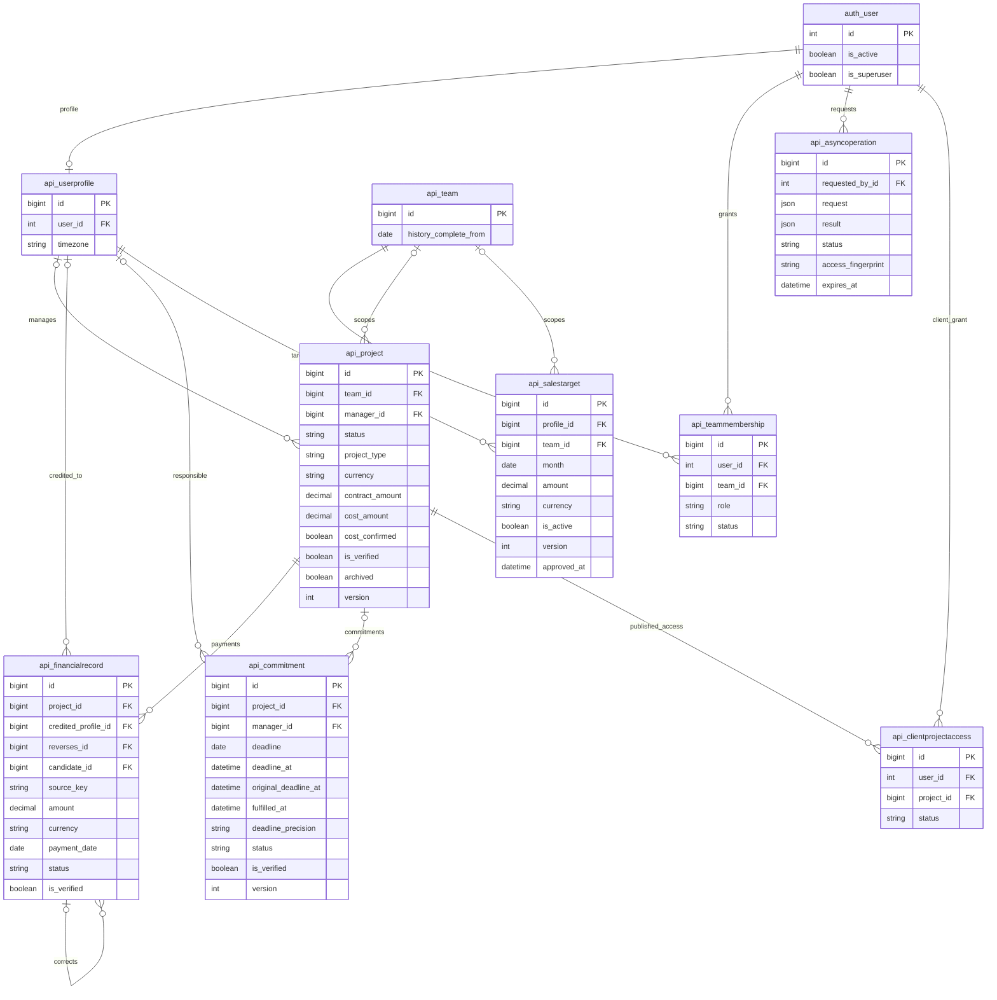
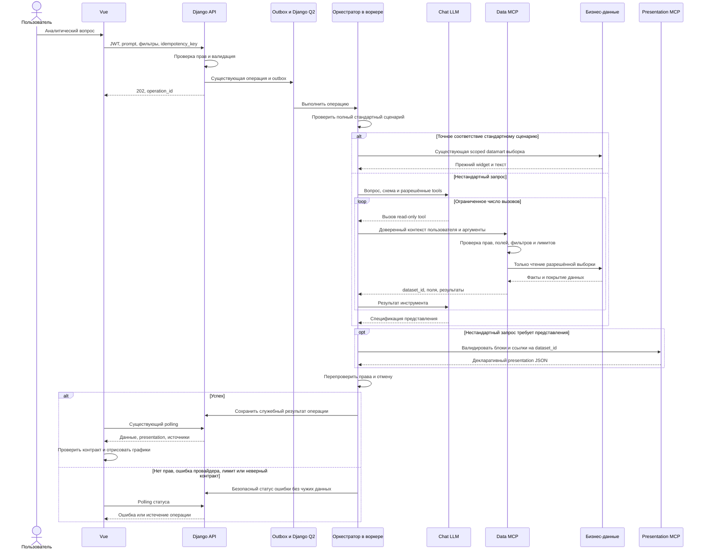

# Read-only аналитический чат и декларативные графики

- Задача: `read-only-analytics-chat`, прямой запрос пользователя, без GitHub Issue.
- Ветка: `feature/read-only-analytics-chat`; целевая ветка будущего PR: `main`.
- Статус: согласовано пользователем; реализация и проверки выполнены, подготовка PR.
- База kz-mazory: `14fa7b20df26f804bc875805cfd8757629437210`.
- Сравнение newrop: main `6d8c577`, Presentation `0bd4fab`, Workspace `0e78b17`, KPI Team `ff8e48e`, Data Foundation `d1dfbf9`.



ERD показывает затронутые аналитические таблицы текущей схемы по `models.py` и миграциям до `0025`, включая `0012` и `0018`. `reverses_id` — nullable self-FK FinancialRecord, `candidate_id` — nullable one-to-one FactCandidate; эти связи используются для происхождения и корректировок, инструмент не раскрывает candidate. Изменения схемы и новые модели не планируются. `auth_user.id` — стандартный целочисленный ключ Django. Служебные OutboxEvent и ProviderUsage существуют и продолжают использоваться; модель не получает инструментов для их изменения. Проверка ClientProjectAccess остаётся в существующем access.py, аналитические данные клиентского доступа в V1 не добавляются.



## Постановка и проверенное сравнение

Пользователь хочет сохранить стандартные сценарии и дать Chat LLM возможность отвечать на нестандартные вопросы, выбирать разрешённые данные с новыми фильтрами и группировками и строить графики в браузере. Голосовой ввод не требуется.

В newrop feature-ветки последовательно наследуют друг друга; новые возможности отсутствуют в main. Presentation добавляет детерминированный margin_analysis и renderer на ECharts 6.1; KPI Team добавляет kpi_team. Последняя ветка регистрирует 13 блоков, из которых 7 графических. Workspace добавляет фиксированный viewport, dock, управляемые анимации и фон. Data Foundation добавляет MonthlyKpiTarget, DataSyncRun, происхождение платежей и команды импорта/сопоставления владельцев. Это реализация специализированных экранов, а не MCP-аналитики.

Приложенный ответ неточен: LLM в newrop остаётся для fallback, который может вернуть project_table вместе с текстом; renderer не обеспечивает абсолютную безопасность; в motion.ts blockStagger равен 70 мс, 800 мс — длительность анимации графика. В kz-mazory микрофон также проходит через WelcomeView.vue, который надо очистить. Вывод о полной свободе модели требует ограничения доступными данными и разрешённым языком выборок.

kz-mazory уже имеет Chat LLM fallback, AsyncOperation → OutboxEvent → Q2, проверку access fingerprint, scoping, SalesTarget, подтверждённые оплаты и покрытие данных. Однако широкие проверки подстрок в operations.py перехватывают сложные вопросы: слово «график» всегда даёт фиксированный план/факт. В newrop ChatQueryView вызывает модель синхронно, KpiSummaryView использует AllowAny, витрина не принимает контекст пользователя. Переносить эти обработчики и миграции целиком нельзя.

## Требования

1. Стандартный путь применим только к полному поддерживаемому сценарию без дополнительных условий. Неизвестные фильтры, произвольные даты, новые группировки или типы диаграмм направляются к модели даже при словах «график», «KPI», «проект». Не терять условия молча.
2. Использовать существующие настройки Chat LLM и хранение секретов; ключи провайдера не отправлять в браузер. Цикл работы модели выполняется в Q2. Проверить tool calling для настроенных API-форматов; несовместимый провайдер даёт понятную ошибку, без выдуманных данных.
3. Реализовать два MCP-сервиса с настоящим согласованным protocol lifecycle и tools/call, а не только назвать JSON-ответ MCP. Host/client размещается в серверном воркере; SDK, транспорт и версия закреплены ниже в конкретной архитектуре V1.
4. Data MCP: describe_schema, query_dataset и чтение разрешённых источников. Контекст пользователя задаётся host, не моделью. Запрос — типизированный JSON с разрешёнными dataset, dimensions, measures, filters, date_range, order_by и limit. Разрешить проекты, подтверждённые платежи, обязательства и утверждённые планы в рамках действующего access.py. Фильтры только сужают права. Произвольные SQL, Python, ORM-пути и функции недоступны.
5. Для V1: группировки по менеджеру, команде, статусу/типу проекта и поддерживаемым календарным периодам; фильтры по этим полям, разрешённым ID, диапазонам дат и сумм; count, sum и определённые сервером показатели. Пользовательский запрос может комбинировать их без отдельного зашитого экрана. Неподдерживаемая операция объясняется или уточняется. Лимиты, deadline и семантика бюджета закреплены ниже.
6. Presentation MCP: build_presentation принимает ссылки на полученные dataset_id и описания осей, серий, типа и компоновки. Разрешённые типы V1: bar, line, area, scatter, donut, funnel, waterfall, table и KPI. Значения связывает с серверными выборками; модель не подменяет финансовые факты. Renderer Vue преобразует документ в ECharts options локально.
7. Нестандартность относится к сочетаниям данных и представлений, а не к исполнению произвольного JS. Не использовать eval, new Function, HTML модели, URL загрузки, callback-код или сырые произвольные ECharts options. Типизированные DTO находятся в frontend/src/types/, внешние данные валидируются во время исполнения на сервере и клиенте.
8. Read-only распространяется на бизнес-данные: инструменты не меняют проекты, оплаты, планы, CRM, WAHA и права. Служебная запись операций/расходов остаётся необходимой. Для бизнес-чтения использовать отдельное соединение с ролью БД с SELECT на разрешённые таблицы и read-only транзакции; инфраструктурные записи делает существующий host, а не MCP. Изолировать роль и учётные данные от инструментов модели.
9. Сохранить JWT, запрет аналитики для client, права команд/менеджеров, повторную проверку перед выдачей результата, отмену, срок жизни и idempotency. Отозванные права прекращают доступ и к dataset_id, и к результату операции.
10. Суммы считать Decimal на сервере, передавать десятичными строками и округлять для визуализации только в адаптере. Не складывать разные валюты. received + is_verified — факт оплаты; отсутствующие планы и неполные данные показывать явно. Маржа требует cost_confirmed; плановая маржа не заменяет фактическую. Числовые ID сущностей остаются number/int, ID блоков — отдельные строки.
11. Удалить Mic, кнопку, voiceInput, handleVoice и listeners из ChatInput.vue, WelcomeView.vue и App.vue. Ввод текста и вложения сохранить.

## Конкретная архитектура V1

### Маршрутизация и условия вопроса

Быстрый путь — только полное совпадение нормализованного текста с четырьмя стандартными подсказками: «Покажи график поступлений», «Покажи KPI команды», «Какие обещания просрочены?», «Покажи воронку проектов». Нормализация убирает регистр, лишние пробелы и UI-стрелку, но не условия вопроса. Остальной свободный текст направляется модели. Новое поле scenario для HTTP-запроса не требуется.

UI-фильтры и выбранный период передаются модели как defaults. Явно названное в вопросе условие заменяет соответствующий default; остальные сохраняются. Права пользователя всегда остаются верхней границей доступа. Сервер возвращает нормализованные итоговые условия, а UI показывает их над графиками. Неоднозначные имена, конфликтующие условия и неподдерживаемые операции требуют текстового уточнения; спорную выборку до уточнения не выполнять. Уточнение возвращается обычным ChatResponse, пользователь отправляет следующий полный вопрос; серверная история диалога в V1 не добавляется.

### Два протокольных сервиса

Выбранная совместимость V1: официальный Python SDK `mcp==1.28.1`, MCP `2025-11-25`, закреплённые pyproject.toml и uv.lock. Это версия для реализации V1, а не утверждение о новейшем MCP. Host работает в задаче Q2 и открывает две независимые MCP ClientSession/server-сессии через официальный memory transport (`mcp.shared.memory.create_connected_server_and_client_session`). Lifecycle: initialize → notifications/initialized → tools/list → tools/call; закрытие обеих сессий при любом завершении. Новые публичные HTTP endpoints, порты и контейнеры не нужны.

Data tools: `describe_schema`, `query_dataset`, `read_sources`. Presentation tool: `build_presentation`. Каждый публикует закрытые inputSchema/outputSchema и readOnlyHint; возвращает structuredContent и JSON text для совместимости. Ошибка аргументов — isError с безопасным кодом, без SQL и traceback. Host переводит tools/list в формат настроенного LLM-провайдера. Одного объявления JSON-функций без MCP-сессий недостаточно.

Host создаёт immutable context `{operation_id, requested_by_id, access_fingerprint, expires_at, deadline}`. Поля отсутствуют в аргументах инструментов модели. Registry наборов данных существует только внутри текущей попытки операции; dataset_id — непрозрачная строка, недоступная другой операции или пользователю. Итоговые datasets вместе с документом сохраняются в AsyncOperation.result; отдельного API получения dataset_id нет. Registry удаляется при закрытии сессий.

Memory transport не изолирует процессы или credentials. Модель получает только схемы инструментов и сериализованные факты; исполнение доверенного кода ограничено tools, авторизацией и отдельным DB alias. Generic HTTP, ORM, SQL, shell и выполнение модельного кода не предоставляются.

### Провайдеры, ограничения и отмена

Добавить отдельный canonical AssistantTurn с text, tool_calls `{id,name,arguments}`, finish_reason и usage. OpenAI-compatible использует assistant tool_calls и role=tool/tool_call_id; Anthropic — tool_use и user tool_result/tool_use_id. Нынешний Anthropic adapter умеет только текст и отклоняет tool_use, поэтому обе реализации продолжения обязательны. Старые extraction/text-only методы сохраняются. Неизвестный tool, повторный call ID, обрезанный ответ и неверные аргументы отклоняются. Несколько вызовов одного turn выполняются последовательно. Отказ endpoint поддерживать tools даёт provider_tools_unsupported; не подменять его выдуманным ответом.

Лимиты: 10 provider generation turns, 16 всех MCP calls, максимум 8 query_dataset, 1000 строк на dataset, 256 KiB на dataset, 1 MiB итогового документа, 12 блоков. Общий deadline — min(150 секунд, AI_WORKER_TIMEOUT − 30 секунд, остаток TTL). Provider timeout — максимум 45 секунд и остаток deadline; connect/read timeout и проверка elapsed должны соблюдать общий deadline. SQL statement_timeout — максимум 5 секунд и остаток deadline. Настройки могут уменьшать лимиты; worker lease/retry остаются длиннее deadline. Существующий polling на 180 попыток сохраняется.

Модель получает column schema, summary и preview до 50 строк с явным признаком preview; полный набор остаётся в registry для renderer. Preview не используется как база финансового расчёта. Context ограничен context_window_tokens минус max_completion_tokens и context_safety_tokens, с учётом tools/messages/results. При превышении — предложение сузить выборку, а не незаметное удаление фактов.

Каждый provider HTTP учитывается в существующем ProviderUsage с привязкой к outbox; сохраняются проверки daily_request_limit/daily_budget_usd. Их нынешняя check-then-act семантика и unknown cost не обеспечивают строгий глобальный денежный потолок. Жёсткие ограничения V1 — turns, completion, объём и deadline; резервирование расходов не входит в эту задачу.

Проверять status, TTL, актуального пользователя и fingerprint перед/после каждого tool/provider call и перед публикацией. Отмена запрещает следующие вызовы; уже отправленный HTTP может закончиться до timeout, результат отбрасывается. Финальная запись CAS только для действующей running операции. Запретить конкурентное выполнение одной operation, например operation-scoped PostgreSQL advisory lock на writable host connection. Fingerprint читать по заново загруженному user, чтобы отзыв is_active/superuser не оставался в кэше объекта.

Неверные параметры допускают один корректирующий turn внутри общего лимита. Ошибка провайдера завершает аналитическую операцию failed, без автоматического перезапуска всего tool loop: это соответствует текущему execute_operation, поглощающему ошибки. После crash допустим существующий outbox recovery с новым registry и новой проверкой прав; повторные provider расходы учитываются. Состояния queued/running/succeeded/failed/cancelled/expired сохраняются.

## Данные, read-only и финансовая семантика

| Dataset | Scope и обязательные ограничения | Dimensions и меры V1 |
|---|---|---|
| projects | access.projects_for, archived=false, is_verified=true, version>0 | project_id, project_manager, team, status, project_type; project_count, contract_amount, confirmed_cost, contract_margin_percent |
| payments | Только доступные подтверждённые проекты; is_verified=true, status=received, валюта совпадает | credited_manager, team, project_id, status/project_type проекта, payment_day/week/month; payment_count, received_amount |
| commitments | access.commitments_for, is_verified=true; самостоятельные обязательства сохраняют собственные правила доступа | responsible_manager, project_id, team/status проекта при наличии проекта, status обязательства, effective_deadline_day/week/month; commitment_count, overdue_count |
| targets | Доступные команды и профили, активная версия SalesTarget, одна валюта; team=NULL не входит в командную аналитику V1 | manager, team, month; target_amount |

`describe_schema` публикует только допустимые поля/операторы/определения; справочники не раскрывают чужие команды и менеджеров. Client без membership не получает tools. Для пользователя с membership и клиентскими связями применяются business-права membership, без добавления клиентских проектов. Scope плана проверяется по команде и профилю вместе, не только profiles_for.

Поступления по менеджеру атрибутируются `credited_profile_id`, проекты — текущему `Project.manager_id`; это разные dimensions. NULL даёт отдельную группу «Не назначен». received_amount включает отрицательные корректировки/reversals: 100 + (−20) = 80. Не исключать исходную запись при наличии корректировки. Legacy Project.paid_amount/due_amount/actual_margin_percent и UserProfile.monthly_target/current_sales не являются источниками мер.

Договорная расчётная маржа = (contract_amount − cost_amount) / contract_amount × 100 при cost_confirmed и contract_amount>0. Это не признанная бухгалтерская прибыль. Weighted margin считается отношением сумм на одном наборе допустимых проектов, не средним процентов. Неизвестная стоимость даёт null и сведения о покрытии. В V1 не добавлять динамический показатель просроченной дебиторки: он требует PaymentScheduleItem/PaymentAllocation и отдельного определения. Прежние стандартные KPI продолжают работать.

Планы поддерживают только полные календарные месяцы, доступные команды/менеджеров и валюту. При project_id/project_type/status/диапазоне сумм договора или частичном месяце сравнение с месячным планом неподдерживаемо; не делить план пропорционально дням и не приписывать его отфильтрованным проектам. Недоступность плана не мешает построить график фактических поступлений с явной подписью. Coverage передаётся каждому dataset; источник полноты — текущий Team.history_complete_from, не новые модели newrop.

### Соединение analytics_readonly

Добавить отдельный Django DB alias analytics_readonly. Все бизнес-queryset и scope-подзапросы должны исполняться на одном alias; нельзя переносить ленивый queryset с default в запрос другой БД. Служебные записи AsyncOperation/OutboxEvent/ProviderUsage и host lock остаются на default. Если read-only alias недоступен, аналитический tool завершается ошибкой без fallback на default.

Предусмотреть идемпотентный provision PostgreSQL-роли для уже существующего volume, не только init первого запуска. Роль: NOSUPERUSER, NOCREATEDB, NOCREATEROLE, NOBYPASSRLS, без наследования writable роли; CONNECT/USAGE и SELECT только на необходимые таблицы/колонки или views. Нет DML/DDL, sequence update, доступа к таблицам секретов и write-capable функциям. Read-only транзакция — дополнительная защита. Данные scope при необходимости читаются с явно ограниченных auth/access таблиц; credentials модели не передаются. Роль запрещает запись, но пользовательский scope обеспечивает доверенный компилятор DSL и повторная авторизация.

### DSL и результат query_dataset

Closed JSON schema, additionalProperties=false. Разрешены только dataset, dimensions, measures, filters, date_range, currency, order_by, limit, top_n. ID — JSON integer, денежное значение — проверенная Decimal string. Операторы eq/in для enum и ID, gt/gte/lt/lte для Decimal/дат; фильтры соединяются AND. Нет SQL, ORM paths, regex, OR-деревьев, arbitrary expression и модельных функций. Сортировка только по разрешённым результирующим columns, с устойчивым tie-breaker.

```json
{
  "dataset": "payments",
  "dimensions": ["credited_manager", "payment_week"],
  "measures": ["received_amount", "payment_count"],
  "filters": [
    {"field": "project_type", "op": "eq", "value": "state"},
    {"field": "contract_amount", "op": "gt", "value": "5000000.00"}
  ],
  "date_range": {"start": "2026-07-03", "end_exclusive": "2026-10-01"},
  "currency": "KZT",
  "order_by": [{"field": "payment_week", "direction": "asc"}],
  "limit": 1000
}
```

Пример содержит фиксированные даты. Относительный период вычисляется сервером: последние 90 дней — сегодня и предыдущие 89 календарных дней; timezone профиля с fallback Asia/Almaty. Интервал [start,end_exclusive), недели с понедельника; частичные граничные недели отмечаются. Платежи используют payment_date с верхней границей факта today+1 день, планы — month, обязательства — effective deadline согласно текущей SLA-логике с deadline_at/precision, проекты не получают произвольный временной фильтр без поддерживаемого date field. Не делать вывод о неизвестном сроке из одного legacy deadline.

Dataset result: dataset_id, columns с типами/единицами, rows, normalized_query, timezone, coverage, returned_count, total_groups, truncated, evidence/definition. Money остаётся string, count/бизнес-ID — integer, процент — finite number|null с определённым округлением. limit ограничивает группы после агрегации, не исходные факты. Превышение limit без явно запрошенного top-N даёт dataset_limit_use_filters; top-N возвращает truncated=true и количество всех групп. Нельзя молча срезать график или выдавать top-N за полную выборку. Ограничение возвращаемых строк не заменяет SQL timeout и ограничения стоимости выборки. Sum/count не удваиваются из-за joins к memberships/commitments.

read_sources принимает числовые ID разрешённого evidence либо query для существующего scoped RAG и проверяет access.messages_for. Доступ к проекту не даёт автоматически доступа ко всем его WhatsApp-чатам. Используется существующий QdrantService со scope конфигураций и повторной проверкой источников; результаты RAG не становятся финансовыми мерами. Источник — доверенная серверная ссылка, не URL от модели.

## Presentation contract и фронтенд

build_presentation принимает version/title/summary/blocks; каждый блок ссылается на dataset_id и columns. Discriminated union по kind: bar/line/area — category/series/value; scatter — x/y/label; donut — category/value; table — columns; KPI — мера одной определённой строки. Funnel использует серверный порядок статусов. Waterfall допускается только с серверными step_kind/base/delta/total; нет выдуманных сценарных эффектов. Модель не передаёт массивы финансовых значений, delta или произвольные options. Presentation MCP связывает encoding с registry, проверяет units/nullability/совместимость и возвращает документ с использованными datasets, источниками, фактическими фильтрами и coverage.

Для waterfall V1 серверный адаптер projects с confirmed_cost строит шаги «Договор» (base), «Подтверждённая стоимость» (отрицательная delta), «Расчётный остаток» (total) по одному и тому же набору проектов с известной стоимостью; покрытие и исключённые проекты показываются. Это расчётная структура договора, не прогноз и не бухгалтерская прибыль. Неподтверждённая стоимость или неподходящий dataset дают понятную ошибку инструмента.

```json
{
  "version": "1.0",
  "title": "Недельные поступления по менеджерам",
  "summary": "Выборка по указанным условиям",
  "blocks": [{
    "id": "weekly-payments",
    "kind": "line",
    "dataset_id": "dataset-opaque-id",
    "encoding": {"category": "payment_week", "series": "credited_manager", "value": "received_amount"},
    "size": "wide"
  }]
}
```

ChatResponse сохраняет prompt/text/widget/quotes/insights и добавляет presentation?:PresentationDocument|null. Отсутствие поля означает старый результат. Новый presentation-ответ имеет widget=null. Источник числовых итогов и подписей — меры dataset; свободный текст модели маркируется как интерпретация, не подтверждённый факт. Нет произвольных HTML/URL/callback/JavaScript модели.

DTO находятся в frontend/src/types/analytics.ts и presentation.ts. Вход unknown валидируется до присвоения Vue state: версия, kind, обязательные поля, уникальность IDs, dataset/column references, числовые диапазоны, Decimal strings/null, enum, units, длины и лимиты. normalize.ts newrop проверяет только оболочку и делает небезопасный cast — не переносить как validator. Семь пресетов newrop специализированы; универсальные encodings и area требуют адаптации, а не только копирования registry.

Отображение: active presentation → active widget → начальный KPI без активного chat-ответа. Старый KPI не показывается под новым текстом, ошибкой или динамическим документом. Заголовок/период/валюта/фильтры берутся из ответа. activePresentation очищается при новом prompt, logout/session change, фильтрах, периоде, goHome и отмене. Request generation защищает от позднего ответа предыдущей операции; одного AbortController недостаточно.

В ECharts options.ts newrop есть скрытые slice для bar/donut/scatter — убрать молчаливые ограничения. UI показывает returned_count/total_groups/truncated и top-N сортировку. Money string превращается в finite plot number в одном проверенном адаптере; tooltip/table сохраняют исходную точность. Динамические строки выводятся текстом; tooltip richText или проверенное escaping, без сетевых обращений к строкам модели. Внутренние trusted formatter-функции адаптера разрешены.

Responsive grid, на узком экране одна колонка, таблица прокручивается внутри блока. Графики поддерживают resize/dispose, legend/hover, временные графики — zoom; доступны табличные данные и описание. Анимации учитывают prefers-reduced-motion. Неверный документ показывает безопасную ошибку, ошибка монтирования отдельного блока не ломает весь экран. Общий WorkspaceShell и фон newrop не входят в задачу. Удаляется также комментарий App.vue про microphone toast; Paperclip/handleAttach сохраняются.

## Планируемые изменения

- Адаптировать renderer, тему, форматтеры и графические пресеты newrop к контрактам kz-mazory; адаптировать код вместо переноса несовместимых DTO и слабого normalize.ts. Не заменять текущие access, операции, витрины и модели.
- Добавить MCP data/presentation, валидаторы запроса и документа, ограниченный цикл tool calling и поддержку провайдеров. Точки интеграции: operations.py, ai_service.py, ai_providers.py, tasks.py; сохранить outbox-путь.
- Расширить ChatResponse совместимым presentation; адаптировать useChat и KpiDashboardView, сохранив текущие widgets и polling. Общая layout/фон из Workspace не входит в эту задачу.
- Настроить отдельное read-only соединение/роль для аналитических выборок в существующей конфигурации deployment. Не добавлять бизнес-модели и миграции newrop.
- Проверить безопасность, корректность финансов и маршрутизацию; убрать голосовой ввод в рамках той же задачи.

## Критерии готовности и проверки

| Сценарий | Ожидаемый результат |
|---|---|
| Менеджер состоит в двух командах | Нет удвоения сумм и чужих планов; scope проверен отдельно от SELECT grants |
| У проекта сменили менеджера | Исторические поступления сохраняют credited_profile attribution |
| received 100, подтверждённый reversal −20, неподтверждённый платёж | Факт 80; неподтверждённый платёж исключён |
| Проекты разного размера/стоимости | Weighted margin по суммам; отсутствующая стоимость — null/coverage |
| Архив, is_verified=false, version=0 | Не попадают в Data MCP |
| Самостоятельное обязательство без проекта | Собственное доступно по commitments_for; чужое недоступно; effective deadline верен |
| Фильтр по проекту или частичному месяцу плюс запрос плана | План не приписывается выборке, объясняется ограничение, факт доступен |
| Отзыв прав между tools или во время LLM | Следующий tool и публикация прекращаются |
| analytics_readonly отсутствует/недоступен | Ошибка без writable fallback; provision работает на существующем volume |
| Прямые SQL INSERT/UPDATE/DELETE/DDL от read-only роли | Отклонены PostgreSQL; отдельно проверены scope, sequence и write-capable функции |
| Несуществующий dataset/column, неизвестный kind/version, повторный ID | Безопасная ошибка без Vue exception и старого KPI |
| Строка проекта содержит HTML/onerror | Выводится текстом в таблице/tooltip; нет выполнения и сетевого обращения |
| 13 bar-категорий или 121 scatter-точка | Нет скрытого slice; все данные либо явный top-N с total_groups |
| Отмена → новый вопрос → позднее завершение первого | Первый результат не заменяет второй; logout очищает документ |
| Viewport 375 px, повторная смена графиков | Ввод и метаданные доступны, table scroll локальный, ECharts/ResizeObserver освобождаются |
| Полная/частичная/пустая история, границы недели и timezone | Корректные coverage/null; неполнота не представлена достоверным выполнением плана |

Контрактные проверки MCP используют реальные memory ClientSession и tools/list/tools/call; provider loop проверяется фикстурами обоих wire formats. Права PostgreSQL и отсутствие бизнес-записей проверяются интеграционно; SQLite unit tests не доказывают grants. UI-тесты покрывают приоритет ответа, валидацию документа и гонки отмены.

- Стандартные подсказки работают; нестандартный вопрос «Покажи недельные поступления за последние 90 дней по менеджерам только по государственным проектам свыше 5 млн KZT» действительно учитывает все условия и строит график.
- «Сравни маржу и сумму договора по завершённым проектам» вызывает нужную выборку и scatter, а не прежний фиксированный план/факт.
- MCP tools доступны через выбранный протокол; данные, ID и меры проверяются; случайные суммы от LLM не проходят в диаграммы.
- Проверены попытки записи, обход прав команд/пользователей, подмена dataset_id, prompt injection, вредоносный JSON/HTML, отзыв доступа во время работы, отмена, таймаут, превышение лимита и неверный ответ провайдера. Бизнес-данные после аналитических запросов не меняются; роль SELECT действительно отклоняет запись.
- Проверены пустые выборки, null против нуля, несколько валют, неподтверждённые оплаты/стоимость, группировка по датам и отсутствие двойного счёта из-за join.
- На welcome и dashboard нет кнопки микрофона и событий голосового ввода. Графики работают на мобильном viewport, показывают единицы, фильтры, период, источники и ограничения данных.
- Выполнить frontend npm run build, Django check, makemigrations --check (No changes detected), целевые backend/MCP/UI проверки, docker compose up -d с нужной пересборкой и просмотр logs --tail=50 backend qcluster waha.
- После согласования и реализации создать PR только в main, приложить выполненные проверки; merge после обязательного review и успешных проверок.

## Источники сравнения

- https://github.com/joodexpert-rgb/newrop/blob/d1dfbf9e1dd4945a5746e3ac805ac3b41cbae9fe/backend/api/views.py
- https://github.com/joodexpert-rgb/newrop/blob/d1dfbf9e1dd4945a5746e3ac805ac3b41cbae9fe/frontend/src/presentation/registry.ts
- https://github.com/joodexpert-rgb/newrop/blob/d1dfbf9e1dd4945a5746e3ac805ac3b41cbae9fe/specs/task_2026-09-27_12-54-09_MSK_kpi_data_foundation_v1.md
- https://modelcontextprotocol.io/docs/learn/architecture
- https://github.com/modelcontextprotocol/python-sdk/blob/v1.28.1/src/mcp/types.py
- https://github.com/modelcontextprotocol/python-sdk/blob/v1.28.1/src/mcp/shared/memory.py
- https://modelcontextprotocol.io/specification/2025-11-25/server/tools
- Локально: backend/api/operations.py, access.py, datamart.py, models.py и migrations/; frontend/src/composables/useChat.ts и компоненты ввода/ответов.

## Реализация и эксплуатационные условия

- Два MCP сервиса и registry: `backend/api/analytics/`; provider adapters: `ai_providers.py`, `AIService.analytics_turn`. Старые extraction/text-only методы сохранены. Стандартный запрос выполняется через существующий outbox → Q2, нестандартный — через настоящий MCP tool loop в той же операции.
- SDK обновлён с предложенного 1.25.0 до 1.28.1 после pip-audit: исправлены выявленные уязвимости; проверены memory transport и MCP 2025-11-25. PyJWT обновлён до 2.15.1 по результатам того же аудита.
- Дополнительный V1 предел: максимум 20 000 исходных строк на выборку и 200 доступных идентификаторов в preview справочника. При превышении исходных строк операция требует сузить фильтры; суммы никогда не считаются по обрезанным фактам. Модель получает preview до 50 агрегированных строк, renderer получает весь допустимый набор. Ограничения не скрываются.
- Используется консервативная верхняя оценка контекста по UTF-8 bytes полного provider payload с запасом, включая tools и результаты, вместо неподдерживаемого точного tokenizer для произвольного gateway. Это может раньше потребовать сузить выборку. Переменная deadline распространяется на все provider HTTP внутри операции, включая существующий embedding-путь RAG.
- Read-only alias подключается только при заданном `ANALYTICS_DB_PASSWORD`; имя роли — `ANALYTICS_DB_USER` (по умолчанию mazory_analytics). Если доступ не настроен, стандартные сценарии продолжают работать, динамический запрос возвращает понятную ошибку.
- После применения существующих миграций оператор с отдельным подключением администратора задаёт `ANALYTICS_ADMIN_USER`/`ANALYTICS_ADMIN_PASSWORD` и выполняет `python manage.py provision_analytics_role`. Команда идемпотентна и работает на существующем volume; секреты не печатает. Администраторские переменные нужны только одноразовому provision, в постоянные worker environments их не добавлять.
- Provision отказывает, если публичные grants позволяют записи, CREATE в public или выполнение публичной SECURITY DEFINER функции; не меняет права других пользователей автоматически. К прикладным таблицам с секретами роль доступа не получает. Для источников предоставлен SELECT только необходимых колонок RawMessage/WhatsAppConfig.
- На рабочем сервере потребуется настроить новый alias и provision роли перед использованием динамической аналитики. В этой задаче production-данные и credentials не изменялись; проверка проводилась на отдельном Compose project с отдельным PostgreSQL volume и WAHA без пользовательских сессий.
- Регрессии: backend контрактные/access/MCP тесты, frontend runtime-validation и гонки отмены, Playwright mobile с реальным ECharts. Интеграционная проверка `api.testing.analytics_integration.verify()` разрешена только в MAZORY_ENV=test на PostgreSQL: роли, scope, финансовые суммы, нет бизнес-записей, HTTP receipt/result и настоящий Q2.

## Выполненные проверки

- `npm run build`: TypeScript и production-сборка успешны; остаётся предупреждение Vite о размере ленивого ECharts chunk.
- `npm test`: 12 тестов; Playwright: один сквозной тест с настоящим ECharts на viewport 375 px.
- Django `check`: ошибок нет; `makemigrations --check`: `No changes detected`; 8 backend-тестов прошли.
- Изолированный PostgreSQL: повторный provision на существующем volume, запрет DML/DDL и чтения секретов, scope и attribution, финансовые суммы, отсутствие бизнес-записей, receipt/result и MCP loop проверены. Q2 обработал реальные стандартные операции успешно.
- Отдельные Docker images собраны, backend/qcluster/nginx/WAHA запущены, логи просмотрены. Рабочий production Compose не изменялся.
- Аудиты npm и pip-audit после обновления SDK/PyJWT не обнаружили известных уязвимостей; deployment security check прошёл с существующими предупреждениями HSTS.
- Ответы внешних моделей проверены фикстурами OpenAI-compatible и Anthropic; платные вызовы реального LLM и production-активация не выполнялись.
