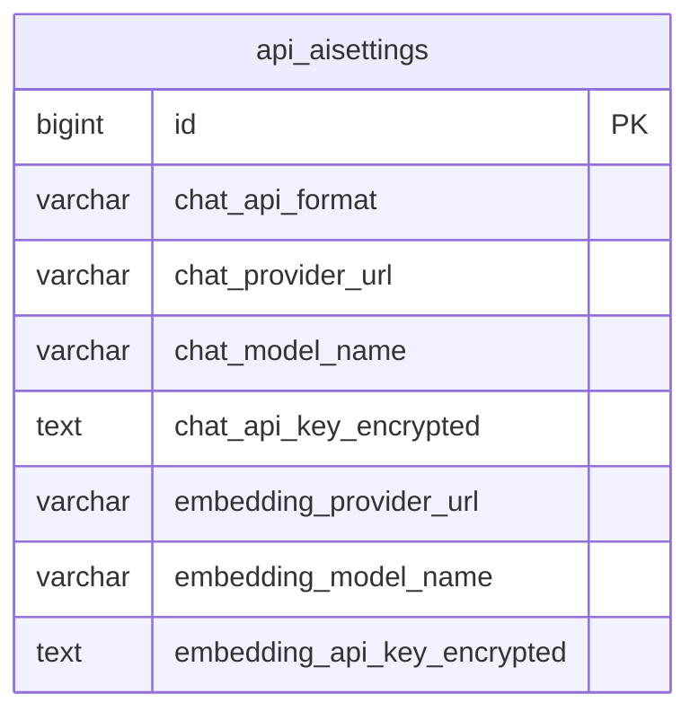

# Удаление allowlist хостов AI-провайдеров

- Задача: `remove-provider-host-allowlist`
- Ветка: `refactor/remove-provider-host-allowlist`
- Статус: согласована пользователем; реализована, выполняются проверки

ERD показывает существующую таблицу по models.py и миграции 0023. Связей с другими таблицами в затронутых настройках нет. Структура хранения не меняется; возможна миграция метаданных поля для исправления help_text.

## Постановка

Администратор должен задавать адрес AI-провайдера без изменения серверного списка разрешённых хостов. Сейчас адрес https://ai.kk-minsk.by/v1 отклоняется в административной форме и при выполнении запросов.

## Требования

- Удалить ограничение хостов для OpenAI-compatible Chat, Anthropic Messages, embeddings и подсчёта токенов.
- Удалить OPENAI_PROVIDER_ALLOWED_HOSTS и ANTHROPIC_PROVIDER_ALLOWED_HOSTS из кода и поставляемой конфигурации.
- Сохранить проверку корректного HTTPS URL, наличия хоста, отсутствия логина/пароля, query/fragment в Base URL и ограничение порта 443. Изменение касается только списка хостов.
- Убрать упоминания allowlist AI-провайдеров из ошибок и подсказок админки.
- Django ALLOWED_HOSTS для входящих запросов сохранить. PROVIDER_ALLOWED_HOSTS, используемый интеграцией Bitrix24, не относится к AI и остаётся в рамках этой задачи.
- Сохранить шифрование ключей, проверку замены ключа при смене хоста и выполнение внешних запросов через фоновые задачи.
- Не записывать переданные ключи и пароли в репозиторий или спецификацию.

## Планируемые изменения

1. Разделить проверку структуры URL и проверку разрешённых хостов CRM в providers.py, чтобы AI-вызовы обходились без списка хостов.
2. Обновить admin_forms.py, ai_service.py и context_tokens.py, удалить AI allowlist из settings.py, docker-compose.yml и .env.example.
3. Исправить help_text поля chat_api_format и при необходимости создать миграцию метаданных.
4. Обновить проверки: произвольный корректный AI-хост принимается формой и runtime; некорректные URL отклоняются; ограничение CRM сохраняется.
5. Выполнить Django check, makemigrations --check, целевые тесты, запуск Docker и просмотр логов backend/qcluster/waha. Создать PR в main и объединить после обязательных проверок и review.

## Критерии готовности

- https://ai.kk-minsk.by/v1 принимается без серверного allowlist для обоих Chat-протоколов и embeddings.
- Ограничение не остаётся ни в форме, ни в отправке запросов, ни в подсчёте токенов.
- Проверки проходят; makemigrations --check сообщает No changes detected.
- PR направлен в main; изменения проверены и объединены.
- Настройка удалённой модели qwen3.8 завершается после доставки изменения на сервер; способ доступа и выкладки требуется установить отдельно.

## Выполнение и проверки

- Удалены AI allowlist; проверка CRM/attachments сохранена отдельно от checked_ai_url.
- Добавлена миграция 0026, изменяющая только help_text.
- Django check: успешно. makemigrations --check: No changes detected (локальная PostgreSQL недоступна, проверка истории предупреждает об этом).
- 12 тестов api.tests_provider_urls и api.tests_analytics: успешно. Новые тесты включены в CI.
- ops/check_deployment.py: успешно, два существующих предупреждения HSTS.
- docker compose config --no-interpolate --quiet и git diff --check: успешно.
- Запуск основного Compose заблокирован отсутствием обязательных переменных окружения. Просмотрены логи существующих backend/qcluster/waha в Docker-контексте kk-minsk.by: backend и worker работают; WAHA остановил WhatsApp-сессию из-за несканированного QR. Это существующая конфигурация, а не проверка новой сборки.
- Доступ к серверу ai.mazory.best и способ выкладки не установлены. Удалённые настройки модели ещё не сохранены.
- Docker-образ mazory-provider-urls:check собран; в отдельном временном контейнере с тестовой SQLite успешно выполнены check, migrate (включая 0026), makemigrations --check и все 12 тестов. Проверки не затрагивали рабочую БД.
- npm run build: проверка типов и сборка успешны; существующие предупреждения Rollup о комментариях зависимостей и размере чанков.
