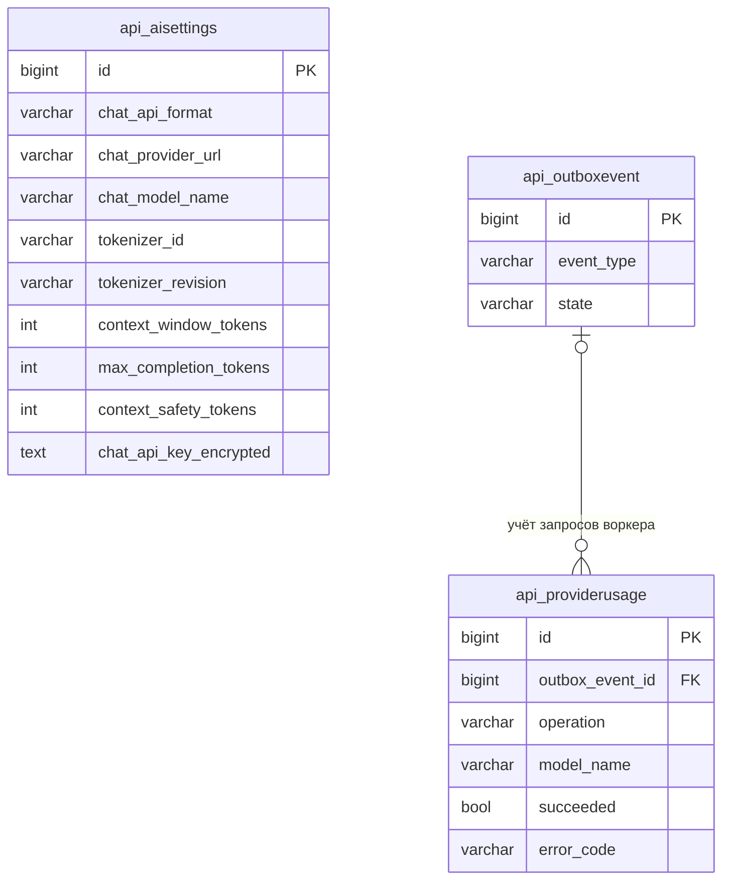
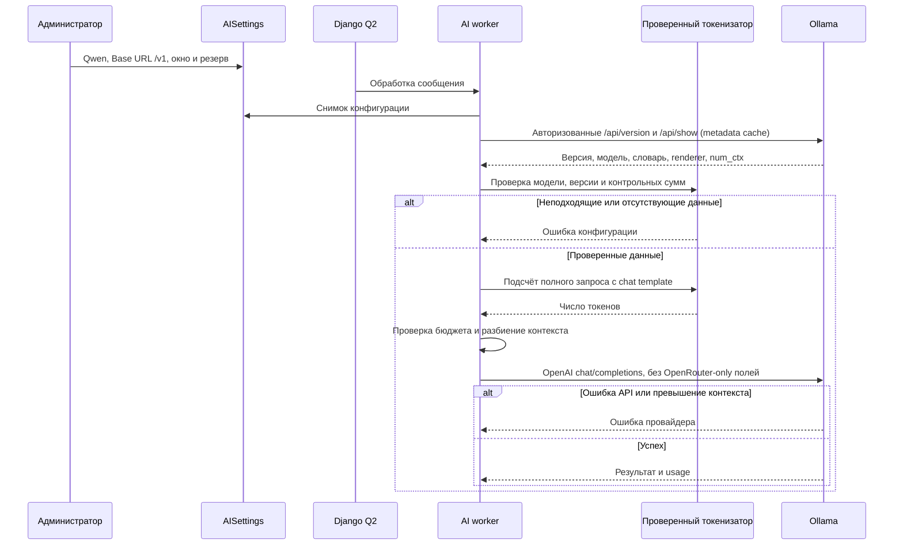

# Поддержка контекста Qwen в Ollama

- Задача: qwen-context-tokenizer
- Ветка: feature/qwen-context-tokenizer
- Статус: согласована пользователем; реализована, проверки перед PR

Показаны существующие поля AISettings по models.py. AISettings не имеет связей; ProviderUsage связан с существующим OutboxEvent необязательным FK. Планируется изменение активных настроек токенизатора; изменение структуры хранения не требуется, если существующих полей достаточно.

## Постановка и подтверждённое состояние

Релиз f6aabcd выложен на ai.mazory.best. Настройки qwen3.8, OpenAI-compatible, context_window_tokens=262144 и max_completion_tokens=8192 сохранены. По подтверждению пользователя Base URL исправлен на https://ai.kk-minsk.by/v1.

Подсчёт контекста сейчас привязан к единственному manifest Nemotron и требует OpenRouter /models/{model}/endpoints. Формирование extraction payload также добавляет OpenRouter provider/plugins. Для Ollama нужны отдельные проверенные данные токенизатора и формирование запросов без этих расширений.

Серверный /api/show для qwen3.8 подтверждает архитектуру qwen35, размер 27.3B, tokenizer.ggml.pre=qwen35, окно 262144 и num_ctx=262144. Название модели нельзя использовать как единственное доказательство совместимости токенизатора.

## Требования

- Проверить происхождение tokenizer assets и chat template установленной модели. Добавить закреплённую версию данных с контрольными суммами, совместимость подтвердить по словарю, special tokens и шаблону GGUF/Ollama. Не подменять их приблизительным токенизатором Nemotron.
- Разрешить выбор проверенного токенизатора по текущим полям tokenizer_id/tokenizer_revision; сохранить Nemotron и Anthropic.
- Для Ollama не обращаться к OpenRouter endpoint metadata. Проверять модель и окно по доступным метаданным Ollama, внешние обращения выполнять только в фоне. Проверка конфигурации должна выдавать понятную ошибку при несовпадении модели, версии или окна.
- В запросах Ollama исключить provider/plugins OpenRouter; корректно задавать max_tokens, JSON-ответ и режим thinking с учётом API Ollama. Подсчёт должен соответствовать фактически отправленному запросу.
- Сохранить разбиение длинных сообщений, резерв ответа, технический запас, снимки конфигурации, лимиты расходов и отсутствие логирования ключей.
- Не менять embeddings и не расширять список разрешённых хостов.

## Планируемые изменения

1. Проверить данные реальной модели на сервере; найти и закрепить совместимые tokenizer assets и шаблон. При невозможности доказать совместимость остановить эту часть и сообщить конкретную причину.
2. Обобщить загрузку manifest и NativeCounter, добавить профиль Qwen/Ollama в context_runtime и extraction_payload. При необходимости уточнить текущие подсказки админки и добавить миграцию только метаданных.
3. Добавить регрессионные тесты подсчёта, payload, границ окна, несовместимых tokenizer assets и отсутствия OpenRouter-вызовов для Ollama; сохранить тесты старых протоколов.
4. Выполнить Django check, migrate при наличии миграций, makemigrations --check, тесты, сборки и Docker-проверки. Создать PR в main и объединить после CI и review.
5. Выложить отдельный релиз на 79.108.164.63, сохранить предыдущий для отката, обновить backend/воркеры, настроить tokenizer_id/tokenizer_revision и проверить реальный проход фоновой обработки Qwen.

## Критерии готовности

- Qwen проходит context_runtime и фоновую обработку с настроенным окном 262144 и резервом 8192.
- Нет запросов к OpenRouter-specific endpoint metadata и полей provider/plugins в Ollama payload.
- Подсчёт токенов подтверждён против tokenizer/template установленной модели; длинные запросы разбиваются в рамках бюджета.
- Nemotron и Anthropic сохраняют прежнее поведение; все обязательные проверки и CI проходят.
- Код объединён в main, выложен; API ready и worker smoke-check успешны.

## Проверенная совместимость

Данные Qwen/Qwen3.8-27B закреплены на 1d4bf0f2ff6012fd82039f2fa52739d0dd7c60c0. Все 248077 используемых token ID и 247587 BPE merges совпадают с GGUF; оставшиеся 243 записи — UNUSED [PADn]. Special IDs и pretokenizer qwen35 проверены. Renderer qwen3.8 проверен по исходникам Ollama 0.34.0; extraction использует reasoning_effort=none. Runtime проверяет версию через /api/version и fingerprint словаря/merges и renderer через авторизованный /api/show в воркере. Метаданные учитываются в ProviderUsage и кешируются на 5 минут. Окно ограничивается минимумом model context_length и server num_ctx.

Три реальных extraction-запроса (кириллица, emoji, Unicode, JSON и история) дали prompt_tokens 575, 584 и 589 — точное совпадение с локальным подсчётом по закреплённому шаблону. Все три фоновые задачи завершились успешно.

## Совместимость и проверки

Официальный Qwen/Qwen3.8-27B закреплён на revision 1d4bf0f2ff6012fd82039f2fa52739d0dd7c60c0. Все 248077 используемых token ID и 247587 merges совпадают с установленным GGUF; оставшиеся 243 записи — UNUSED [PADn]. Проверены special IDs и pretokenizer qwen35. Renderer qwen3.8 проверен по исходникам Ollama 0.34.0; thinking отключён через reasoning_effort=none.

Runtime сверяет версию через /api/version и fingerprint словаря/merges, архитектуру и renderer через авторизованный /api/show. Запросы выполняются воркером, учитываются как model_metadata в ProviderUsage и кешируются на 5 минут; окно ограничено model context_length и server num_ctx.

Три реальных extraction-запроса с Unicode и историей дали prompt_tokens 575, 584 и 589 — точное совпадение с локальным подсчётом. Все фоновые задачи успешны. Локальные тесты также проверяют длинную историю, partial boundary, неверный словарь/renderer/версию, бюджет, кеширование и старые протоколы.

## Результаты проверок перед PR

- 24 теста api.tests_qwen_context, api.tests_provider_urls и api.tests_analytics: успешно.
- Django check: успешно; makemigrations --check: No changes detected (локальная PostgreSQL недоступна; проверка истории предупреждает об этом). Схема моделей не менялась.
- npm run build (vue-tsc + Vite): успешно; существующие предупреждения о комментариях зависимостей и размере чанков.
- ops/check_deployment.py: успешно; два существующих предупреждения HSTS.
- Compose config и git diff --check: успешно.
- Добавлен queue-only verify_ai_context: синтетическое сообщение, проверка метаданных и точного совпадения локального подсчёта с usage модели, без создания бизнес-данных. Его запуск предусмотрен после выкладки.
- Профиль закреплён для Ollama 0.34.0 и проверенного словаря/renderer; другая версия требует повторной проверки совместимости.
- Docker image собран; в отдельном контейнере с тестовой SQLite успешно выполнены check, migrate, makemigrations --check и все 24 теста. Рабочая БД не затрагивалась.
- Первое CI остановлено двумя false positive generic-api-key на публичных SHA-256 tokenizer.json/tokenizer_config.json. В существующие точные checksum-exceptions добавлены только эти две проверенные суммы; правила сканера сохраняются.
