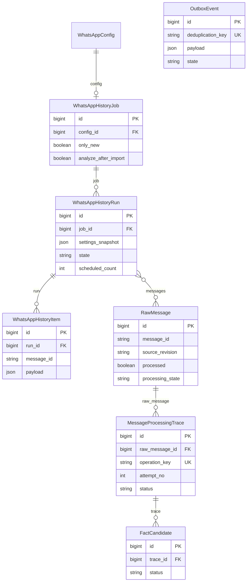
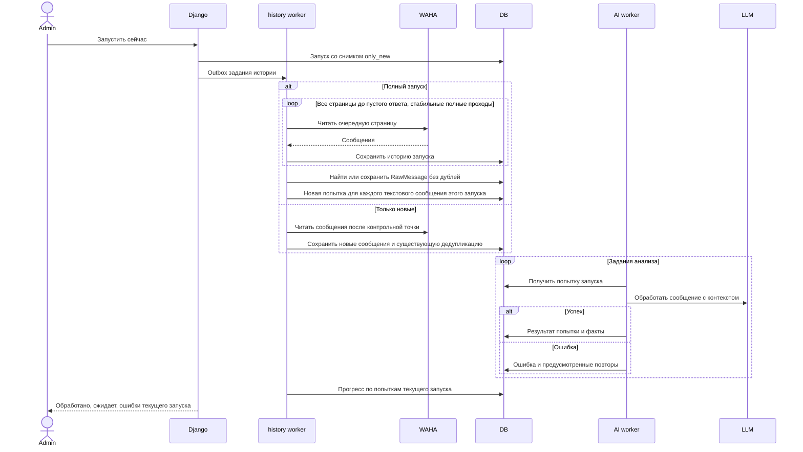

# Повторная обработка всей истории WhatsApp

Задача: `full-history-reprocessing`. Ветка: `bugfix/full-history-reprocessing`.
Статус: согласовано пользователем; реализовано. Выкладка после объединения PR.

ERD отражает существующую схему. OutboxEvent связывается с сообщением, попыткой и запуском через payload; физического FK нет. Предпочтительно использовать существующие попытки и ключи операций без миграции.

## Постановка и найденная причина

Полный импорт ошибочно применяет ограничения инкрементальной обработки. В persist_items сообщение получает задание только при processed=False и отсутствии любого старого extract:<raw_id>. Поэтому успешные сообщения пропускаются, а старые задания после ошибки препятствуют новому анализу. pipeline дополнительно пропускает processed=True без явно назначенной попытки. progress считает глобальное состояние RawMessage, смешивая старые результаты с текущим запуском.

## Требования

- При only_new=False кнопка «Запустить сейчас» читает все доступные WAHA сообщения выбранного чата до момента снимка запуска, без общего ограничения количества. Размер страницы ограничивает один запрос.
- Все текстовые сообщения полного запуска получают новую обработку независимо от наличия в БД, предыдущего успеха, ошибки и старого задания outbox.
- Повтор одного шага или доставка одного задания не создаёт второй анализ в рамках того же запуска; следующий полный запуск создаёт новую попытку.
- Только режим only_new=True сохраняет инкрементальный пропуск уже обработанных сообщений.
- Прогресс полного запуска отражает новые попытки: предыдущий успех не означает успех текущего запуска. Окончательные ошибки показываются явно; завершённый запуск не обещает успех сообщений, анализ которых завершился ошибкой.
- Сообщения без текста учитываются отдельно без бессодержательных запросов LLM. Медиа без текста не выдаются за успешно проанализированный текст.
- RawMessage не дублируются. Старые попытки сохраняются. Подтверждённые факты сохраняются и не применяются повторно; существующий pipeline заменяет неподтверждённые предложения после успешного нового анализа.
- Пауза AI, бюджет и механизм повторов сохраняются; ожидание активной обработки того же сообщения исключает гонки между старым и новым результатами.
- Учитывается analyze_after_import: при отключении выполняется только импорт, в интерфейсе это должно быть понятно.

## Планируемые изменения

1. Создавать для полного запуска отдельные идемпотентные операции history:<run_id>:extract:<raw_id> и явные MessageProcessingTrace; передавать trace_id и history_run_id в задания анализа.
2. Использовать существующий механизм явной повторной обработки, не сбрасывая старые результаты для обхода проверки processed.
3. Считать прогресс и завершение по операциям/попыткам текущего запуска, отдельно учитывать нетекстовые сообщения. Согласовать отображение ошибок и повторов в админке.
4. Сохранить постраничное чтение до пустого ответа. Проверить историю более 2000 сообщений, короткие промежуточные страницы, повторные проходы и отсутствие пропусков.
5. Добавить регрессионные проверки полного повторного запуска после успеха и ошибки, идемпотентности, гонок активных заданий, режима только новых и сохранения подтверждённых фактов.
6. Выполнить проверки, создать PR в main и объединить после CI/review. Развёртывание исправления на ai.mazory.best и проверка состояния сервисов. Полный платный анализ реальной истории запускается кнопкой пользователя; техническая проверка не создаёт массовых запросов к модели.

## Критерии готовности

- Смешанная история из новых, успешных и ошибочных сохранённых сообщений получает анализ каждого текстового сообщения при полном запуске.
- Новый полный запуск повторяет анализ; повтор шага текущего запуска его не дублирует.
- Старые ошибки/успехи не подменяют результаты текущего запуска.
- История более 2000 сообщений обрабатывается постранично целиком в пределах доступного хранилища WAHA; ограничения модели относятся к контексту одного запроса, не количеству заданий.
- Django check, makemigrations --check (No changes detected либо необходимые применённые миграции), регрессионные тесты, frontend npm run build, Docker и логи backend/qcluster/history/waha проверены; CI зелёный.
- Исправление объединено через PR и развёрнуто; секреты и содержимое переписки не попадают в репозиторий и отчёт.

## Реализация и проверки

Полные запуски сохраняют analysis_mode=reprocess_all; прежние запуски продолжают отображаться по старым правилам. Каждое текстовое сообщение получает отдельную MessageProcessingTrace и операцию history:<run_id>:extract:<raw_id>. Счётчики повторной обработки и причины ошибок привязаны к текущему запуску. Подтверждённые факты сохраняются существующим механизмом pipeline. При занятом сообщении outbox откладывает следующую попытку без расходования счётчика повторов.

Проверены 33 регрессионных теста (9 новых), включая 2101 сообщение, короткую промежуточную страницу, полный повтор после успеха/ошибки, идемпотентность, текущие ошибки поверх старого успеха, ожидание активной попытки, сохранение подтверждённых фактов и замену неподтверждённых. Django check, makemigrations --check, сборка Vue/TypeScript, проверка production-конфигурации и Compose проходят. Проверки Django/миграций и тестов выполняются также внутри изолированного Docker-контейнера с тестовой SQLite. Изменений схемы БД нет.
