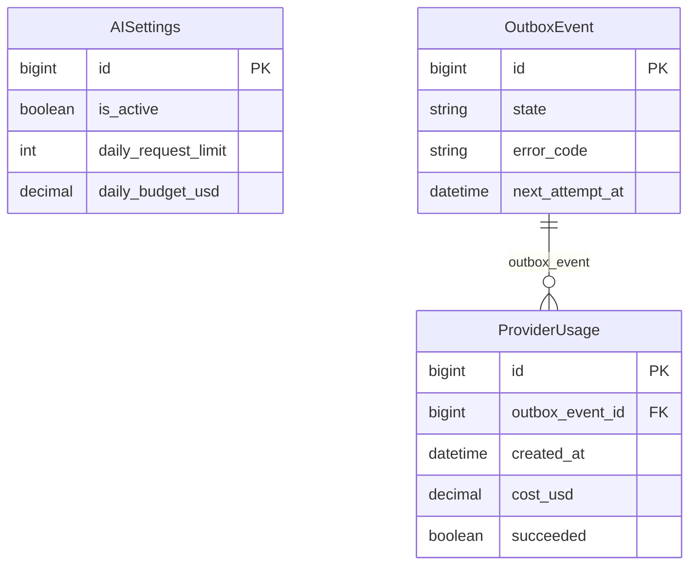
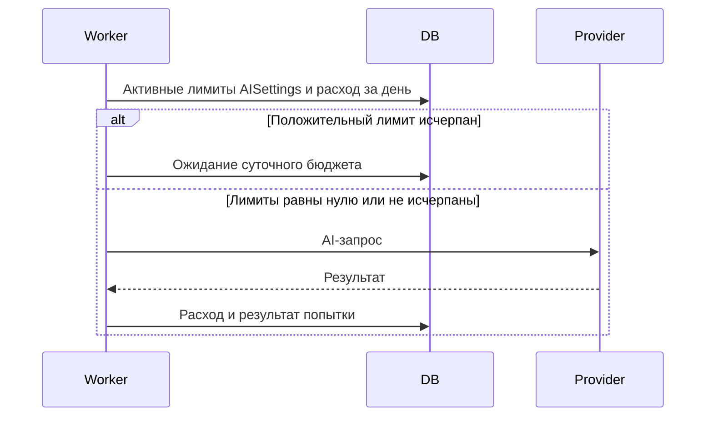

# Нулевые суточные лимиты AI означают отсутствие ограничений

Задача: `zero-ai-limits`. Ветка: `bugfix/zero-ai-limits`.
Статус: согласовано пользователем; реализовано, выполняются проверки и выкладка.

Текущая схема. AISettings применяется к запросам через активную конфигурацию, прямого FK на ProviderUsage нет. Меняется help_text полей AISettings; необходима миграция состояния Django, без изменения структуры столбцов.

## Постановка

Пользователь требует, чтобы 0 означал «без ограничений». Сейчас выражение cfg.daily_request_limit or settings.AI_DAILY_REQUEST_LIMIT подставляет серверные 1000 запросов, а аналогичное выражение бюджета подставляет 20 USD. Поэтому конфигурация с нулями блокирует обработку. На сервере 21 задание текущего импорта ожидает следующего дня именно по этой причине.

## Требования и изменения

- daily_request_limit=0 отключает ограничение числа запросов; daily_budget_usd=0 отключает ограничение расходов. Лимиты независимы.
- Положительные значения сохраняют ограничение, включая точное достижение порога. Серверные значения не заменяют явный ноль активной AISettings.
- Обновить help_text админки и создать соответствующую миграцию Django.
- Уведомления о приближении к лимиту используют значения активной AISettings и не срабатывают из-за нулевых лимитов; уведомления о реальных ошибках сохраняются.
- Проверить нулевые лимиты при превышении серверных значений, положительные пороги, независимость ограничений и сохранение учёта ProviderUsage.
- После объединения PR и выкладки применить миграцию; оставить оба значения действующей конфигурации 0. Возобновить уже ожидающие задания с ai_daily_budget_exhausted, сохранив историю попыток. Ошибку evidence_not_in_source не сбрасывать: она не связана с лимитами.
- Не менять ограничения окна контекста, размера ответа, авторизацию и проверки достоверности фактов.

## Критерии готовности

Нулевая конфигурация не блокирует AI-запросы и не наследует серверные лимиты. Положительные лимиты работают. Тесты, Django check, применённая миграция и makemigrations --check (No changes detected), сборка frontend и Docker-проверки проходят. PR в main проходит CI и объединяется. На ai.mazory.best развёрнуто исправление; ранее ожидавшие из-за бюджета сообщения продолжают выполняться без нового полного импорта.

## Реализация и проверки

AIService проверяет каждый суточный лимит только при значении больше нуля; подстановка серверных значений удалена. Уведомления используют ту же активную конфигурацию и порог 80% только для положительных лимитов. Миграция 0027 обновляет пояснения в админке, не меняя значения существующих настроек.

Добавлены пять регрессионных тестов: превышение серверных настроек при нулях, независимые положительные ограничения и точные пороги, сохранение учёта расходов, корректные предупреждения и уведомления о реальных ошибках. Все 38 backend-тестов прошли. Django check и makemigrations --check проходят, TypeScript/Vite сборка успешна. Применение миграций и проверки выполняются также в изолированном Docker-контейнере.
