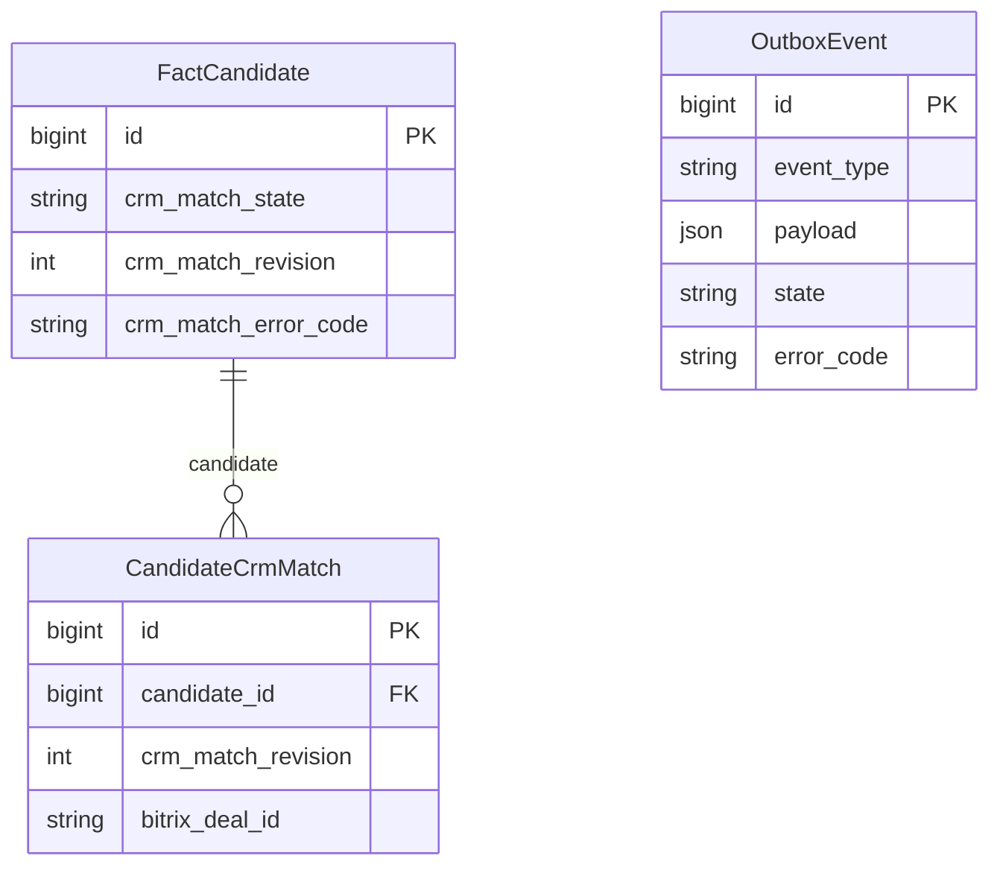
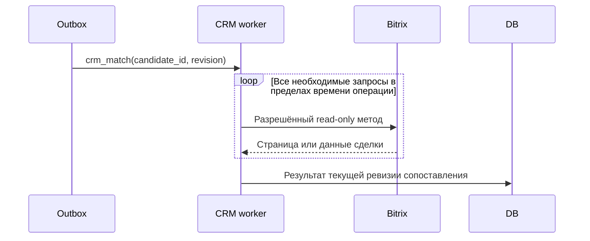

# Удаление лимита количества read-only запросов CRM

Задача: `remove-crm-request-limit`. Ветка: `bugfix/remove-crm-request-limit`.
Статус: согласовано пользователем; реализовано, выполняются проверки и выкладка.

Существующая схема. OutboxEvent связывается с FactCandidate через candidate_id и crm_match_revision в payload; FK отсутствует. Изменение схемы БД не требуется.

## Постановка

Пользователь требует убрать внутренний лимит CRM_MATCH_MAX_REQUESTS=16. Сейчас CrmReadBudget.next_timeout прерывает 17-й запрос ошибкой crm_match_request_limit, поэтому некоторые проверки фактов остаются незавершёнными.

## Требования и изменения

- Удалить константу CRM_MATCH_MAX_REQUESTS, параметр request_limit и проверку количества запросов в CrmReadBudget. Счётчик request_count можно сохранить для диагностики.
- Операция может выполнить больше 16 read-only запросов. Существующие timeout отдельного запроса, общий deadline, валидация пагинации и список разрешённых методов сохраняются.
- Существующее ограничение 10 страниц одного list-запроса не относится к удаляемому общему лимиту 16 запросов; оно остаётся в рамках этой задачи. Ошибки иных условий остановки продолжают показываться явно.
- Добавить тест более 16 последовательных запросов, проверки deadline и запрета методов записи.
- После проверок создать PR в main, объединить после CI/review, развернуть на ai.mazory.best.
- Возобновить CRM-проверки, остановленные именно crm_match_request_limit: только актуальные кандидаты и ревизии, штатным механизмом повторной постановки. Успешные проверки и другие ошибки не сбрасывать. Повторные задачи и результаты старых ревизий не должны дублировать результаты.

## Критерии готовности

17-й и последующие read-only запросы не блокируются счётчиком. Проверки времени, пагинации и разрешённых методов проходят. Django check, makemigrations --check (No changes detected), backend-тесты, frontend build и Docker-проверки успешны. PR объединён, исправление выложено; проверки с прежней ошибкой лимита возобновлены и их статус проверен.

## Реализация и проверки

Удалены константа 16 запросов, параметр request_limit и условие crm_match_request_limit из CrmReadBudget. Счётчик request_count остаётся для диагностики. В новых регрессионных тестах 40 последовательных разрешённых запросов доходят до транспорта; общий deadline и запрет методов записи сохраняются. Все 41 backend-тест прошли локально; Django check, makemigrations --check, frontend build, production-конфигурация и Compose проверены. Изменений схемы БД нет.
