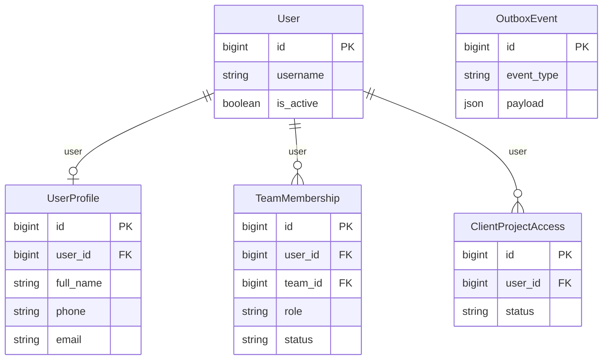
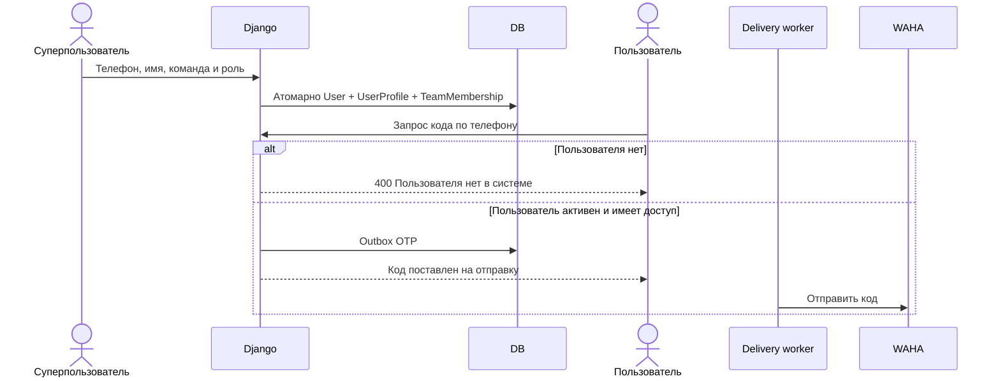

# Создание пользователей в админке и понятная ошибка входа

Задача: `unknown-phone-feedback`. Ветка: `bugfix/unknown-phone-feedback`.
Статус: согласовано пользователем; реализация.

Существующая схема; OTP-outbox связывается с User через user_id в payload. Структура БД не меняется.

## Постановка

Сервер для отсутствующего номера возвращает общий успешный ответ без постановки OTP в очередь. Модальное окно ошибочно переключается на ввод кода и сообщает «Код отправлен». Пользователь требует явное сообщение «Пользователя нет в системе». Дополнительно указал отсутствие создания пользователей и профилей в админке.

User зарегистрирован стандартным Django UserAdmin: has_add_permission=True, но в шаблоне Unfold кнопка требует show_add_link, которого у стандартного admin нет. UserProfileAdmin наследует ScopedReadOnlyAdmin: создание и изменение безусловно отключены. Существующий API /api/access/ умеет создавать User, UserProfile и TeamMembership, но в указанных разделах админки нет удобного пути.

## Требования и изменения

- Настроить UserAdmin для Unfold, чтобы кнопки создания и формы корректно отображались.
- Дать суперпользователю форму добавления пользователя для OTP-входа: телефон, имя, активная команда и роль (менеджер, руководитель, финансист). Телефон нормализуется общим правилом входа; повторный нормализованный номер не создаёт дубликат.
- Создавать User, связанный UserProfile и активное TeamMembership атомарно. Для OTP-пользователя пароль не требуется и устанавливается unusable; is_staff и is_superuser автоматически не выдаются. Существующая учётная запись admin и её пароль сохраняются.
- В UserProfile разрешить суперпользователю создание отсутствующего профиля для существующего User и изменение личных данных (имя, телефон, email, отдел); системные финансовые/KPI-поля оставить вне ручного изменения. Телефон профиля OTP-пользователя должен соответствовать его логину, чтобы не возникало разных идентичностей.
- Предоставить суперпользователю управление связью пользователя с командой/ролью через админку. Профильное текстовое поле role не заменяет TeamMembership как источник прав.
- Остальные пользователи сохраняют существующие права просмотра и ограничения доступа; новое управление пользователями не становится общедоступным.

- POST /api/auth/send-code/ для отсутствующего пользователя возвращает HTTP 400 с понятной ошибкой «Пользователя нет в системе».
- Модальное окно показывает эту ошибку и остаётся на вводе телефона, не показывает «Код отправлен».
- Существующие правила доступа, активность пользователя, очереди OTP, кулдаун и ограничения попыток сохраняются. Зарегистрированный пользователь без доступа получает отдельную понятную ошибку доступа; он не выдаётся за отсутствующего.
- Сохранить проверку ограничений запросов для отсутствующих номеров, чтобы проверка существования пользователя не обходила имеющийся кулдаун и лимиты.
- Успешный ответ означает постановку OTP на отправку; текст интерфейса не обещает доставку до результата фоновой отправки.
- Регрессионные проверки: видимость кнопки добавления, атомарное создание пользователя/профиля/доступа, нормализация телефона, дубликаты, отсутствие автоматических административных прав и запрет управления обычным пользователям; отсутствующий номер, зарегистрированный пользователь с доступом, существующий без доступа, неактивный пользователь, сохранение кулдауна и отсутствие OTP-задания при отказе.
- После проверок создать PR в main, объединить после CI/review и развернуть backend и frontend на ai.mazory.best.

## Критерии готовности

Суперпользователь видит кнопки добавления на /admin/auth/user/ и /admin/api/userprofile/ и может создать OTP-пользователя с профилем и выбранным командным доступом. Создание тестового рабочего аккаунта с правами и отправка реального OTP при проверке не выполняются без указанных пользователем данных; поведение проверяется автоматическими тестами и формами админки. На реальном сайте отсутствующий номер показывает «Пользователя нет в системе» и остаётся на шаге телефона. OTP не отправляется при отказе. Зарегистрированные пользователи с доступом сохраняют вход по коду. Backend-тесты, Django check, makemigrations --check (No changes detected), frontend typecheck/build и Docker-проверки проходят. PR объединён и исправление выложено. Схема БД неизменна.
