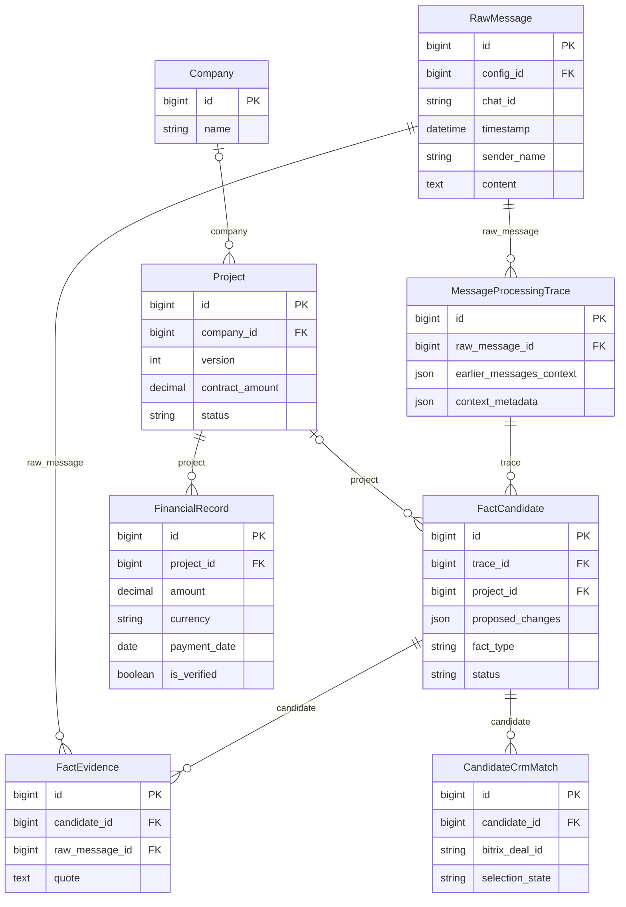
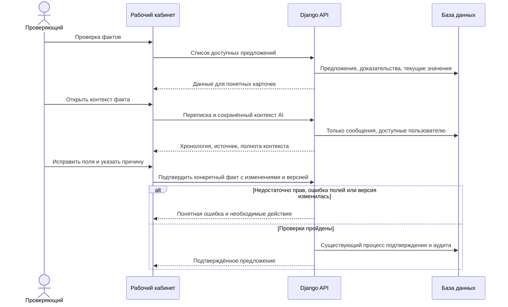

# Понятная проверка фактов с контекстом переписки

Задача: `fact-review-usability`. Ветка: `feature/fact-review-usability`.
Статус: согласовано пользователем; реализовано, локальные проверки пройдены.

Существующая схема проверена по models.py. Изменение схемы БД не планируется.

## Постановка

Пользователь не может уверенно проверять факты: названия полей, типы фактов, статусы, причины CRM-сопоставления и ошибки содержат технические английские значения. Карточка показывает отдельную цитату без цепочки переписки. Для исправления предлагается редактирование JSON.

Проверка исходников подтверждает: WorkspaceView напрямую выводит proposed_changes, fact_type, uncertainties и error_code, использует textarea с JSON.parse. candidate_data отдаёт цитаты, но не сохранённый earlier_messages_context и не переписку. Контекст AI уже сохраняется в MessageProcessingTrace. Подтверждение обрабатывается существующим facts.review с проверкой роли, версии, доказательств и причины исправления.

## Требования и планируемые изменения

1. Переработать раздел «Проверка фактов»: русские названия типов, полей, статусов, ролей, значений перечислений и объяснения CRM-проверки. Суммы с валютой, даты в читаемом виде, пустые значения «Не указано». Не выводить служебные поля как бизнес-данные.
2. Карточка объясняет, что обнаружено, к какому проекту относится и что будет записано после подтверждения. Для существующего проекта показывать доступные текущие значения рядом с предложенными; для нового объекта явно объяснить создание. Для платежей и обязательств описать соответствующее действие, без ложного обещания замены накопительной суммы или создания платежа из обещания.
3. Организовать список по проекту/чату, показывать связанные предложения и доступную навигацию по страницам. Каждое подтверждение остаётся отдельным проверяемым действием; объединение карточек не означает массовое принятие непроверенных фактов.
4. Показать цепочку переписки по времени: автор, дата, текст, выделенное исходное сообщение и цитата-доказательство. Добавить загрузку соседних более ранних/поздних сообщений того же чата с пагинацией. Не подменять окружающую переписку «контекстом AI»: отдельно отметить сообщения, действительно использованные при извлечении, и доступные сведения о неполноте/обрезке сохранённого контекста.
5. Данные контекста получать отдельным аутентифицированным API по запросу раскрытия карточки. Проверять доступ к предложению и каждому сообщению через существующие access.candidates_for/messages_for. Не раскрывать текст, авторов и идентификаторы недоступных источников из trace JSON; не читать внешние сервисы в HTTP-обработчике. Учитывать удалённый источник, неизвестное время и отсутствие сохранённой истории: честное пояснение вместо выдуманного контекста.
6. Заменить JSON-редактор формой для каждого типа факта: проект (объект, компания, стадия, суммы, валюта, текущий/следующий шаг), платёж (сумма, валюта, дата, вид платежа и необходимые ссылки для корректировки), обязательство (текст и срок с точностью). Использовать поддерживаемые сервером поля и значения. Факт, доказательства, уверенность и служебные идентификаторы нельзя произвольно менять. Проверка чисел/дат, причина исправления, понятные подписи кнопок «Подтвердить», «Сохранить исправления и подтвердить», «Отменить исправления», «Отклонить».
7. Показывать понятные русские ошибки с подсказкой действия: конфликт версии, отсутствие прав, обязательные поля, отсутствующий источник, проблемы CRM. Код ошибки и технические сведения — только в необязательной свёрнутой диагностике. Не показывать пользователю сырой JSON или неизвестный английский код как основное сообщение. Свободный исходный текст переписки не переводить и не менять.
Отдельный API списка подтверждённых платежей выбранного проекта используется для выбора исходной операции корректировки. Он доступен только финансисту/суперпользователю, поддерживает пагинацию и не ограничивается текущим месяцем. ID платежа остаётся числовым на фронтенде.

8. Сохранить финансовые права, выбор сделки CRM отдельным действием, исходную цитату, аудит, проверку версии и идемпотентность существующего подтверждения. Не вводить автоматическое подтверждение или менять правила расчётов в рамках визуальной переработки.
9. Выделить компоненты карточки, контекста и формы; типы DTO в frontend/src/types/, без any и смешанных типов ID. Схема БД не меняется.

## Проверки и критерии готовности

- Backend-тесты: доступ к контексту, запрет утечки чужого чата/недоступных сообщений из снимка AI, порядок и пагинация истории, отсутствие/удаление источника, корректные текущие значения.
- Frontend-тесты: русские карточки и ошибки, форма вместо JSON, отмена правок, корректный payload для каждого типа факта, отображение цепочки и состояний загрузки, сохранение ограничений подтверждения.
- Проверить сценарии нового/существующего проекта, платежа, обязательства, выбора CRM и конфликта версии. Никаких реальных подтверждений финансовых или иных рабочих фактов при визуальной проверке.
- Frontend typecheck/build/tests, backend tests/check, makemigrations --check (No changes detected), Docker запуск и логи; CI PR в main.
- После согласования, реализации и CI объединить PR и развернуть backend/frontend на ai.mazory.best. Проверить браузером русский интерфейс, контекст и форму; сохранить скриншот результата. Не создавать дополнительные постоянные документы задачи.
