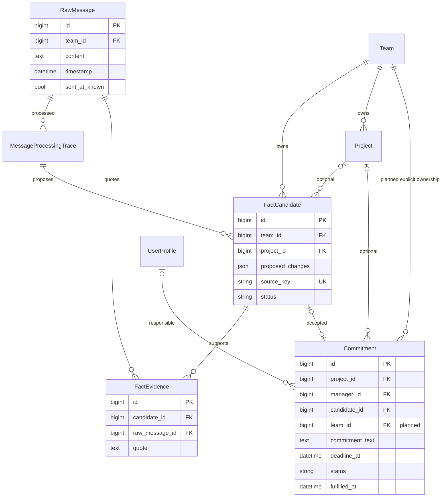
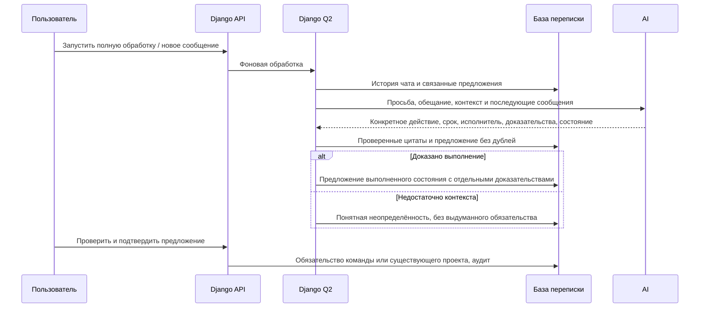

# Обязательства по полной цепочке переписки и пустой справочник проектов

Ветка: `feature/contextual-commitments`. Постановка: прямой запрос пользователя.

Текущие связи проверены по `backend/api/models.py`. У Commitment уже допускается отсутствие проекта; явная принадлежность команде планируется для безопасного доступа к таким задачам. Остальные изменения схемы уточнить в этой же спецификации при реализации.

## Постановка и установленные причины

Первое предложение содержит «Тогда завтра», а не действие. Текущий WORKER_PROMPT ограничивает извлечение одним сообщением и доказательство цитатой из него. История для извлечения включает только предыдущие сообщения. Подтверждение любого непроектного факта требует проект, хотя модель Commitment допускает project=null; сохранение также предполагает наличие project.manager и project.pk.

В доступной цепочке есть просьба прислать таблицу, ссылка и обещание Жаната «Да с утра отправлю Мака». «Тогда завтра» написал другой участник: его нельзя назначать исполнителем обещания. В теле сообщений присутствуют заголовки экспортированной переписки с датами августа, отличающимися от даты поступления в систему в сентябре. Последующее выполнение требует проверки всей соответствующей цепочки, а не предположения по одному подтверждению получения.

## Требования и изменения

1. Восстанавливать обязательство из связанных сообщений: действие, предмет, источник/ссылка, автор обещания, получатель и срок. Короткие согласия сами по себе не создавать как обязательства. Финансовые факты из истории не дублировать.
2. Для примера пользователя формулировка: «Отправить список действующих объектов за 2026 год из онлайн-таблицы», с сохранением указанной ссылки. «Утром» трактовать как 09:00 согласно запросу пользователя, показывать, что время уточнено правилом, а не буквально процитировано. Дату и часовой пояс выводить из исходной переписки; надёжно распознанные заголовки экспорта хранить/передавать с происхождением, сохраняя оригинальный текст и дату получения. Не распознавать произвольный текст как достоверные метаданные.
3. Учитывать более поздние сообщения для состояния обязательства. Прямое связанное сообщение об отправке/выполнении или подтверждение результата должно поддерживать предложение «Выполнено» с цитатами и временем. Простое «Принято», обсуждение другой задачи или существование ссылки не являются достаточным доказательством.
4. Разделить доказательства постановки и выполнения, проверять точные цитаты в соответствующих доступных сообщениях. При обработке новых сообщений пересматривать связанные обязательства; при полной истории учитывать весь загруженный чат без произвольного ограничения числом сообщений. Соблюдать окно модели, при необходимости обрабатывать последовательными частями с сохранением связей.
5. Разрешить общие обязательства команды без проекта. Исправить backend-подтверждение, права доступа, интерфейс, уведомления и сериализацию таких задач. Не создавать фиктивный проект «список объектов». Для обязательства конкретного объекта предложить существующий проект либо проверку/создание реального проекта из подтверждённых данных.
6. Проверить пустой справочник: различать отсутствующие проекты, непроверенные предложения и ограничения доступа. Реальные проекты из переписки предлагать к созданию/сопоставлению с доказательствами; показать понятное действие для подтверждения проекта при пустом списке. Не импортировать все строки внешней таблицы автоматически и не выдавать проекты за подтверждённые без проверки.
7. Предотвращать дубли при повторных запусках; исправленные предложения заменяют прежние с сохранением аудита. Подтверждённые человеком факты не переписывать молча. Предложения и доказательства ограничивать командой и чатом, исполнителя не угадывать при неоднозначности.
8. После выкладки повторно обработать затронутую историю и проверить исправление предложения «Тогда завтра». Не подтверждать бизнес-факты от имени пользователя автоматически.

9. Все пояснения AI, неопределённости, причины выбора стадии и ошибки в рабочем кабинете должны быть на русском. Требовать русский язык в контракте извлечения; уже сохранённые английские пояснения преобразовать в понятный русский текст, сохранив исходник только в свёрнутой технической диагностике. Пример: «Отдельные проекты не перечислены; приведены только общие суммы»; «Стадия „В работе“ предположена, поскольку проекты названы действующими». Предположение о стадии не выдавать за подтверждённый факт.

10. Определять исходную дату и время отправки каждого целевого сообщения: по метаданным либо достоверному заголовку экспортированной переписки. Сохранять происхождение даты. Для этой установки пользователь явно указал UTC+6: согласовать настройку источника, расчёт сроков и отображение в этом смещении. Моменты времени хранить в UTC.
11. Передавать AI исходное время отправки, текущий момент и UTC+6. «Завтра», «сегодня» и другие относительные даты вычислять от исходной отправки именно реплики с соответствующим выражением, а не от анализа, импорта или другой реплики. Сравнивать полученный срок с текущим временем в UTC+6; это сравнение не меняет исходный срок и не доказывает выполнение. Выполненная задача остаётся выполненной даже после истечения срока.
12. Если дата отправки неизвестна или противоречива, показывать неопределённость и не выдумывать срок. Отличать дату импорта от исходной даты в интерфейсе и доказательствах.

## Критерии готовности и проверки

- Регрессия на цепочку просьба → ссылка → «Тогда завтра» → «с утра отправлю» → доказательство выполнения: конкретное обязательство, верный автор и дата, 09:00 с пояснением, выполненное состояние с доказательствами.
- Нет ложного выполнения по общему согласию; нет дублей при повторной обработке; подтверждённые записи защищены.
- Общая задача подтверждается и доступна руководителю своей команды при пустом справочнике; чужие команды недоступны.
- Пустой список проектов сопровождается объяснением и рабочим сценарием проверки/создания реального проекта.
- Тесты backend/frontend, `npm run build`, Django `check`, `makemigrations --check` (No changes detected после создания необходимых миграций), применение миграций, Docker-запуск и логи backend/qcluster/WAHA.
- PR в main, CI и review, merge, выкладка и проверка на ai.mazory.best.

Дополнительные регрессии: повторный анализ старого сообщения сегодня; граница полуночи UTC+6; реплики в разные дни; дата импорта отличается от отправки; неизвестная дата; выполненное обязательство с прошедшим сроком.

## Уточнение реализации

- Миграция добавляет Commitment.team и responsible_name; принадлежность существующих записей заполняется из проекта, кандидата или сообщения.
- Даты экспорта распознаются только для явно настроенного источника. export_imported_until отделяет старую импортированную переписку от последующих живых сообщений, чтобы дата приёма новых сообщений оставалась достоверной.
- Существующие подтверждённые проекты автоматически не создаются: в проверенном чате сейчас 0 подтверждённых проектов и 468 предложений по проектам. В интерфейсе добавлен фильтр и переход к их проверке при пустом справочнике.
- Последующий однозначно связанный разбор получателем запрошенной таблицы с перечислением её объектов может служить доказательством получения результата; одна общая сумма или ссылка сами по себе недостаточны.
- Подтверждённое обязательство обновляется только после отдельного принятия предложения о выполнении, с проверкой версии и аудитом.
