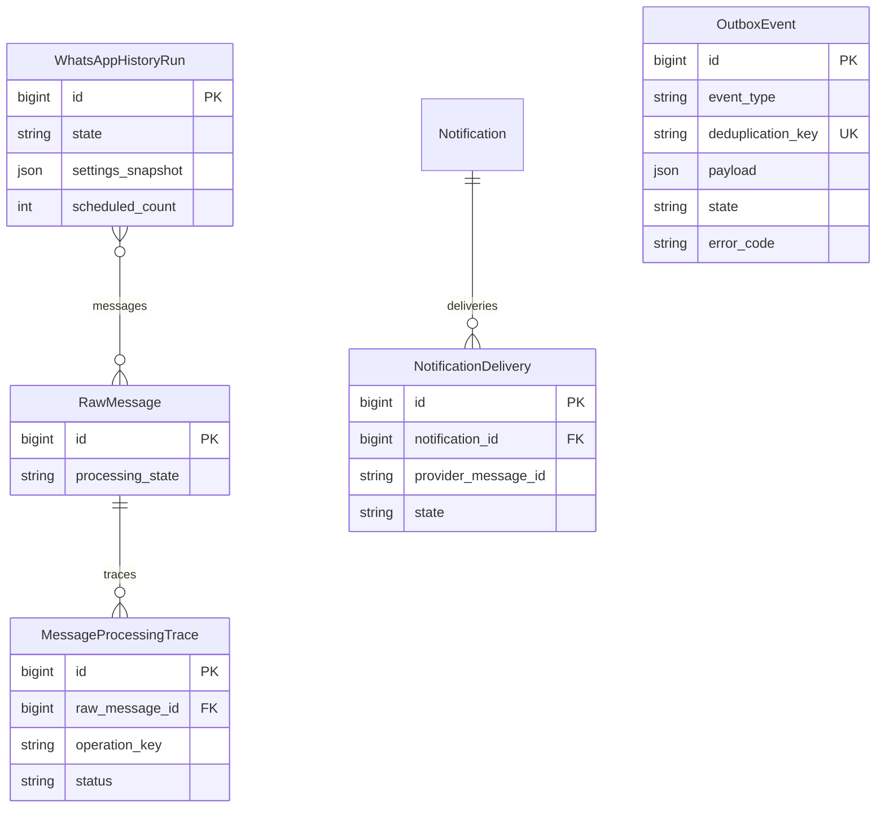
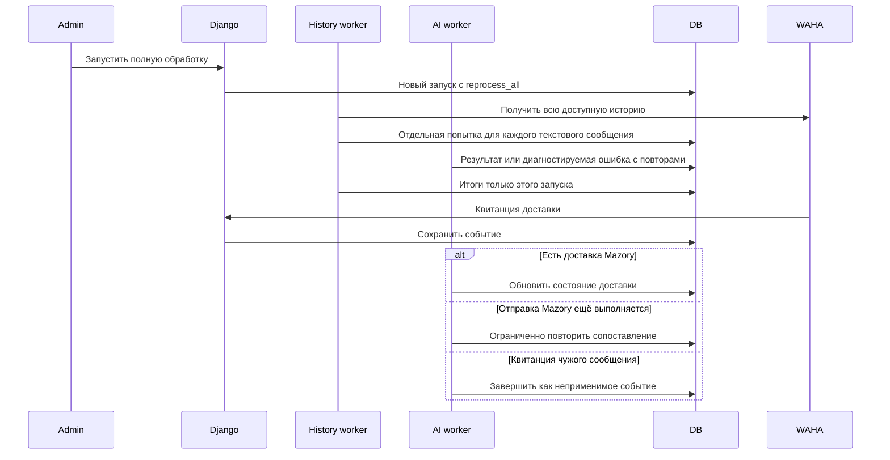

# Исправление версий воркеров, полной обработки истории и квитанций доставки

Ветка: `bugfix/worker-history-outbox`. Сервер: `79.108.164.63`. Прямой запрос пользователя.

Связь OutboxEvent с сообщением/запуском/доставкой хранится в payload, не во внешних ключах. Структура проверена по актуальному models.py; изменения схемы не планируются.

## Диагностика

Backend использует a634e5a, воркеры — a7af42f. Проверка реального кода history worker показала отсутствие ветки reprocess_all: уже обработанные сообщения пропускаются. В AI worker отсутствует checked_ai_url нового кода. Запуск №10 получил 205 сообщений, направил только одно, завершился с итогом 202/205 и тремя ошибками; старые результаты учитывались как новые. В очереди 2417 failed delivery_ack с delivery_receipt_waiting_for_send: обработчик требует доставку NotificationDelivery для всех исходящих квитанций WhatsApp.

## Требования и изменения

1. Привести backend, все воркеры и outbox к единой проверенной версии; проверить фактический код в контейнерах, миграции и работоспособность. Сохранить настройки, тома и несвязанные сервисы. Проверить отличия старого release перед заменой.
2. Исправить обработку квитанций: неприменимые квитанции не являются ошибкой; сохранить повтор для гонки между квитанцией и ответом на настоящую отправку Mazory. Не отмечать фактическую доставку без подтверждения.
3. Сохранить аудит старых ошибок. После исправления повторно сопоставить только безопасно восстановимые квитанции; не отправлять сообщения повторно.
4. Восстановить обработку проблемных сообщений отдельными попытками, проверить причины неверных цитат/обрезанного ответа/перегрузки и применимые исправления. Не принимать финансовые факты автоматически и не ослаблять проверку доказательств.
5. Запустить полную повторную обработку чата после выравнивания версий; каждый текстовый источник получает попытку данного запуска, включая ранее успешные и ошибочные. Итоговый статус различает успех и завершение с ошибками, не использует прежние результаты.
6. Добавить проверку согласованности версии при выкладке в существующие механизмы проекта, если применимо, без новых постоянных документов.

## Готовность

Регрессионные проверки посторонней квитанции, гонки настоящей отправки и полной обработки ранее сохранённых сообщений. Django check, makemigrations --check, необходимые тесты, frontend build при изменении frontend, запуск Docker и логи backend/qcluster/WAHA. PR в main, CI, merge. На сервере проверены одинаковые версии, нет новых ложных ошибок доставки, повторная история действительно направляет все текстовые сообщения; отчёт явно указывает реальные остаточные ошибки провайдера, если они остаются.
