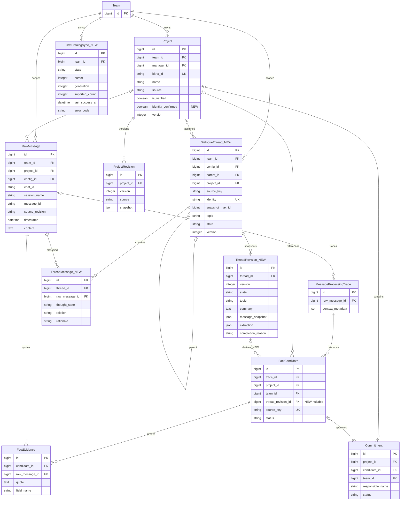
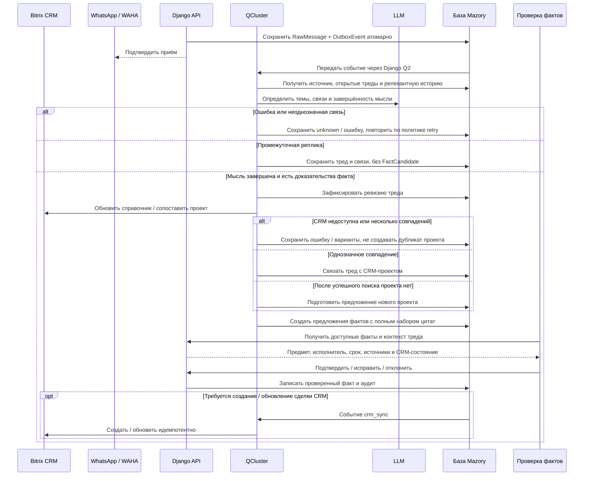

# Проекты Bitrix CRM и факты из завершённых тредов WhatsApp

- Задача: `crm-dialogue-threads`, прямой запрос пользователя, без GitHub Issue.
- Ветка: `feature/crm-dialogue-threads`, база: актуальная `main`.
- Создано: 2026-10-04 11:54:07 (MSK, UTC+3).
- Статус: согласовано пользователем 2026-10-04; реализация начата.

## Структура данных

Текущие сущности и связи проверены по `backend/api/models.py` и миграциям до `0028_contextual_commitments`. Сущности с суффиксом NEW и поля с пометкой NEW ниже — планируемые изменения. Остальные сущности существуют; показана только затрагиваемая часть схемы.



Ограничения NEW: уникальность `(thread_id, raw_message_id)` и `(thread_id, version)`, родитель и дети в одном источнике и команде, запрет циклов. Одно сообщение допускает несколько тематических связей, если действительно касается нескольких тем. ID локальных сущностей — `int`/`number`; существующие внешние Bitrix ID остаются `str`/`string`.

## Сквозной процесс



Импорт справочника CRM — самостоятельная фоновая операция, запускается и без завершённых тредов. HTTP-обработчики не вызывают CRM, WAHA или LLM синхронно.

## Постановка и текущее поведение

1. В «Рабочем столе → Проверка фактов» проекты должны загружаться из Bitrix CRM и быть доступны для привязки фактов.
2. Реплики вроде «сделаешь завтра?» или «Тогда завтра» нельзя показывать как самостоятельные предложения обязательств. Нужно восстанавливать завершённую мысль из диалога, включая перемежающиеся темы и подтреды.
3. Нужны воспроизводимые локальные e2e-тесты всего процесса.

Сейчас `DirectoryView` возвращает только доступные `Project(is_verified=True)` и ограничивает выдачу 500 записями. `BitrixService.propose_import` создаёт предложения, а не готовый справочник. `pipeline.extract_message` анализирует целевую реплику и историю; `commitment_evidence.validate_commitment` уже проверяет цитаты и отсеивает отдельные короткие ответы. Постоянной модели тредов нет. Единственный существующий Playwright-сценарий проверяет аналитику с подменой API, поэтому не проверяет связку backend → очередь → CRM → UI.

## Требования: справочник Bitrix

- Реализовать первичную и повторную фоновую загрузку доступных сделок CRM с пагинацией и сохранением прогресса. Использовать существующие настройки интеграции и сопоставление команды через `BITRIX_TEAM_ID`; отсутствие сопоставления показывать как ошибку конфигурации.
- По умолчанию CRM-проект соответствует сделке `crm.deal`, согласно текущей модели `Project`. Не подменять это сущностью рабочих групп Bitrix.
- Локальная идентичность проекта создаётся/обновляется по уникальному `bitrix_id`; сопоставление ответственного по `UserProfile.bitrix_user_id`. Не назначать произвольного сотрудника при отсутствии соответствия.
- CRM считается источником справочника проектов. Доступность для выбора отделить от ручного подтверждения финансов: импорт имени и внешней идентичности не должен автоматически подтверждать платежи, стоимость, маржу или предложения WhatsApp. Сохранить `is_verified` и правила аналитики, расширить критерий справочника на импортированные CRM-проекты.
- Не перезаписывать проверенные локальные финансовые значения без существующего процесса review. Версии и конфликты обрабатывать явно.
- Добавить пагинацию/поиск справочника вместо незаметного обрезания после 500 проектов; обновить все затронутые потребители API.
- Сохранить разграничение доступа: руководитель/финансист видят свою команду, менеджер — назначенные проекты. Не расширять доступ всем менеджерам из-за импорта.
- UI показывает состояние загрузки, дату успешной синхронизации, ошибку и возможность повторить загрузку уполномоченным пользователем. Пустые состояния различают отсутствие проектов, отсутствие доступа и недоступность CRM.
- Повторные запуски и webhooks не дублируют проекты. Ошибка страницы не означает успешную полную синхронизацию; исчезновение сделки из неполной выдачи не архивирует её.

## Требования: треды и завершённость мысли

- Каждому диалогу назначить стабильный числовой ID и тему; тематические ответвления имеют `parent_id`. Хранить происхождение, участников, сообщения, состояние и версии.
- Каждой тематической связи сообщения назначить `intermediate`, `final` или `unknown`. Состояния треда: `open`, `ready`, `unknown`, `superseded`. `ready` означает завершённую мысль, а не выполненную задачу.
- Использовать reply/quoted-message ID, участников, предмет обсуждения, время и семантическое сопоставление. Смена темы или пауза — сигнал для сегментации, но сами по себе не доказывают обещание или завершённость.
- Новые сообщения сопоставлять с существующими тредами, включая ранее завершённые, и релевантной историей того же источника. Сохранять обоснование назначения; неопределённую связь не превращать в уверенный факт.
- Всю импортированную и новую доступную переписку распределять по тредам/подтредам. Некоммерческие сообщения тоже получают тематическую принадлежность; неясные — `unknown`. Не требуется создавать бизнес-факт из каждого треда.
- Финализация выполняется на уровне конкретной темы. Незавершённый соседний подтред не блокирует готовое обязательство другой темы.
- Только ревизия `ready` с валидными источниками может создавать предложения. Предмет действия и явное обещание либо назначение обязательны; исполнитель выводится из подтверждающих реплик. Неизвестный срок допустим с явной пометкой, неизвестное действие — нет.
- Пример: «Подготовь смету по объекту А» → «Сделаешь завтра?» → без ответа: предложения нет. Ответ исполнителя «Да, подготовлю завтра» завершает мысль и создаёт одно предложение со всеми относящимися цитатами.
- «Тогда завтра» может уточнять срок уже известного обязательства только при однозначной связи с предметом и обещанием; сама по себе не создаёт обязательство.
- Источники факта — сообщения треда с ролями просьба/обещание/срок/выполнение. Каждая цитата проверяется по исходному тексту; IDs проверяются в границах команды, чата и сессии. Перемежающаяся тема не становится доказательством.
- Относительные сроки вычислять от исходной даты сообщения со сроком и действующего часового пояса источника. Неизвестную дату не заменять временем получения.
- Повторная обработка одного треда не создаёт дубликаты. Ключ бизнес-факта стабилен между ревизиями; разные обязательства одного треда различаются. Новая ревизия может заменить неподтверждённое предложение, а подтверждённое изменяется только через review.
- Поздние, отредактированные и удалённые сообщения вызывают пересмотр соответствующих тредов. Устаревшие результаты LLM не записываются поверх новой версии. Работа по одному источнику защищена от гонок.
- Бюджет контекста ограничен возможностями модели: искать релевантные треды, хранить краткое содержание со ссылками, подгружать первоисточники доказательств. Краткое содержание не является доказательством факта.
- Сбой LLM, исчерпание бюджета и невалидная схема — состояние обработки/ошибка, а не повод выставить промежуточную реплику на review.

## Требования: привязка к проекту и UI

- После завершения мысли сопоставлять проект по CRM ID, явным реквизитам, объекту и компании. Название темы само по себе не основание для создания сделки.
- Однозначное совпадение связывает тред с проектом; неоднозначность предоставляет проверяющему варианты. При недоступной CRM не трактовать результат как «проект не найден».
- Если поиск успешен и совпадений нет, подготовить предложение создания проекта с цитатами. Предлагаемая политика: создание проекта и внешней сделки после подтверждения предложения пользователем, затем привязка треда и связанных фактов. Это сохраняет существующее правило ручной проверки бизнес-фактов.
- Общекомандные обязательства допускаются без проекта и не создают фиктивную сделку.
- В «Проверке фактов» показывать только готовые предложения: тему и ID треда, конкретное действие, исполнителя, срок и полный относящийся контекст. Открытые/unknown мысли доступны в контексте переписки, но не засоряют очередь фактов.
- Для старых pending-предложений провести фоновый пересмотр по тредам: сохранить аудит, убрать неподтверждённые фрагменты через `superseded`; одобренные записи не отменять автоматически. Результаты пересмотра фиксировать в ревизиях.
- Сохранить прямые DTO DRF, JWT, `IsAuthenticated`, строгие типы без `any`; запросы фронтенда относительно `VITE_API_URL`.

## Планируемые изменения

1. Модели и миграции тредов, связей, ревизий, статуса импорта CRM и связи кандидата с ревизией; индексы по источнику/состоянию/времени и ограничения уникальности.
2. Фоновый импорт справочника в `bitrix_service.py` и `tasks.py`; durable OutboxEvent, retry, управление синхронизацией через защищённый API.
3. Новый слой сегментации и поиска контекста перед извлечением; обновить схемы ответа LLM, prompt, pipeline, валидацию доказательств и дедупликацию на уровне треда.
4. Обработка новой переписки и исторического импорта через один процесс; контролируемый backfill существующей истории и пересмотр pending.
5. API справочника, контекста треда и CRM-состояний; компоненты `WorkspaceView`/`FactConversation`, типы в `frontend/src/types/`.
6. Backend-тесты инвариантов и локальные Playwright e2e по реальным API и воркеру, с детерминированными локальными HTTP-заменами только для Bitrix/WAHA/LLM.

## Локальные e2e и проверки

Отдельная тестовая БД и тестовые настройки провайдеров; без production-токенов, реальных WhatsApp-рассылок и записи в боевой Bitrix. Переносимый локальный стенд обслуживает собранный Vue через тестовый Django на `127.0.0.1:18080`, с настоящей аутентифицированной сессией. Отдельный настоящий воркер Django Q2 использует ORM-брокер и изолированную SQLite; production Compose использует Redis и nginx. Проверка паритета Docker/Redis выполняется отдельно. Тесты не подменяют `/api/*` через `page.route`; проверяют результат обработки очереди и запись в БД через наблюдаемый API. Ожидания по состояниям с ограниченным таймаутом, без фиксированных задержек. Команда запуска и очистка приведены ниже.

Обязательные сценарии:

1. CRM содержит проекты, локальный справочник пуст: фоновая загрузка делает проекты доступными в форме; повтор и более одной страницы не создают дубликатов, поиск находит проект за пределами первых 500.
2. Импорт не подтверждает финансовые факты и не открывает чужую команду/чужие проекты менеджеру.
3. Незавершённая просьба и отдельное «Тогда завтра» не появляются в проверке фактов; после явного обещания появляется одно конкретное обязательство с полным контекстом.
4. Две перемежающиеся темы/подтемы: ответы и сроки относятся к правильным обязательствам и проектам; завершение одной темы не публикует вторую.
5. Завершённый тред сопоставляется с CRM-проектом; неоднозначное совпадение требует выбора; отсутствие совпадений приводит к предложению нового проекта, подтверждение связывает тред без дублей.
6. Общее обязательство создаётся без проекта; новый факт не возникает из простого подтверждения прежнего обещания.
7. Повтор webhook, повтор воркера, позднее сообщение и изменение источника сохраняют стабильные ID и корректные ревизии; проверенный факт не перезаписывается автоматически.
8. Сбой/таймаут CRM либо LLM, unknown-ответ и невалидная цитата не создают фрагментарные предложения; восстановление даёт один результат.
9. Исторический импорт формирует те же треды и факты, что и последовательная доставка; старые фрагментарные pending скрываются с сохранением аудита.
10. UI раскрывает только доступные источники, показывает русские подписи и готовый контекст на desktop/mobile.

Перед коммитом: профильные backend-тесты, `npm run build`, Playwright e2e, Django `check`, `makemigrations --check` с `No changes detected`; применить миграции, поднять Docker-сервисы и проверить логи `backend qcluster waha`. После успешных проверок создать PR в `main`, пройти проверки/review и объединить согласно AGENTS.md.

## Критерии готовности

- Проекты CRM доступны для привязки фактов согласно правам без ручного создания каждого проекта в Mazory.
- Переписка хранится в стабильных тредах и подтредах с темой и классификацией сообщений; завершённость мысли проверяется до публикации факта.
- Промежуточные и неизвестные фрагменты не видны в очереди проверки; готовое обязательство содержит предмет и проверяемый набор цитат.
- Привязка/создание проекта, пересмотр истории и retry проходят без дублей, смешения команд или автоматической перезаписи подтверждённых фактов.
- Локальные e2e проверяют полный процесс, повторяемо проходят и имеют воспроизводимую команду запуска.
- Все обязательные проверки успешны; PR нацелен на `main`.

## Согласуемые решения

Подтверждение этой спецификации включает следующие предложенные решения: CRM-проект = сделка Bitrix; импорт справочника не подтверждает финансовые показатели; новый проект по переписке создаётся после review; пауза без ответа не завершает мысль. Если нужна другая политика автоматического создания проектов, уточнить её в этой же спецификации до реализации.

## Уточнения после согласования

- Не ждать окончания всего разговора: готовность определяется для конкретной мысли/темы по достаточности доказательств.
- Статус сообщения хранится на его тематической связи, поскольку одна реплика может касаться нескольких тем.
- Треды допускают пересмотр состава и связей «отвечает», «уточняет», «отменяет», «подтверждает выполнение»; прежние версии сохраняются.
- Справочник CRM участвует в определении темы до извлечения и повторно в проверке привязки.
- Кроме e2e, добавить фиксированный набор обезличенных диалогов для оценки ложных обязательств и смешения тем.
- Начальный этап реализует тематические треды с поддержкой parent_id; усложнение иерархии обосновывать примерами.

## Реализация и проверка

Реализованы миграции 0029–0031, фоновый постраничный справочник CRM, тематические связи и неизменяемые снимки ревизий, публикация только готовых мыслей, защищённые API и экран «Темы переписки». Обработка и подтверждение берут блокировку источника до блокировок кандидатов и тредов. Справочник подтверждает только идентичность проекта; суммы и стадии не подтверждаются импортом. Новые проекты из тематического факта требуют успешного результата CRM «совпадений нет» либо выбора существующей сделки; ошибка CRM не разрешает создание.

Локальный стенд запускается так:

```bash
cd frontend
npm ci
npm run build
npx playwright install chromium
cd ..
uv run --project backend python backend/fetch_tokenizer.py
uv run --project backend python backend/e2e/run.py
```

Если Node отсутствует в PATH, runner принимает `--node /absolute/path/to/node`. Runner сам применяет миграции к временной БД, запускает API, Q2 и HTTPS-замены Bitrix/LLM; после завершения останавливает процессы и удаляет БД, сессию и приватный ключ. Логи и Playwright-артефакты остаются в напечатанном временном каталоге. `/api` в браузере не подменяется. Индексация в Qdrant исключена из этого стенда. Набор обезличенных диалогов проверяет инварианты на фиксированных ответах провайдера; качество семантической классификации реальной LLM этим прогоном не измеряется.

Проверены 105 backend-тестов, 30 frontend-тестов, TypeScript/Vite build, Django check и makemigrations --check (No changes detected). Четыре браузерных e2e покрывают импорт и несколько страниц CRM, промежуточные реплики/перемежающиеся темы, повтор webhook/backfill без дублей подтверждённого обязательства, ошибку CRM с повтором, общее обязательство без проекта, создание после not_found и отсутствие финансовых полей в исходящем CRM-запросе. Backend дополнительно проверяет поиск за первой 500-й записью, доступ, снимки, подтемы, поддельные источники, устаревшие версии и отсутствие финансового подтверждения.

После применения миграций существующую историю нужно пересобрать через кнопку «Разобрать историю по темам» на экране тем или командой:

```bash
python manage.py rebuild_threads --config-id CONFIG_ID --user-id LEAD_USER_ID --request-key UNIQUE_REQUEST_KEY
```

Импорт CRM использует существующие настройки Bitrix и явный BITRIX_TEAM_ID; отсутствие привязки команды отображается в UI. Старые pending заменяются при обработке соответствующей истории; миграция сама не вызывает LLM.

Ограничение среды: локальный Docker engine недоступен, а активный Docker context указывает на удалённую рабочую среду. Обязательный запуск Compose и просмотр backend/qcluster/waha логов локально не выполнены. PR остаётся draft и не объединяется до этой проверки и обязательного review. Проверки SQLite не доказывают поведение блокировок PostgreSQL под нагрузкой.

## Проверка удалённого релиза

PR #37 объединён по прямому указанию пользователя. Выполнены резервная копия PostgreSQL, сборка и пересоздание 11 контейнеров Mazory, миграции 0029–0031. PostgreSQL-проверка обнаружила несовместимость JSONField raw_id IN bigint subquery в сериализации очереди: исправлено явным приведением текстового JSON ID к BigIntegerField перед сравнением. Поправка продолжает исходную задачу и входит в эту же спецификацию. Автоматические записи CRM отключены до проверки результатов; включено чтение каталога и BITRIX_TEAM_ID=1.

Ожидание обработки предыдущей страницы backfill больше не расходует лимит повторов: очередь продолжает ждать без ложного failed после трёх ожиданий. Добавлен регрессионный тест пяти последовательных ожиданий.
