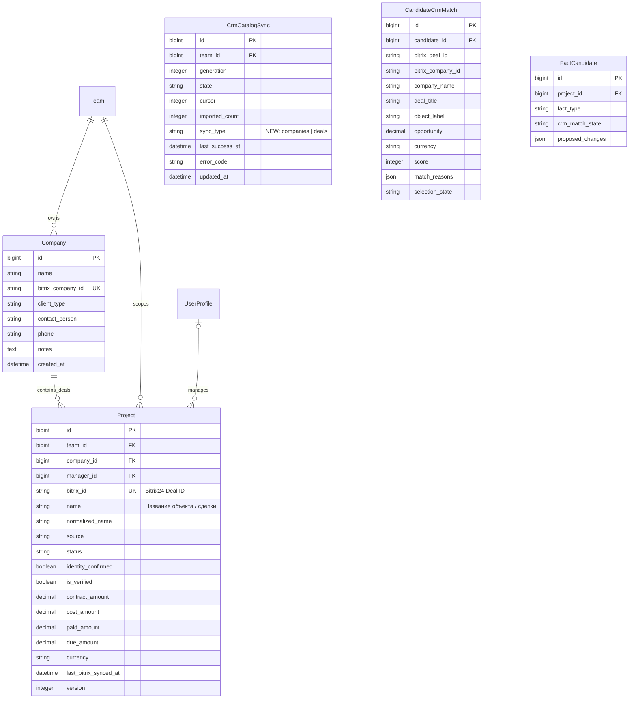
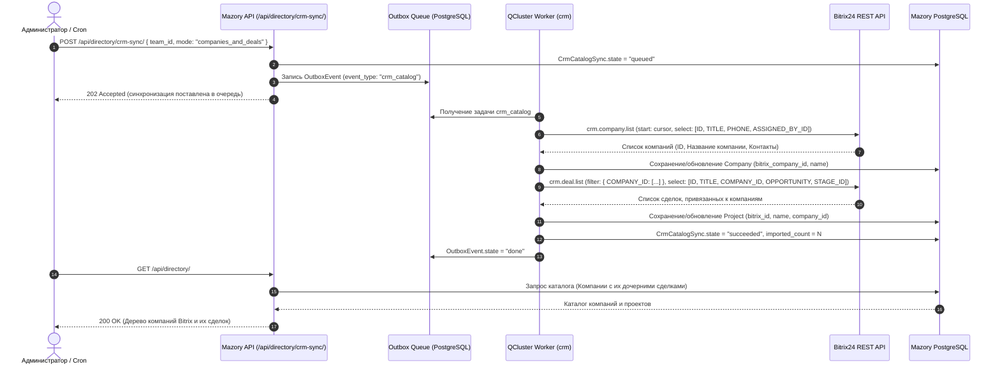

# Синхронизация компаний Bitrix24 как проектов и привязка сделок к контрагентам

- Задача: `bitrix-company-projects`, прямой запрос пользователя, без GitHub Issue.
- Ветка: `refactor/bitrix-company-projects`, база: актуальная `main`.
- Создано: 2026-10-04 21:57:51 (MSK, UTC+3).
- Статус: реализовано, проверки пройдены.

## Структура данных

Текущие сущности и связи проверены по `backend/api/models.py` и миграциям до `0031_threadrevision_summary_threadrevision_topic`.
Изменения: выравнивание бизнес-контракта: Проект в Mazory — это Компания / Контрагент из Bitrix24 (`crm.company`), а конкретные сделки/объекты (`crm.deal`) привязываются к Компании как дочерние сущности.

## Диаграмма последовательности

## Постановка задачи

В текущей кодовой базе сущность `Project` напрямую ассоциировалась со сделкой Bitrix (`crm.deal`), а `Company` импортировалась обособленно либо создавалась вручную. При этом для бизнеса и рабочей группы продаж ключевым объектом верхнего уровня является **Компания-контрагент** (застройщик, девелопер, генподрядчик: BI Group, BAZIS-A, RAMS Qazaqstan и др.), которая в Bitrix24 ведется в справочнике `crm.company`.

В результате:
1. Каталог `crm_catalog.py` загружал только `crm.deal.list` без надежной привязки к компаниям.
2. При извлечении информации из WhatsApp-переписки (где собеседники называют компанию: «мы от BI Group по объекту Grand Park») поиск сделки падал в `not_found`, так как искал сделку с названием «BI Group».
3. В рабочем кабинете и админке проекты не группировались по компаниям Bitrix.

## Требования

1. **Модели данных и связи:**
   - Модель `Company` должна содержать уникальный `bitrix_company_id` с поддержкой индексации и синхронизации.
   - Каждая сделка `Project` должна быть жестко связана с `Company` через `ForeignKey(Company, on_delete=models.SET_NULL, null=True, related_name="projects")`.
   - Если при импорте сделки из Bitrix у нее указан `COMPANY_ID`, соответствующая `Company` должна создаваться/находиться и привязываться к сделке.

2. **Синхронизация каталога (`crm_catalog.py`):**
   - Механизм `CrmCatalogSync` и `sync_page` должен поддерживать двухфазный импорт:
     - Фаза 1: Загрузка компаний через `crm.company.list` (ID, TITLE, PHONE, ASSIGNED_BY_ID) с сохранением в `Company`.
     - Фаза 2: Загрузка сделок через `crm.deal.list` (ID, TITLE, COMPANY_ID, OPPORTUNITY, CURRENCY_ID, STAGE_ID) с привязкой к созданной `Company`.
   - Поддержка пагинации Bitrix24 (`next` cursor) без превышения лимитов запросов.

3. **Справочник для фронтенда (`DirectoryView` / `/api/directory/`):**
   - Возвращать структурированный список компаний из Bitrix с их дочерними объектами/сделками.
   - Поля компании: `id`, `bitrix_company_id`, `name`, `client_type`, `phone`.
   - Вложенные проекты: `id`, `bitrix_id`, `name`, `status`, `contract_amount`, `currency`.

4. **Двухуровневый матчинг в `bitrix_service.py`:**
   - При анализе текста факта (`FactCandidate`) сначала сопоставлять компанию по названию/БИН в базе `Company`, затем находить сделку внутри этой компании.

## План реализации

1. **Бэкенд: обновление моделей и миграция схемы:**
   - Проверить поля `Company` и `Project` в `backend/api/models.py`.
   - Убедиться, что `Company.bitrix_company_id` индексирован и имеет констрейнт уникальности.
   - Добавить/проверить обратную совместимость связей.

2. **Бэкенд: переработка `crm_catalog.py`:**
   - Добавить в `sync_page` загрузку компаний через `crm.company.list` с сохранением в модель `Company`.
   - Связывать каждую импортируемую сделку `crm.deal` с соответствующей `Company` по `COMPANY_ID`.

3. **Бэкенд: обновление `DirectoryView` и сериализаторов:**
   - В `backend/api/platform_views.py` (или `views.py`) в методе `DirectoryView` отдавать компании и сгруппированные по ним проекты.

4. **Бэкенд: обновление `bitrix_service.py`:**
   - В функциях `crm_match_candidate` и `_prefilter_crm_deals` учитывать связь компании со сделками.

5. **Тестирование и валидация:**
   - Написать unit-тесты на импорт компаний и привязку сделок в `backend/api/tests_crm_catalog.py`.
   - Выполнить `python manage.py check` и `python manage.py makemigrations --check`.
   - Проверить сборку фронтенда `npm run build`.

## Критерии готовности (DoD)

- [x] Каталог Bitrix загружает компании (`crm.company`) и сохраняет их в `Company`.
- [x] Сделки Bitrix (`crm.deal`) сохраняются в `Project` с корректно установленным `company_id`.
- [x] Эндпоинт `/api/directory/` возвращает список компаний с вложенными сделками.
- [x] Все unit-тесты на синхронизацию каталога проходят без ошибок.
- [x] `makemigrations --check` завершается с кодом 0 (`No changes detected`).
- [x] `npm run build` во `frontend` завершается успешно без ошибок TypeScript.
- [x] Создан Pull Request в ветку `main`.
