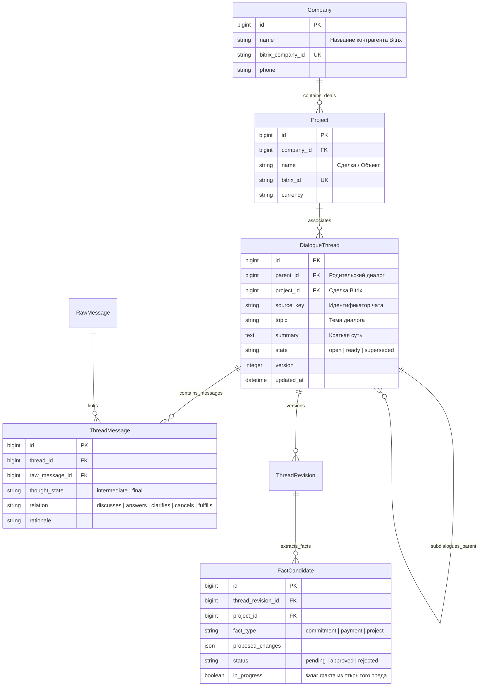
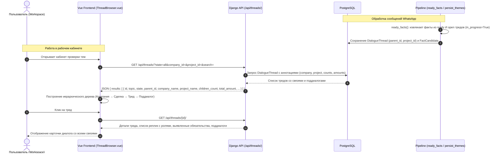

# Иерархическое дерево тредсов и поддиалогов в кабинете проверки (Workspace Review)

- Задача: `workspace-thread-tree`, прямой запрос пользователя, без GitHub Issue.
- Ветка: `feature/workspace-thread-tree`, база: `refactor/bitrix-company-projects`.
- Создано: 2026-10-04 22:11:30 (MSK, UTC+3).
- Статус: реализовано, проверки пройдены.

## Структура данных

Модели проверены по `backend/api/models.py`. Связь `Company ||--o{ Project` настроена в задаче 1.
В данной задаче реализуется иерархическая связь родительский тред → дочерние поддиалоги (`DialogueThread.parent`), привязка тредов к сделкам `Project` и компаниям `Company`, а также сохранение фактов/обязательств из незавершенных (`open`) тредов.

## Диаграмма последовательности

## Постановка задачи

В текущей версии Mazory список тем в кабинете проверки (`ThreadBrowser.vue`) отображается в виде плоского списка без иерархии, без привязки к компаниям и сделкам Bitrix, и без отображения фактов/обязательств.
Кроме того, в бэкенде функция `ready_facts` отбрасывает факты из тредов со статусом `open`, из-за чего обязательства и суммы не видны пользователю до полного закрытия ветки диалога.

Цель задачи:
1. Обеспечить сквозную иерархию «Компания Bitrix → Сделка Bitrix → Корневой диалог → Поддиалоги» в рабочем кабинете проверки.
2. Поддержать в API фильтрацию по статусу (`open`/`ready`), компании и сделке, а также аннотацию количества реплик, дочерних тредов и сумм обязательств (₸).
3. Включать факты и обязательства из открытых (`open`) тредов в кандидаты с пометкой `in_progress: true`, чтобы пользователь видел ход договоренностей в реальном времени.
4. Реализовать на фронтенде древовидный интерфейс каталога диалогов согласно интерактивному макету `mocks/workspace_review_mock.html`.

## Планируемые изменения

1. **Бэкенд (`backend/api/thread_views.py`):**
   - Расширить `ThreadListView`:
     - Поддержать фильтры `company_id`, `project_id`, `state` (`open`, `ready`, `all`), `parent_id`.
     - Возвращать в элементах списка: `id`, `topic`, `state`, `version`, `parent_id`, `project_id`, `project_name`, `company_id`, `company_name`, `summary`, `updated_at`, `children_count`, `messages_count`, `commitments_count`, `total_amount`.
   - Расширить `ThreadDetailView` (`thread_data`):
     - Возвращать `company_id`, `company_name`, `project_name`.
     - Возвращать список дочерних поддиалогов `children` (`id`, `topic`, `state`, `version`, `updated_at`).
     - Возвращать список привязанных фактов и обязательств `facts` (тип, сумма, валюта, срок, контрагент, статус).

2. **Бэкенд (`backend/api/dialogue_threads.py`):**
   - В функции `ready_facts`: не отбрасывать факты из тем со статусом `open`, а помечать их флагом `in_progress=True`, сохраняя валидацию доказательств (`member_ids`).

3. **Фронтенд (`frontend/src/types/factReview.ts`):**
   - Обновить интерфейсы `DialogueThread`, `ThreadMessage`, добавить `ThreadSummaryItem`, `ThreadFilter`.

4. **Фронтенд (`frontend/src/components/review/ThreadBrowser.vue`):**
   - Переработать компонент в двухпанельный древовидный вид (дерево папок слева, просмотр треда справа):
     - Фильтры: статус (`Все`, `В процессе (open)`, `Завершённые (ready)`), поиск по теме/компании.
     - Дерево: Компания Bitrix → Сделка/Проект Bitrix → Тред → Поддиалог.
     - Бейджи: статус, число реплик, сумма обязательств в ₸.
     - Правая панель: подробности темы, реплики с ролями и цитатами, карточки выявленных обязательств, быстрый переход к дочерним диалогам.

5. **Тесты (`backend/api/tests_dialogue_threads.py`):**
   - Тест на выдачу иерархии тредов в `ThreadListView` с полями компании и сделки.
   - Тест на фильтрацию по `company_id`, `project_id`, `state`.
   - Тест на извлечение фактов из `open` тредов с сохранением флага `in_progress`.

## Критерии готовности (DoD)

- [x] Эндпоинт `/api/threads/` возвращает иерархические поля `parent_id`, `project_id`, `project_name`, `company_id`, `company_name`, `children_count`, `commitments_count`, `total_amount`.
- [x] Поддерживаются фильтры по `state`, `company_id`, `project_id`, `search`.
- [x] Детальный эндпоинт `/api/threads/<id>/` отдает дочерние диалоги и привязанные обязательства.
- [x] Факты из незавершенных (`open`) тредов не теряются, а сохраняются с признаком `in_progress`.
- [x] На фронтенде `ThreadBrowser.vue` отображает интерактивное дерево (Компания → Сделка → Тред → Поддиалоги) в соответствии с макетом.
- [x] Пройдены системные проверки Django (`python manage.py check`, `makemigrations --check`).
- [x] Все тесты в `api.tests_dialogue_threads` проходят успешно.
- [x] Сборка фронтенда `npm run build` проходит без ошибок TypeScript.
- [x] Изменения зафиксированы в ветке `feature/workspace-thread-tree` и запушены в origin.
