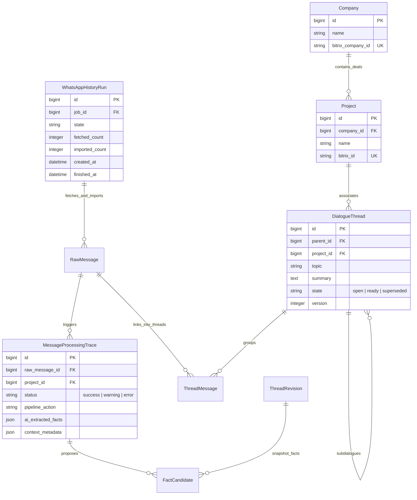
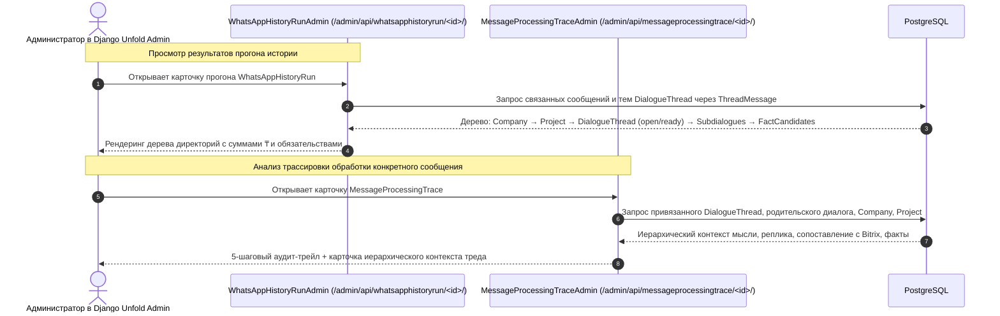

# Иерархическое отображение диалогов и трейсов в Django Unfold Admin (WhatsAppHistoryRun и MessageProcessingTrace)

- Задача: `admin-trace-tree-views`, прямой запрос пользователя, без GitHub Issue.
- Ветка: `feature/admin-trace-tree-views`, база: `feature/workspace-thread-tree`.
- Создано: 2026-10-04 22:56:00 (MSK, UTC+3).
- Статус: реализовано, проверки пройдены.

## Структура данных

Модели проверены по `backend/api/models.py`.
Взаимосвязь между прогоном истории `WhatsAppHistoryRun`, сообщениями `RawMessage`, трассировками `MessageProcessingTrace`, тредами `DialogueThread`, сделками `Project` и компаниями `Company`:

## Диаграмма последовательности

## Постановка задачи

В текущей панели Django Unfold Admin страницы `WhatsAppHistoryRun` и `MessageProcessingTrace` отображают плоские списки чисел и текстовые логи без наглядной группировки по бизнес-сущностям. Пользователь ожидает видеть в админке такое же понятное иерархическое дерево, как и в рабочем кабинете:
1. В `WhatsAppHistoryRun` (карточка и список прогона): иерархическая структура обработанных диалогов: **Компания Bitrix → Сделка/Проект Bitrix → Тред диалога (open/ready) → Поддиалоги → Выявленные факты и обязательства с суммами (₸)**.
2. В `MessageProcessingTrace` (карточка и список трассировки): наглядный контекст того, в какой тред и компанию попало сообщение, завершена ли мысль (`ready`) или продолжается (`open`), какова роль реплики (`discusses`, `answers`, `clarifies`, `cancels`, `fulfills`) и какие обязательства извлечены.

## Планируемые изменения

1. **`WhatsAppHistoryRunAdmin` (`backend/api/job_admin.py` и шаблоны):**
   - Добавить метод `thematic_tree_card(obj)`, собирающий и форматирующий HTML-дерево:
     - Извлекаются сообщения прогона: `obj.messages.all()`.
     - Находятся все привязанные треды через `ThreadMessage.objects.filter(raw_message__in=messages)`.
     - Треды группируются по Компании (`thread.project.company`) и Сделке (`thread.project`).
     - Отображаются корневые треды и их дочерние поддиалоги (`children`) с бейджами `open` / `ready`.
     - Под каждым тредом выводятся извлеченные факты/обязательства с суммами (₸) и ссылками на объекты в админке.
   - Добавить колонку `thematic_summary` в `list_display`: число тредов, разбивка `open`/`ready`, сумма обязательств.
   - Встроить блок дерева в форму `admin/history_run_change.html`.

2. **`MessageProcessingTraceAdmin` (`backend/api/admin.py`):**
   - Добавить метод `dialogue_thread_hierarchy_card(obj)`:
     - Отображает иерархическую карточку: Компания Bitrix → Сделка → Тред (ID, тема, статус `open`/`ready`, версия) → Поддиалоги.
     - Показывает роль данного сообщения в диалоге (`thought_state`, `relation`, `rationale`).
     - Выводит список извлеченных из этого контекста фактов и обязательств.
   - Включить `dialogue_thread_hierarchy_card` в `fieldsets` (в Этап 2: «История сообщений и контекст треда»).
   - Добавить колонку `thread_badge` в `list_display`.

3. **Тесты (`backend/api/tests_history_reprocessing.py` или новый тестовый модуль):**
   - Тестирование генерации HTML-дерева в `thematic_tree_card` для `WhatsAppHistoryRun`.
   - Тестирование контекстной карточки `dialogue_thread_hierarchy_card` для `MessageProcessingTrace`.

## Критерии готовности (DoD)

- [x] В карточке `WhatsAppHistoryRun` в админке отображается интерактивное дерево диалогов с группировкой по компаниям Bitrix, сделкам, тредам и поддиалогам с суммами обязательств.
- [x] В списке `WhatsAppHistoryRun` отображается сводка по темам (`thematic_summary`).
- [x] В карточке `MessageProcessingTrace` отображается блок иерархического контекста треда (Компания, Сделка, Тред, роль реплики, обязательства).
- [x] В списке `MessageProcessingTrace` выводится колонка с бейджем треда и компании.
- [x] Django check и makemigrations чисты (0 issues, no changes detected).
- [x] Все unit-тесты бэкенда успешно проходят.
- [x] Сборка фронтенда `npm run build` проходит без ошибок.
- [x] Изменения зафиксированы в ветке `feature/admin-trace-tree-views` и запушены в origin.
