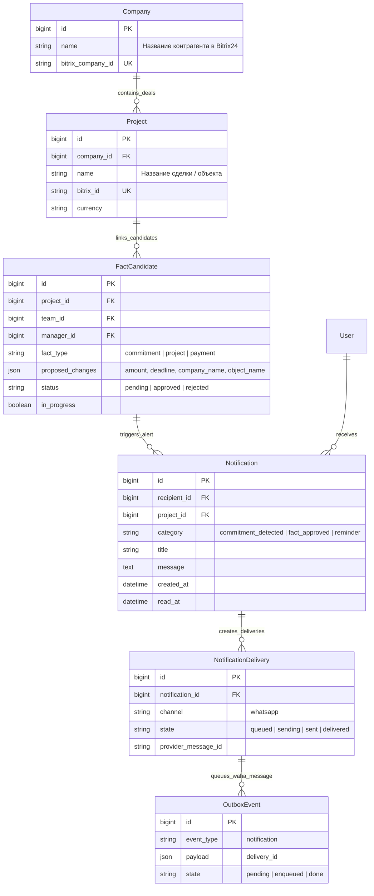
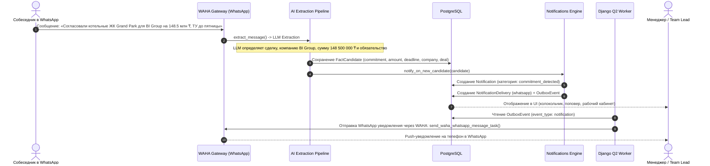

# Экстракция сделок, компаний Bitrix24, финансовых обязательств (₸) и генерация уведомлений с отправкой в WhatsApp

- Задача: `financial-commitments-notifications`, прямой запрос пользователя, без GitHub Issue.
- Ветка: `feature/financial-commitments-notifications`, база: `feature/admin-trace-tree-views`.
- Создано: 2026-10-04 23:14:00 (MSK, UTC+3).
- Статус: реализовано, проверки пройдены.

## Структура данных

Модели проверены по `backend/api/models.py`. Связи между `Company`, `Project`, `DialogueThread`, `FactCandidate`, `Notification`, `NotificationDelivery` и `OutboxEvent`:

## Диаграмма последовательности

## Постановка задачи

Пользователь требует:
«Хочу чтобы из чата сделки определялись, контрагенты/компании, обязательства/обещания и все это совместно с информацией из bitrix по компаниям/проектам, суммам, и тд. Чтобы генерировались уведомления.»

В текущей системе:
1. Системные уведомления генерировались только при наступлении дедлайнов уже утвержденных (`is_verified=True`) обязательств (`plan_reminders`), либо по ручному запросу. При автоматическом обнаружении нового обязательства, обещания или сделки в чате уведомления не создавались.
2. Подсказка промпта `WORKER_PROMPT` требовала публиковать факты только для полностью закрытых тем (`ready`), игнорируя обещания из активных тредов.

Цель задачи:
1. Настроить автоматическую генерацию персональных и командных уведомлений при выявлении из переписки нового обязательства, обещания, сделки или платежа (`notify_on_new_candidate`).
2. Включать в текст уведомления всю связку: **Компания Bitrix24**, **Сделка / Объект**, **Суть обязательства / обещания**, **Сумма в ₸**, **Срок** и **Отправитель**.
3. Обеспечить сквозную доставку уведомления как в веб-интерфейсе (колокольчик в шапке, раздел уведомлений в кабинете), так и через WhatsApp (WAHA) ответственным сотрудникам и тимлиду.
4. Генерировать подтверждающее уведомление при аппруве факта в рабочем кабинете (`notify_on_candidate_approved`).

## Планируемые изменения

1. **`backend/api/ai_service.py`:**
   - Обновить `WORKER_PROMPT`, уточнив извлечение сделок, контрагентов, сумм в тенге (₸) и обязательств/обещаний как для завершенных мыслей, так и для открытых активных диалогов.

2. **`backend/api/notifications.py`:**
   - Реализовать функцию `notify_on_new_candidate(candidate)`:
     - Определяет получателей (ответственный менеджер + руководители команды `team_lead`).
     - Собирает форматированный текст сообщения с контрагентом, объектом, суммой ₸, сроком и репликой.
     - Создает `Notification` (категория `commitment_detected`), создает `NotificationDelivery` с каналом `whatsapp` и ставит событие в `OutboxEvent`.
   - Реализовать функцию `notify_on_candidate_approved(candidate)` для оповещения об утверждении договоренности.

3. **`backend/api/pipeline.py` и `backend/api/platform_views.py`:**
   - В `pipeline.py`: вызывать `notify_on_new_candidate(candidate)` при создании нового кандидата факта.
   - В `platform_views.py`: вызывать `notify_on_candidate_approved(candidate)` при подтверждении факта пользователем.

4. **Фронтенд (`frontend/src/components/NotificationsPopover.vue`):**
   - Добавить поддержку категории `commitment_detected` с подсветкой и иконкой портфеля/часов.

5. **Тестирование (`backend/api/tests_notifications.py`):**
   - Написать unit-тесты генерации уведомления по выявленному факту и по подтвержденному факту.
   - Проверить создание записей `Notification`, `NotificationDelivery` и `OutboxEvent`.

## Критерии готовности (DoD)

- [x] При появлении в чате нового обязательства, обещания или сделки создается `FactCandidate` и автоматически генерируется `Notification` для менеджера и тимлида.
- [x] Уведомление содержит название компании Bitrix, объекта, суть обязательства, сумму в ₸ и срок.
- [x] Для уведомления создается `NotificationDelivery` со статусом отправки в WhatsApp и событие в `OutboxEvent`.
- [x] При утверждении факта генерируется уведомление об успешном подтверждении.
- [x] В поповере уведомлений на фронтенде новые события корректно отображаются.
- [x] `uv run python manage.py check` и `makemigrations --check` завершаются без ошибок.
- [x] Все unit-тесты бэкенда проходят успешно.
- [x] Сборка фронтенда `npm run build` проходит без ошибок.
- [x] Изменения зафиксированы в ветке `feature/financial-commitments-notifications` и запушены в origin.
