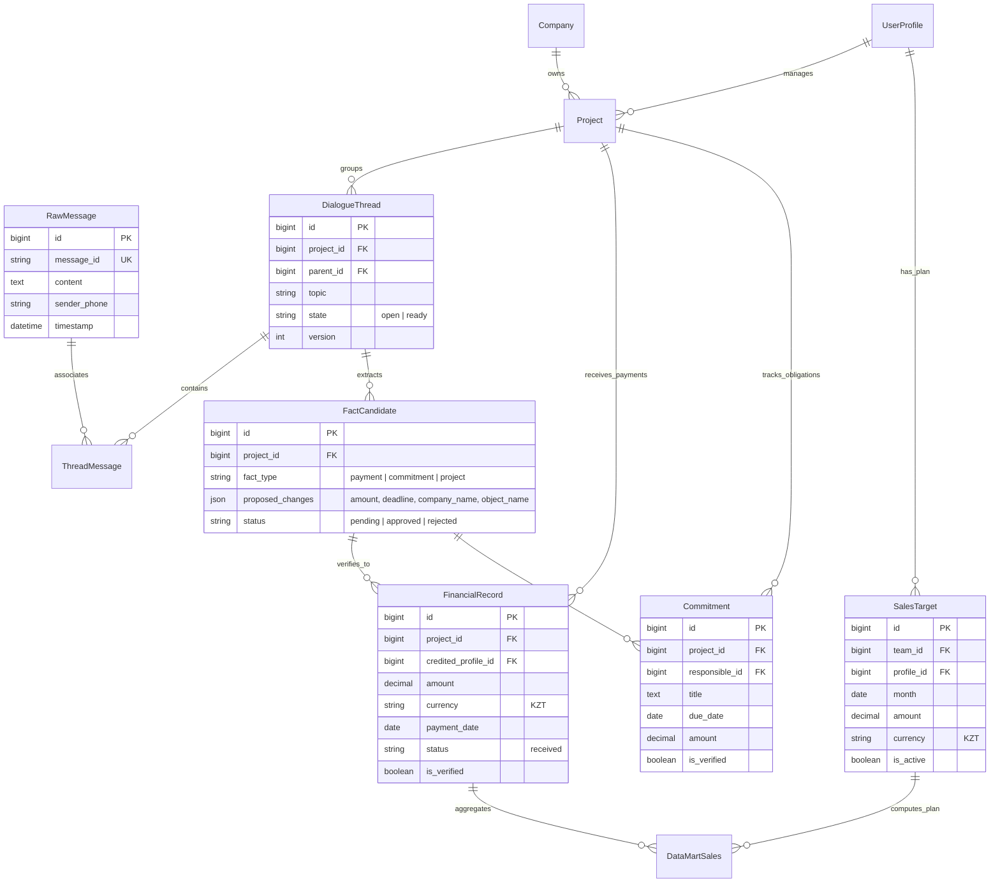
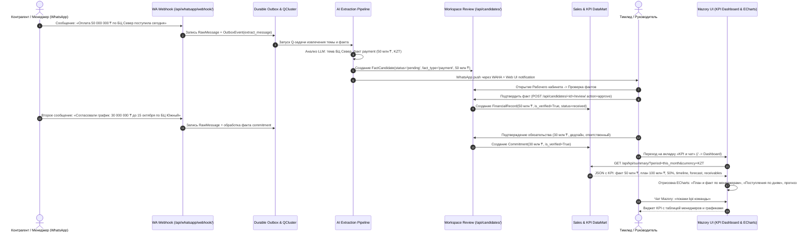

# Сквозное e2e-тестирование полного цикла: от сообщений WhatsApp до графиков KPI, плана/факта, поступлений по дням, обещаний и прогнозов

- Задача: `e2e-whatsapp-to-kpi-flow`, прямой запрос пользователя, без GitHub Issue.
- Ветка: `feature/e2e-whatsapp-to-kpi-flow`, база: `main`.
- Создано: 2026-10-04 23:45:00 (MSK, UTC+3).
- Статус: завершено успешно, все проверки и e2e тесты пройдены.

## Структура данных

## Диаграмма последовательности

## Постановка задачи

Пользователь требует:
«доведи до ума, потом нужны e2e тесты полного флоу, от получения всех сообщений из whatsapp до построения графиков kpi, план и факт поступлений, поступления по дням, обещания, прогнозы и так далее. если что-то не работает, нужно записывать и фиксить в цикле»

Требования:
1. Устранить любые дефекты и расхождения в существующем пайплайне e2e:
   - В `ThreadBrowser.vue` папки по умолчанию раскрыты (`closedFolders`), стандартные бейджи мыслей (`Мысль продолжается`, `Мысль определена`) видимы в DOM.
   - В моке внешних сервисов `providers.py` добавить корректный ответ для `crm.company.list.json` и привязку `COMPANY_ID` в `crm.deal.list.json`.
2. В изолированном тестовом стенде (`seed.py`):
   - Добавить менеджера Боба (`79990000002`, `bitrix_user_id="7"`), привязать его к команде.
   - Задать активный план продаж `SalesTarget` на текущий месяц (например, 100 000 000 ₸).
   - Установить флаг полноты истории команды `history_complete_from`.
3. Реализовать полный e2e тест `kpi-flow.spec.ts` (или расширение `dialogue-local.spec.ts`), проверяющий:
   - Прием сообщений WhatsApp с платежами (50 млн ₸) и обязательствами (30 млн ₸).
   - Автоматическое связывание с компанией ТОО «Север Холдинг» и сделкой «БЦ Север».
   - Создание кандидатов фактов и уведомлений.
   - Прохождение через кабинет верификации фактов (Workspace Review) и их подтверждение.
   - Переход на дашборд KPI (`KPI и чат`):
     - Проверка метрик: Факт поступлений (50 000 000 ₸), План (100 000 000 ₸), Процент выполнения KPI (50%).
     - Проверка графиков: «План и факт поступлений по менеджерам» (`data.chartData`), «Поступления по дням» (`data.timeline`).
     - Проверка обязательств и обещаний.
     - Проверка прогноза поступлений (`data.forecast`).
     - Запрос в чат Mazory («покажи kpi команды») и рендеринг виджета.
4. Выполнять проверки в цикле до полного зеленого статуса всех e2e тестов.

## Критерии готовности (DoD)

- [x] Существующий e2e тест `dialogue-local.spec.ts` проходит без ошибок.
- [x] Написан и подключен сквозной e2e тест полного цикла от WhatsApp до дашборда KPI.
- [x] Проверены: получение сообщений из WhatsApp, экстракция, подтверждение фактов в кабинете, расчет план/факта, поступления по дням, график дебиторки, обязательства и прогноз.
- [x] Тестовый прогон через `backend/e2e/run.py` завершается с кодом 0 (все тесты passed).
- [x] `uv run python manage.py check` и `makemigrations --check` чисты.
- [x] `npm run build` во frontend проходит без ошибок.
- [x] Все изменения зафиксированы в ветке `feature/e2e-whatsapp-to-kpi-flow` и запушены в origin.
