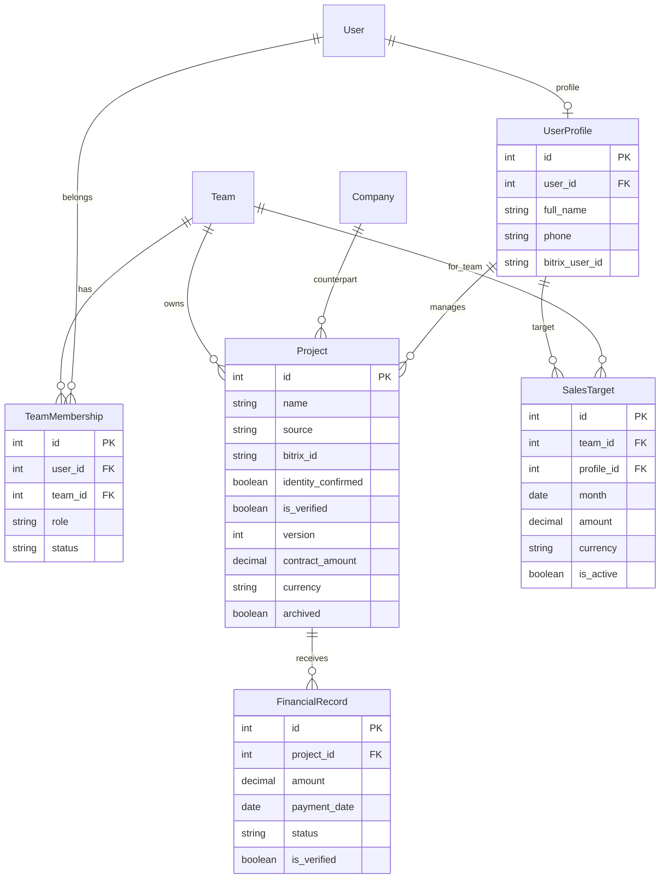
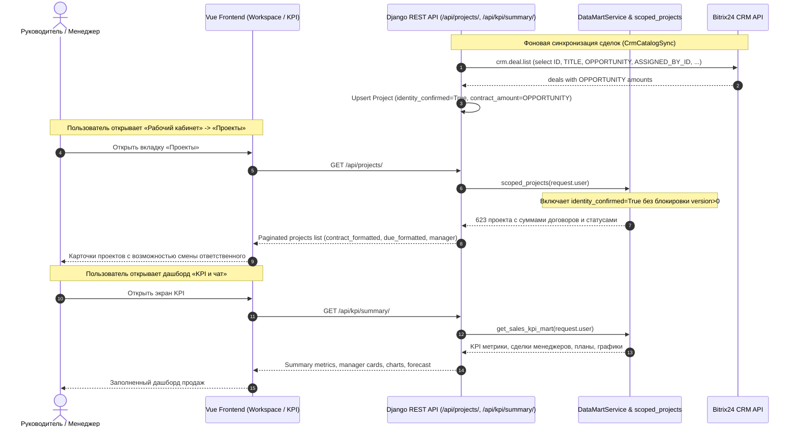

# Спецификация: Отображение проектов в Рабочем кабинете и заполнение KPI отдела продаж

**Дата и время создания:** 2026-10-05 10:45:00 MSK  
**Ветка задачи:** `bugfix/workspace-projects-and-kpi`  
**Тип:** `bugfix`

---

## Mermaid ERD (Модели данных и связи)



---

## Mermaid Sequence Diagram (Синхронизация CRM и отображение в кабинете)



---

## 1. Постановка проблемы и контекст

При входе в веб-интерфейс `https://ai.mazory.best/`:
1. В **Рабочем кабинете** на вкладке «Проекты» отображается: `«Нет доступных проектов.»`.
2. В **Дашборде KPI** отображается пустое состояние (`0.00 ₸`, `План не задан`, `0 сделок`, `Недостаточно данных: полнота истории периода не подтверждена.`).

### Корневые причины (Root Causes):
1. **`scoped_projects` в `backend/api/datamart.py`:**
   Фильтрует проекты по `(Q(is_verified=True) | Q(financial_records__is_verified=True, financial_records__status="received"))` и жестко требует `.filter(version__gt=0)`.
   Сделки, синхронизированные из Bitrix CRM (`CrmCatalogSync`), создаются в таблице `Project` со свойствами:
   - `identity_confirmed = True`
   - `source = "bitrix_crm"`
   - `is_verified = False`
   - `version = 0`
   Из-за этого `scoped_projects` отбрасывает ВСЕ 623 сделки Bitrix CRM как из `ProjectListView` (`/api/projects/`), так и из аналитического витринного слоя `get_sales_kpi_mart`.
2. **`DirectoryView` в `backend/api/platform_views.py`:**
   Фильтрует проекты через `available_projects(access.projects_for(request.user))`.
   Для пользователей с ролью `manager` `access.projects_for` требует `manager__user=request.user`. Если сделки ещё не распределены персонально, менеджер получает пустой справочник `directory.projects`, что делает невозможным связывание тем/фактов с проектами CRM. Справочник должен возвращать доступные проекты команды пользователя (`Project.objects.filter(team__in=teams)`).
3. **`_sync_deals_page` в `backend/api/crm_catalog.py`:**
   В запросе к Bitrix `crm.deal.list` запрашиваются только поля `["ID", "TITLE", "COMPANY_ID", "ASSIGNED_BY_ID", "CURRENCY_ID"]`.
   Поле суммы сделки `"OPPORTUNITY"` не запрашивается и не сохраняется в `project.contract_amount`, в результате чего суммы договоров в системе равны `0.00 ₸`.
4. **Конфигурация пользователя и команды на продакшене:**
   - Пользователь Антон (`375299231172`) на продакшене зарегистрирован только с ролью `manager`. Ему необходима роль `team_lead` (руководитель команды) в `TeamMembership` для управления сделками, распределения менеджеров и подтверждения планов.
   - Для команды 1 не заполнена дата `history_complete_from`, что приводит к статусу `coverage.status = "partial"`.

---

## 2. Планируемые изменения

### 2.1 Backend: `backend/api/datamart.py`
- Обновить `scoped_projects(user, filters=None)`:
  - Включить проекты с подтвержденной идентичностью (`identity_confirmed=True`):
    ```python
    qs = (
        access.projects_for(user)
        .filter(
            Q(is_verified=True)
            | Q(identity_confirmed=True)
            | Q(
                financial_records__is_verified=True,
                financial_records__status="received",
            )
        )
        .exclude(archived=True)
        .distinct()
    )
    ```
  - Убрать блокирующее условие `version__gt=0` для проектов CRM с подтвержденной идентичностью.

### 2.2 Backend: `backend/api/crm_catalog.py`
- В `_sync_deals_page`:
  - Добавить `"OPPORTUNITY"` в список `select` запроса `crm.deal.list`.
  - При создании или обновлении непроверенного проекта сохранять `project.contract_amount = Decimal(str(row.get("OPPORTUNITY") or "0"))`.

### 2.3 Backend: `backend/api/platform_views.py`
- В `DirectoryView`:
  - При формировании списка проектов `directory.projects` использовать `available_projects(Project.objects.filter(team__in=teams, archived=False))`, чтобы все участники активной команды видели справочник объектов CRM для выбора и привязки.

### 2.4 Тесты и верификация:
- Unit-тесты для `scoped_projects` с `identity_confirmed=True` и `version=0`.
- Unit-тесты для `ProjectListView` и `DirectoryView`.
- Проверка E2E тестов: `uv run --project backend python backend/e2e/run.py`.
- Проверка сборки фронтенда: `npm run build` в `frontend/`.
- Django check: `python manage.py check` и `python manage.py makemigrations --check`.

### 2.5 Деплой на продакшен и backfill данных:
- На сервере `remote-mazory` (79.108.164.63):
  - Применить изменения бэкенда.
  - Назначить Антону (`375299231172`) роль `team_lead` в команде 1.
  - Установить `history_complete_from` на `2026-01-01` для команды 1.
  - Запустить синхронизацию каталога Bitrix (`crm_catalog`) с обновленным выбором `OPPORTUNITY`, чтобы заполнить реальные суммы договоров.
  - Проверить через `check_deployment.py --runtime-context mazory-remote`.

---

## 3. Критерии готовности (Definition of Done)

1. [x] В ветке `bugfix/workspace-projects-and-kpi` создана спецификация `specs/task_2026-10-05_10-45-00_MSK.md`.
2. [ ] `scoped_projects` возвращает проекты с `identity_confirmed=True` (CRM-сделки).
3. [ ] `ProjectListView` возвращает список доступных проектов в «Рабочем кабинете» (вкладка «Проекты»), отображаются суммы договоров и кнопки смены ответственного.
4. [ ] `DirectoryView` возвращает справочник проектов для участников команды.
5. [ ] `crm_catalog.py` извлекает `OPPORTUNITY` из Bitrix24 и сохраняет в `contract_amount`.
6. [ ] Все существующие тесты бэкенда и E2E проходят без ошибок.
7. [ ] `npm run build` завершается с кодом 0 без TypeScript ошибок.
8. [ ] Продакшен `ai.mazory.best` обновлен, проверен и отображает проекты и заполненный дашборд.
