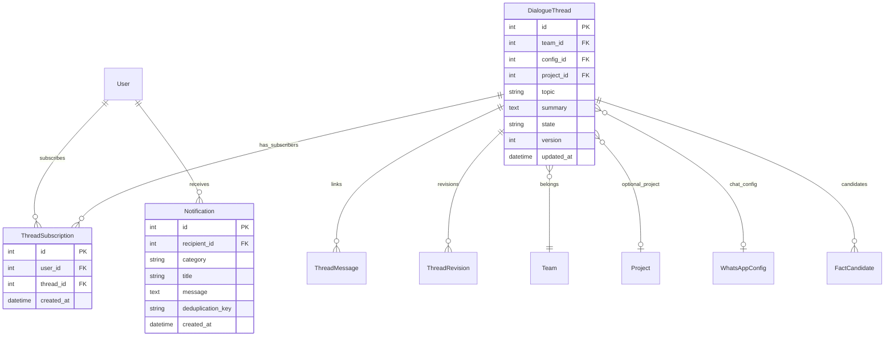
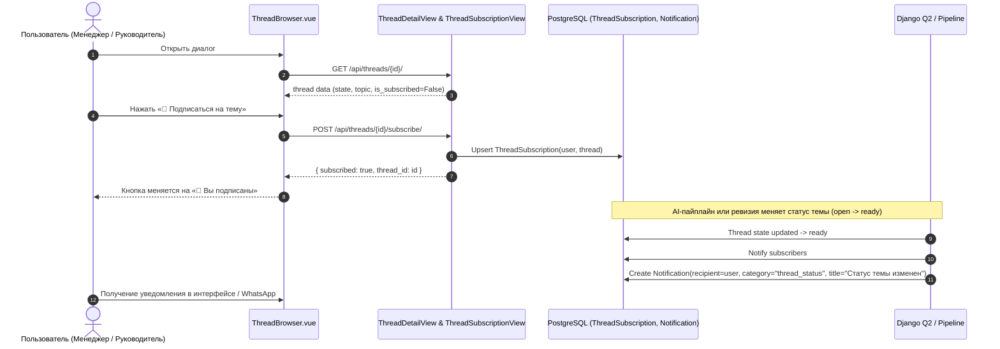

# Спецификация: Исправление фильтров тем, группировки диалогов, подписки на уведомления и верстки select в формах

**Дата и время создания:** 2026-10-05 10:58:00 MSK  
**Ветка задачи:** `bugfix/thread-tree-filters-and-workspace-layout`  
**Тип:** `bugfix`

---

## Mermaid ERD (Модели данных и связи)



---

## Mermaid Sequence Diagram (Подписка на тему и уведомление об изменении статуса)



---

## 1. Постановка проблемы и выявленные дефекты

1. **Некорректная работа счетчиков фильтра статусов тем (`Все`, `В процессе`, `Завершенные`):**
   - Нажатие на «В процессе» меняет отображение кнопок на «Все (27), В процессе (27), Завершенные (0)», а нажатие на «Завершенные» — на «Все (4), В процессе (0), Завершенные (4)».
   - *Причина:* `ThreadBrowser.vue` вычисляет `stats` на стороне клиента из текущего массива `items.value`, который уже отфильтрован бэкендом по выбранному статусу.
   - *Решение:* Бэкенд `/api/threads/` должен возвращать в пагинированном ответе глобальные счетчики `stats` (`total`, `open`, `ready`, `commitments`), подсчитанные по базовому запросу пользователя до фильтрации по конкретному `state`.
2. **Пагинация и перегрузка экрана темами:**
   - Отображается сразу 50 тем, не помещающихся в экран. Требуется отображать по 10 тем на страницу с удобной пагинацией.
   - В первую очередь должны отображаться уже выявленные темы (с зафиксированными обязательствами / фактами или завершенные `ready`), а затем по времени обновления.
3. **Группировка «Без контрагента»:**
   - Сейчас все темы без явного проекта Bitrix CRM складываются в один гигантский блок «Без контрагента».
   - *Решение:* Если у темы нет `project.company`, использовать:
     - Распознанного контрагента/компанию из выявленных фактов (`party` / `company_name`),
     - Либо название чата WhatsApp (`Чат: ${config.name}`),
     - Либо контакт отправителя (`Диалог: ${sender_name}`),
     - И только при полном отсутствии метаданных — «Общие диалоги».
4. **Подписка на тему и уведомления:**
   - Пользователь должен иметь возможность подписаться на тему, чтобы при изменении её статуса (например, `open` -> `ready` или появлении новых выявленных фактов) получать уведомление.
   - *Решение:* Модель `ThreadSubscription`, эндпоинт `POST /api/threads/<id>/subscribe/`, отправка `Notification` подписчикам при изменении `state`.
5. **Сломанная верстка полей `<select>` (вылезание за пределы карточки формы):**
   - В «Добавить согласованный срок платежа», «Распределить платёж», «Документы» и связывании проектов `<select class="field block">` расширяется до 1500+ пикселей из-за сверхдлинных названий объектов из CRM (например, 150 символов), ломая всю верстку.
   - *Решение:* Добавить класс `max-w-full truncate` глобально для `select.field` в `main.css`, а также ограничить контейнеры `<label>` и `<select>` классами `w-full max-w-xs sm:max-w-sm truncate` в `WorkspaceView.vue`.

---

## 2. Планируемые изменения

### 2.1 Модель данных и миграции (`backend/api/models.py`)
- Добавить модель `ThreadSubscription`:
  ```python
  class ThreadSubscription(models.Model):
      user = models.ForeignKey(User, on_delete=models.CASCADE, related_name="thread_subscriptions")
      thread = models.ForeignKey(DialogueThread, on_delete=models.CASCADE, related_name="subscriptions")
      created_at = models.DateTimeField(auto_now_add=True)

      class Meta:
          constraints = [
              models.UniqueConstraint(fields=["user", "thread"], name="unique_user_thread_subscription")
          ]
  ```
- Создать и применить миграцию Django.

### 2.2 Бэкенд: Эндпоинты тредов (`backend/api/thread_views.py`)
- В `ThreadListView`:
  - Установить размер страницы пагинации = 10 (`pagination.page_size = 10`).
  - Рассчитать агрегированные счетчики по `base_qs` (до применения фильтра `state`):
    `stats = {"total": base_qs.count(), "open": base_qs.filter(state="open").count(), "ready": base_qs.filter(state="ready").count()}`.
  - Добавить `stats` в `get_paginated_response`.
  - Упорядочивание: в первую очередь выявленные темы (с обязательствами / фактами или `ready`), затем `-updated_at`, `-id`.
  - В возвращаемых объектах тем добавить:
    - `is_subscribed`: флаг подписки текущего пользователя.
    - `chat_name`: название чата из `config.name`.
    - `counterparty`: распознанный контрагент из фактов или компании.
- В `ThreadDetailView`:
  - Включить `is_subscribed: bool`.
- Добавить `ThreadSubscribeView(APIView)`:
  - `POST /api/threads/<pk>/subscribe/`:
    Переключает подписку текущего пользователя на тред (`subscribed: bool`).
- При смене статуса треда (в `save()` или при переходе `open` -> `ready`):
  - Оповестить подписчиков треда через `create_notification(recipient=sub.user, category="thread_status", ...)`.

### 2.3 Фронтенд: Компонент `ThreadBrowser.vue`
- Использовать `result.stats` из ответа API для кнопок `Все`, `В процессе`, `Завершенные`, чтобы счетчики не сбрасывались при фильтрации.
- Добавить навигацию по страницам (пагинация по 10 тем: «Предыдущая», «Страница X из Y», «Следующая»).
- Обновить дерево `treeCompanies`:
  - Группировать по `thread.counterparty || thread.company_name || thread.chat_name || 'Общие диалоги'`.
- В правой панели деталей треда добавить кнопку `🔔 Подписаться / 🔕 Отписаться` с мгновенным переключением состояния через `/api/threads/${id}/subscribe/`.

### 2.4 Фронтенд: Верстка выпадающих списков (`WorkspaceView.vue`, `main.css`)
- В `frontend/src/assets/main.css`:
  - Добавить стили для предотвращения переполнения:
    ```css
    select.field { @apply max-w-full truncate; }
    ```
- В `frontend/src/components/WorkspaceView.vue`:
  - Обернуть поля выбора проектов в формы с контролируемой шириной (`max-w-xs sm:max-w-sm w-full truncate`).
  - Исправить формы в разделах «Финансы», «Документы» и «Проверка фактов».

---

## 3. Критерии готовности (Definition of Done)

1. [x] Создана ветка `bugfix/thread-tree-filters-and-workspace-layout` и спецификация `specs/task_2026-10-05_10-58-00_MSK.md`.
2. [ ] Кнопки фильтра «Все», «В процессе», «Завершенные» сохраняют глобальные счетчики при переключении.
3. [ ] В списке тем отображается по 10 тем на странице с пагинацией.
4. [ ] Темы с выявленными обязательствами и статусом `ready` отображаются в начале списка.
5. [ ] Темы группируются логично по контрагентам / чатам вместо единой кучи «Без контрагента».
6. [ ] Пользователь может подписаться и отписаться от уведомлений по конкретной теме.
7. [ ] При смене статуса темы подписчик получает уведомление.
8. [ ] Все `<select>` с длинными названиями проектов в кабинете аккуратно усекаются (`truncate`) и не вылезают за границы карточек.
9. [ ] `uv run --project backend python backend/manage.py test` проходит без ошибок.
10. [ ] `npm run build` в `frontend/` завершается с кодом 0 без TypeScript ошибок.
11. [ ] Миграция БД создана и проверена (`makemigrations --check` чистый).
12. [ ] Деплой на `remote-mazory` выполнен и протестирован.
